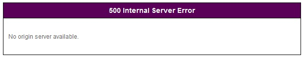

.. _adv_topics:

제 19 장 최적화 및 기타 물건
****************************

이 장에서는 최적화 및 기타 잡다한가 깊이있는 주제를 다룬다. 최적화는 고성능 (High Performance)를위한 방법이며, 이것은 우리가 추구하는 최고의 가치이다. 엔터프라이즈 환경에서의 성능은 주어진 하드웨어 자원을 최대한 활용하는 것을 의미한다

그 중에 메모리는 모든 설계와 정책을 결정하는 가장 중요한 자원이다. 특히 인덱스 (요청 된 URL을 신속하게 찾을 수)에는 반드시 이해한다. 왜냐하면 서비스 품질을 결정하는 것은 인덱스이기 때문이다. 지금부터 설명하는 모든 내용은 다음 표 "실제 메모리 크기에 따라 설정 '과 관련이있다.

============= ============== =============== ============= ========
Physical RAM  System Free    Contents        Caching Count Sockets
============= ============== =============== ============= ========
1GB           409.60MB       188.37MB        219,469       5,000
2GB           819.20MB       446.74MB        520,494       10,000
4GB           1.60GB         963.49MB        1,122,544     20,000
8GB           3.20GB         2.05GB          2,440,422     20,000
16GB          6.40GB         4.45GB          5,303,733     20,000
32GB          12.80GB        9.25GB          11,030,356    20,000
64GB          25.60GB        18.85GB         22,483,603    20,000
128GB         51.20GB        38.05GB         45,390,095    20,000
============= ============== =============== ============= ========

.. toctree::
   :maxdepth: 2

.. _adv_topics_memory_only:

Memory-Only 모드
====================================

MMemory-Only 모드와 디스크를 사용하지 않고 콘텐츠를 메모리에만 적재하는 방식을 말한다. 
:ref:`env-cache-storage` 을하지 않으면 자동으로 Memory-Only 모드로 동작한다. ::
    
    # server.xml - <Server><Cache>

    <Storage />

이 모드에서는 :ref:`caching-policy-ttl` 이 짧거나 콘텐츠의 크기가 작은 경우에 편리하다.

- HLS 라이브 방송
- 가격 / 재고
- 티켓 조회
- 실시간 순위
- 검색
- API

반대로 콘텐츠의 크기가 GB 단위로 크거나 :ref:`caching-policy-ttl` 긴 서비스는 부적합하다.

.. note::

   v2.5.0에서 지원되는 동적으로 변경이 불가능하다. 설정 변경 후에는 반드시 서비스를 다시 시작해야한다.

.. _adv_topics_indexing:

인덱스
====================================

인덱스 모드를 설명하기 전에 Hot 콘텐츠 및 Cold 콘텐츠의 개념을 이해한다.

.. figure:: img/indexing_hot_cold.png
   :align: center

소스에서 캐시 된 콘텐츠는 로컬 디스크에 저장된다. 해당 콘텐츠에 액세스 할 때마다 매번 디스크에서 읽을 보낼 당연히 성능이 저하된다. 따라서 자주 액세스되는 내용을 메모리에로드 해두면 고성능을 얻을 수있다. 이렇게 메모리에로드 된 컨텐츠를 Hot 디스크 만있는 콘텐츠 Cold라고 부른다

인덱스는 Hot과 Cold 콘텐츠를 찾는 방법을 의미하며, 이는 성능과 직결된다. 기본 메모리의 인덱스이다. ::

   # server.xml - <Server><Cache>

   <Indexing>Memory</Indexing>

메모리 인덱스는 Cold이 존재하지 않는다. 모든 파일에 대한 정보는 메모리에로드되기 때문에 메모리에서 찾을 수없는 경우, 원본 서버에서 새로 다운로드한다. 검색 시간이 매우 짧기 때문에 그만큼 고성능과 신속한 서비스 품질을 얻을 수있다. 그러나 메모리 용량의 한계로 인해 캐시 수에 한계가있다. 그 한계는 선진 표 Caching Count를 참조한다.

디스크 인덱스는 Hot없는 경우는 소스에 가기 전에 Cold에서 콘텐츠를 찾는다. ::

   # server.xml - <Server><Cache>

   <Indexing>Disk</Indexing>

이 방식은 메모리의 제한을받지 않기 때문에 Caching Count에 제한이 없다. Hot 콘텐츠의 경우 신속한 품질을 보장하지만, Cold의 경우에는 디스크를 사용하기 때문에 비교적 느리다. 간단하게 정리하면 Hot 메모리 속도, Cold 디스크 속도에 수렴한다.

디스크 인덱스를 사용하는 경우는 SSD를 사용하는 것이 좋습니다한다. 인덱스는 STON가 설치된 디스크에서만 실행된다. STON는 일반적으로 OS와 동일한 디스크에 설치되므로 OS 디스크 만 SSD에 사용하여도 성능을 기대할 수있다.

.. note::

   SSD의 수명은 사용 빈도보다 Write되는 양에 따라 결정된다. Intel이나 Samsung 등 공급 SSD의 경우 최소 600TB의 Write 수명을 보장한다. 이것은 단순히 계산해 보면 하루에 20GB 씩 Write 할 경우 10 년 정도의 수명을 예측할 수있다. STON에서 Write의 99 %는 Log이다. 이러한 관점에서 Log를 SSD가 아닌 다른 디스크 (SAS 및 SATA 등)에 기록하도록하면 내구성을 확보 할 수있다.

.. warning::

   인덱스는 동적으로 변경할 수 없다뿐만 아니라 변경해도 안정성이 보장되지 않는다. 따라서 모드를 변경 한 후 :ref:`getting-started-reset` 를해야 안전하게 서비스 할 수있다.

.. _adv_topics_mem:

메모리 구조
====================================

캐시 서버와 일반 Web 서버의 동작은 동일한 하나의 목적은 매우 다르다. STON의 구조와 동작을 상세하게 이해하면보다 최적화 된 서비스가 가능하다. 최적화의 목적은 다음과 같다.

**높은 처리량** . 성능 저하없이 수만의 세션을 동시에 처리 할 수있다.

**빠른 반응**. 클라이언트에 지연없는 서비스를 제공한다.

**원래 서버의 부하를 줄일 수 있습니다.** 소스 서버의 부하는 자칫 전체의 장애로 이어집니다.

다음 그림은 STON을 8GB와 16GB의 메모리 장치에서 구동 시켰을 때의 메모리 구성이다.

.. figure:: img/perf_mem_8_16.png
   :align: center

메모리는 STON가 사용하는 메모리와 사용하지 않는 메모리 (Free)로 나눈다. STON가 사용하는 메모리는 파일, 소켓과 같은 서비스의 규모에 따라 자원의 수와 관련이있다.

.. note::

   시스템 부하의 근본은 디스크 I / O를위한 것이다. 당신은 "얼마나 많은 Contents를 Caching 없으면, 디스크 I / O를 줄일 수 있는가?"에 대해 걱정할 필요가 없다.

.. _adv_topics_mem_control:

메모리 제어
====================================

`메모리 구조`_ 는 구동 될 때 실제 메모리 크기에 따라 계산된다. ::

   # server.xml - <Server><Cache>

   <SystemMemoryRatio>100</SystemMemoryRatio>

-  ``<SystemMemoryRatio> (기본: 100)`` 실제 메모리를 기준으로 사용 메모리의 비율을 설정한다.

예를 들어 8GB 기기에서 ``<SystemMemoryRatio>`` 를 50으로 설정하면 실제 메모리가 4GB 인 것처럼 동작한다. 이것은 메모리를 점유하는 다른 프로세스처럼 구동 할 때 유용하게 사용할 수있다.

보다 구체적으로 서비스의 종류에 따라 메모리에로드되는 데이터의 비율을 조정하면 효과적이다. ::

   # server.xml - <Server><Cache>

   <ContentMemoryRatio>50</ContentMemoryRatio>

-  ``<ContentMemoryRatio> (기본: 50)``  STON가 사용하는 전체 메모리 중 서비스 데이터 메모리로드의 비율을 설정한다.

예를 들어, 게임 포털과 같은 파일의 수는 적지 만, 내용의 크기가 큰 경우에는이 수치를 크게하면 파일 I / O가 감소된다. 반대로, 매우 작은 파일이 많은 경우는 반대로 감소 설정이 유용 할 수있다.

.. _adv_topics_sys_free_mem:

시스템 Free 메모리
====================================

OS (Operating System)가 느린 경우 어떤 프로그램도 제 성능을 내지 않는다. STON는 OS에 대한 몇 가지 메모리를 사용하지 않는다. OS 성능을 극대화하기 위해 존재하고,이를 시스템 Free 메모리라고 부른다.

.. note::

   이에 대해 권위있는 설명을 제시하고 싶지만, 불행히도 발견되지 않았다. 구글링을 통해 가장 많이 `인용 된 문장 <http://www.sysxperts.com/home/announce/vmdirtyratioandvmdirtybackgroundratio>`_ 을 제시한다.

============== ===============
Physical RAM   System Free
============== ===============
1GB	           409.6MB
2GB	           819.2MB
4GB            1.6GB
8GB	           3.2GB
16GB	         6.4GB
32GB	         12.8GB
64GB	         25.6GB
128GB	         51.2GB
============== ===============

고급 사용자의 경우 서비스 형태에 따라 Free 메모리의 비율을 줄일 수있다. Free 메모리가 줄어들면서 더 많은 Contents를 메모리에로드 할 수있다. ::

   # server.xml - <Server><Cache>

   <SystemFreeMemoryRatio>40</SystemFreeMemoryRatio>

-  ``<SystemFreeMemoryRatio> (기본: 40, 최대: 40)`` 실제 메모리에 따라 설정된 비율만을 Free 메모리에 남아있다.

Caching 서비스 메모리
====================================

클라이언트로 전송하는 컨텐츠를 Caching 메모리이다. 일단 디스크에서 메모리로로드 된 콘텐츠는 메모리 부족이 발생하지 않으면 계속 메모리에 존재한다. 문제는 메모리 부족은 항상 발생한다는 점이다.

.. figure:: img/perf_inmemory.png
   :align: center

위의 그림과 같이 보내질 내용은 디스크에 완전히인데 실제 메모리에로드 할 수있는 공간은 매우 제한되어있다. 32GB의 실제 메모리를 탑재하고도 고화질 동영상 및 게임 클라이언트의 크기를 고려하면 그다지 넓은 편은 아니다. 아무리 효율적으로 메모리를 관리하여도 실제 디스크 I / O 속도에 수렴 할 수밖에 없다.

가장 효과적인 방법은 Contents 메모리 공간을 최대한 확보하여 디스크 I / O의 감소이다. 다음은 실제 메모리 기준으로 STON가 기본으로 설정하는 최대 Contents 메모리 크기이다.

=============== ================= ====================
Physical RAM    Contents          Caching Count
=============== ================= ====================
1GB             188.37MB          219,469
2GB             446.74MB          520,494
4GB             963.49MB          1,122,544
8GB             2.05GB            2,440,422
16GB            4.45GB            5,303,733
32GB            9.25GB            11,030,356
64GB            18.85GB           22,483,603
128GB           38.05GB           45,390,095
=============== ================= ====================

Socket 메모리
====================================

소켓도 메모리를 사용한다. 4GB 이상의 기기에서 STON는 2 만개의 소켓을 기반으로 생성한다. 소켓 1 개 = 10KB 1 만 당 97.6MB의 메모리를 사용하기 때문에 약 195MB의 메모리가 기본적으로 소켓에 할당된다.

=============== ================= ======================
Physical RAM    Socket Count      Socket Memory
=============== ================= ======================
1GB             5千               50MB
2GB             1万               97.6MB
4GB 以上         2万               195MB
=============== ================= ======================

다음 그림과 같이 소켓을 모두 사용하면 자동으로 소켓이 늘어난다.

.. figure:: img/perf_sockets.png
   :align: center

위의 그림과 같이 추가 된 3 만개의 소켓을 사용하는 경우, 총 240MB의 메모리 소켓에 할당된다. 필요한 소켓을 필요만큼 사용하는 것은 아무런 문제가 없어 보인다. 그러나 사용하지 않는 소켓을 지나치게 많이 설정하는 것이 메모리의 낭비이다. 예를 들어 10Gbps의 장치는 사용자 당 10Mbps의 전송 속도를 보장하는 것을 전제했을 때, 다음 식에 따라 최대 동시 사용자는 1,000 명이다. ::

   10,000Mbps / 10Mbps = 1,000 Sessions

이 경우 STON가 처음 생성하는 2 만 중 19,000 개에 해당하는 약 148MB는 낭비되는 셈이다. 이 148MB의 Contents에 투자하는 경우의 효율을 더 높일 수있다. 최소 소켓 수를 설정하면 메모리를보다 효율적으로 사용할 수있다

**최소 소켓 수**. 처음에 할당 된 소켓의 수를 의미한다.

**확장 소켓 수**。 소켓이 모두 사용중인 (Established) 때 설정 한 수만큼 소켓을 증설한다.

또 다른 중요한 변수는 클라이언트 Keep-Alive 시간 설정이다.  (:ref:`handling_http_requests_session_man` 를 참조)

.. figure:: img/perf_keepalive.png
   :align: center

연결된 모든 소켓 데이터 전송 중에있는 것은 아니다. IE, Chrome과 같은 브라우저는 다음 발생하는 HTTP 전송을 위해 소켓을 서버에 연결 해둔 상태로 유지한다. 실제로 쇼핑몰의 경우는 연결되어있는 세션에서 어떤 데이터 전송이 발생하지 않고, 그냥 붙어있는 세션의 비중은 적게는 50 %에서 많게는 80 %에 이른다.

.. figure:: img/perf_keepalive2.png
   :align: center

Keep-Alive 시간을 길게 줄 정도 소켓의 재사용 성 향상되지만 유지하는 Idle 소켓의 수가 증가하기 때문에 메모리 낭비가 심해진다. 따라서 서비스에 적합한 클라이언트 Keep-Alive 시간을 설정하는 것이 중요하다.

.. _adv_topics_tso:

TCP Segmentation Offload
====================================

.. important::

   10G NIC를 사용하는 경우 TSO (TCP Segmentation Offload)를 OFF로 설정하고 싶은 좋습니다.

TTCP는 전송시 패킷을 분할 (Segmentation)가이 작업을 CPU가 아닌 NIC가 실행되도록 설정할 수 TSO이다. (기본값은 ON이다.) 그러나 10G NIC 서비스 환경에서, 우리는 그와 관련된 많은 장애를 경험했다.

-  TCP 패킷 손실과 지연
-  TCP연결 종료
-  Load Average 이상 증가

결론적으로 TSO는 모든 기대만큼 높은 성능을 낼 수없는 것으로 추정된다. (NIC 만 1G로 바꿔도 같은 문제가 발생하지 않았습니다.) 결론적으로 TSO를 OFF로 설정하면 서비스는 정상화되었다. 이에 따라 CPU 사용률은 걱정할 수준이 아니라 서비스의 규모와 비례하는 정직한 지표를 보여 준다.

TSO 설정은 다음과 같이 설정 / 확인 할 수있다. (K 대 / 소문자에주의한다.) ::

   # ethtool -K ethX tso off        // TSO OFF 설정
   # ethtool -k ethX                // 설정보기
   ...
   tcp segmentation offload: on
   ...

.. Tip::

   자세한 내용은 아래 링크를 참조

   -  `http://sandilands.info/sgordon/segmentation-offloading-with-wireshark-and-ethtool <http://sandilands.info/sgordon/segmentation-offloading-with-wireshark-and-ethtool>`_
   -  `http://www.linuxfoundation.org/collaborate/workgroups/networking/tso <http://www.linuxfoundation.org/collaborate/workgroups/networking/tso>`_
   -  `http://www.packetinside.com/2013/02/mtu-1500.html <http://www.packetinside.com/2013/02/mtu-1500.html>`_

클라이언트 액세스 제한
====================================

제한없이 클라이언트 요청을 허용하면 시스템에 과도한 부하가 발생할 수있다. 시스템 과부하는 실질적으로 장애이다. 적절한 수치로 클라이언트의 요청을 거부하여 시스템을 보호한다. ::

   # server.xml - <Server><Cache>

   <MaxSockets Reopen="75">80000</MaxSockets>

-  ``<MaxSockets> (기본: 80000, 최대: 100000)`` 의 연결을 허용 할 클라이언트의 최대 소켓 수. 이 수치를 초과하면 새 클라이언트 연결을 즉시 닫는다. 
   ``<MaxSockets>`` 의 ``Reopen (기본: 75%)``  의 비율만큼 소켓 수가 감소하면 다시 연결을 가능하게한다.

.. figure:: img/maxsockets.png
   :align: center

(기본적으로) 전체 클라이언트 소켓의 수가 8 만 개 이상의 신규 클라이언트 연결이 즉시 종료된다. 모든 클라이언트 소켓의 수가 6 만 (8 만 75 %)가되면 다시 액세스를 허용한다.

예를 들어, 3 만개의 클라이언트 세션을 처리 할 때 원본 서버가 모든 제한에 도달하면이 수치를 3 ~ 4 만 정도에 설정하는 것이 좋다. 이로 인해 얻을 수있는 효과는 다음과 같다.

-  특별 Network 구성 (eg L4 세션 제어 등)이 필요 없다.
-  불필요한 (전 부하에서 처리 할 수없는) 클라이언트의 요청을 방지한다.
-  서비스의 신뢰성을 높인다. 서비스 Burst 다음 재부팅 등 점검 작업이 필요 없다.

HTTP 클라이언트 세션
====================================

HTTP 클라이언트 연결을 처리하기위한 초기 / 증설 세션 수를 설정한다. ::

    # server.xml - <Server><Cache>

    <HttpClientSession>
       <Init>20000</Init>
       <TopUp>6000</TopUp>
    </HttpClientSession>

-  ``<Init>`` STON 시작할 때 미리 작성해두면 소켓

-  ``<TopUp>`` 생성 해 놓은 소켓의 수를 초과 할 경우 추가로 만들 수 소켓

별도로 설정하지 않은 경우에는 실제 메모리의 크기에 따라 자동으로 설정된다.

=============== =========================
실제 메모리	    <Init>, <TopUp>
=============== =========================
1GB             5000, 1000
2GB             1만 2천
4GB             2만 4천
8GB 이상         2만, 6천
=============== =========================
제한적인 환경에서 적은 수의 소켓만으로 서비스가 가능하면 소켓의 수를 줄일 메모리를 절약 할 수있다.

.. _adv_topics_req_hit_ratio:

Request hit ratio
====================================

첫째, 클라이언트의 HTTP 요청이 어떻게 처리되는지를 이해한다. 캐시 처리의 결과는 Squid처럼 TCP_*로 명명 된 각 표현마다 캐시 서버가 처리 한 방식을 의미한다.

-  ``TCP_HIT``  요청한 리소스 (무기한)가 캐시되어 즉시 응답한다.
-  ``TCP_IMS_HIT`` IMS (If-Modified-Since) 헤더와 요청 된 자원이 끊어지지 않은 상태에서 캐시되어 있으며, 304 NOT MODIFIED에 응답한다. TTLExtensionBy4xx, TTLExtensionBy5xx 설정에 해당하는 경우도 이에 해당한다.
-  ``TCP_REFRESH_HIT`` 요청한 리소스가 만료 원래 서버 확인 (전 미 변경, 304 NOT MODIFIED) 후 응답한다. 자원의 유효 기간 연장.
-  ``TCP_REF_FAIL_HIT`` TCP_REFRESH_HIT 과정 중에 소스 서버에서 확인 실패 (연결 실패, 전송 지연)하는 경우 만료 된 컨텐츠로 응답한다.
-  ``TCP_NEGATIVE_HIT`` 요청한 리소스가 비정상 상태 (원래 서버 연결 / 전송 실패, 4xx 응답, 5xx 응답)에 캐시되고, 그 상태를 응답한다.
-  ``TCP_REDIRECT_HIT`` 서비스 허용 / 거부 / Redirect 조건에 따라 Redirect를 응답한다.
-  ``TCP_MISS`` 요청한 리소스가 캐시되지 않은 (= 첫 번째 요청). 소스 서버에서 검색 한 결과를 응답한다.
-  ``TCP_REF_MISS`` 요청한 리소스가 만료 원래 서버 확인 (원본 변경 200 OK) 한 후 응답한다. 새로운 자원이 캐시된다.
-  ``TCP_CLIENT_REFRESH_MISS`` 요청을 원래 서버로 우회.
-  ``TCP_ERROR`` 요청한 리소스가 캐시되지 않은 (= 첫 번째 요청). 소스 서버 오류 (연결 실패, 전송 지연 원고 제거)하여 자원을 캐시 할 수 없다. 클라이언트에 500 Internal Error로 응답한다.
-  ``TCP_DENIED`` 요청이 거부되었습니다.

이상을 종합 해 Request hit ratio의 계산식은 다음과 같다. ::

   TCP_HIT + TCP_IMS_HIT + TCP_REFRESH_HIT + TCP_REF_FAIL_HIT + TCP_NEGATIVE_HIT + TCP_REDIRECT_HIT
   ------------------------------------------------------------------------------------------------
                                            SUM(TCP_*)

Byte hit ratio
====================================

클라이언트로 전송 된 트래픽 (Client Outbound) 비율 원본 서버에서 전송 된 트래픽 (Origin Inbound)의 비율을 나타낸다. 원래 서버의 트래픽이 클라이언트 트래픽보다 높은 경우 부정이 나올 수있다. ::

   Client Outbound - Origin Inbound
   --------------------------------
           Client Outbound

소스 서버의 장애 상황 정책
====================================

고객이 언제든지 원래의 서버를 확인할 수 있도록하는 것이 개발팀의 목표 다. 소스 서버의 오류가 감지되면 서버는 자동으로 제거되어 복구 모드로 전환된다. 장애 서버가 다시 시작 되어도 정상적인 서비스 상태를 확인해야한다면 다시 투입한다.

만약 모든 소스 서버의 장애를 감지 한 경우 현재 캐시 된 콘텐츠에 대한 서비스를 실시한다. TTL이 만료 콘텐츠는 원래 서버가 복구 될 때까지 자동으로 연장된다. 또한 Purge 된 콘텐츠의 경우에도 원래 서버에서 캐시 할 수없는 경우에는 회복시키고 서비스에 문제가 없도록 동작한다. 최대한 클라이언트에 장애 상황을 공개하지 않는다는 방침이다. 전체 장애 상황에서 신규 콘텐츠 요청이 들어 오면 다음과 같은 오류 페이지와 이유가 명시된다.

   왠만과 같은 화면이 표시 싫다

시간 단위의 표현 및 범위
====================================

기준 시간이「초」항목을 문자열로 시간 표현이 가능하다. 다음은 지원되는 시간 표현의 목록과 계산 된 초 (sec)이다.

=========================== =========================
표현	                        환산
=========================== =========================
year(s)                     31536000 초 (=365 days)
month(s)                    2592000 초 (=30 days)
week(s)                     604800 초 (=7 days)
day(s)                      86400 초 (=24 hours)
hour(s)	                    3600 초 (=60 mins)
minute(s), min(s)	          60 초
second(s), sec(s), (생략)	  1 초
========================== =========================

다음과 같이 조합 한 시간의 표현이 가능하다. ::

    1year 3months 2weeks 4days 7hours 10mins 36secs

현재 지원 대상은 다음과 같다.

- Custom TTL 시간 표현
- TTL의 Ratio를 제외한 모든
- ClientKeepAliveSec
- ConnectTimeout
- ReceiveTimeout
- BypassConnectTimeout
- BypassReceiveTimeout
- ReuseTimeout
- Recovery의 Cycle 특성
- Bandwidth Throttling

Emergency 모드
====================================

내부적으로 모든 가상 호스트가 MemoryBlock을 공유하면서 데이터를 관리 할 수 ​​있도록 설계되어있다. 새 메모리가 필요한 경우 참조되지 않는 오래된 MemoryBlock을 재사용하여 새 메모리를 확보한다. 이 프로세스를 Memory-Swap이라고 부른다. 이러한 구조로 장기간 운용도 안정성을 확보 할 수있다.

.. figure:: img/faq_emergency1.png
   :align: center

   콘텐츠 데이터는 MemoryBlock에 포함되어 서비스된다.

위 그림의 오른쪽 상황처럼 모든 MemoryBlock이 사용중인 재사용 할 수있는 MemoryBlock가 존재하지 않는 상황이 발생할 수있다. 이때 Memory-Swap이 불가능해진다. 예를 들어, 모든 클라이언트가 다른 데이터 영역을 아주 조금씩 다운로드하거나 원본 서버에서 다른 데이터를 아주 조금씩 보내 상황이 동시에 발생하는 경우가 최악이다. 이러한 경우에는 시스템에서 새로운 메모리를 할당하고 사용하는 것도 방법이다. 그러나 이런 상황이 계속되면 메모리 사용량이 높아진다. 메모리 사용량이 지나치게 높을 경우 시스템 메모리 스왑을 발생 시키거나 최악의 경우 OS가 STON을 종료시키는 상황이 발생할 수 있습니다.

.. note::

   Emergency 모드와 메모리 부족 상황이 발생하면 일시적으로 신규 MemoryBlock 할당을 금지하는 상황을 의미한다.

이것은 과도한 메모리 사용으로부터 자신을 지키기위한 방법이며, 재사용 가능한 MemoryBlock가 충분히 확보되면 자동으로 종료된다. ::

    # server.xml - <Server><Cache>

    <EmergencyMode>OFF</EmergencyMode>

-  ``<EmergencyMode>``

   - ``OFF (기본)`` 를 사용하지 않는다.

   - ``ON`` 을 사용한다.

Emergency 모드 STON는 다음과 같이 동작한다.

- 이미로드되어있는 콘텐츠는 정기적으로 서비스된다.。
- 바이 패스는 일반적으로 이루어진다.
- 로드되지 않은 내용은 503 service temporarily unavailable로 응답한다. TCP_ERROR 상태가 증가한다.
- Idle 클라이언트 소켓을 신속하게 정리한다.
- 신규 콘텐츠를 캐시 할 수 없다.
- TTL이 만료 콘텐츠를 업데이트하지 않습니다.
- SNMP의 cache.vhost.status 및 XML / JSON 통계 Host.State 값이 「Emergency」로 제공된다.
- Info 로그에 Emergency 모드로 전환 / 해제를 다음과 같이 기록한다. ::

    2013-08-07 21:10:42 [WARNING] Emergency mode activated. (Memory overused: +100.23MB)
    ...(생략)...
    2013-08-07 21:10:43 [NOTICE] Emergency mode inactivated.

디스크 Hot-Swap
====================================

서비스를 중단하지 않고 디스크를 교체한다. 매개 변수는 반드시 ``<Disk>`` 설정과 동일하다. ::

   http://127.0.0.1:10040/command/unmount?disk=...
   http://127.0.0.1:10040/command/umount?disk=...

제거 된 디스크가 즉시 사용되지 않고 디스크에 저장된 모든 콘텐츠는 무효화된다. 관리자에 의해 배제 된 디스크의 상태는 "Unmounted"로 설정된다.

디스크를 서비스에 다시 투입하려면 다음과 같이 호출합니다. ::

   http://127.0.0.1:10040/command/mount?disk=...

다시 투입된 디스크의 모든 콘텐츠는 무효화된다.

.. _adv_topics_syncstale:

SyncStale
====================================

(인덱스 시점과 성능상의 이유로) 이상 서비스 종료시 관리자가が :ref:`api-cmd-purge` , :ref:`api-cmd-expire` , :ref:`api-cmd-hardpurge` 콘텐츠가 인덱스에서 손실 될 수 있습니다. 이를 보완하기 위해 API 호출을 기록하여 서비스를 다시 시작할 때 반영한다. ::

    # server.xml - <Server><Cache>

    <SyncStale>ON</SyncStale>

-  ``<SyncStale>``

   - ``ON  (기본)``  구동되는 동기화한다.

   - ``OFF`` 무시한다.

로그는 ./stale.log에 기록 된 성공 또는 정기적으로 인덱스의 시점에서 초기화된다.
