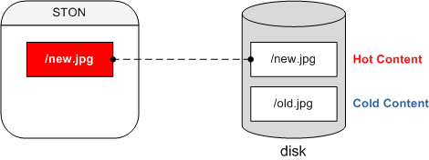
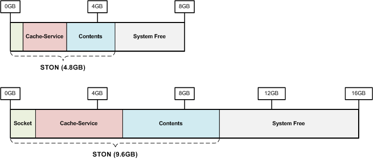

.. _adv_topics:

第19章 最適化とその他のもの
****************************

この章では、最適化とその他の雑多が深みのあるトピックについて扱う。 最適化は、高性能（High Performance）のための方法であり、これは、私たちが追求する最大の価値だ。 エンタープライズ環境での高性能は与えられたハードウェアリソースを最大限に活用することを意味する

その中で、メモリはすべての設計と政策を決定する最も重要な資源である。 特にインデックス（要求されたURLを迅速に見つけること）には、必ず理解する。 なぜなら、サービス品質を決定することは、インデックスだからだ。 これから説明するすべての内容は、次の表「物理メモリサイズに応じ設定」と関連がある。

============= ============== =============== ============= ========
Physical RAM  System Free    Contents        Caching Count Sockets
============= ============== =============== ============= ========
1GB           409.60MB       188.37MB        219,469       5,000
2GB           819.20MB       446.74MB        520,494       10,000
4GB           1.60GB         963.49MB        1,122,544     20,000
8GB           3.20GB         2.05GB          2,440,422     20,000
16GB          6.40GB         4.45GB          5,303,733     20,000
32GB          12.80GB        9.25GB          11,030,356    20,000
64GB          25.60GB        18.85GB         22,483,603    20,000
128GB         51.20GB        38.05GB         45,390,095    20,000
============= ============== =============== ============= ========

.. toctree::
   :maxdepth: 2

.. _adv_topics_memory_only:

Memory-Only モード
====================================

Memory-Onlyモードとディスクを用いずに、コンテンツをメモリのみ積載する方式をいう。 
:ref:`env-cache-storage` をしないと、自動的にMemory-Onlyモードで動作する。 ::
    
    # server.xml - <Server><Cache>

    <Storage />

このモードでは、 :ref:`caching-policy-ttl` が短いか、コンテンツのサイズが小さい場合に便利である。

- HLS ライブ放送
- 価格/在庫
- チケット照会
- リアルタイム順位
- 検索
- API

逆に、コンテンツのサイズがGB単位で大きいか :ref:`caching-policy-ttl` が長いサービスでは、不適合である。

.. note::

   v2.5.0からサポートされて動的に変更が不可能である。 設定の変更後は、必ずサービスを再起動しなければならない。

.. _adv_topics_indexing:

インデックス
====================================

インデックスモードを説明する前に、HotコンテンツとColdコンテンツの概念を理解する。

ソースからキャッシュしたコンテンツは、ローカルディスクに保存される。 そのコンテンツがアクセスされるたびに毎回ディスクから読み取る送信する当然の性能が低下する。 したがって、頻繁にアクセスされるコンテンツをメモリにロードしておけば、高性能を得ることができる。 このように、メモリにロードされたコンテンツをHot、ディスクのみあるコンテンツをColdと呼ぶ

インデックスは、HotとColdコンテンツを見つける方法を意味し、これは性能と直結される。 基本は、メモリのインデックスである。

   # server.xml - <Server><Cache>

   <Indexing>Memory</Indexing>

メモリインデックスでは、Coldが存在しない。 すべてのファイルに関する情報は、メモリにロードされるため、メモリで見つけることができない場合は、元のサーバーから新規にダウンロードする。 検索時間が非常に短いため、その分高性能と迅速なサービス品質を得ることができる。 しかし、メモリ容量の制限により、キャッシュ数に限界がある。 その限界は先進表Caching Countを参照する。

ディスクインデックスはHotにない場合は、ソースに行く前にColdからコンテンツを探す。 ::

   # server.xml - <Server><Cache>

   <Indexing>Disk</Indexing>

この方式は、メモリの制限を受けないため、Caching Countに制限がない。 Hotコンテンツの場合、迅速な品質を保証しますが、Coldの場合は、ディスクを使用するため、比較的遅い。 簡単に整理すると、Hotは、メモリ速度、Coldは、ディスク速度に収束する。

ディスクインデックスを使用する場合はSSDを使用することを強く推奨する。 インデックスは、STONがインストールされてディスクでのみ実行される。 STONは、一般的にOSと同じディスクにインストールされるので、OSディスクのみSSDに使用しても高性能を期待することができる。

.. note::

   SSDの寿命はアクセス頻度よりWriteされる量によって決定される。 IntelやSamsungなど供給するSSDの場合、最小600TBのWrite寿命を保証する。 これは単に計算してみると、一日に20GBずつWriteする場合、10年ほどの寿命を予測することができる。 STONからのWriteの99％は、Logだ。 このような観点から、LogをSSDではなく、別のディスク（SASやSATAなど）に記録するようにすれば耐久性を確保することができる。

.. warning::

   インデックスは、動的に変更することができないだけでなく、変更しても安定性が保証されない。 したがって、モードを変更した後、 :ref:`getting-started-reset` を行わなければ、安全にサービスすることができる。

.. _adv_topics_mem:

メモリ構造
====================================

キャッシュサーバと汎用のWebサーバーの動作は、同様の一つの目的は、非常に異なっている。 STONの構造と動作を詳細に理解すると、より最適化されたサービスが可能である。 最適化の目的は、以下の通りである。

**高スループット **。 パフォーマンスの低下なしに数万のセッションを同時に処理することができる。

**クイック反応**。 クライアントに遅れのないサービスを提供する。

**元のサーバーの負荷を削減**。 ソースサーバーの負荷は、ややもすると、全体の障害につながる。

次の図は、STONを8GBと16GBのメモリ装置で駆動させた時のメモリ構成である。

メモリはSTONが使用するメモリと使用していないメモリ（Free）に分ける。 STONが使用するメモリは、ファイル、ソケットのようなサービスの規模に依存する資源の数と関連がある。

.. note::

   システム負荷の根本は、ディスクI / Oのためである。 あなたは "どのように多くContentsをCachingなければ、ディスクI / Oのを減らすことができるか。」 について心配する必要がない。

.. _adv_topics_mem_control:

メモリ制御
====================================

`メモリ構造`_ は、駆動されたとき、物理メモリサイズに基づいて計算される。 ::

   # server.xml - <Server><Cache>

   <SystemMemoryRatio>100</SystemMemoryRatio>

-  ``<SystemMemoryRatio> (基本: 100)`` 物理メモリを基準として使用メモリの割合を設定する。

たとえば8GB機器で ``<SystemMemoryRatio>`` を50に設定すると、物理メモリが4GBであるかのように動作する。 これはメモリを占有する他のプロセスのように駆動されるときに有用に使用することができる。

より具体的にサービスの種類に応じて、メモリにロードされるデータの割合を調整すると効果的である。 ::

   # server.xml - <Server><Cache>

   <ContentMemoryRatio>50</ContentMemoryRatio>

-  ``<ContentMemoryRatio> (基本: 50)`` STONが使用するメモリの合計のうちサービスデータメモリロードの割合を設定する。

例えば、ゲームのポータルのようなファイルの数は少ないが、コンテンツのサイズが大きい場合には、この数値を大きくすると、ファイルI / Oが減少される。 逆に、非常に小さなファイルが多い場合は、逆に減らす設定が役に立つことができる。

.. _adv_topics_sys_free_mem:

システムFreeメモリ
====================================

OS（Operating System）が遅い場合どのようなプログラムも、第性能を出さない。 STONは、OSのためにいくつかのメモリを使用していない。 OSのパフォーマンスを最大化するためにあり、これをシステムFreeメモリと呼ぶ。

.. note::

   これに対して権威のある説明を提示したいが、残念ながら見つからなかった。 グーグリングを通じて最も多く `引用された文 <http://www.sysxperts.com/home/announce/vmdirtyratioandvmdirtybackgroundratio>`_ を提示する。

============== ===============
Physical RAM   System Free
============== ===============
1GB	           409.6MB
2GB	           819.2MB
4GB            1.6GB
8GB	           3.2GB
16GB	         6.4GB
32GB	         12.8GB
64GB	         25.6GB
128GB	         51.2GB
============== ===============

上級ユーザーの場合は、サービス形態に合わせてFreeメモリの割合を減らすことができる。 Freeメモリが減ると、より多くのContentsをメモリにロードすることができる。 ::

   # server.xml - <Server><Cache>

   <SystemFreeMemoryRatio>40</SystemFreeMemoryRatio>

-  ``<SystemFreeMemoryRatio> (基本: 40, 最大: 40)`` 物理メモリに基づいて設定された割合だけをFreeメモリに残っている。

Cachingサービスメモリ
====================================

クライアントに送信するコンテンツをCachingメモリである。 一度ディスクからメモリにロードされたコンテンツは、メモリ不足が発生していない場合続け、メモリに存在する。 問題は、メモリ不足は、常に発生するという点である。

.. figure:: img/perf_inmemory.png
   :align: center

上の図のように送信すべきコンテンツは、ディスクに完全なのに物理メモリにロードすることができる容量は非常に限られている。 32GBの物理メモリを搭載しても、高精細動画やゲームクライアントのサイズを考慮すると、あまりゆったり方ではない。 いくら効率的にメモリを管理しても、物理的なディスクI / O速度に収束するしかない。

最も効果的な方法は、Contentsメモリ空間を最大限に確保して、ディスクI / Oの削減である。 以下は、物理メモリの基準でSTONが基本的に設定する最大Contentsメモリサイズである。

=============== ================= ====================
Physical RAM    Contents          Caching Count
=============== ================= ====================
1GB             188.37MB          219,469
2GB             446.74MB          520,494
4GB             963.49MB          1,122,544
8GB             2.05GB            2,440,422
16GB            4.45GB            5,303,733
32GB            9.25GB            11,030,356
64GB            18.85GB           22,483,603
128GB           38.05GB           45,390,095
=============== ================= ====================

Socketメモリ
====================================

ソケットもメモリを使用する。 4GB以上の機器でSTONは2万個のソケットを基に生成する。 ソケット1個= 10KB、1万あたり97.6MBのメモリを使用するので、約195MBのメモリが基本的にソケットに割り当てられる。

=============== ================= ======================
Physical RAM    Socket Count      Socket Memory
=============== ================= ======================
1GB             5千               50MB
2GB             1万               97.6MB
4GB 以上         2万               195MB
=============== ================= ======================

次の図のように、ソケットの両方を使用すると、自動的にソケットが増える。

.. figure:: img/perf_sockets.png
   :align: center

上の図のように増設され、3万個のソケットを使用する場合は、合計240MBのメモリがソケットに割り当てられる。 必要なソケットを必要分だけ使用することは何の問題もないように見える。 しかし、使用していないソケットを過度に多く設定しておくことは、メモリの無駄だ。 例えば10Gbpsの装置では、ユーザーごとに10Mbpsの伝送速度を保証することを前提したとき、次の式によって最大同時ユーザーは1,000人である。 ::

   10,000Mbps / 10Mbps = 1,000 Sessions

この場合、STONが最初生成する2万のうち19,000個に相当する約148MBは無駄になるわけだ。 この148MBのContentsに投資する場合の効率をより高めることができる。 最小ソケット数を設定すると、メモリをより効率的に使用することができる

**最小ソケット数**。 最初に割り当てられているソケットの数を意味する。

**増設ソケット数**。 ソケットがすべて使用中（Established）のときに設定した数だけソケットを増設する。

もう一つの重要な変数は、クライアントKeep-Alive時間設定だ。 (:ref:`handling_http_requests_session_man` を参照)

接続されたすべてのソケットがデータ転送中にあるわけではない。 IE、Chromeのようなブラウザは、次に発生するHTTPトランスポートのためにソケットをサーバーに接続しておいた状態に維持する。 実際にショッピングモールの場合は、接続されているセッションの中で、何のデータ転送が発生せず、ただついているセッションの割合は少なくは50％から多くは80％にのぼる。

Keep-Alive時間を長く与えるほどソケットの再利用性良くなりますが維持されるIdleソケットの数が増加するので、メモリを無駄にはひどくなる。 したがって、サービスに適したクライアントKeep-Alive時間を設定することが重要である。

.. _adv_topics_tso:

TCP Segmentation Offload
====================================

.. important:: 

   10G NICを使用する場合はTSO（TCP Segmentation Offload）をOFFに設定したいお勧めします。

TCPは送信時のパケットを分割（Segmentation）が、この作業をCPUではなくNICが実行するように設定することがTSOである。 （デフォルトはONである。）しかし、10G NICサービス環境では、我々はそれに関連する多くの障害を経験した。

-  TCPパケット損失と遅延
-  TCP接続の終了
-  Load Averageの異常増加

結論としてTSOは、すべての期待ほど高い性能を出せないものと推定される。 （NICのみ1Gに変えても、このような問題は発生しませんでした。）結論としてTSOをOFFに設定することにより、サービスは正常化された。 これによるCPU使用率は、心配するレベルではなく、サービスの規模と比例する正直な指標を示してくれる。

TSOの設定は、次のように設定/確認することができる。 （Kの大文字/小文字に注意する。） ::

   # ethtool -K ethX tso off        // TSO OFF 設定
   # ethtool -k ethX                // 設定閲覧
   ...
   tcp segmentation offload: on
   ...

.. Tip::

   詳細については、以下のリンクを参照する

   -  `http://sandilands.info/sgordon/segmentation-offloading-with-wireshark-and-ethtool <http://sandilands.info/sgordon/segmentation-offloading-with-wireshark-and-ethtool>`_
   -  `http://www.linuxfoundation.org/collaborate/workgroups/networking/tso <http://www.linuxfoundation.org/collaborate/workgroups/networking/tso>`_
   -  `http://www.packetinside.com/2013/02/mtu-1500.html <http://www.packetinside.com/2013/02/mtu-1500.html>`_

クライアントアクセス制限
====================================

制限なしのクライアント要求を許可すると、システムに過度の負荷が発生することができる。 システム過負荷は実質的に障害である。 適切な数値で、クライアントの要求を拒否して、システムを保護する ::

   # server.xml - <Server><Cache>

   <MaxSockets Reopen="75">80000</MaxSockets>

-  ``<MaxSockets> (基本: 80000, 最大: 100000)`` の接続を許可するクライアントの最大ソケット数。
   この数値を超えると、新規クライアント接続をすぐに閉める。
   ``<MaxSockets>`` の ``Reopen (基本: 75%)`` の割合だけソケット数が減少すると、再び接続を可能にする。

.. figure:: img/maxsockets.png
   :align: center

（デフォルト設定で）完全なクライアントソケットの数が8だけ超える新規クライアント接続は直ちに終了される。 全クライアントソケットの数が6万（8万75％）になると、再びアクセスを可能にする。

例えば、3万個のクライアントセッションを処理するときに、元のサーバーがすべての制限に達すると、この数値を3〜4万程度に設定するのが良い。 これにより、得られる効果は、以下の通りである。

-  特別Network構成（eg L4セッション制御など）が必要ない。
-  不要な（元の負荷で処理することができない）、クライアントの要求を防止する。
-  サービスの信頼性を高める。 サービスBurst以降の再起動など点検作業が必要ない。

HTTPクライアントセッション数
====================================

HTTPクライアントの接続を処理するための初期/増設セッション数を設定する。 ::

    # server.xml - <Server><Cache>

    <HttpClientSession>
       <Init>20000</Init>
       <TopUp>6000</TopUp>
    </HttpClientSession>

-  ``<Init>`` STON起動時にあらかじめ作成しておくソケット数

-  ``<TopUp>`` 生成しておいたソケットの数を超えたときに追加で作成することがソケット数

別に設定していない場合は、物理メモリのサイズに応じて自動的に設定される。

=============== =========================
物理メモリ	    <Init>, <TopUp>
=============== =========================
1GB             5千, 1千
2GB             1万, 2千
4GB             2万, 4千
8GB 以上        2万, 6千
=============== =========================
限定的な環境で少ない数のソケットだけでサービスが可能な場合、ソケットの数を減らすメモリを節約することができる。

.. _adv_topics_req_hit_ratio:

Request hit ratio
====================================

まず、クライアントのHTTP要求がどのように処理されるかを理解する。 キャッシュ処理の結果は、Squidと同じようにTCP_ *と命名され、各表現ごとにキャッシュサーバが処理した方式を意味する。

-  ``TCP_HIT`` 要求されたリソース（無期限）がキャッシュされており、すぐに応答する。
-  ``TCP_IMS_HIT`` IMS(If-Modified-Since)ヘッダと要求されたリソースが切れていない状態でキャッシュされており、304 NOT MODIFIEDに応答する。 TTLExtensionBy4xx、TTLExtensionBy5xx設定に該当する場合にも、これに該当する。
-  ``TCP_REFRESH_HIT`` 要求されたリソースが期限切れになって、元のサーバーの確認（元米の変更、304 NOT MODIFIED）後に応答する。 リソースの有効期限延長。
-  ``TCP_REF_FAIL_HIT`` TCP_REFRESH_HIT過程の中ソースサーバーで確認が失敗（接続の失敗、伝送遅延）した場合、有効期限が切れたコンテンツで応答する。
-  ``TCP_NEGATIVE_HIT`` 要求されたリソースが異常状態（元のサーバー接続/送信の失敗、4xx応答、5xx応答）にキャッシュされており、その状態を応答する。
-  ``TCP_REDIRECT_HIT`` サービス許可/拒否/ Redirect条件によってRedirectを応答する。
-  ``TCP_MISS`` 要求されたリソースがキャッシュされていない（=最初の要求）。 ソースサーバーから取得した結果を応答する。
-  ``TCP_REF_MISS`` 要求されたリソースが期限切れになって、元のサーバーの確認（元の変更、200 OK）した後の応答する。 新しいリソースがキャッシュされる。
-  ``TCP_CLIENT_REFRESH_MISS`` 要求を元のサーバーにバイパス。
-  ``TCP_ERROR`` 要求されたリソースがキャッシュされていない（=最初の要求）。 ソースサーバー障害（接続の失敗、伝送遅延、原稿排除）により、リソースをキャッシュできない。 クライアントに500 Internal Errorで応答する。
-  ``TCP_DENIED`` 要求は拒否されました。

以上を総合してRequest hit ratioの計算式は次の通りである。 ::

   TCP_HIT + TCP_IMS_HIT + TCP_REFRESH_HIT + TCP_REF_FAIL_HIT + TCP_NEGATIVE_HIT + TCP_REDIRECT_HIT
   ------------------------------------------------------------------------------------------------
                                            SUM(TCP_*)

Byte hit ratio
====================================

クライアントに送信されたトラフィック（Client Outbound）比元のサーバーから送信されたトラフィック（Origin Inbound）の割合を示す。 元のサーバーのトラフィックがクライアントのトラフィックよりも高い場合、負のが出てくることができる。 ::

   Client Outbound - Origin Inbound
   --------------------------------
           Client Outbound

ソースサーバーの障害状況ポリシー
====================================

顧客がいつでも元のサーバーをチェックできるようにすることが、開発チームの目標だ。 ソースサーバーの障害が検出されると、サーバーは自動的に排除されてリカバリモードに転換される。 障害サーバーが再起動されても、通常のサービスの状態を確認しなければなら再度投入する。

もしすべてのソースサーバーの障害を検出した場合、現在のキャッシュされたコンテンツへのサービスを行う。 TTLが期限切れコンテンツは、元のサーバーが回復するまで、自動的に延長される。 さらにPurgeされたコンテンツの場合でも、元のサーバーからキャッシュすることができない場合は、回復させ、サービスに問題がないように動作する。 最大限クライアントに障害状況を公開してはいけないという方針である。 完全障害状況で新規コンテンツ要求が入ってくると、次のようなエラーページと理由が明示される。

.. figure:: img/faq_stonerror.jpg
   :align: center

   まあまあの程と、このような画面は、表示する嫌いだ

時間単位の表現と範囲
====================================

基準時間が「超」の項目について、文字列として時間表現が可能である。 以下は、サポートされている時間の表現のリストと換算された超（sec）である。

=========================== =========================
表現	                      換算
=========================== =========================
year(s)                     31536000 秒 (=365 days)
month(s)                    2592000 秒 (=30 days)
week(s)                     604800 秒 (=7 days)
day(s)                      86400 秒 (=24 hours)
hour(s)	                    3600 秒 (=60 mins)
minute(s), min(s)	          60 秒
second(s), sec(s), (省略)	  1 秒
=========================== =========================

次のように組み合わせた時間の表現が可能である。 ::

    1year 3months 2weeks 4days 7hours 10mins 36secs

現在サポート対象は、以下の通りである。

- Custom TTLの時間表現
- TTLのRatioを除くすべて
- ClientKeepAliveSec
- ConnectTimeout
- ReceiveTimeout
- BypassConnectTimeout
- BypassReceiveTimeout
- ReuseTimeout
- RecoveryのCycle属性
- Bandwidth Throttling

Emergencyモード
====================================

内部的に、すべての仮想ホストがMemoryBlockを共有しながら、データを管理するように設計されている。 新規メモリが必要な場合は、参照されない古いMemoryBlockを再利用して新規メモリを確保する。 このプロセスをMemory-Swapと呼ぶ。 このような構造により、長期間運用しても、安定性を確保することができる。

.. figure:: img/faq_emergency1.png
   :align: center

   コンテンツデータは、MemoryBlockに含まれてサービスされる。

上の図の右側の状況のように、すべてのMemoryBlockが使用中で再利用することができるMemoryBlockが存在しない状況が発生することができる。 この時Memory-Swapが不可能になる。 たとえば、すべてのクライアントが異なるデータ領域を非常に少しずつダウンロードしたり、元のサーバーから別のデータを非常に少しずつ送信する状況が同時に発生する場合が最悪です。 このような場合は、システムから新しいメモリを割り当てて使用することも方法である。 しかし、このような状況が続く場合は、メモリ使用量が高くなる。 メモリ使用量が過度に高くなる場合は、システムメモリのスワップを発生させたり、最悪の場合は、OSがSTONを終了させる状況が発生することがあります。

.. note::

   Emergencyモードとメモリ不足の状況が発生した場合、一時的に新規MemoryBlockの割り当てを禁止させる状況を意味する。

これは過剰メモリ使用から身を守るための方法であり、再利用可能なMemoryBlockが十分に確保されると、自動的に終了される。 ::

    # server.xml - <Server><Cache>

    <EmergencyMode>OFF</EmergencyMode>

-  ``<EmergencyMode>``

   - ``OFF (기본)`` を使用していない。

   - ``ON`` を使用する。

EmergencyモードのときSTONは、次のように動作する。

- すでにロードされているコンテンツは、定期的にサービスされる。
- バイパスは、通常行われる。
- ロードされていないコンテンツについては、503 service temporarily unavailableで応答する。 TCP_ERROR状態が増加する。
- Idleクライアントソケットを素早く整理する。
- 新規コンテンツをキャッシュすることができない。
- TTLが期限切れコンテンツを更新しない。
- SNMPのcache.vhost.statusとXML / JSON統計のHost.State値が「Emergency」で提供される。
- InfoログにEmergencyモードに切り替え/オフを次のように記録する。 ::

    2013-08-07 21:10:42 [WARNING] Emergency mode activated. (Memory overused: +100.23MB)
    ...(省略)...
    2013-08-07 21:10:43 [NOTICE] Emergency mode inactivated.

ディスクHot-Swap
====================================

サービスを中断せず、ディスクを交換する。 パラメータは必ず ``<Disk>`` 設定と同じである。 ::

   http://127.0.0.1:10040/command/unmount?disk=...
   http://127.0.0.1:10040/command/umount?disk=...

排除されたディスクは、すぐに使用されず、そのディスクに保存されたすべてのコンテンツは無効化される。 管理者によって排除されたディスクの状態は「Unmounted "に設定される。

ディスクをサービスに再投入するには、次のように呼び出します。 ::

   http://127.0.0.1:10040/command/mount?disk=...

再投入されたディスクのすべてのコンテンツは無効化される。

.. _adv_topics_syncstale:

SyncStale
====================================

（インデックス時点とパフォーマンス上の理由で）異常サービス終了時の管理者が :ref:`api-cmd-purge` , :ref:`api-cmd-expire` , :ref:`api-cmd-hardpurge` したコンテンツがインデックスから失われることがあります。
これを補完するために、API呼び出しをログに記録して、サービスの再起動時に反映する。 ::

    # server.xml - <Server><Cache>

    <SyncStale>ON</SyncStale>

-  ``<SyncStale>``

   - ``ON  (基本)`` 駆動される同期する。

   - ``OFF`` 無視する。

ログは./stale.logに記録され正常終了または定期的インデックスの時点で初期化される。
