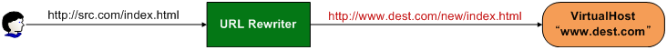
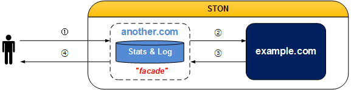
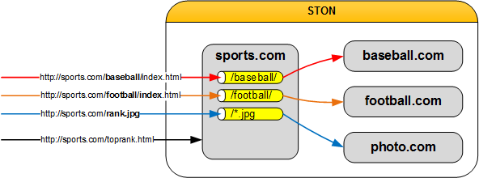
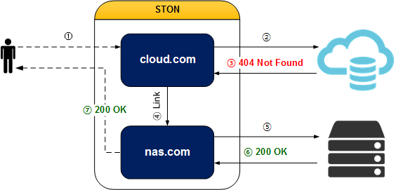
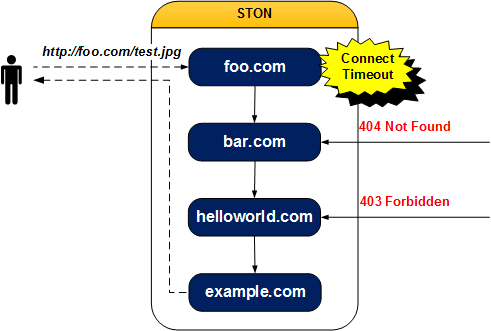

.. _adv-vhost:

第14章 仮想ホストの高度なテクニック
******************

この章では、仮想ホストを使用して、サービスを柔軟に構成する複数の手法について説明する。

仮想ホストは、通常、元の（DomainまたはIPリスト）と1：1で構成されていることが基本である。 しかし、状況に応じて代表仮想ホストを複数のサブ仮想ホストに分岐したり、逆に、独立した複数の仮想ホストを一つのサービスとしてパッケージする場合も発生する。 各機能に応じて、 :ref:`monitoring_stats_vhost_client` / :ref:`admin-log-access` 의のポリシーが異なる場合があることに注意しなければならない。

.. toctree::
   :maxdepth: 2

.. _adv-vhost-url-rewrite:

URL前処理
====================================

`정규표현식 <http://en.wikipedia.org/wiki/Regular_expression>`_ を使用して要求されたURLを変更する。 URL前処理が設定されている場合は、すべてのクライアントの要求（HTTPまたはFile I / O）は、必ずURL Rewriterを経る。

   URL Rewriterを通過しなければなら仮想ホストに行くことができる。

もしURL RewriterによってアクセスしようとするHostの名前が変更された場合、クライアントのHTTP要求のHostヘッダが変更されたものとみなす。 URLの前処理は、仮想ホストの設定（vhosts.xml）に設定する。 ほとんどの設定は、仮想ホストに依存しますが、URL、前処理の場合、クライアントが要求したHostの名前を変更することができますので、仮想ホストと同じレベルに設定する。 ::

   # vhosts.xml

   <Vhosts>
      <Vhost ...> ... </Vhost>
      <Vhost ...> ... </Vhost>
      <URLRewrite ...> ... </URLRewrite>
      <URLRewrite ...> ... </URLRewrite>
   </Vhosts>

マルチに設定することができ、順次、正規表現に一致するかどうかを比較する。 ::

   # vhosts.xml - <Vhosts>

   <URLRewrite AccessLog="Replace">
       <Pattern>www.exmaple.com/([^/]+)/(.*)</Pattern>
       <Replace>#1.exmaple.com/#2</Replace>
   </URLRewrite>

-  ``<URLRewrite>``

   URL前処理を設定する。
   ``AccessLog (基本: Replace)`` 属性は、Accessログに記録されるURLを設定する。
   ``Replace`` の場合、変換後のURL（/logo.jpg）を、 ``Pattern`` の場合、変換前のURL（/baseball/logo.jpg）をAccessログに記録する。

   -  ``<Pattern>`` マッチングさせるパターンを設定する。 一つのパターンは、（）括弧を使用して表現される。

   -  ``<Replace>`` 変換形式を設定する。 一致したパターンには＃1、＃2のように使用することができる。 ＃0は、要求URL全体を意味する。 パターンは、最大9個（＃9）まで指定することができる。

スループットは :ref:`monitoring_stats` で提供され :ref:`api-graph-urlrewrite` でも確認することができる。
URL前処理は :ref:`media-trimming` , :ref:`media-hls` などの他の機能と組み合わせて、表現を簡潔にする。 ::

   # vhosts.xml - <Vhosts>

   <URLRewrite>
       <Pattern>example.com/([^/]+)/(.*)</Pattern>
       <Replace>example.com/#1.php?id=#2</Replace>
   </URLRewrite>
   // Pattern : example.com/releasenotes/1.3.4
   // Replace : example.com/releasenotes.php?id=1.3.4

   <URLRewrite>
       <Pattern>example.com/download/(.*)</Pattern>
       <Replace>download.example.com/#1</Replace>
   </URLRewrite>
   // Pattern : example.com/download/1.3.4
   // Replace : download.example.com/1.3.4

   <URLRewrite>
       <Pattern>example.com/img/(.*\.(jpg|png).*)</Pattern>
       <Replace>example.com/#1/STON/composite/watermark1</Replace>
   </URLRewrite>
   // Pattern : example.com/img/image.jpg?date=20140326
   // Replace : example.com/image.jpg?date=20140326/STON/composite/watermark1

   <URLRewrite>
       <Pattern>example.com/preview/(.*)\.(mp3|mp4|m4a)$</Pattern>
       <Replace><![CDATA[example.com/#1.#2?&end=30&boost=10&bandwidth=2000&ratio=100]]></Replace>
   </URLRewrite>
   // Pattern : example.com/preview/audio.m4a
   // Replace : example.com/audio.m4a?end=30&boost=10&bandwidth=2000&ratio=100

   <URLRewrite>
       <Pattern>example.com/(.*)\.mp4\.m3u8$</Pattern>
       <Replace>example.com/#1.mp4/mp4hls/index.m3u8</Replace>
   </URLRewrite>
   // Pattern : example.com/video.mp4.m3u8
   // Replace : example.com/video.mp4/mp4hls/index.m3u8

   <URLRewrite>
       <Pattern>example.com/(.*)_(.*)_(.*)</Pattern>
       <Replace>example.com/#0/#1/#2/#3</Replace>
   </URLRewrite>
   // Pattern : example.com/video.mp4_10_20
   // Replace : example.com/example.com/video.mp4_10_20/video.mp4/10/20

パターンの表現にXMLの5つの特殊文字（ "＆" <>）が入る場合は、<！[CDATA [... ]]>で囲んで正しく設定されている。
:ref:`wm` を使用して設定すると、すべてのパターンはCDATAとして処理される。

.. _adv-vhost-facadevhost:

Facade仮想ホスト
====================================

``<Alias>`` は、仮想ホストの別名だけを追加しているので、統計とログが分離されない。 仮想ホストは、共有がドメインに基づいて、 :ref:`monitoring_stats_vhost_client` と :ref:`admin-log-access` を分離したい場合Facade仮想ホストを設定する。

   facadeは、統計とログを収集する。

::

    # vhosts.xml - <Vhosts>

    <Vhost Name="example.com">
       ...
    </Vhost>

    <Vhost Name="another.com" Status="facade:example.com">
       ...
    </Vhost>

``Status`` 属性の値を ``facade:`` + ``仮想ホスト`` に設定する。 例の場合 :ref:`monitoring_stats_vhost_client` と :ref:`admin-log-access` はexample.comではなく、クライアントが要求したドメインであるanother.comに収集される。

.. _adv-vhost-sub-path:

Sub-Path指定
====================================

仮想ホストでパスに沿って、他の仮想ホストが処理するように設定することができる。

   統計/ログは、要求を最終処理した各仮想ホストに記録される。

::

   # vhosts.xml - <Vhosts>

   <Vhost Name="sports.com">
     
       <Path Vhost="baseball.com">/baseball/<Path>
       <Path Vhost="football.com">/football/<Path>
       <Path Vhost="photo.com">/*.jpg<Path>
     
   </Vhost>

   <Vhost Name="baseball.com" />
   <Vhost Name="football.com" />
   <Vhost Name="photo.com" />

-  ```` パスまたはパターンが一致すると、その要求を別の仮想ホストに送る。 一致しない場合のみ、現在の仮想ホストが処理する。

   - ``Status (基本: Active)`` Inactiveの場合は無視する。

   -  ``<Path>`` クライアントが要求したURIとパスが一致した場合 ``Vhost`` にその要求を送る。 値は、パスまたはパターンのみ可能である。 ::

         <Path Vhost="baseball.com">baseball<Path>
         <Path Vhost="photo.com">*.jpg<Path>

      上記のように入力しても、それぞれ/ baseball /と/*.jpgとして認識される。

たとえば、クライアントが次のようにリクエストした場合、その要求は、仮想ホストのfootball.comが処理する。 ::

   GET /football/rank.html HTTP/1.1
   Host: sports.com

.. _adv-vhost-redirection-trace:

Redirect追跡
====================================

元のサーバーでRedirect系（301、302、303、307）で応答する場合Locationヘッダを追跡して、コンテンツを要請する。

   .. figure:: img/conf_redirectiontrace.png
      :align: center

      クライアントは、Redirectかどうかを知らない。

::

   # server.xml - <Server><VHostDefault><OriginOptions>
   # vhosts.xml - <Vhosts><Vhost><OriginOptions>

   <RedirectionTrace>OFF</RedirectionTrace>

-  ``<RedirectionTrace>``

   - ``OFF (基本)`` 3xx 応答で保存される。

   - ``ON`` Locationヘッダに記載されアドレスからコンテンツをダウンロードする。 形式に合わない場合Locationヘッダがない場合は、動作しない。 無限Redirectされることを防止するために1回だけ追跡する。

.. _adv-vhost-link:

仮想ホストのリンク
====================================

コンテンツが複数のソースに分散している場合は、仮想ホストのリンクを利用して、コンテンツが統合されているかのようにサービスが可能である。 特にOn-Premiseからクラウドにストレージを移行するか、またはストレージの容量、コストなどの理由でコンテンツが分散している環境で有用である。

   cloud.comにないコンテンツはnas.comが処理する。

::

   # vhosts.xml - <Vhosts><Vhost>

   <VhostLink Condition="...">...</VhostLink>

-  ``<VhostLink>`` 要求を委任する仮想ホスト名。 コンテンツのソースの応答が ``Condition`` を満足すれば、指定した仮想ホストに要求を委任します。 ただし一つだけ設定することができる。

   - ``Condition`` HTTP応答コード/パターン（1xx、2xx、3xx、4xx、5xx）、fail（ソースからキャッシュしていなかった場合）

クライアントの要求が他の仮想ホストに委任されても、 :ref:`monitoring_stats_vhost_client` と :ref:`admin-log-access` は、クライアントがアクセスした仮想ホストに記録される。

.. note::

   リンク関係にある仮想ホストの設定が異なる場合意図しない動作することを注意する。 仮想ホストのリンクがA（単純キャッシュ） - > B（画像圧縮）で結ばれている場合は、Aで処理された画像は、圧縮されませんが、Bで処理された画像は、圧縮される。

たとえばnas.comのコンテンツをcloud.comに移転している場合、cloud.comにない（= 404 Not Found）コンテンツにのみnas.comに要求を送信することができる。 下の場合、要求はnas.comによって処理されても、 :ref:`monitoring_stats_vhost_client` と :ref:`admin-log-access` はcloud.comに記録される。

::

   # vhosts.xml - <Vhosts>

   // cloud.comに ない(=404 Not Found) のコンテンツは、nas。  comで サービスする 。
   <Vhost Name="cloud.com">
     <VhostLink Condition="404">nas.com</VhostLink>
   </Vhost>

   <Vhost Name="nas.com">
   </Vhost>

:ref:`admin-log-access` のvhostlinkフィールドを介してクライアントの要求がどの仮想ホストで処理されたことが分かる。 「 - 」は、要求がリンクされていないことを意味し、 "nas.com」は、要求がリンクされてnas.comで処理されたことを意味する。 ::

    #Fields: date time s-ip cs-method cs-uri-stem ...(中略)... vhostlink
    2016.11.24 16:52:24 220.134.10.5 GET /web/h.gif ...(中略)... -
    2016.11.24 16:52:26 220.134.10.5 GET /favicon.ico ...(中略)... nas.com

リンクが複数回発生した場合、「+」を区切り文字としてリンクされたすべての仮想ホストが明示される。 この場合、最後の仮想ホストが最終リクエストを処理した仮想ホストである。

次のように複数の仮想ホストを別の条件でリンクすることができる。

::

   # vhosts.xml - <Vhosts>

   //  元のサーバーが 5 xxに 応答したり、 キャッシュしてい なかった 場合 （= fail）、 要求を bar。  comに 委任する 。
   <Vhost Name="foo.com">
     <VhostLink Condition="5xx,fail">bar.com</VhostLink>
   </Vhost>

   // 元のサーバーが 4 xxに 応答した ときに 、その 要求を helloworld。  comに 委任する 。
   <Vhost Name="bar.com">
     <VhostLink Condition="4xx">helloworld.com</VhostLink>
   </Vhost>

   // 元のサーバーで 403、404、または 5 xxに 応答した ときに 、その 要求を example。  comに 委任する 。
   <Vhost Name="helloworld.com">
     <VhostLink Condition="403,404,5xx">example.com</VhostLink>
   </Vhost>

   // もはや 委任してい ない 。
   <Vhost Name="example.com">
   </Vhost>

   抑止ながら可能である。

上記の例の場合、foo.comの :ref:`admin-log-access` は、次のとおりである。 ::

   #Fields: date time s-ip cs-method cs-uri-stem ...(中略)... vhostlink
   2016.11.24 16:52:24 220.134.10.5 GET /test.jpg ...(中略)... bar.com+helloworld.com+example.com

次の場合は、リンクはすぐに中断される。

* ターゲット仮想ホストが存在しない場合（foo.com - >？）
* 自分自身をターゲット仮想ホストに指定した場合（foo.com - > foo.com）
* 再帰リンク（Recursive Link）が発生した場合（foo.com - > bar.com - > foo.com）
