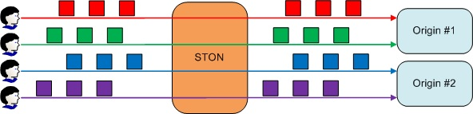

.. _bypass:

第8章 バイパス
******************

この章では、クライアント要求の処理を元のサーバーに委任するバイパスについて説明する。 バイパスは、条件と動作的に区分される。

バイパスは、Cachingポリシーよりも優先します。 設計段階でEdge導入が検討されていないサービスであれば、静的リソースと動的リソースを精巧に区分こなせない場合が多い。 このような場合、すべてのクライアントの要求をバイパスするように構成した後、ログに基づいて、要求の多いコンテンツのみCachingように設定する。 ほとんどの場合、数時間のログだけで、元の負荷を劇的に下げることができる。
:ref:`monitoring_stats` でリアルタイムの情報を提供している理由もサービスをリアルタイムチューニングできるようにするためである。

バイパスは、非常に速いだけでなく、HTTPトランザクション単位で動作する。 いくらパーソナライズされたサイトといってもほとんどは、メインページ（.html）のみ、動的に変更されるだけで、残りの99％は、静的なリソースとして構成されている。 ソースサーバーの動作に合わせることができるよう、 :ref:`origin-httprequest` のバイパスバージョンが別々に存在する。

.. toctree::
   :maxdepth: 2

No-Cacheリクエストバイパス
====================================

クライアントがno-cacheリクエストを送信ばバイパスする ::

   GET / HTTP/1.1
   cache-control: no-cache または cache-control:max-age=0
   pragma: no-cache

::

   # server.xml - <Server><VHostDefault><Options>
   # vhosts.xml - <Vhosts><Vhost><Options>

   <BypassNoCacheRequest>OFF</BypassNoCacheRequest>

-  ``<BypassNoCacheRequest>``

   - ``OFF (基本)`` Cacheモジュールが処理する。

   - ``ON`` ソースサーバーにバイパスする。

.. note::

    この設定は、クライアントの動作（おそらく ``ctrl`` + ``F5`` )によって判断される。 したがって、大量のバイパスが元に負担を与える可能性がある。

.. _bypass-getpost:

GET / POSTバイパス
====================================

バイパスがGET / POSTリクエストのデフォルトの動作になるように設定することができる。 GETとPOSTの用途が異なるだけデフォルトの動作が異なることに注意する。 ::

   # server.xml - <Server><VHostDefault><Options>
   # vhosts.xml - <Vhosts><Vhost><Options>

   <BypassPostRequest>ON</BypassPostRequest>
   <BypassGetRequest>OFF</BypassGetRequest>

-  ``<BypassPostRequest>``

   - ``ON (基本)`` POSTリクエストを送信元サーバーとしてバイパスする。

   - ``OFF`` POSTリクエストをSTONが処理する。

-  ``<BypassGetRequest>``

   - ``OFF (基本)`` GETリクエストをSTONが処理する。

   - ``ON`` GETリクエストを送信元サーバーとしてバイパスする。

:ref:`access-control-vhost` と同じ条件の両方をサポートする。 バイパス例外条件は/ svc / {仮想ホスト名} /bypass.txtに設定する。 ::

   # /svc/www.example.com/bypass.txt
   $IP[192.168.2.1-255]
   /index.html

cacheやbypass条件を明確にしていない場合は、デフォルトの設定と逆に動作する。 例えば、 ``<BypassGetRequest>`` が ``ON`` であれば、例外条件はCachingリストになる。 混乱余地が多い場合、2番目のパラメータを使用して、より明確に条件を設定することができる。 ::

   # /svc/www.winesoft.co.kr/bypass.txt

   $HEADER[cookie: *ILLEGAL*], cache               // 常にCaching処理
   !HEADER[referer:]                               // デフォルトの設定に応じて
   !HEADER[referer] & !HEADER[user-agent], bypass  // 常にバイパス
   $URL[/source/public.zip]                        // デフォルトの設定に応じて

整理すると、優先順位は次の通りである。

1. No-Cacheバイパス
2. bypass.txtにbypassと明記されて
3. bypass.txtのデフォルト設定

ソースサーバーの固定
====================================

ログイン状態のように、元のサーバーとクライアントが必ず1：1で通信する必要がある。
`GET/POST 바이패스`_ の属性に元のサーバーを固定させることができる。 ::

   # server.xml - <Server><VHostDefault><Options>
   # vhosts.xml - <Vhosts><Vhost><Options>

   <BypassPostRequest OriginAffinity="ON">...</BypassPostRequest>
   <BypassGetRequest OriginAffinity="ON">...</BypassGetRequest>

-  ``OriginAffinity``

   - ``ON (基本)`` クライアント要求が常に同じサーバーにバイパスされることを保証する。 ただし、同じソケットであることを保証するものではない。

     バイパスしなければならソースサーバーと接続しているすべてのソケットが切れる状況が発生することもある。 しかし、このような場合でも、サーバーに新しいソケット接続を要求する。

     .. figure:: img/private_bypass3.jpg
        :align: center

        常に同じサーバーにバイパスされる。

     バイパスたソースサーバーが障害を排除したり、DNSに陥った場合、新しいサーバーにバイパスされる。

   - ``OFF`` クライアントからの要求がどのサーバーにバイパスされることを保証することはできない。

     .. figure:: img/private_bypass1.jpg
        :align: center

        :ref:`origin-balancemode` によって従う。

元セッション固定
====================================

クライアントソケットごとに、元のサーバーと1：1でバイパスセッションを使用する。

   クライアントが、元のセッションを所有する。

`GET/POST 바이패스`_ の属性に元のセッションを固定することができる。 ::

   # server.xml - <Server><VHostDefault><Options>
   # vhosts.xml - <Vhosts><Vhost><Options>

   <BypassPostRequest Private="OFF">...</BypassPostRequest>
   <BypassGetRequest Private="OFF">...</BypassGetRequest>

-  ``Private``

   - ``ON`` クライアントセッションが元のサーバー専用のセッションを使用するように動作する。 常に同じサーバーに要求がバイパスされる。 クライアントと元のサーバーのいずれか一方のセッションが終了された瞬間、相手のセッションも終了される。

   - ``OFF (基本)`` 専用のセッションを使用していない。

ソースサーバーがユーザーのログイン情報をセッションに基づいて維持する場合のように、クライアントの要求が必ずしも同じソケットに処理されるべき場合に便利である。

.. note::

   ややもすると、あまりにも多くの要求を ``Private`` にバイパスする場合は、クライアントの数だけ、元のサーバーに接続されて多大な負荷を与えることができる。 また、このように接続されたソースセッションは、クライアントが所有することになるので、悪意のある攻撃の状況でのリスクをもたらすことができる。

Timeout
-----------------------

バイパスは、元のサーバーから動的に処理した結果を応答する場合が多い。 これにより、処理速度が静的なコンテンツよりも遅い場合が多い。 バイパス専用Timeoutを設定して、不器用な障害の判断がされないようにする。 ::

   # server.xml - <Server><VHostDefault><OriginOptions>
   # vhosts.xml - <Vhosts><Vhost><OriginOptions>

   <BypassConnectTimeout>5</BypassConnectTimeout>
   <BypassReceiveTimeout>300</BypassReceiveTimeout>

-  ``<BypassConnectTimeout> (基本: 5秒)``
   バイパスのためにn秒以内に元のサーバーとの接続が行われていない場合、接続に失敗として処理する。

-  ``<BypassReceiveTimeout> (基本: 5秒)``
   バイパスのソースサーバーからの応答がn秒ない場合は、送信が失敗で処理する。

バイパスヘッダ
====================================

:ref:`origin-httprequest` 設定のバイパスを許可するを設定する。 ::

   # server.xml - <Server><VHostDefault><OriginOptions>
   # vhosts.xml - <Vhosts><Vhost><OriginOptions>

   <UserAgent Bypass="OFF">...</UserAgent>
   <Host Bypass="ON"/>
   <XFFClientIPOnly Bypass="ON">...</XFFClientIPOnly>

-  ``Bypass`` 属性

   - ``ON`` に設定され、ヘッダーを指定する。

   - ``OFF`` クライアントが送信した関連ヘッダを明示する。

.. _bypass-port:

Portバイパス
====================================

特定のTCPポートのすべてのパケットを送信元サーバーとしてバイパスする。 仮想ホストのみ設定だ。 ::

   # vhosts.xml - <Vhosts>

   <Vhost Name="www.example">
      <PortBypass>443</PortBypass>
      <PortBypass Dest=”1935”>1935</PortBypass>
   </Vhost>

-  ``<PortBypass>``
   指定されたポートで、入力されたすべてのパケットを元のサーバーの同じポートにバイパスする。
   ``Dest`` 属性にソースサーバーのポートを設定する。

たとえば、ポート443をバイパスする場合、クライアントは、元のサーバーと直接SSL通信をする効果を持つ。 バイパスされるポートは、絶対に重複することができない。

.. note::

   構造的にPortバイパスは、HTTPより下位LayerであるTCPで行われる。 特定の仮想ホストの下位にPortバイパスを設定する理由は、統計情報を収集する主体が必要だからだ。
