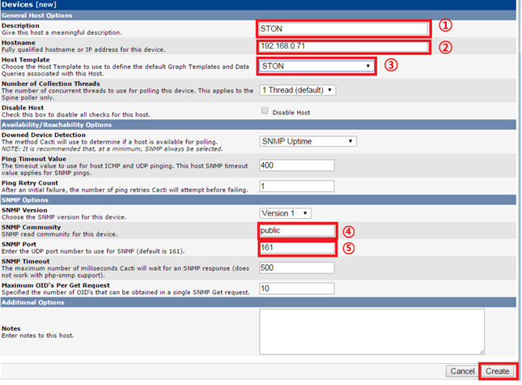
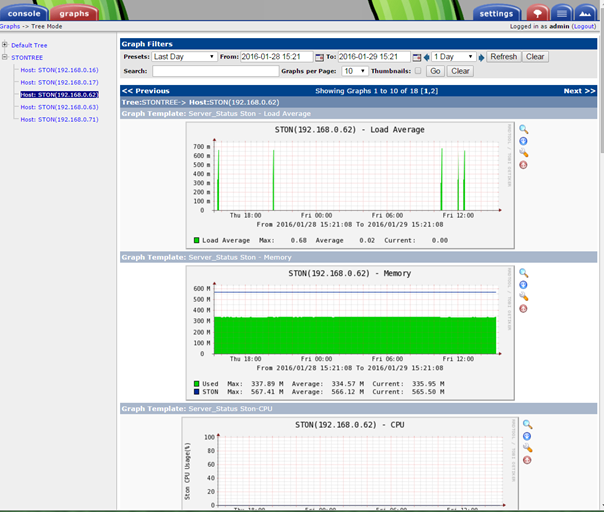

.. _cacti:

Appendix B : Cacti 감시
*************************

이 장에서는 `Cacti <http://www.cacti.net/>`_ 의 Graph Tree를 사용하여 다수의 STON을 통합 모니터링하는 방법을 설명한다. 다음의 두 가지 조건이 전제가된다.

-  Cacti를 설치하는 서버
-  SNMP를 활성화 ( :ref:`snmp` 참조)

.. toctree::
   :maxdepth: 2

.. _cacti_template:

Template 추가
====================================

STON에서 제공되는 Host Template을 사용하면 모니터링 환경을 쉽게 구축 할 수있다.
( `다운로드  <http://webhard.winesoft.co.kr/ston/monitoring/cacti/ston_host_template.xml>`_ )

.. figure:: img/cacti01.png
   :align: center

   Import Templates 메뉴를 선택한다.

.. figure:: img/cacti02.png
   :align: center

   cacti_host_template_ston.xml을 Import한다.

.. _cacti_device_add:

Device 등록
====================================

STON을 Cacti의 Device에 등록한다.

.. figure:: img/cacti03.png
   :align: center

   [Devices] 메뉴를 선택한다.

.. figure:: img/cacti04.png
   :align: center

   [Devices]메뉴에서 [Add]버튼을 클릭합니다.

   Devices 항목을 작성한다.

-  ①  대상 STON의 이름을 작성한다.
-  ② 대상 STON의 IP 주소를 입력한다.
-  ③ "STON"을 선택한다.
-  ④ “Public”을 선택한다.
-  ⑤ 기본 포트 161을 입력한다.

Create 버튼을 클릭하여 Device를 연동한다.

.. figure:: img/cacti06.png
   :align: center

   정상적인 연동되었다.

.. figure:: img/cacti07.png
   :align: center

   연동에 실패했습니다.

.. note::

   SNMP 연동 실패

   -  STON의 SNMP가 활성화되어 있는지 확인한다.
   -  SNMP Port 번호가 STON의 SNMP Port 번호와 일치하는지 확인한다.

Device 연동에 성공하면 STON Template에서 제공되는 18 가지 항목의 그래프를 사용할 수있다.

.. figure:: img/cacti08.png
   :align: center

   "Create Graphs for this Host"링크를 클릭합니다.

   18 종류의 그래프가 제공된다.

[Create] 버튼을 클릭하여 생성 된 그래프를 확인한다.

.. figure:: img/cacti10.png
   :align: center

   그래프가 작성되었다.

.. _cacti_graph_tree:

Graph Tree 생성
====================================

Graph Tree를 생성한다.

   [Graph Trees]을 클릭합니다.

   오른쪽 상단의[Add]를 클릭합니다.

.. figure:: img/cacti13.png
   :align: center

   Graph Tree 생성한다.

STON을 Graph Tree에 추가한다.

   [Tree Items] 메뉴에서 [Add]를 클릭합니다.

.. figure:: img/cacti15.png
   :align: center

   [Tree Items]항목을 작성한다.

-  ①	“Host”를 선택한다.
-  ②	추가 “Devices” 를 선택한다.
-  ③	“Graph Template”를 선택한다.

.. _cacti_graph_confirm:

Graphs 확인
====================================

왼쪽의 [graphs] 메뉴를 클릭하여 그래프가 제대로 나오는지 확인한다.

   정기적으로 정상 작동 여부를 확인한다.
