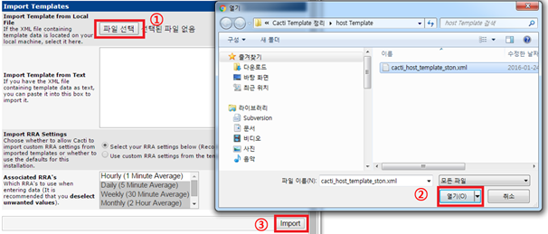
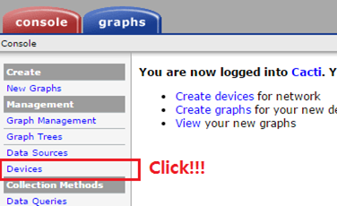
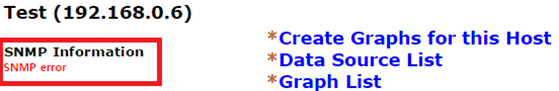
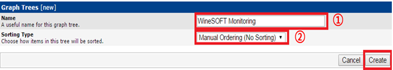
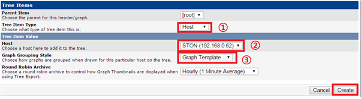

.. _cacti:

Appendix B：Cacti監視
*************************

この章では、 `Cacti <http://www.cacti.net/>`_ のGraph Treeを使用して、多数のSTONを統合監視する方法について説明する。 次の2つの条件が前提となる。

-  Cactiをインストールするサーバー
-  SNMPの有効化 ( :ref:`snmp` 参照)

.. toctree::
   :maxdepth: 2

.. _cacti_template:

Template追加
====================================

STONで提供されるHost Templateを使用すると、監視環境を容易に構築することができる。
( `ダウンロード  <http://webhard.winesoft.co.kr/ston/monitoring/cacti/ston_host_template.xml>`_ )

   Import Templatesメニューを選択する。

   cacti_host_template_ston.xmlをImportする。

.. _cacti_device_add:

Device登録
====================================

STONをCactiのDeviceに登録する。

   [Devices]メニューを選択する。

.. figure:: img/cacti04.png
   :align: center

   [Devices]メニューの[Add]ボタンをクリックします。

.. figure:: img/cacti05.png
   :align: center

   Devices項目を作成する。

-  ① 対象STONの名前を作成する。
-  ② 対象STONのIPアドレスを入力する。
-  ③ ”STON” を選択する。
-  ④ “Public” を選択する。
-  ⑤ デフォルトのポート161を入力する。

Createボタンをクリックして、Deviceを連動する。

.. figure:: img/cacti06.png
   :align: center

   正常連動された。

   連動に失敗しました。

.. note::

   SNMP連動失敗時

   -  STONのSNMPが有効になっていることを確認する。
   -  SNMP Port番号がSTONのSNMP Port番号と一致することを確認する。

Device連動に成功するとSTON Templateで提供される18種類の項目のグラフを使用することができる。

.. figure:: img/cacti08.png
   :align: center

   "Create Graphs for this Host" リンクをクリックします。

.. figure:: img/cacti09.png
   :align: center

   18種類のグラフが提供される。

[Create] ボタンをクリックして、生成されたグラフを確認する。

.. figure:: img/cacti10.png
   :align: center

   グラフが作成された。

.. _cacti_graph_tree:

Graph Tree生成
====================================

Graph Treeを生成する。

.. figure:: img/cacti11.png
   :align: center

   [Graph Trees] をクリックします。

.. figure:: img/cacti12.png
   :align: center

   右上の [Add]をクリックします。

   Graph Tree生成する。

STONをGraph Treeに追加する。

.. figure:: img/cacti14.png
   :align: center

   [Tree Items] メニューから[Add]をクリックします。

   [Tree Items]項目を作成する。

-  ①	“Host”を選択する。
-  ②	追加する “Devices” を選択する。
-  ③	“Graph Template” を選択する。

.. _cacti_graph_confirm:

Graphs確認
====================================

左上の [graphs] メニューをクリックして、グラフが正常に出るかを確認する。

.. figure:: img/cacti16.png
   :align: center

   定期的に、通常の動作するかどうかを確認する。
