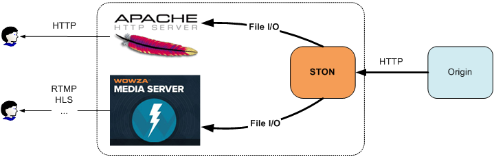

.. _filesystem:

제 18 장 File System
******************

이 장에서는 STON를 로컬 디스크처럼 사용하는 방법을 설명한다. STON는 `FUSE <http://fuse.sourceforge.net/>`_ 를 기반으로 Linux VFS (Virtual File System)에 Mount된다. Mount 된 경로의 모든 파일 액세스 된 순간 Caching입니다 만, 다른 프로세스는이 사실을 모른다.
**Caching기능이 탑재 된 ReadOnly 디스크에** 이해하고있다.

   `Fuse <http://upload.wikimedia.org/wikipedia/commons/0/08/FUSE_structure.svg>`_ 구조

구조 File I / O 함수의 호출을 Linux Kernel이 STON에 직접 전달하는 과정에서 어떤 요소 (물리적 파일 I / O 또는 Socket 통신 등)도 개입하지 않는다. 이러한 구조는 매우 높은 성능을 가능하게한다. STON 메모리 Caching을 통해 물리적 디스크에 액세스보다 뛰어난 성능을 기대할 수있다.

.. toctree::
   :maxdepth: 2

Mount하기
====================================

전역 설정 (server.xml)로 설정한다. ::

   # server.xml - <Server><Cache>

   <FileSystem Mount="/cachefs" DotDir="OFF" Separator="^">OFF</FileSystem>

-  ``<FileSystem>``

   -  ``OFF (기본)`` 아무것도하지 않는다.

   -  ``ON``  STON을 ``Mount`` 속성의 경로에 Mount한다.

기존 HTTP 구조를 그대로 유지 한 채 Cache 모듈에 액세스하는 방법 (File System)가 추가 된 구조로 개발되었다. 따라서 어느 쪽에서 접근도 Caching은 처음 한 번만 이루어 HTTP 또는 File I / O 서비스된다. FileSystem은 Cache 모듈에 액세스하는 새로운 다리를 또 놓은 것이다.

.. figure:: img/conf_fs2.png
   :align: center

   HTTP와 File I / O Cache 모듈을 공유한다.

소스 서버의 콘텐츠를 HTTP뿐만 아니라 File I / O 모두에서 액세스 할 수있다. 이를 활용하면 로컬 파일 기반 솔루션의 가용성을 더욱 높일 수있다.

   어떤 서버에서도 OK

현재 STON File System을 지원하는 함수 목록은 다음과 같다.

========= =============== ===========
FUSE	  C	              LINUX
========= =============== ===========
open	  fopen	          open
release	  fclose	      close
read	  fseek, fread	  seek, read
getattr	  fstat	          stat
unlink	  remove	      unlink
========= =============== ===========

File I / O는 내부적으로 여러 단계를 거친다. 각 단계의 이해가 바탕이되어야 최상의 성능을 얻을 수있다.

가상 호스트 찾기
====================================

첫 번째 코스는 액세스하려고하는 가상 호스트를 찾을 수 있습니다. HTTP 요청에는 다음과 같이 Host 헤더가 명시되어 있으며, 가상 호스트를 손쉽게 찾을 수있다. ::

    GET /ston.jpg HTTP/1.1
    host: example.com

File System은 첫 번째 경로에서이 문제를 해결한다. 예를 들어, STON이 / cachefs라는 경로에 Mount되어있는 경우 로컬 파일에 액세스하려면 다음 경로를 사용할 필요가있다. ::

    /cachefs/example.com/ston.jpg

:ref:`env-vhost-find` 도 동일한 방식으로 작동한다. example.com의 ``<Alias>`` 에 * .example.com가 지정되어있는 경우는 다음의 방법은 모두 같은 파일을 가리킨다. ::

    /cachefs/example.com/ston.jpg
    /cachefs/img.example.com/ston.jpg
    /cachefs/example.example.com/ston.jpg

예를 들어 Apache에서 example.com을 연동하기 위해서는 DocumentRoot를 /cachefs/example.com/로 설정할 필요가있다.

파일 / 디렉토리
====================================

가상 호스트마다 File System을 설정한다. 또는 기본 가상 호스트를 사용하여 모든 가상 호스트에 일괄 설정할 수있다. ::

   # server.xml - <Server><VHostDefault><Options>
   # vhosts.xml - <Vhosts><Vhost><Options>

   <FileSystem Status="Active" DotDir="OFF">
      <FileTime>origin</FileTime>
      <FileStatus>200</FileStatus>
      <DirStatus>301, 302, 400, 401, 403</DirStatus>
      <Unlink>Purge</Unlink>
   </FileSystem>

-  ``<FileTime> (기본: Origin)``
   파일의 시간을 제공 할 때  ``Origin`` 인 경우, 원본으로 답했다 Last-Modified 시간, ``Local`` 의 경우 로컬에 캐시 된 시간을 서비스한다.
   ( ``Origin`` 의 경우) 원본 서버에서 Last-Modified 시간을주지 않는 경우는 다음과 같이 Unix의 초기 시간에 제공된다.

   .. figure:: img/fs_filetime.png
      :align: center

-  ``<FileSystem>``
   ``Status`` 속성이 ``Inactive`` 이면 File System에서 액세스 할 수 없다. Active로 설정해야한다.

-  ``<FileStatus> (기본: 200)``
   파일로 인식 할 원본 서버 HTTP 응답 코드를 설정한다. 일반적으로 200 달러를 설정하지만, 특별한 제약은 없다.

-  ``<DirStatus> (기본: 301, 302, 400, 401, 403)``
    디렉토리로 인식 할 원본 서버 HTTP 응답 코드를 설정한다. 기본적으로 302,400,401,403 등이 설정된다.

-  ``<Unlink> (기본: Purge)``
   파일 삭제 요청이 들어온 경우 동작  ``Purge`` , ``Expire`` , ``HardPurge`` 를 설정한다.

원래 서버에 HTTP 응답 코드가 다양하게 해석 될 수있다. 따라서 각각의 HTTP 응답 코드를 해석하는 방법을 설정할 필요가있다.

대부분의 경우 원래 서버에있는 파일의 경우 **200 OK** 로 응답한다. 디렉터리 액세스의 경우 **403 Forbidden** 응답과 **302 Found** 다른 페이지로 Redirect 시키기도한다. 응답 코드 이름을 comma (,)로 구분하여 설정하면 HTTP 응답 코드 Body를 파일 또는 디렉토리로 인식한다. 설정되지 않은 응답 코드는 존재하지 않는 것으로 판단, File I / O가 실패합니다.

파일의 속성
====================================

대부분 File I / O의 첫 번째 단계는 파일의 속성을 취득하는 것이다. 파일을 open하기 전에 파일의 정보를 얻는 것은 당연한 순서이다. Kernel이 파일의 속성을 서비스하는 과정을 STON의 관점에서 보면 다음과 같다. (/cachefs은 Mount 경로이므로 Kernel을 생략한다.)

.. figure:: img/conf_fs4.png
   :align: center

   파일의 속성을 취득하는 과정

Linux의 경우 파일이나 디렉토리를 따로 구분하지 않는다. 따라서 특정 파일의 속성을 취득하는 과정이 생각보다 복잡하다. 위의 그림에서 알 수 있듯이 디렉토리가 깊으면 깊을수록 중간 과정 (= 필요없는) 가상 호스트를 검색 및 파일 액세스가 발생하여 성능이 저하된다. 특히 / one 또는 / one / two 수 있도록, Web 서비스라면 읽혔도 않은 경로의 요구가 발생하여 원본 서버의 부하를 발생시킨다. 물론 Caching되면 TTL (Time To Live) 시간의 액세스는 발생하지 않습니다 아름답 지 않은 것만은 분명하다.

이러한 구조의 부하를 휴리스틱 (Heuristic)에 해결하기 위해 ``DotDir`` 속성을 추가했다.
``DotDir`` 는 dot (.)가 요청 된 경로에 존재하지 않으면 디렉토리 (Dir)로 인식되는 기능이다. 위의 그림은 ``DotDir`` 가 ``OFF`` 상태이다.
``DotDir`` 이 ``ON`` 인 경우는 다음과 같이 동작한다.

.. figure:: img/conf_fs5.png
   :align: center

   전역 ``DotDir`` 활성화( ``ON`` )

Kernel에서 호출되는 과정과 횟수는 변하지 않는다. 그러나, 요구 된 경로에 dot (.)가없는 경우 가상 호스트까지 가지 않고 즉시 디렉토리에 응답하기 위해 필요한 부분 만의 가상 호스트 파일이 참조된다. 이 기능은 대부분의 프로그래머는 파일 만 확장자를 부여하여 디렉토리에는 그렇지 않은 것에 착안 한 기능이다. 따라서 사용하기 전에 디렉토리 구조에 대해서는 반드시 확인이 필요하다.

``<FileSystem>`` 의 ``DotDir`` 속성은 글로벌이다. 쉽게 말하면, 모든 가상 호스트가 디렉토리에 dot (.)를 사용하지 않으면 글로벌 ``DotDir`` 를 ``ON`` 으로 설정하는 것은 매우 효과적이다. 물론 전역 ``DotDir`` 를 ``OFF`` 로 설정하여 가상 호스트에 대해 개별적으로 설정할 수도있다. 이 경우 다음 그림과 같이 약간의 성능 부하가 발생한다.

.. figure:: img/conf_fs6.png
   :align: center

   가상 호스트 ``DotDir`` 활성화( ``ON`` )

가상 호스트 검색은 발생하지만 파일의 참조는 dot (.)가있는 상태에서 발생한다. 매우 자주 호출 될 수 있도록 성능과 관련하여 반드시 이해할 것을 권장합니다.。

파일의 읽기
====================================

파일의 속성을 취득하는 과정은 복잡하지만 중요한 파일의 읽기는 간단하다. 먼저 파일을 Open한다. 모든 파일은 당연히 ReadOnly있다. Write 권한의 파일에 대한 액세스는 실패한다. 첫 번째 파일에 액세스 할 경우 HTTP와 마찬가지로 원래 서버에서 파일을 Caching한다. 파일을 요청한 프로세스가 대기하지 않도록 다운로드를 진행하면서 동시에 File I / O 서비스가 이루어집니다.

.. figure:: img/conf_fs7.png
   :align: center

   파일 Open

이후의 동작은 HTTP 서비스와 동일하다. 그러나 HTTP의 경우 처음 결정된 Range에서 순차적 (Sequential) 파일에 대한 액세스가 발생하기 때문에 파일 전송에 유리한면이있다. 한편, File I / O의 경우는 파일 크기에 관계없이 매우 작은 1KB 단위의 read 액세스가 많은 발생할 수있다. 성능의 극대화를 위해 STON는 Cache 모듈에 `Readahead <http://en.wikipedia.org/wiki/Readahead>`_ 을 구현하고 있으며,이를 통해 File I / O 성능을 극대화시켰다.

파일 닫기 (fclose 등) 함수를 호출하거나 프로세스가 완료되면 파일 handle은 Kernel에 의해 반환된다. 이는 HTTP 트랜잭션이 종료하는 것과 마찬가지다.

파일 삭제
====================================
Caching 된 파일은 STON 의해 관리되지만 프로세스가 삭제 요청을 보낼 수있다. STON은 다양한 :ref:`api-cmd-purge` 방법을 제공하고 있기 때문에, 이러한 요구에 쉽게 대응할 수있다.

예를 들어, ``<Unlink>`` 가 ``expire`` 로 설정되어있는 경우, 파일의 삭제 요청에 대해 해당 파일을 expire하도록 동작한다. Kernel에서 다시 그 파일에 액세스 할 때 expire 된 상태이므로, 원래 서버에서 변경 여부를 확인한 후 변경되지 않은 경우 해당 파일을 다시 정비한다.

파일의 확장
====================================
HTTP의 경우는 다음과 같이 URL을 사용하여 원본 파일을 동적으로 처리 할 수있다. ::

    # HTTP를 통해 /video.mp4의 0~60 초 구간을 Trimming한다.
    http://www.example.com/video.mp4?start=0&end=60

이러한 QueryString 방식은 HTTP와 File System의 두 호출 사양을 동일하게 사용할 수있다. ::

    # "/video.mp4의 0~60 초 구간을 Trimming 한"로컬 파일에 액세스한다.
    /cachefs/www.example.com/video.mp4?start=0&end=60

그러나 MP4HLS와 DIMS 있도록 할 URL 뒤에 가공 옵션을 디렉토리 형식으로 지정하는 방법은 File I / O 문제가있다. ::

    /cachefs/image.winesoft.com/img.jpg/12AB/resize/500x500/
    /cachefs/www.winesoft.com/video.mp4/mp4hls/index.m3u8

"파일의 속성을 취득"에서 설명한 바와 같이, LINUX는 경로의 각 부분의 특성을 매번 물어 본다. STON 관점에서는 현재 요청 경로 뒤에 추가 경로가 있음을 알 수 없기 때문에 가공되지 않은 파일을 서비스하게된다.

이 문제를 극복하기 위해 STON 다른 구분 기호로 ``<FileSystem>`` 의 ``Separator (기본: ^)`` 속성을 사용한다. ::

    /cachefs/image.winesoft.com/img.jpg^12AB^resize^500x500^
    /cachefs/www.winesoft.com/video.mp4^mp4hls^index.m3u8

.. figure:: img/conf_fs9.png
   :align: center

   MP4HLS 액세스

STON 내부에서는 ``Separator`` 를 slash (/)로 변경하여 HTTP와 같은 호출 사양을 사용한다. 이를 적극적으로 활용하려면 다음과 같이 불필요한 File I / O 액세스를 완전히 제거 할 수있다.

.. figure:: img/conf_fs7.png
   :align: center

   극도로 최적화 된 접근

Wowza 연동
====================================

File System을 이용하여 쉽게 Wowza를 연동 할 수있다. STON가 Mount 된 경로를 Wowza 파일 경로로 설정하는 것이 모든 설정이 완료되었습니다.

**1. [STON - 전역 설정] 파일 시스템의 설정 ON**

  전역 설정 (server.xml)는 다음과 같이 ``<FileSystem>`` 를 ``ON`` 으로 설정한다. (예를 들어, Mount 경로를 "/ cachefs"로 설정한다.) ::

     # server.xml - <Server><Cache>

     <FileSystem Mount="/cachefs" DotDir="OFF" Separator="^">ON</FileSystem>

  또는 WM 전역 설정 - 파일 시스템에서는 다음과 같이 파일 시스템을 "사용"으로 설정한다.

  .. figure:: img/faq_wowza1.png
     :align: center

     설정 후에는 반드시 STON를 다시 시작해야 Mount된다.

**2. [STON - 가상 호스트] 파일 시스템에 대한 액세스 권한 및 응답 코드 설정**

  가상 호스트의 파일 시스템에 대한 액세스를 Active한다. 소스 서버의 응답 코드에 의한 파일 / 디렉토리의 판단 정책도 설정한다. 여기 가상 호스트의 설정 (server.xml)를 예로 들어 설명하지만, 각각의 가상 호스트 (vhosts.xml)에서 개별적으로 설정할 수있다. ::

     # server.xml - <Server><VHostDefault><Options>
     # vhosts.xml - <Vhosts><Vhost><Options>

     <FileSystem Status="Active" DotDir="OFF">
        <FileStatus>200</FileStatus>
        <DirStatus>301, 302, 400, 401, 403</DirStatus>
     </FileSystem>

  또는 WM 가상 호스트 - 파일 시스템에서는 다음과 같이 액세스를「허용」으로 설정한다.

  .. figure:: img/faq_wowza2.png
     :align: center

     응답 코드를 설정한다.

**3. [Wowza] Storage 경로 설정**

  Wowza 설치 경로 /Conf/Application.xml 파일을 다음과 같이 STON가 Mount 된 경로를 바라 보게 편집한다. ::

     <Streams>
       <StreamType>default</StreamType>
       <StorageDir>/cachefs/example.com</StorageDir>
       <KeyDir>${com.wowza.wms.context.VHostConfigHome}/keys</KeyDir>
     </Streams>

**4. [Wowza] VOD 경로 설정**

  Wowza 설치 경로 /Conf/vod/Application.xml 파일을 다음과 같이 STON가 Mount 된 경로를 바라 보게 편집한다. ::

     <Streams>
       <StreamType>default</StreamType>
       <StorageDir>/cachefs/example.com</StorageDir>
       <KeyDir>${com.wowza.wms.context.VHostConfigHome}/keys</KeyDir>
     </Streams>

**5. 플레이어 테스트**

  Wowza 테스트 플레이어에 로컬에 존재하지 않는 (= STON 캐시해야) 영상을 RTMP 재생한다.

  .. figure:: img/faq_wowza3.png
     :align: center

     테스트는 적절한 영상이 필요합니다.
