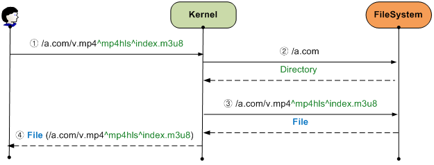

.. _filesystem:

第18章 File System
******************

この章では、STONをローカルディスクのように使用する方法について説明する。 STONは `FUSE <http://fuse.sourceforge.net/>`_ をベースにLinux VFS（Virtual File System）でMountされる。 Mountされたパスのすべてのファイルは、アクセスされた瞬間Cachingますが、他のプロセスは、この事実を知らない。
**Caching機能が搭載されたReadOnlyディスク** に理解してよい。

.. figure:: img/conf_fs1.png
   :align: center

   `Fuse <http://upload.wikimedia.org/wikipedia/commons/0/08/FUSE_structure.svg>`_ 구조

構造File I / O関数の呼び出しをLinux KernelがSTONに直接伝達する過程でどのような要素（物理ファイルI / OまたはSocket通信など）も介入しない。 このような構造は、非常に高い性能を可能にする。 STONのメモリCachingを介して物理ディスクにアクセスよりも優れた性能を期待することができる。

.. toctree::
   :maxdepth: 2

Mountする
====================================

グローバル設定（server.xml）に設定する。 ::

   # server.xml - <Server><Cache>

   <FileSystem Mount="/cachefs" DotDir="OFF" Separator="^">OFF</FileSystem>

-  ``<FileSystem>``

   -  ``OFF (基本)`` 何もしない。

   -  ``ON``  STONを ``Mount`` 属性のパスでMountする。

既存のHTTP構造をそのまま維持したままCacheモジュールにアクセスする方法（File System）が追加された構造で開発された。 したがって、どちらからのアクセスでもCachingは、最初一度だけ行われ、HTTPまたはFile I / Oにサービスされる。 FileSystemはCacheモジュールにアクセスする新しい橋をもう一つおいたものである。

.. figure:: img/conf_fs2.png
   :align: center

   HTTPとFile I / OがCacheモジュールを共有する。

ソースサーバーのコンテンツをHTTPだけでなく、File I / Oの両方からアクセスすることができる。 これを活用すれば、ローカルファイルに基づいたソリューションの可用性をさらに高めることができる。

.. figure:: img/conf_fs3.png
   :align: center

   どのサーバーでもOK

現在STON File Systemがサポートしている関数の一覧は、以下の通りである。

========= =============== ===========
FUSE	  C	              LINUX
========= =============== ===========
open	  fopen	          open
release	  fclose	      close
read	  fseek, fread	  seek, read
getattr	  fstat	          stat
unlink	  remove	      unlink
========= =============== ===========

File I / Oは、内部的にいくつかの段階を経る。 各ステップの理解が土台にならなければ、最高のパフォーマンスを得ることができる。

仮想ホストを探す
====================================

最初のコースは、アクセスしようとする仮想ホストを見つけることです。 HTTPリクエストには、次のようにHostヘッダが明示されており、仮想ホストを簡単に見つけることができる。 ::

    GET /ston.jpg HTTP/1.1
    host: example.com

File Systemは、最初のパスで、この問題を解決する。 例えば、STONが/ cachefsというパスでMountされている場合は、ローカルファイルにアクセスするには、次のパスを使用する必要がある。 ::

    /cachefs/example.com/ston.jpg

:ref:`env-vhost-find` も同じように動作する。 example.comの ``<Alias>`` に *.example.comが指定されている場合は、以下のアプローチは、すべて同じファイルを指す。 ::

    /cachefs/example.com/ston.jpg
    /cachefs/img.example.com/ston.jpg
    /cachefs/example.example.com/ston.jpg

たとえばApacheでexample.comを連動するためにはDocumentRootを/cachefs/example.com/に設定する必要がある。

ファイル/ディレクトリ
====================================

仮想ホストごとにFile Systemを設定する。 またはデフォルトの仮想ホストを使用して、すべての仮想ホストに一括設定することができる。 ::

   # server.xml - <Server><VHostDefault><Options>
   # vhosts.xml - <Vhosts><Vhost><Options>

   <FileSystem Status="Active" DotDir="OFF">
      <FileTime>origin</FileTime>
      <FileStatus>200</FileStatus>
      <DirStatus>301, 302, 400, 401, 403</DirStatus>
      <Unlink>Purge</Unlink>
   </FileSystem>

-  ``<FileTime> (基本: Origin)``
   ファイルの時間を提供する際に ``Origin`` である場合、元ので答えたLast-Modified時刻、 ``Local`` の場合、ローカルにキャッシュされた時間を整備する。
   ( ``Origin`` の場合) 元のサーバーで、Last-Modified時間を与えていない場合は、次のようにUnixの初期時間に提供される。

   .. figure:: img/fs_filetime.png
      :align: center

-  ``<FileSystem>``
   ``Status`` 属性が ``Inactive`` であれば、File Systemからアクセスすることができない。 Activeに設定する必要がある。

-  ``<FileStatus> (基本: 200)``
   ファイルとして認識することが、元のサーバーHTTP応答コードを設定する。 一般的には200万を設定しますが、特別な制約はない。

-  ``<DirStatus> (基本: 301, 302, 400, 401, 403)``
    ディレクトリとして認識することが、元のサーバーHTTP応答コードを設定する。 デフォルトで302、400、401、403などが設定される。

-  ``<Unlink> (基本: Purge)``
   ファイル削除要求が入ってきた場合、動作 ``Purge`` , ``Expire`` , ``HardPurge`` を設定する。

元のサーバーにHTTP応答コードが多様に解釈されることができる。 したがって、それぞれのHTTP応答コードの解釈方法を設定する必要がある。

ほとんどの場合、元のサーバーに存在するファイルの場合、 **200 OK** で応答する。 ディレクトリアクセスの場合 **403 Forbidden** 応答や **302 Found** に別のページにRedirectさせたりする。 応答コード名をcomma（、）で区切って設定すると、HTTP応答コードのBodyをファイルまたはディレクトリとして認識する。 設定されていない応答コードには存在しないものと判断、File I / Oが失敗する。

ファイルのプロパティ
====================================

ほとんどFile I / Oの最初のステップは、ファイルの属性を取得するものである。 ファイルをopenする前に、ファイルの情報を得ることは当然の順だ。 Kernelこのファイルの属性をサービスする過程をSTONの観点から見ると、以下の通りである。 （/ cachefsはMountパスなので、Kernelが省略する。）

.. figure:: img/conf_fs4.png
   :align: center

   ファイルの属性を取得するプロセス

Linuxの場合、ファイルやディレクトリを別に区別しない。 したがって、特定のファイルの属性を取得するプロセスが思ったより複雑である。 上の図からもわかるように、ディレクトリが深ければ深いほど、中間過程の（=必要ない）仮想ホストを検索およびファイルアクセスが発生し、性能が低下する。 特に/ oneまたは/ one / twoよう、Webサービスであれば、アクセスされてもいないパスの要求が発生して、元のサーバーの負荷を発生させる。 もちろんCachingされると、TTL（Time To Live）時間のアクセスは発生しません美しくないことだけは明らかだ。

このような構造の負荷をヒューリスティック（Heuristic）に解決するために ``DotDir`` 属性を追加した。
``DotDir`` はdot（。）が要求されたパスに存在しない場合、ディレクトリ（Dir）として認識される機能である。 前述の図は、 ``DotDir`` が ``OFF`` の状態である。
``DotDir`` が ``ON`` である場合は、次のように動作する。

   全域 ``DotDir`` 有効( ``ON`` )

Kernelから呼び出される過程や回数は変わらない。 しかし、要求されたパスにdot（。）がない場合、仮想ホストまで行かずに、すぐにディレクトリに応答するため、必要な部分のみの仮想ホストとファイルが参照される。 この機能は、ほとんどのプログラマは、ファイルのみの拡張子を付与して、ディレクトリには、そうではないことに着目した機能である。 したがって、使用する前に、ディレクトリ構造については必ず確認が必要である。

``<FileSystem>`` の ``DotDir`` 属性は、グローバルである。 簡単に言うと、すべての仮想ホストがディレクトリにdot（。）を使用しない場合、グローバル ``DotDir`` を ``ON`` に設定することは非常に有効である。 もちろん全域 ``DotDir`` を ``OFF`` に設定して、仮想ホストごとに個別に設定することもできる。 この場合、次の図のように、少しのパフォーマンス負荷が発生する。

.. figure:: img/conf_fs6.png
   :align: center

   仮想ホスト ``DotDir`` 有効( ``ON`` )

仮想ホストの検出は発生するが、ファイルの参照は、dot（。）がある状態でのみ発生する。 非常に頻繁に呼び出されるように、パフォーマンスと関連して、必ず理解するのをお勧めします。

ファイルの読み取り
====================================

ファイルの属性を取得するプロセスは複雑ですが、肝心のファイルの読み取りは簡単である。 まず、ファイルをOpenする。 すべてのファイルは、当然ReadOnlyある。 Write権限のファイルへのアクセスは失敗する。 最初のファイルがアクセスされる場合、HTTPと同様に、元のサーバーからファイルをCachingする。 ファイルを要求されたプロセスが待機しないようダウンロードを進めながら、同時にFile I / Oサービスが行われます。

.. figure:: img/conf_fs7.png
   :align: center

   ファイルOpen

以降の動作は、HTTPサービスと同じである。 ただしHTTPの場合、最初決定されたRangeで順次（Sequential）のファイルへのアクセスが発生するため、ファイル転送に有利な面がある。 一方、File I / Oの場合は、ファイルサイズに関係なく、非常に小さな1KB単位のreadアクセスが非常に多く発生することができる。 性能の最大化のためにSTONはCacheモジュールに `Readahead <http://en.wikipedia.org/wiki/Readahead>`_ を実装しており、これにより、File I / Oパフォーマンスを最大化させた。

ファイルを閉じる（fcloseなど）関数が呼び出されるか、プロセスが終了した場合、ファイルhandleはKernelによって返却される。 これはHTTPトランザクションが終了するのと同じだ。

ファイルの削除
====================================
Cachingされたファイルは、STONによって管理されますが、プロセスが削除要求を送信することができる。 STONは、様々な :ref:`api-cmd-purge` 方法を提供していますので、このような要求に容易に対応することができる。

例えば、 ``<Unlink>`` が ``expire`` に設定されている場合は、ファイルの削除要求に対して、そのファイルをexpireするように動作する。 Kernelで再びそのファイルにアクセスする場合expireされた状態なので、元のサーバーから変更するかどうかを確認した後に変更されていない場合、そのファイルを再度整備する。

ファイルの拡張
====================================
HTTPの場合は、次のようにURLを利用して、元のファイルを動的に処理することができる。 ::

    # HTTP経由 /video.mp4の0〜60秒の区間をTrimmingする。
    http://www.example.com/video.mp4?start=0&end=60

このようなQueryString方式は、HTTPとFile Systemの両方の呼び出し仕様を同じように使用することができる。 ::

    # "/video.mp4の0〜60秒の区間をTrimmingした" ローカルファイルにアクセスする。
    /cachefs/www.example.com/video.mp4?start=0&end=60

しかし、MP4HLSやDIMSよう元のURLの後ろに加工オプションをディレクトリ形式で指定する方法は、File I / Oに問題がある。 ::

    /cachefs/image.winesoft.com/img.jpg/12AB/resize/500x500/
    /cachefs/www.winesoft.com/video.mp4/mp4hls/index.m3u8

"ファイルのプロパティを取得" で説明したように、LINUXは、パスの各部分の属性を毎回尋ねる。 STON観点では、現在求めてパスの後に追加のパスがあることを知ることができないため、加工されていないファイルをサービスすることになる。

この問題を克服するために、STONは、別の区切り文字として ``<FileSystem>`` の ``Separator (基本: ^)`` 属性を使用する。 ::

    /cachefs/image.winesoft.com/img.jpg^12AB^resize^500x500^
    /cachefs/www.winesoft.com/video.mp4^mp4hls^index.m3u8

   MP4HLS アクセス

STON内部では、 ``Separator`` をslash（/）に変更して、HTTPと同じ呼び出し仕様を使用する。 これを積極的に活用する場合は、次のように不要File I / Oアクセスを完全に除去することができる。

.. figure:: img/conf_fs7.png
   :align: center

   極度に最適化されたアプローチ

Wowza連動
====================================

File Systemを利用して簡単にWowzaを連動することができる。 STONがMountされたパスをWowzaのファイルパスに設定すること、すべての設定が完了している。

**1. [STON - グローバル設定] ファイルシステムの設定ON**

  グローバル設定（server.xml）には、次のように ``<FileSystem>`` を ``ON`` に設定する。 （例では、Mountパスを「/ cachefs」に設定する。） ::

     # server.xml - <Server><Cache>

     <FileSystem Mount="/cachefs" DotDir="OFF" Separator="^">ON</FileSystem>

  またはWMのグローバル設定 - ファイルシステムでは、次のようにファイルシステムを "使用する"に設定する。

  .. figure:: img/faq_wowza1.png
     :align: center

     設定後は、必ずSTONを再起動する必要がMountされる。

**2. [STON - 仮想ホスト] ファイルシステムへのアクセスの許可及び応答コードの設定**

  仮想ホストのファイルシステムへのアクセスをActiveせる。 ソースサーバーの応答コードによるファイル/ディレクトリの判断政策も設定する。 ここ仮想ホストの設定（server.xml）を例に説明するが、それぞれの仮想ホスト（vhosts.xml）で個別に設定することができる。 ::

     # server.xml - <Server><VHostDefault><Options>
     # vhosts.xml - <Vhosts><Vhost><Options>

     <FileSystem Status="Active" DotDir="OFF">
        <FileStatus>200</FileStatus>
        <DirStatus>301, 302, 400, 401, 403</DirStatus>
     </FileSystem>

  またはWMの仮想ホスト - ファイルシステムでは、次のようにアクセスを「許可する」に設定する。

  .. figure:: img/faq_wowza2.png
     :align: center

     応答コードを設定する。

**3. [Wowza] Storageパスの設定**

  Wowzaインストールパス/Conf/Application.xmlファイルを次のようにSTONがMountされたパスを眺めるよう編集する。 ::

     <Streams>
       <StreamType>default</StreamType>
       <StorageDir>/cachefs/example.com</StorageDir>
       <KeyDir>${com.wowza.wms.context.VHostConfigHome}/keys</KeyDir>
     </Streams>

**4. [Wowza] VODパスの設定**

  Wowzaインストールパス/Conf/vod/Application.xmlファイルを次のようにSTONがMountされたパスを眺めるよう編集する。 ::

     <Streams>
       <StreamType>default</StreamType>
       <StorageDir>/cachefs/example.com</StorageDir>
       <KeyDir>${com.wowza.wms.context.VHostConfigHome}/keys</KeyDir>
     </Streams>

**5. プレーヤーテスト**

  Wowzaテストプレイヤーにローカルに存在しない（= STONがキャッシュしなければなら）映像をRTMPで再生する。

  .. figure:: img/faq_wowza3.png
     :align: center

     テストは、適切な映像が必要です。
