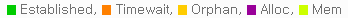
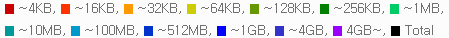

.. _api-graph:

Appendix A: Graph
******************

すべてのMRTG統計はPNG形式のグラフで提供される。 呼び出し規約は、リソースの後に単位が付く形式である。 ::

    # 5つのCPUグラフ (dash, day, week, month, year)
    http://127.0.0.1:10040/graph/cpu_dash.png
    http://127.0.0.1:10040/graph/cpu_day.png
    http://127.0.0.1:10040/graph/cpu_week.png
    http://127.0.0.1:10040/graph/cpu_month.png
    http://127.0.0.1:10040/graph/cpu_year.png

すべてのグラフは、5つのタイプに提供される。

============== ================= ==================== =================
タイプ           サイズ              時間単位               期間
============== ================= ==================== =================
dash           205 X 175         5分                   12時間
day            580 X 203         5分                   2日 (48時間)
week           580 X 203         30分                  2週 (14일)
month          580 X 203         2時間                  7週
year           580 X 203         1日                   18ヶ月
============== ================= ==================== =================

グラフには、少なくとも1つから最大3つの線が描かれる。 Mainラインは緑、Sub行は青で描かれる。 また、「Week」のグラフ以上からPeakラインが提供される。 Peakラインは、以前の単位での最大の数値をピンクに描く。

.. note:

   너무 많은 그래프를 동시에 그릴 경우 CPU사용량이 과도하게 높아져 서비스 품질저하가 발생할 수 있다.
   이를 방지하기 위해 항상 한번에 하나의 그래프만 그리도록 관리한다.

.. toctree::
   :maxdepth: 2

.. _api-graph-global:

グローバル・リソース
====================================

グローバル・リソースグラフは、システムの状態やSTONに関するリソースについてサービスする。 以下の表で *はタイプ（dash、day、week、month、year）のいずれかを意味する。

CPU
---------------------
::

    /graph/cpu_*.png

-  ``Main`` Kernel + User
-  ``Sub`` Kernel

STONメディアサーバーCPU
---------------------
::

    /graph/ston_media_server_cpu_*.png

-  ``Main`` Kernel + User
-  ``Sub`` Kernel

メモリ
---------------------
::

    /graph/mem_*.png

-  ``Main`` 全体の使用量
-  ``Sub`` STONメディアサーバーの使用率

IO Wait
---------------------
::

    /graph/iowait_*.png

-  ``Main`` IO Wait

Load Average
---------------------
::

    /graph/loadavg_*.png

-  ``Main`` Load Average

サーバソケットイベント（クライアント -> STON)
---------------------
::

    /graph/ssockevent_*.png

-  ``Main`` Accepted
-  ``Sub`` Closed

サーバソケットの使用量（クライアント -> STON)
---------------------
::

    /graph/ssockusage_*.png

-  ``Main`` 全体
-  ``Sub`` Established

クライアントソケットイベント（STON - >ソースサーバー）
---------------------
::

    /graph/csockevent_*.png

-  ``Main`` Connected
-  ``Sub`` Closed

クライアントソケットの使用量（STON - >ソースサーバー）
---------------------
::

    /graph/csockusage_*.png

-  ``Main`` 全体
-  ``Sub`` Established

ブロックされたIPアクセス
---------------------
::

    /graph/acldenied_*.png

-  ``Main`` ブロックされたクライアント

イベントキュー
---------------------
::

    /graph/eq_*.png

-  ``Main`` イベントキューの長さ

書き込み待機
---------------------
::

    /graph/wf2w_*.png

-  ``Main`` 書き込み待機中のファイルの数

.. _api-graph-urlrewrite:

URL前処理成功
---------------------
::

    /graph/urlrewrite_*.png

-  ``Main`` 前処理されたURLの数

TCPソケット
---------------------
::

    /graph/tcpsocket_*.png

.. _api-graph-vhost:

仮想ホスト
====================================

仮想ホストのグラフは、全体または個々の仮想ホストの状態についてサービスする。 vhostパラメータを利用して、特定の仮想ホストを指定することができ、省略された場合、全体の仮想ホストの合計を提供する。 ::

    http://127.0.0.1:10040/graph/vhost/mem_day.png?vhost=example.com

以下の表で *はタイプ（dash、day、week、month、year）のいずれかを意味する。

ヒット率
---------------------
::

    /graph/vhost/hitratio_*.png

-  ``Main`` Request Hit Ratio
-  ``Sub`` Byte Hit Ratio

コンテンツ数
---------------------
::

    /graph/vhost/filecount_*.png

コンテンツメモリ
---------------------
::

    /graph/vhost/mem_*.png

-  ``Main`` メモリにロードされたコンテンツデータ量

削除待機
---------------------
::

    /graph/vhost/wf2d_*.png

-  ``Main`` 削除待機しているファイルの数

クライアントバイパス
---------------------
::

    /graph/vhost/client_httpreq_bypass_*.png

-  ``Main`` バイパスされたクライアントのHTTPリクエスト

クライアントの要求をブロック
---------------------
::

    /graph/vhost/client_httpreq_denied_*.png

-  ``Main`` ブロックされたクライアント要求

クライアントセッション
---------------------
::

    /graph/vhost/client_http_session_*.png

-  ``Main`` 全体クライアントセッション
-  ``Sub`` 伝送進行中のクライアントセッション

クライアントのトラフィック
---------------------
::

    /graph/vhost/client_traffic_*.png

-  ``Main`` Inbound
-  ``Sub`` Outbound

クライアントの応答
---------------------
::

    /graph/vhost/client_http_res_*.png

-  ``Main`` クライアントHTTP応答の数
-  ``Sub`` クライアントのHTTP要求の数

クライアントの詳細応答
---------------------
::

    /graph/vhost/client_http_res_detail_*.png

.. figure:: img/graph_rescode_detail.png

クライアントトランザクションの完了
---------------------
::

    /graph/vhost/client_http_res_complete_*.png

-  ``Main`` 完了クライアントHTTP応答の数
-  ``Sub`` クライアントのHTTP要求の数

クライアントの応答時間
---------------------
::

    /graph/vhost/client_http_res_time1_*.png

-  ``Main`` クライアント要求のHTTP応答時間

クライアント完了時間
---------------------
::

    /graph/vhost/client_http_res_time2_*.png

-  ``Main`` クライアント要求のHTTPトランザクションの完了時間

クライアントキャッシュ応答
---------------------
::

    /graph/vhost/client_http_res_hit_*.png

.. figure:: img/graph_filehit.png

クライアントSSLトラフィック
---------------------
::

    /graph/vhost/client_traffic_ssl_*.png

-  ``Main`` Inbound
-  ``Sub`` Outbound

ソースサーバーセッション
---------------------
::

    /graph/vhost/origin_http_session_*.png

-  ``Main`` フルオリジナルセッション
-  ``Sub`` 伝送進行中のソースセッション

ソースサーバーのトラフィック
---------------------
::

    /graph/vhost/origin_traffic_*.png

-  ``Main`` Inbound
-  ``Sub`` Outbound

ソースサーバーの応答
---------------------
::

    /graph/vhost/origin_http_res_*.png

-  ``Main`` 元HTTP応答の数
-  ``Sub`` 元のHTTPリクエストの数

ソースサーバーの詳細応答
---------------------
::

    /graph/vhost/origin_http_res_detail_*.png

.. figure:: img/graph_rescode_detail.png

ソースサーバートランザクションの完了
---------------------
::

    /graph/vhost/origin_http_res_complete_*.png

-  ``Main`` 完了ソースサーバーHTTP応答の数
-  ``Sub`` 元サーバーのHTTPリクエストの数

元のサーバーの応答時間
---------------------
::

    /graph/vhost/origin_http_res_time1_*.png

-  ``Main`` 元サーバーに送信される要求のHTTP応答時間

ソースサーバー完了時間
---------------------
::

    /graph/vhost/origin_http_res_time2_*.png

-  ``Main`` 元サーバーに送信される要求のHTTPトランザクションの完了時間
