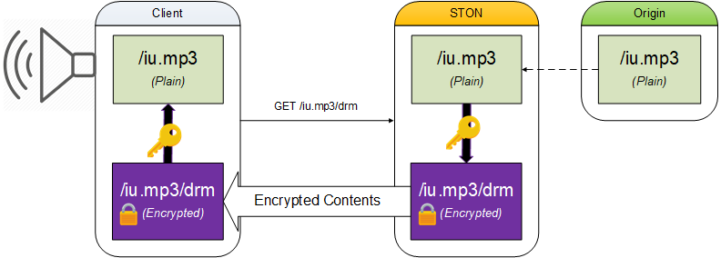

.. _handling_http_requests:

제 6 장 HTTP 요청 / 응답
******************

.. note::

   - `[동영상 강좌]하자! STON Edge Server - Chapter 6 압축 <https://youtu.be/GZ_NaK2yqk0?list=PLqvIfHb2IlKeZ-Eym_UPsp6hbpeF-a2gE>`_

이 장에서는 HTTP 클라이언트 세션 요청을 처리하는 방법을 설명한다. 서비스의 주요 기능으로보기 어려운 내용이 많기 때문에 머리가 아플 필요는 없다. 일부 HTTP의 이해가 없으면 어려울 수있는 부분이 있지만, 이런 경우는 기본 설정을 사용하기 바란다. 전체적으로 기본 설정을 그대로 사용하여도 서비스에는 전혀 지장이없는 내용이다.

.. toctree::
   :maxdepth: 2

.. _handling_http_requests_session_man:

세션 관리
====================================

HTTP 클라이언트가 서버 (STON)에 연결하면 HTTP 세션이 생성된다. 클라이언트는 HTTP 세션을 통해 서버에 저장된 여러 컨텐츠를 서비스 받는다. 요청에서 응답까지를 하나의 **HTTP트랜잭션** 이라고 부른다. HTTP 세션은 여러 HTTP 트랜잭션을 순차적으로 처리한다. ::

   # server.xml - <Server><VHostDefault><Options>
   # vhosts.xml - <Vhosts><Vhost><Options>

   <ConnectionHeader>keep-alive</ConnectionHeader>
   <ClientKeepAliveSec>10</ClientKeepAliveSec>
   <KeepAliveHeader Max="0">ON</KeepAliveHeader>

-  ``<ConnectionHeader> (기본: keep-alive)``
   클라이언트에 보내는 HTTP 응답의 Connection 헤더( ``keep-alive`` 또는 ``close`` )를 설정한다.

-  ``<ClientKeepAliveSec> (기본: 10초)``
   클라이언트 세션이란 무엇 통신이없는 상태에서 설정된 시간이 경과하면 세션을 종료한다. 시간을 너무 오래 설정하면 통신을하지 않는 세션이 지나치게 많아진다. 너무 많은 세션을 유지하는 것만으로도 시스템 부하가된다.

-  ``<KeepAliveHeader>``

   - ``ON (기본)`` HTTP 응답에 Keep-Alive 헤더를 명시한다.
     ``Max (기본: 0)`` 을 0보다 크게 설정하면 Keep-Alive 헤더 값으로 ``Max`` 값이 명시된다. 이후 HTTP 트랜잭션이 발생할 때마다 1 씩 감산된다.

   - ``OFF`` HTTP 응답에 Keep-Alive 헤더를 생략한다.

HTTP 세션을 유지 정책
---------------------

STON 가급적 Apache의 정책에 따른다. 특히 세션 유지 정책은 HTTP 헤더의 값에 따라 변수가 많다. HTTP 세션을 유지 정책에 영향을 미치는 요소는 다음과 같다.

- 클라이언트의 HTTP 요청에 지정된 Connection 헤더 ( "Keep-Alive"또는 "Close")
- 가상 호스트 ``<Connection>`` 설정
- 가상 호스트 세션 Keep-Alive 시간 설정
- 가상 호스트 ``<Keep-Alive>`` 설정

1. 클라이언트의 HTTP 요청에 "Connection : Close"에 명시되어있는 경우 ::

      GET / HTTP/1.1
      ...(생략)...
      Connection: Close

   이러한 HTTP 요청은 가상 호스트 설정의 유무에 불구하고 "Connection : Close"로 응답한다. Keep-Alive 헤더는 명시되지 않는다. ::

      HTTP/1.1 200 OK
      ...(생략)...
      Connection: Close

   이 HTTP 트랜잭션이 완료되면 HTTP 연결을 종료한다.

2. ``<ConnectionHeader>`` 이 ``Close`` 에 설정된 경우 ::

      # server.xml - <Server><VHostDefault><Options>
      # vhosts.xml - <Vhosts><Vhost><Options>

      <ConnectionHeader>Close</ConnectionHeader>

   클라이언트의 HTTP 요청과 관계없이 "Connection : Close"로 응답한다. Keep-Alive 헤더는 명시되지 않는다. ::

      HTTP/1.1 200 OK
      ...(생략)...
      Connection: Close

3. ``<KeepAliveHeader>`` 이 ``OFF`` 로 설정된 경우 ::

      # server.xml - <Server><VHostDefault><Options>
      # vhosts.xml - <Vhosts><Vhost><Options>

      <ConnectionHeader>Keep-Alive</ConnectionHeader>
      <KeepAliveHeader>OFF</KeepAliveHeader>

   Keep-Alive가 명시되지 않는다. HTTP 세션은 지속적으로 재사용 가능하다. ::

      HTTP/1.1 200 OK
      ...(생략)...
      Connection: Keep-Alive

4. ``<KeepAliveHeader>`` 가 ``ON`` 으로 설정된 경우 ::

      # server.xml - <Server><VHostDefault><Options>
      # vhosts.xml - <Vhosts><Vhost><Options>

      <ConnectionHeader>Keep-Alive</ConnectionHeader>
      <ClientKeepAliveSec>10</ClientKeepAliveSec>
      <KeepAliveHeader>ON</KeepAliveHeader>

   Keep-Alive가 명시된다. timeout 값 세션 Keep-Alive 시간 설정을 사용한다. ::

      HTTP/1.1 200 OK
      ...(생략)...
      Connection: Keep-Alive
      Keep-Alive: timeout=10

   .. note::

      < ``<Keep-Alive>`` 와 ``<ClientKeepAliveSec>`` 관계 >

      ``<Keep-Alive>`` 설정시 ``<ClientKeepAliveSec>`` 를 참조하지만, ``<ClientKeepAliveSec>`` 는보다 근본적인 문제와 관련이있다. 성능과 자원으로 가장 중요한 문제는 Idle 세션 (= HTTP 트랜잭션이 발생하지 않는 세션) 요약 관점을 취하는 것이다. HTTP 헤더의 설정은 동적으로 변경되거나 때로는 생략 될 수 있지만 Idle 세션 정리가 훨씬 더 민감한 문제이다. 이러한 이유로 ``<ClientKeepAliveSec>`` 는 ``<KeepAliveHeader>`` 에 통합되지 않고 별도 존재한다.

5. ``<KeepAliveHeader>`` 의 ``Max`` 속성이 설정되어있는 경우 ::

      # server.xml - <Server><VHostDefault><Options>
      # vhosts.xml - <Vhosts><Vhost><Options>

      <ConnectionHeader>Keep-Alive</ConnectionHeader>
      <ClientKeepAliveSec>10</ClientKeepAliveSec>
      <KeepAliveHeader Max="50">ON</KeepAliveHeader>

   Keep-Alive 헤더에 max 값을 지정한다. 이 세션에서는 max 번만 사용이 가능하며, HTTP 트랜잭션이 진행될 때마다 1 씩 감소된다. ::

      HTTP/1.1 200 OK
      ...(생략)...
      Connection: Keep-Alive
      Keep-Alive: timeout=10, max=50

6. Keep-Alive의 max가 만료 된 경우 ::

   위의 설정대로 max가 설정된 경우 max는 점차 감소 다음과 같이 1까지 도달하게된다. ::

      HTTP/1.1 200 OK
      ...(생략)...
      Connection: Keep-Alive
      Keep-Alive: timeout=10, max=1

   이 응답은 현재 세션에서 향후 1 회 HTTP 트랜잭션의 진행이 가능하다 뜻이다. 이 세션에서 HTTP 요청을 다시하는 경우는 다음과 같이 "Connection: Close"로 응답한다. ::

      HTTP/1.1 200 OK
      ...(생략)...
      Connection: Close

클라이언트 Cache-Control
====================================

클라이언트 Cache-Control 관련 설정을 다룬다.

Age 헤더
---------------------

Age 헤더는 캐시 된 순간부터의 경과 시간 (초)을 의미하며, 
`RFC2616 - 13.2.3 Age Calculations <http://www.w3.org/Protocols/rfc2616/rfc2616-sec13.html#sec13.2.3>`_ 에 의해 계산된다. ::

   # server.xml - <Server><VHostDefault><Options>
   # vhosts.xml - <Vhosts><Vhost><Options>

   <AgeHeader>OFF</AgeHeader>

-  ``<AgeHeader>``

   -  ``OFF (기본)`` Age 헤더를 생략한다.

   -  ``ON`` Age 헤더를 명시한다.

Expires 헤더
---------------------

Expires 헤더를 재설정한다. ::

   # server.xml - <Server><VHostDefault><Options>
   # vhosts.xml - <Vhosts><Vhost><Options>

   <RefreshExpiresHeader Base="Access">OFF</RefreshExpiresHeader>

-  ``<RefreshExpiresHeader>``

   -  ``OFF (기본)`` 원래 서버에서 응답 한 Expires 헤더를 클라이언트에 지정한다. 원본 서버에서 Expires 헤더가 생략 된 경우 클라이언트의 응답도 Expires 헤더가 생략된다.

   -  ``ON``  Expires 조건을 반영하여 Expires 헤더를 명시한다. 조건에 해당하지 않는 콘텐츠는 ``OFF`` 의 설정과 동일하게 동작한다.

Expires 조건은 Apache `mod_expires <http://httpd.apache.org/docs/2.2/mod/mod_expires.html>`_ 처럼 동작한다. 특정 조건 (URL 또는 MIME Type)에 대응하는 콘텐츠의 Expires 헤더와 Cache-Control의 값을 설정할 수있다. Cache-Control의 max-age 값은 설정된 Expires 시간에서 요청한 시간을 뺀 값이된다.

Expires 조건 / svc / {가상 호스트 이름} /expires.txt로 설정한다. ::

   # /svc/www.exmaple.com/expires.txt
   # 구분 기호는 쉼표 (,)이며, {조건}, {시간}, {표준} 순으로 표기한다.

   $URL[/test.jpg], 86400
   /test.jpg, 86400
   *, 86400, access
   /test/1.gif, 60 sec
   /test/*.dat, 30 min, modification
   $MIME[application/shockwave], 1 years
   $MIME[application/octet-stream], 7 weeks, modification
   $MIME[image/gif], 3600, modification

-  **조건**

   URL과 MIME Type의 두 가지로 설정이 가능하다. URL의 경우, $ URL [...]에서 MIME Type의 경우 $ MIME [...]라고 표기한다. 패턴 표현이 가능하며, $ 표현이 생략 된 경우 URL로 인식한다.

-  **시간**

   Expires 유효 기간을 설정한다. 시간 단위의 표현을 지원하고 단위를 명시하지 않은 경우, 초 계산된다.

-  **기준**

   Expires 만료 기준 시점을 설정한다. 별도 기준 시점을 지정하지 않으면 Access가 기준 시점으로 명시된다. Access는 현재 시간을 기준으로한다. 다음은 MIME Type이 image / gif 인 파일의 액세스 시간에서 1 일 12 시간 후에 Expires 헤더 값을 설정하는 예입니다. ::

      $MIME[image/gif], 1 day 12 hours, access

   Modification는 원래 서버에서 전송 된 Last-Modified를 기준으로한다. 다음은 모든 jpg 파일에 Last-Modified에서 30 분 후에 Expires 값으로 설정하는 예이다. ::

      *.jpg, 30min, modification

   Modification의 경우는 계산 된 Expires 값이 현재 시간보다 과거의 시간 인 경우 현재 시간을 지정한다. 만약 원래 서버에서 Last-Modified 헤더를 제공하지 않는 경우 Expires 헤더를 보내지 않습니다.

ETag 헤더
---------------------

클라이언트에 보내는 HTTP 응답에 ETag 헤더 명시할지 여부를 설정한다. ::

   # server.xml - <Server><VHostDefault><Options>
   # vhosts.xml - <Vhosts><Vhost><Options>

   <ETagHeader>ON</ETagHeader>

-  ``<ETagHeader>``

   -  ``ON (기본)`` ETag 헤더를 명시한다.

   -  ``OFF``  ETag 헤더를 생략한다.

기본 응답 헤더
====================================

소스 비표준 헤더
---------------------

성능 및 보안상의 이유로 원본 서버에서 보낸 헤더의 표준 헤더만을 선택적으로 인식하고있다. ::

   # server.xml - <Server><VHostDefault><Options>
   # vhosts.xml - <Vhosts><Vhost><Options>

   <OriginalHeader>OFF</OriginalHeader>

-  ``<OriginalHeader>``

   -  ``OFF (기본)`` 표준 헤더가없는 경우는 무시한다.

   -  ``ON`` cookie, set-cookie, set-cookie2을 제외한 모든 헤더를 저장하여 클라이언트로 전송한다. 그러나 메모리와 스토리지 비용을 더 소비한다.

Via 헤더
---------------------

클라이언트에 보내는 HTTP 응답에 Via 헤더 명시할지 여부를 설정한다. ::

   # server.xml - <Server><VHostDefault><Options>
   # vhosts.xml - <Vhosts><Vhost><Options>

   <ViaHeader>ON</ViaHeader>

-  ``<ViaHeader>``

   - ``ON (기본)`` Via 헤더를 다음과 같이 지정한다.
     ::

        Via: STON/2.0.0

   - ``OFF``  Via 헤더를 생략한다

Server 헤더
---------------------

클라이언트에 보내는 HTTP 응답에 Server 헤더 명시할지 여부를 설정한다. ::

   # server.xml - <Server><VHostDefault><Options>
   # vhosts.xml - <Vhosts><Vhost><Options>

   <ServerHeader>ON</ServerHeader>

-  ``<ServerHeader>``

   -  ``ON (기본)`` 소스 서버의 Server 헤더를 명시한다. ::

   -  ``OFF``  Server 헤더를 생략한다.

.. _handling_http_requests_modify_client:

클라이언트의 요청 / 응답 헤더의 변경
====================================

클라이언트 HTTP 요청과 응답을 특정 조건에 따라 변경한다. ::

   # server.xml - <Server><VHostDefault><Options>
   # vhosts.xml - <Vhosts><Vhost><Options>

   <ModifyHeader FirstOnly="OFF">OFF</ModifyHeader>

-  ``<ModifyHeader>``

   -  ``OFF (기본)`` 변경하지 않는다.

   -  ``ON`` 헤더 변경 조건에 따라 헤더를 변경한다.

헤더 변경 시점을 정확하게 이해하자.

-  **HTTP 요청 헤더의 변경 시점**

   클라이언트의 HTTP 요청을 최초로 인식 한 시점에서 헤더를 변경한다. 헤더가 변경된 경우 변경된 상태에서 Cache 모듈에서 처리된다. 그러나 Host 헤더와 URI는 변경할 수 없다.

-  **HTTP 응답 헤더의 변경 시점**

   클라이언트의 응답 직전에 헤더를 변경한다. 그러나 Content-Length는 변경할 수 없다.

헤더 변경 조건 / svc / {가상 호스트 이름} /headers.txt로 설정한다. 헤더는 다양하게 설정이 가능하기 때문에 조건에 일치하는 경우 모든 변경 설정이 순차적으로 적용된다.

첫 번째 조건 만 변경하려면 ``FirstOnly`` 속성을 ``ON`` 으로 설정한다. 다른 조건이 동일한 헤더를 변경하려면 ``set`` 가 단지 Last-Win되거나 명시 적으로 ``put`` ``append`` 할 수있다. ::

   # /svc/www.example.com/headers.txt
   # 구분 기호는 쉼표 (,)이다.

   # 요청 변경
   # {Match}, {$REQ}, {Action(set|put|append|unset)} 순으로 표기한다.
   $IP[192.168.1.1], $REQ[SOAPAction], unset
   $IP[192.168.2.1-255], $REQ[accept-encoding: gzip], set
   $IP[192.168.3.0/24], $REQ[cache-control: no-cache], append
   $IP[192.168.4.0/255.255.255.0], $REQ[x-custom-header], unset
   $IP[AP], $REQ[X-Forwarded-For], unset
   $HEADER[user-agent: *IE6*], $REQ[accept-encoding], unset
   $HEADER[via], $REQ[via], unset
   $URL[/source/*.zip], $REQ[accept-encoding: deflate], set
   $METHOD[POST], $REQ[host: sub.example.com], set

   # 응답 변경
   # {Match}, {$RES}, {Action(set|put|append|unset)}, {condition} 순으로 표기한다.
   # {condition}는 특정 응답 코드에만 헤더를 변경할 수 있지만 필수는 아니다.
   $IP[192.168.1.1], $RES[via: STON for CDN], set
   $IP[192.168.2.1-255], $RES[X-Cache], unset, 200
   $IP[192.168.3.0/24], $RES[cache-control: no-cache, private], append, 3xx
   $IP[192.168.4.0/255.255.255.0], $RES[x-custom-header], unset
   $HEADER[user-agent: *IE6*], $RES[vary], unset
   $HEADER[x-custom-header], $RES[cache-control: no-cache, private], append, 5xx
   $URL[/source/*], $RES[cache-control: no-cache], set, 404
   /secure/*.dat, $RES[x-custom], unset, 200
   /*.mp4, $RES[Access-Control-Allow-Origin: example1.com], set
   /*.mp4, $RES[Access-Control-Allow-Origin: example2.com], put

{Match}은 IP 주소, GeoIP, Header, URL 네 가지로 설정이 가능하다.

-  **IP**

   $IP[...]로 표기 IP, IP Range, Bitmask, Subnet 4 가지를 지원합니다.

-  **GeoIP**

   $IP[...]로 표기하고 반드시 :ref:`access-control-geoip` 가 설정되어야한다. 국가 코드는、 `ISO 3166-1 alpha-2 <http://en.wikipedia.org/wiki/ISO_3166-1_alpha-2>`_ 와 `ISO 3166-1 alpha-3 <http://en.wikipedia.org/wiki/ISO_3166-1_alpha-3>`_ 를 지원한다.

-  **Header**

   $HEADER[Key : Value]로 표기한다. Value는 명확한 표현과 패턴을 지원한다. Value가 생략 된 경우에는 Key에 대응하는 헤더의 존재 유무를 조건으로 판단한다.

-  **URL**

   $URL[...]로 표기 생략이 가능하다. 명확한 표현과 패턴을 인식한다.

-  **METHOD**

   $METHOD[...]로 표기하고 GET、POST、HEAD、OPTIONS 중 하나를 명시 적으로 지정한다.

{$REQ}과 {$RES}헤더를 변경하는 방법을 설정한다.
``set`` ``put`` ``append`` 의 경우{Key：Value}로 설정 Value가 입력되어 있지 않은 경우는 빈 값（ ""）가 입력된다.
``unset`` 의 경우 {Key}를 입력한다.

{Action}은 ``set`` , ``put`` , ``append`` , ``unset``  4 가지로 설정이 가능하다.

-  ``set``  요청 / 응답 헤더에 설정되어있는 Key와 Value를 헤더에 추가합니다. 이미 같은 Key가 존재하는 경우 이전 값을 덮어 씁니다.

-  ``put``  ( ``set`` 과 비슷하지만) 같은 Key가 존재하면 덮어 쓰지 않고 새로운 행에 붙여 넣습니다.

-  ``append`` ( ``set`` 과 비슷하지만）같은 Key가 존재하는 경우 기존의 Value로 설정된 Value 사이에 Comma (,)로 구분하여 값을 결합한다.

-  ``unset`` 요청 / 응답 헤더에 설정되어있는 Key에 대응하는 헤더를 제거한다.

{Condition}은 200이나 304과 같은 구체적인 응답 코드 외에도 2xx, 3xx, 4xx, 5xx처럼 응답 코드 계열의 조건으로 설정한다. {Match}과 일치하는 경우에도 {Condition}과 일치하지 않는 경우 변경이 반영되지 않는다. {Condition}가 생략 된 경우 응답 코드를 검사하지 않습니다.

.. note::

   ``#PROTOCOL`` 키워드를 통해 클라이언트가 요청한 프로토콜 (http 또는 https)을 클라이언트 헤더에 추가 할 수있다. ::

      $URL[*], $REQ[X-Forwarded-Proto: #PROTOCOL], set

.. _handling_http_requests_compression:

압축
====================================
원래 대신 콘텐츠를 압축하여 전송한다.
:ref:`caching-policy-accept-encoding` 에 따라 컨텐츠를 구별하도록 설정되어 있어야한다. ::

   Accept-Encoding: gzip, deflate

.. figure:: img/compression_1.png
   :align: center

   압축 파일을 실시간으로 압축하여 전송한다.

::

   # server.xml - <Server><VHostDefault><Options>
   # vhosts.xml - <Vhosts><Vhost><Options>

   <Compression Method="gzip" Level="6" SourceSize="2-2048">OFF</Compression>

-  ``<Compression>``

   -  ``OFF (기본)`` 압축 기능을 사용하지 않습니다.

   -  ``ON`` 압축 기능을 사용한다. 다음의 속성을 지원합니다.

      -  ``Method (기본: gzip)`` 압축 방식을 지정한다. gzip 만 지원된다.
      -  ``Level (기본: 6)`` 압축 수준을 지정합니다. 이 값은 ``Method`` 에 따라 다르다. gzip은 1-9까지 지정이 가능하다. 숫자가 작을수록 빠르지 만 압축률이 나쁘고, 크고 느리지 만 압축률이 좋다.
      -  ``SourceSize (기본: 2-2048, 단위: KB)`` 원래 크기를 범위로 지정한다. 너무 작은 파일은 압축률이 저하된다. 반대로 너무 큰 파일은 과도하게 CPU를 점유 할 수있다.

압축 된 콘텐츠 원본과 다른 내용으로 인식 / 캐시 된 동일한 요청을 다시 압축되지 않는다. 압축 대상은 /svc/{vhost}/compression.txt에 지정한다. 정의 된 순서대로 적용된다. ::

   # /svc/www.example.com/compression.txt
   # 구분 기호는 쉼표 (,)이다.
   # {URL条件}, {Method}, {Level} 순으로 표기한다.

   /sample.css, no       // 압축하지 않는다.
   *.css                 // *.css 조건 기본 Method와 Level로 압축한다.
   *.htm, gzip           // *.htm 조건 gzip으로 압축한다.  (기본 Level)
   *.xml, , 9            // *.xml 조건에 대해 Level 9 압축한다.  *.  (기본 Method)
   *.js, gzip, 5         // *.js 조건 gzip (Level = 5)로 압축한다.

압축은 CPU 자원을 많이 소모하는 기능이다. 다음은 파일 크기별 GZIP (Level : 9)의 성능 테스트 결과이다.

-  ``OS`` CentOS 6.3 (Linux version 2.6.32-279.el6.x86_64 (mockbuild@c6b9.bsys.dev.centos.org) (gcc version 4.4.6 20120305(Red Hat 4.4.6-4) (GCC) ) #1 SMP Fri Jun 22 12:19:21 UTC 2012)
-  ``CPU`` `Intel(R) Xeon(R) CPU E5-2603 0 @ 1.80GHz (8 processors) <http://www.cpubenchmark.net/cpu.php?cpu=Intel%20Xeon%20E5-2603%20@%201.80GHz>`_
-  ``RAM`` 8GB
-  ``HDD`` SAS 275GB X 5EA

======================= ========== ======== ============== ========================= ==================
크기                    압축(%)    처리량  응답속도(ms)    클라이언트 트래픽(Mbps)  원래 트래픽(Mbps)
======================= ========== ======== ============== ========================= ==================
1KB                     26.25      5288     6.72           40.58                     55.02
2KB                     57.45      5238     7.20           41.52                     97.58
4KB                     76.94      5236     7.18           42.44                     184.04
8KB                     87.61      5021     7.53           41.87                     337.80
16KB                    93.32      4608     8.30           41.19                     616.83
32KB                    96.26      3495     13.55          34.53                     924.22
64KB                    97.79      1783     24.50          20.71                     938.83
bootstrap.css(20KB)     86.87      3944     9.67           83.79                     638.25
bootstrap.min.js(36KB)  73.00      1791     51.50          139.00                    514.86
======================= ========== ======== ============== ========================= ==================

``<Compression>`` 이 활성화되어있는 경우, 원래 서버에 압축되지 않은 콘텐츠만을 요구한다. 비 압축 콘텐츠와 소스 서버에 Accept-Encoding 헤더를 명시하지 않고 보냈을 때의 응답을 의미한다. 만약 소스 서버가 압축되지 않은 콘텐츠 요청에 Content-Encoding 헤더를 명시하면 이미 압축 된 것으로 간주하고 다시 압축하지 않는다.

.. _handling_http_requests_drm:

DRM
====================================

On-the-fly 콘텐츠를 암호화하여 전송한다. 

::

   $ server.xml - <Server><VHostDefault><Options>
   $ vhosts.xml - <Vhosts><Vhost><Options>

   <Drm Status="Inactive" Keyword="drm" MaxSourceSize="500">
      <Algorithm>RC4</Algorithm>
      <IV> ... </IV>
      <Token> ... </Token>
      <Key Hash="none">$Token</Token>
   </Drm>

-  ``<Drm>`` DRM 방식을 설정한다. ``Status="Active"`` 로 설정되면 활성화된다. 서비스 주소 뒤에 ``Keyword`` 를 suffix에 넣기 DRM을 구동한다. ::

      // URL
      www.example.com/music.mp3

      // DRM 処理された URL
      www.example.com/music.mp3/drm

   ``MaxSourceSize (기본: 500 MB)`` 이상의 내용은 500 Internal Error로 처리한다.

-  ``<Algorithm> (기본: RC4)`` 
   암호화 알고리즘을 선택한다. 사용 가능한 알고리즘은 다음과 같다.

   ================== ============
   <Algorithm>        Bits
   ================== ============
   RC4                40 ~ 2048
   ================== ============

-  ``<IV>`` Initial Vector。

-  ``<Token>`` 키의 생성에 사용되는 토큰

-  ``<Key> (기본: $Token)`` 변수를 조합하여 암 / 복호화에 사용되는 키를 생성 할 수있다.
   
   ================== ==================================
   변수                설명
   ================== ==================================
   $Token             <Token>의 값
   $url               클라이언트가 요청 된 URL
   $filename1         확장자를 포함한 파일 이름
   $filename2         확장자를 제외한 파일 이름
   ================== ==================================

   쉼표 (,)를 구분자로 사용하여 키를 생성한다. 
   
   URL이 /music/iu.mp3에서 ``<Token>`` 를 ABC 가정하면 ``<Key>`` 표현에 의한 암 / 복호화 키는 다음과 같다.
   
   ========================= ==================================
   <Key Hash="none">         암 / 복호화 키
   ========================= ==================================
   $Token                    ABC
   $url,$Token               /music/iu.mp3ABC
   $Token,$filename1         ABCiu.mp3
   $filename2,$Token,$url    iuABC/music/iu.mp3
   ========================= ==================================

   ``Hash (기본: none)`` 속성이 ``none`` 의 경우 조합 된 문자열을 암 / 복호화 키를 사용한다.

   ``Hash`` 속성을 지정하면 다음과 같이 조합 된 문자열을 해시 값을 키로 사용한다. ::

      Hash( iuABC/music/iu.mp3 )

   ``Hash`` 속성은 ``none`` 、 ``MD5`` 、 ``SHA-1`` 、 ``SHA-256`` 을 지원한다.
   

.. note::

   DRM 관련 변수( ``<Algorithm>`` , ``<IV>`` , ``<Token>`` , ``<Key>`` ) 는 동적으로 변경할 수 없으므로 신중하게 설정해야한다. 왜냐하면 이전 키로 암호화 된 파일을 새 키로 풀 수 없기 때문이다. 따라서 키를 변경할 필요가없는 상황이라면 그 가상 호스트 캐시를 초기화 한 후 서비스하는 것이 안전하다.

    
``<IV>`` 와 ``<Token>`` 를 평문 (Plain Text)에서 제공하는 보안으로 취약하다. 이것은 다음의 API를 이용하여 암호화 한 후 설정하는 것을 권장한다. ::

   /command/encryptpassword?plain=abcdefghijklmnop

암호화 된 ``<IV>`` 、 ``<Token>`` 설정을 위해 ``Type="enc"`` 속성을 추가한다. ::

   $ server.xml - <Server><VHostDefault><Options>
   $ vhosts.xml - <Vhosts><Vhost><Options>

   <Drm Status="Active" Keyword="drm">
      <Algorithm>RC4</Algorithm>
      <IV Type="enc">RokyekMd0IjDnRGKjVE7sQ==</IV>
      <Token Type="enc">x4KHA1b+AirBOIoaeEBHmg==</Token>
      <Key>$Token</Key>
   </Drm>

.. note::

   암호화 API 인증서를 기반으로 작동한다. 따라서 인증서가 다른 암 / 복호화의 결과가 다르다.

