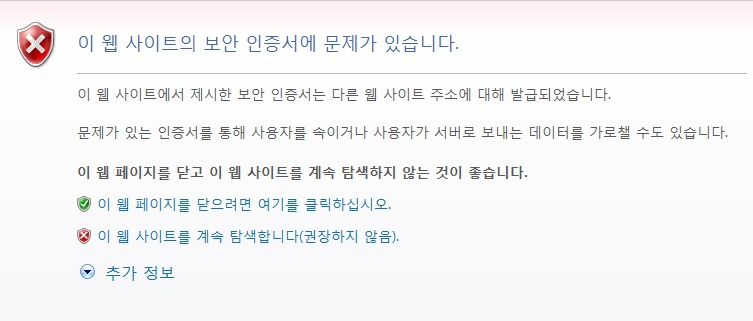
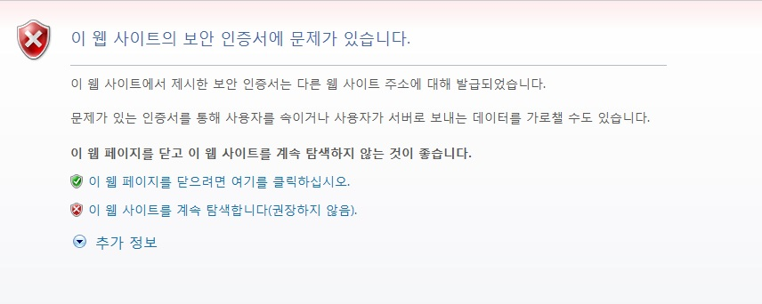
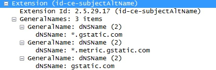

.. _https:

제 9 장 HTTPS
******************

이 장에서는 HTTPS 구성에 대해 설명한다. TLS 1.2을 지원하고 SSL 2.0은 보안상의 이유로 업그레이드 만 허용한다. HTTPS는 클라이언트와 STON 구간에서만 사용된다. STON 원래 서버와 HTTPS 통신하고 있지 않다. 왜냐하면 보안 적으로도 성능으로 STON가 HTTPS를 중계하는 것은 적절하지 않기 때문이다. 만약 원래 서버와 항상 HTTPS 통신이 필요한 경우 :ref:`bypass-port` 를 권장한다.

.. toctree::
   :maxdepth: 2

서비스 구성
====================================

다른 IP 주소 나 포트를 지정하지 않으면 기본적으로 바인딩 된 서비스 주소는 " * 443"이다. 전역 설정 (server.xml)로 설정한다. ::

   # server.xml - <Server>

   <Https>
      <Cert>/usr/ssl/cert.pem</Cert>
      <Key>/usr/ssl/certkey.pem</Key>
      <CA>/usr/ssl/CA.pem</CA>
   </Https>

   <Https Listen="1.1.1.1:443">
      <Cert>/usr/ssl_ip_port/cert.pem</Cert>
      <Key>/usr/ssl_ip_port/certkey.pem</Key>
      <CA>/usr/ssl_ip_port/CA.pem</CA>
   </Https>

   <Https Listen="*:886">
      <Cert>/usr/ssl_port886/cert.pem</Cert>
      <Key>/usr/ssl_port886/certkey.pem</Key>
      <CA>/usr/ssl_port886/CA.pem</CA>
   </Https>

-  ``<Https>`` HTTPS를 구성한다.

   -  ``<Cert>`` 서버 인증서

   -  ``<Key>`` 서버 인증서의 개인 키. 암호화 된 형식은 지원하지 않는다.

   -  ``<CA>`` CA(Certificate Authority) 체인의 인증서

같은 Port를 서비스하고 더욱 명확한 표현이 우선한다.

예를 들어, 위의 NIC가 3 개에 각각의 IP 주소가 1.1.1.1,1.1.1.2,1.1.1.3 인 경우를 가정 해 보자. 1.1.1.1:443에 연결 한 클라이언트는 가장 명시적인 표현 인 두 번째 (<Https Listen = "1.1.1.1:443">) 인증서에 서비스된다. 한편 1.1.1.3 : 443에 연결 한 클라이언트는 IP가 일치하는 첫 번째 (<Https> Listen = "* 443"속성이 생략 된) 인증서에 서비스된다. 인증서 파일을 같은 이름으로 덮어도 Reload 때 반영된다.

.. note::

   인증서의 형식은 PEM (Privacy Enhanced Mail), 비대칭 키 알고리즘은 RSA 만 지원한다.

.. _https-aes-ni:

SSL / TLS 가속
====================================

CPU (AES-NI)를 통해 SSL / TLS를 가속한다. AES-NI를 지원하는 CPU 인 경우 SSL / TLS에서 AES 알고리즘을 우선적으로 사용하도록 동작한다. AES-NI가 인식 된 경우에는 다음과 같이 Info.log에 기록된다. ::

   AES-NI : ON (SSL/TLS accelerated)

관리자는 AES-NI를 사용할지 여부를 선택할 수있다. ::

   # server.xml - <Server><Cache>

   <AES-NI>ON</AES-NI>

-  ``<AES-NI> (기본: ON)`` AES-NI를 사용할지 여부를 선택한다.

.. _https-ciphersuite:

CipherSuite를 선택
====================================

지원하는 CipherSuites는 다음과 같다.

================================================ ======== =========== =======
Cipher Suite                                     TLS1.2   TLS1.1/1.0  SSL3.0
================================================ ======== =========== =======
TLS_ECDHE_RSA_WITH_AES_256_GCM_SHA384	(0xc030)   O
TLS_ECDHE_RSA_WITH_AES_256_CBC_SHA384	(0xc028)   O
TLS_ECDHE_RSA_WITH_AES_128_GCM_SHA256	(0xc02F)   O
TLS_ECDHE_RSA_WITH_AES_128_CBC_SHA256	(0xC027)   O
TLS_ECDHE_RSA_WITH_AES_256_CBC_SHA (0xC014)      O        O
TLS_ECDHE_RSA_WITH_AES_128_CBC_SHA (0xC013)      O        O
TLS_RSA_WITH_AES_256_GCM_SHA384	(0x009D)         O
TLS_RSA_WITH_AES_128_GCM_SHA256	(0x009C)         O
TLS_RSA_WITH_AES_256_CBC_SHA256	(0x003D)         O
TLS_RSA_WITH_AES_128_CBC_SHA256	(0x003C)         O
TLS_RSA_WITH_AES_256_CBC_SHA (0x0035)            O        O
TLS_RSA_WITH_AES_128_CBC_SHA (0x002F)            O        O
TLS_RSA_WITH_3DES_EDE_CBC_SHA (0x000A)           O        O
TLS_RSA_WITH_RC4_128_SHA (0x0005)                                     O
TLS_RSA_WITH_RC4_128_MD5 (0x0004)                                     O
================================================ ======== =========== =======

``<Https>`` 의 ``CipherSuite`` 특성을 사용하면 사용 CipherSuite를 설정할 수있다. ::

   # server.xml - <Server>

   <Https CipherSuite="ALL:!ADH:RC4+RSA:+HIGH:+MEDIUM:+LOW:+SSLv2:+EXP">
      <Cert>/usr/ssl/cert.pem</Cert>
      <Key>/usr/ssl/certkey.pem</Key>
      <CA>/usr/ssl/CA.pem</CA>
   </Https>

-  ``CipherSuite`` `Apache mod_ssl의 SSL CipherSuite표현 <http://httpd.apache.org/docs/2.2/mod/mod_ssl.html#sslciphersuite>`_ 을 따른다.

`Forward Secrecy <https://en.wikipedia.org/wiki/Forward_secrecy>`_ 을 보장하는 높은 안전성을 얻을 수있다. (아래 링크 참조)

   - `SSL Labs: Deploying Forward Secrecy <https://community.qualys.com/blogs/securitylabs/2013/06/25/ssl-labs-deploying-forward-secrecy>`_
   - `SSL/TLS & Perfect Forward Secrecy <http://vincent.bernat.im/en/blog/2011-ssl-perfect-forward-secrecy.html>`_
   - `Configuring Apache, Nginx, and OpenSSL for Forward Secrecy <https://community.qualys.com/blogs/securitylabs/2013/08/05/configuring-apache-nginx-and-openssl-for-forward-secrecy>`_

기본적으로 FS (Forward Secrecy)를 보장하는 CipherSuite를 우선적으로 선택한다. ::

   # server.xml - <Server>

   <Https FS="ON"> ...  </Https>

-  ``FS``

   - ``ON (기본)`` Forward Secrecy를 보장하는 CipherSuite를 우선적으로 선택한다.
   - ``OFF`` ClientHello에 순서대로 선택한다.

``FS`` 속성은 ``CipherSuite`` 특성보다 우선합니다.

.. note::

   성능상의 이유로 ECDHE만을 지원한다. DHE는 지원하지 않는다.

.. _https-ciphersuite-query:

CipherSuite 조회
====================================

CipherSuite 설정 결과를 조회한다. CipherSuite 식은 `OpenSSL 1.0.0E <https://www.openssl.org/docs/apps/ciphers.html>`_ 를 준수한다. ::

   http://127.0.0.1:10040/monitoring/ssl?ciphersuite=...

결과는 JSON 형식으로 제공된다. ::

  {
      "version": "2.0.0",
      "method": "ssl",
      "status": "OK",
      "result":
      [
          {
              "Name" : "AES128-SHA",
              "Ver" : "SSLv3",
              "Kx" : "RSA",
              "Au" : "RSA",
              "Enc" : "AES(128)",
              "Mac" : "SHA1"
          },
          {
              "Name" : "AES256-SHA",
              "Ver" : "SSLv3",
              "Kx" : "RSA",
              "Au" : "RSA",
              "Enc" : "AES(256)",
              "Mac" : "SHA1"
          }
      ]
  }

멀티 Domain 구성
====================================

하나의 서버에서 여러 서비스를 동시에 운용하는 경우 SSL 설정이 문제가 될 수있다. 대부분의 Web / Cache 서버는 HTTP 요청의 Host 헤더를보고 어떤 가상 호스트에서 서비스 여부를 결정한다.

   일반 HTTPS 통신

일반적으로 SSL은 클라이언트 (Browser)가 자신이 연결하고자하는 서버의 도메인 이름 (winesoft.co.kr)을 인증서를 사용하여 확인할 신원 확인을한다. 만약 인증서로 신원 확인이되지 않은 경우 (잘못된 인증서 또는 유효 기간 만료 등)는 다음과 같이 사용자에게 신뢰 여부를 묻는 (처음부터 차단하는 경우도있다). 신뢰는 클라이언트가되므로 일반적으로 신원 확인이되지 않아도 계속하려면 SSL 통신이 이루어진다.

   사용자에게 판단을 맡긴다.

서버에서 SSL을 사용하는 가상 호스트가 하나라면 문제가되지 않는다. 그러나 여러 가상 호스트를 동시에 운영하는 서버에서는 문제가 될 수있다. 왜냐하면, 서버가 클라이언트에 인증서를 전달할 때 ( "일반 HTTPS 통신"의 "2. 인증서 전달") 클라이언트가 어떤 Host에 연결하려고 알 수 없기 때문이다.

이 문제를 극복하는 대표적인 방법은 다음과 같다.

=================== =========================================== ========================================================================
방식	               장점	                                        단점
=================== =========================================== ========================================================================
SNI                 서버설정만으로 동작 (표준)                         Windows XP와 IE6 미지원
Multi Certificate	인증서만 교체하여 동작                            메인 도메인 또는 서비스 주체가 마찬가지
Multi Port          포트만 변경하여 동작                             웹 페이지에서 HTTPS포트를 명시해주어야 함
Multi NIC	        서버설정만으로 동작 (가장 널리쓰임)                  NIC와 IP추가 구성필요
=================== =========================================== ========================================================================

=================== ====================================== ========================================================================
방식	            장점	                               단점
=================== ====================================== ========================================================================
SNI                 서버설정만으로 동작 (표준)	           Windows XP와 IE6 미지원
Multi Certificate	인증서만 교체하여 동작	               메인 도메인 또는 서비스 주체가 같아야 하며 자칫 재발급이 빈번할 수 있음
Multi Port          포트만 변경하여 동작	               웹 페이지에서 HTTPS포트를 명시해주어야 함
Multi NIC	        서버설정만으로 동작 (가장 널리쓰임)    NIC와 IP추가 구성필요
=================== ====================================== ========================================================================

.. _https_sni:

SNI (Server Name Indication)
--------------------------

SSL / TLS의 `SNI(Server Name Indication) <http://en.wikipedia.org/wiki/Server_Name_Indication>`_
확장 필드를 사용하는 방식이다. 이 방식은 클라이언트가 서버에 SSL 연결을 요청할 때 Server Name 확장 필드를 명시함으로써 가능하다. ::

   # server.xml - <Server><Cache>

   <HttpsSNI>OFF</HttpsSNI>

-  ``<HttpsSNI>``

   - ``OFF (기본)`` `Multi Port`_ 또는 `Multi NIC`_ 방법으로 여러 인증서를 지원합니다.

   - ``ON`` 과 같은 IP + Port의 조합으로 여러 인증서를 지원한다. 다음의 경우처럼, 포트 443에서 여러 인증서를 지원할 수있다. ::

      # server.xml - <Server>

      <Https>
         <Cert>/usr/ssl/cert.pem</Cert>
         <Key>/usr/ssl/certkey.pem</Key>
         <CA>/usr/ssl/CA.pem</CA>
      </Https>

      <Https>
         <Cert>/usr/ssl_another/cert.pem</Cert>
         <Key>/usr/ssl_another/certkey.pem</Key>
         <CA>/usr/ssl_another/CA.pem</CA>
      </Https>

``<HttpsSNI>`` 은 동적으로 변경이 불가능하다. 설정 변경 후에는 반드시 서비스를 다시 시작해야한다.

.. note::

   SNI는 2003 년 6 월 `RFC 3546 <https://tools.ietf.org/html/rfc3546#page-8>`_ 을 통해 TLS 1.0 이상에서만 정의되었다. 따라서 SSL v3는 SNI를 지원하지 않습니다. 참고로 OpenSSL의 s_client에 SSL-3.0 옵션을 적용하면 SNI 확장 필드를 전송하지 않습니다.

현재까지 가장 우아한 방법이지만, 일부 오래된 클라이언트에서 지원되지 않습니다. 다음은 SNI를 지원하지 않는 클라이언트의 목록이다. (출처: `Wikipedia - Server Name Indication <http://en.wikipedia.org/wiki/Server_Name_Indication#Client_side>`_ )

- Internet Explorer (any version) on Windows XP or Internet Explorer 6 or earlier
- Safari on Windows XP
- BlackBerry Browser
- Windows Mobile up to 6.5
- Android default browser on Android 2.x[34] (Fixed in Honeycomb for tablets and Ice Cream Sandwich for phones)
- wget before 1.14
- Java before 1.7

Multi Certificate
--------------------------

인증서에 여러 도메인을 넣고 Wildcard (i.e. * .winesoft.co.kr)을 명시하여 하나의 인증서로 여러 도메인의 신원을 확인할 수있는 방법이다.

   하나의 인증서로 여러 Domain을 인증한다.

서비스 주체가 동일한 경우에 효과적인 방법이지만, 무관하다면 동일한 인증서를 공유하는 것은 현실적으로 곤란하다. 이 방법은 인증서 만 교체하면되는 것이므로 STON 개별적으로 구성 할 수는 없다.
[ `DigiCert <http://www.digicert.com/wildcard-ssl-certificates.htm>`_ 참고]

Multi Port
--------------------------

SSL / TLS는 443 포트를 사용한다. 중복되지 않는 포트를 이용하여 인증서를 여러 개 설치할 수있다. 클라이언트는 다음과 같이 포트를 명시하여 SSL 통신이 가능하다. ::

    https://winesoft.co.kr:543/

STON는 다음과 같이 Listen 속성에 포트를 명시하여 인증서를 복수로 설정한다. ::

   # server.xml - <Server>

   <Https> ..A 사의 인증서.. </Https>
   <Https Listen="*:543"> ..B사 인증서.. </Https>
   <Https Listen="*:544"> ..C사 인증서.. </Https>

이 방법은 가장 경제적이지만, 모든 Web 페이지에 링크에 HTTPS 포트를 지정해야한다면 문제가있다.

Multi NIC
--------------------------

서버의 NIC가 복수로 구성되어있는 경우 각 NIC에 IP 주소를 개별적으로 할당 할 수있다. 따라서 서버의 IP에 대해 별도의 인증서를 설치하여 클라이언트가 접속 한 서버의 IP에 따라 인증서를 결정하도록 설정한다. STON는 다음과 같이 Listen 특성에 IP 주소를 명시하여 인증서를 복수로 설정한다. ::

   # server.xml - <Server>

   <Https Listen="10.10.10.10"> ..A사 인증서.. </Https>
   <Https Listen="10.10.10.11"> ..B사 인증서.. </Https>
   <Https Listen="10.10.10.12"> ..C사 인증서.. </Https>

이 방법은 가장 일반적으로 사용되는 방식이다.

.. note::

   설정을 공유하면 IP 주소에 대한 문제가 될 수있다. 이런 경우 IP가 아닌 NIC의 이름으로 설정한다. ::

      # server.xml - <Server>

      <Https Listen="eth0"> ... </Https>
      <Https Listen="eth1"> ... </Https>
      <Https Listen="eth2"> ... </Https>

프로토콜 설정
====================================

``<Https>`` 프로토콜을 구성한다. ::

   # server.xml - <Server>

   <Https TLS1.2="ON" TLS1.1="ON" TLS1.0="ON" SSL3.0="ON"> ...  </Https>

- ``TLS1.2 (기본: ON)`` TLS1.2을 사용한다.

- ``TLS1.1 (기본: ON)`` TLS1.1을 사용한다.

- ``TLS1.0 (기본: ON)`` TLS1.0을 사용한다.

- ``SSL3.0 (기본: ON)`` SSL3.0을 사용한다.

.. _https-hsts:

HSTS
====================================

`HSTS(HTTP Strict Transport Security) <https://en.wikipedia.org/wiki/HTTP_Strict_Transport_Security>`_ 는
:ref:`handling_http_requests_modify_client` 을 이용하여 쉽게 구현이 가능하다.
::

   # /svc/www.example.com/headers.txt

   *, $RES[Strict-Transport-Security: max-age=31536000; includeSubDomains], set

`Qualys SSL Server Test <https://www.ssllabs.com/ssltest/>`_ 는 HSTS가 적용된 사이트에만 A + 등급을 부여하고있다.

.. figure:: img/qualys_a_plus.png
   :align: center

   STON v2.2에서 A +를받을 수있다
