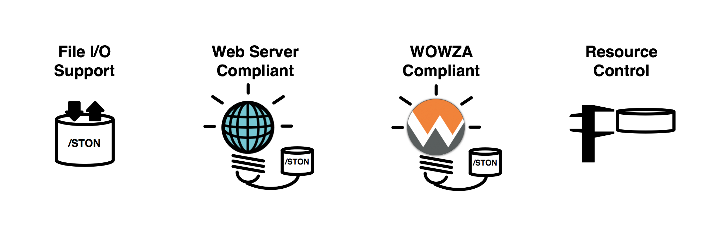

.. _intro:

제 1 장. STON 에지 서버 (Edge Server)
**********************************

.. toctree::
   :maxdepth: 2

서비스 디자인의 원칙
===================
서비스의 성공은 가용성, 속도, 확장 성이 달려있다. "확장 성, Web 아키텍처와 분산 시스템의 설계」를 쓴 Kate Matsudaira도이 세 가지 원칙을 강조하고있다.

**가용성 (availability)**

서비스는 항상 가능해야한다. 장애 발생시 90 %의 고객이 경쟁사로 이동한다. 전체 시스템은 아니지만, 재해 복구는 신속해야한다.

**속도 (speed)**

비즈니스에서의 시간은 금이다. 느린 응답 시간은 매출 감소이다. 응답 시간이 0.1 초 지연 및 매출 1 % 감소한다. Amazon.com의 고객 47 %는 Web 페이지가 2 초 이내에 열리는 것을 희망한다.

**확장 성 (scalability)**

객이 만명이든 사람이든 서비스가 원활해야한다. 크기를 키우고 유지하기 위해 노력 스토리지 확장 성, 트랜잭션 처리 여력도 확장 성이다. 관리의 확장 성 빼놓을 수 없다. 진단 문제를 이해하고 업데이트 및 변경이 용이해야한다.

모든 원칙은 최소의 비용으로 방어수록 효율적입니다. 비용은 돈뿐만 아니라 시간, 노력, 훈련 등을 포함한다.

성공 서비스는  **성장** 한다. 더 많은 고객과 더 많은 콘텐츠를 해결해야한다. 성장할수록 원칙은 더 지키는 것은 어렵다. 어떻게하면이 원칙을 쉽게 최소의 비용으로 지킬 수 있을까?

서비스의 성장
===============

테스트와 파일럿 서비스는 항즈데 서버에서 시작한다. 서비스가 조금씩 성장하고있다. 서버의 수는 야금 야금 늘어난다. 콘텐츠 업데이트 한 대씩 신중해야한다. 손발이 고생하는 것만으로, 아직 관리에 큰 무리가 없다.

서비스가 성장하기 시작했다. 고객이 늘어나 쌓기 데이터가 점점 커진다. 서버를 일일이 관리 할 어려워진다. 데이터를 한 곳에 모으는 높은 비용의 스토리지를 도입하는 NAS (, SAN ,, DAS 등). 높은 비용이지만, 믿을 수있을 것 같다. 콘텐츠 업데이트가 용이하게되었다. 스토리지에 올린 콘텐츠는 서버가 자동으로 가지고 간다.

서비스가 급성장하고있다. 서버 대수를 늘려 료 트 드니 스토리지의 전송 부하가 커졌다. 더 빠른 스토리지는 매우 고가이다. 도입이 망설여진다. 투자 가치가 있는가?

동기화 (synchronization) 솔루션을 검토한다. 서버에 데이터 전체를 준비 할 수 없다. 스토리지의 콘텐츠를 선별해야한다. 정확하게 제어하려면 관리 기술이 필요하다. 서버 여러 대 동기화 관리는 쉽다. 그러나 서버와 파일 수가 증가할수록 어려워진다. 점점 나 빠진다. 커질수록 느려지고 어렵고 불안정하다.

콘텐츠는 변화하고있다. 추가, 삭제, 파일이 많을수록 동기화 시간은 길어진다. 서비스의 규모가 커질수록 동기화 관리 시스템도 필연적으로 커지고 복잡해진다. 관리 시스템의 장애는 곧 전체의 장애를 일으킨다.

콘텐츠를 빠르고 유연하게 전송하는 쉬운 방법이 필요하다.

.. _intro_service_scaling:

서비스 확장 성 전송
=====================

계층화 (layering)에 서비스를 모델링하면 다음 그림과 같이 2 층으로 나누고있다.

.. figure:: img/intro_2layers.png
   :align: center

중심으로 데이터를 관리하는 스토리지 (storage)의 층이있다. 그 위에 서비스 로직이 구현 된 응용 프로그램 (application) 계층이있다. 응용 프로그램 계층은 소규모 고객들 콘텐츠 전송도 처리 할 수있다. 초기에는 스토리지 및 애플리케이션 계층에서만 서비스를 구성 할 수있다.

.. figure:: img/intro_graph_1.png
   :align: center

서비스가 성장하고 처리 비용은 달라진다. 초기에는 논리의 개발이 성장기에는 고객의 증가와 함께 데이터 관리가 가장 많은 비용을 차지하고있다. 서비스가 발전할수록 가장 큰 고민은 **콘텐츠 전달** 이다. 폭발하는 대역폭을 어떻게 해결할 것인가?   **콘텐츠 전송** 서비스 확장 (Scale-out)의 큰 과제이다.

에지 (edge) : 전송 계층
==========================

.. figure:: img/intro_3layers.png
   :align: center

서비스가 성장할수록 전송의 부담은 기하 급수적으로 커진다. 쇼핑몰의 콘텐츠 수는 많으면 수십 억 개에 달한다. 동영상 서비스의 콘텐츠는 TB에 도달 오래다. 서비스를 설치하려면 콘텐츠 전달의 확장 성 (scalability)을 고려해야합니다.

에지 (edge)는 서비스의 가장 바깥 쪽 최전방을 가리킨다. 가장자리는 고객은 속도와 가용성을 체험한다. 고객이 요구하는 콘텐츠는 무엇이 있어도 "반드시"보낼 필요가있다. 고객이 보는 화면에 깨진 이미지도 접속 불능은 매우 치명적이다. 가장자리에서 콘텐츠 전송을 처리하면 애플리케이션과 스토리지 전송 부담이 줄어든다.

가장자리의 확장이 용이하고 효율적이면 다른 높은 비용 층을 증설 할 필요가 없다. 스토리지 및 애플리케이션의 증설은 고비용의 비효율적 인 선택이다.

그럼 STON 에지 서버는 어떻게 콘텐츠 전달을 빠르고 쉽게 바꾸자?

에지 서버의 동작 : 캐시 (cache)
=========================================

.. figure:: img/intro_cache1.png
   :align: center

전송의 규모는 고객의 수와 내용의 크기에 따라 커진다. 얼마나 많은 고객이 어떤 콘텐츠를 요구하고있는 것은 가장자리에서 가장 빨리 알 수있다. 가장자리에서 Bottom-up 작업 흐름이 효율적이다. 따라서 에지 서버는 고객의 요구에 따라 On-demand에서 작동하는 **캐시 (cache)** 전송 방식을 채용했다. 관리 시스템도 필요 없다. 구체적인 동작은 다음과 같다.

.. figure:: img/intro_cache2.png
   :align: center

에지 서버는 첫 번째 콘텐츠 전송 요청을 받았을 때, 전 계층에서 콘텐츠를 검색하고 고객에게 보내십시오. 이 콘텐츠를 에지 서버는 자신도 저장한다. 두 번째 요구와 그 후에는 저장된 컨텐츠를 고객에게 즉시 전송한다. 저장된 콘텐츠는 미리 설정된 TTL (Time-To-Live) 시간 만 유효하다.

에지 서버는 이러한 방법으로 상당한 양의 콘텐츠 전송을 처리 할 수있다. 애플리케이션 및 스토리지 증설을 최소화하면서 고속 대용량 전송을 처리한다. 성장하는 서비스라면 반드시 에지를 고려한다.

STON 에지 서버는 완전한 기능 / 무조건을 지향하는 소프트웨어이다. 일부 하드웨어에 설치되자 최대의 성능을 발휘하도록 설계되었다.

**CPU:** Many-Core에 최적화되었다. Throughput은 코어 수에 비례한다.

**Memory:** 이 많을수록 빠르게 처리한다. Disk I / O를 줄일 수 있습니다.

**Disk:**  I / O를 균등하게 분산한다. 더 많은 데이터를 caching한다.

**NIC:** 4Gbps NIC Bonding 또는 10Gbps NIC의 Bandwidth를 보장한다.

STON 에지 서버는 **강력한 라이브 모니터링 / 로그를** 지원합니다. 초 단위의 실시간 통계에 즉시 서비스 상태를 확인 할 수있다. JSON, XML SNMP와 같은 일부 범용 포맷으로 실시간 수치를 제공한다.

STON 관리자를위한 **간단한 설정을** 제공한다. STON의 설계 이념은 관리자 에지 서버이다. Web Management 페이지를 사용하여 직관적 인 설정 방법을 제공한다. 세부 설정을 원하는 경우, 단 두 개의 XML 설정 파일에 쉽게 할 수있다.

에지 서버의 영향
======================
에지 서버의 효과는 다음과 같다.

#. 간단하고 편리한 서비스 가속
#. 서비스의 소스를 외부로부터 보호 (Origin Shielding)
#. 서비스가 중요한 역할을 수행 할 수 있도록 보조

에지 서버의 영향은 다음과 적용 사례를 중심으로도 확인할 수있다.

Game
----------------------------

전통적으로, 게임 서비스는 엄청나게 많은 대역폭을 필요로한다. "대작"게임에서 쉽게 캐주얼 게임까지 종류도 매우 다양하다. 특히 스마트 폰 게임의 폭발적인 성장과 전파 속도는 서비스 형태를보다 다양했다.

.. figure:: img/icons_game.png
   :align: center

- **높은 대역폭 출력**

  단일 서버에 높은 대역폭을 얻는 전통적인 방법은 1Gbps NIC를 본딩 (Bonding)하는 것이다. 그러면 4Gbps의 대역폭까지 얻을 수있다. 최근 10Gbps NIC도 시장에 많이 보급되어있는 경향이있다.

  ``STON`` 4Gbps NIC Bonding 및 10Gbps NIC 최대 대역폭을 보장한다.

- **사용자의 대역폭을 보장**

  모든 사용자는 게임을 바로 다운로드하고 싶어한다. 광 LAN 사용자는 100Mbps의 속도를 얻을 수없는 경우 항의 전화를 걸 것이다. 모두 빨리 게임을 시작하고 싶어한다. 서버는 물리적으로 각 사용자의 최대 속도를 균일하게 확보해야한다.

  ``STON`` 모든 사용자에게 최대 속도로 전송하는 것을 보장한다.

- **대용량 파일 처리**

  설치 파일이 4GB 정도의 게임은 현재 대규모 게임으로 분류되지도 않는다. 수십 GB는해야 '대작'이라는 단어를 장착 할 수있는 세계이다. 파일이 너무 큰 경우 서버의 메모리에 모두 Caching 수 없다. 최악의 상황은 파일 크기가 너무 커서 사용자마다 다운로드되는 위치가 제각각 인 상황이다.

  ``STON`` Caching 파일 크기의 제한이 없다. Memory 및 Disk의 적절한 Swap을 통해 언제든지 고성능을 보장한다.

- **Range 요청 처리**

  파일 전송이 대형화되는 추세에 따라 Grid Delivery 방식의 P2P 솔루션도 많이 사용되고있다. 이러한 솔루션의 특징은 파일을 잘게 조각 내고 송수신하는 서버에 매우 많은 HTTP Range 요청을 보낸다. 10GB의 파일을 만 명의 고객이 다른 Range 요구하는 상황도 가능하다. 어떤 부분을 요구해도 서비스는 즉시 가능해야한다. 그러나 원래의 서버는 반드시 원본 파일의 크기만큼 데이터를 전송한다.

  ``STON`` Range 요구에 최적화 된 파일 시스템이 탑재되었다. 또한 멀티 다운로드를 통해 신속한 응답 성을 확보한다. 원본 서버에서 1Bytes도 필요 다운로드하지 않는다.

쇼핑몰
----------------------------

쇼핑몰 사이트의 액세스가 고객의 매출과 직결된다. 이제 전통적인 PC 환경뿐만 아니라 모바일 쇼핑이 일반화되었다. 쇼핑 환경이 다양 화 될뿐만 아니라 무한히 늘어날 파일을 관리하지 않으면 서비스는 곤경에 처한다.

.. figure:: img/icons_shopping.png
   :align: center

- **무한대의 작은 파일**
  "억! 단위를 초과 ~」、「무수한 ~」、「항상 증가기만하는 ~」파일을 저장하기 위해서는 비싼 Storage이 필요하다. 그러나 경제성이 중요한 Edge 서버에서는 그 수 없다. 크기가 1KB 파일이 10 억 개 존재하는 서비스도있을 수있다. 결론적으로 모든 파일을 Caching 수 없다. 소스 서버의 부하를 최소화하면서도 액세스 빈도가 높은 파일을 항상 유지하는 방법이 필요하다.

  ``STON`` 메모리와 Disk 자원의 최대 용량 만 Caching한다. 모든 파일의 액세스 빈도는 실시간으로 관리되며 LRU (Least Recently Used)에 의해 오래된 파일 순으로 삭제된다.

- **많은 사용자**

  쇼핑몰은 많은 사용자를 동시에 처리 할 수 있어야한다. 가파른 이벤트는 사용자 연결이 폭발적으로 증가 (= Burst)도있다. Burst 때 서버는 자신을 보호해야 Burst 후에도 안정성을 유지해야한다.

  ``STON`` CPU 확장 성 (Scalability 자원 증설로 솔루션의 성능이 높아지는 것)을 보장한다. 탄력있는 HTTP Keep-Alive 처리 및 소켓 관리를 사용하여 Burst시에도 안정성을 보장한다.

- **반응성**

  쾌적한 쇼핑 환경과 페이지가 즉시로드되는 것을 의미한다. 사용자는 기다리지 않는다. 3 초 이내에로드되지 않는 경우 다른 사이트에 남깁니다. 일반적으로 메인 페이지에 100 개 안팎의 파일로 구성되어 물리적 환경을 고려해서 보통 1 초 대에 페이지가 완전히로드 될 것이다.

  ``STON`` 실시간 파일 인덱스를 사용하여 즉시 응답을 보장한다. 소프트 파일 교환을 통해 원래의 종속성없이 반응성을 극대화 할 수있다. 모든 HTTP 응답 (First byte 응답 트랜잭션의 완료) 로그와 통계 수치를 제공하여 성능 저하 여부를 실시간으로 감지 할 수있다.

- **페이지 TTL**

  대부분의 사용자의 이동 경로는 메인 페이지 -> 대 카테고리 페이지 -> 소형 카테고리 -> 상세 페이지 순서이다. 페이지마다 노출 빈도가 다를뿐만 아니라 업데이트도 달라야한다. 똑똑한 페이지 Caching 및 업데이트 방법이 필요하다.

  ``STON`` URL에 대해 별도의 TTL을 부여 할 수있다. 또한 Purge, Expire, ExpireAfter, HardPurge 등 상황에 따라 다양한 방식의 업데이트 방법을 제공한다.

미디어
----------------------------

미디어 프로토콜은 점차 설 자리를 잃고있다. HTTP, MP4 간단하지만 강력한 조합은 점차 세력을 넓히고있다. 모바일 가변의 연결 상태를 고려하면, HTTP 기반의 Streaming 방식이 전송 표준이 될 것이다.

.. figure:: img/icons_media.png
   :align: center

- **미디어 인식**

  더 이상 파일을 Chunk를 확인해야한다. 미디어 파일을 정확하게 인식 할 수 있어야 대역폭 절감과 함께 다양한 부가 기능을 연동 할 수있다. 서버가 파일의 해석을 위해 파일의 모든 부분을 필요로하는 경우, 사용자는 영상의 재생을 포기하는 것이다.
  ``STON`` MP4, MP3, M4A, FLV 포맷을 지원한다. 다운로드와 동시에 HTTP Pseudo Streaming을 위해 필요한 영역을 우선적으로 Caching한다.

- **미디어 헤더의 재배치**

  헤더 뒤에 파일의 경우 HTTP Pseudo Streaming이 불가능하다. 그러기 위해서는 전용 플레이어가 필요하지만 이것은 사용자에게 문제를 +10한다.

  ``STON`` MP4 파일 인코딩 후 헤더가 후에 붙는 경우 헤더를 앞으로 옮기는 작업을 추가 할 필요가있다. STON 자연스럽게 헤더를 전에 옮겨 정비한다.

- **대역폭 조절**

  대부분의 영상을 끝까지 보는 사용자는 드물다. 따라서 재생에 무리가 없도록 필요한만큼의 대역폭을 사용하는 것이 효율적 전송 방법이다. 같은 영상이라도 360p, 480p, 720p, 1080p처럼 Bitrate를 다양하게 서비스한다.

  ``STON``  Bandwidth-Throttling을 통해 미디어 파일 전송 대역폭을 최적화 할 수있다.

- **구간 추출**

  미리보기 / 하이라이트 / 공유 등 파일 전체가 아닌 특정 구간만을 서비스하는 경우도 많다. 서비스를 제공하는 모든 파일에 대해 구간을 추출하는 것은 시간과 저장 공간을 지나치게 낭비한다. 또한 사용자마다 추출 구간이 다를 수있다. 또한 Skip 기능을 구간 재생에 구현하는 플레이어도 존재한다.

  ``STON`` Trimming 기능 구간을 추출하여 완전한 형태의 미디어 파일에 서비스한다.

뉴스 / 커뮤니티
----------------------------

매우 높은 충성도의 사용자 층을 확보 한 사이트는 흥미로운 점이 많다. 같은 관심사를 가진 사용자가 모이기 때문에 교류가 활발하고, 페이지에 머무는 시간도 매우 길다. 서비스 패턴이 제각각이라 서비스하는 꽤 어렵다.

.. figure:: img/icons_news.png
   :align: center

- **304 Not Modified**

  사이트 충성도가 매우 높기 때문에 이미 많은 파일을 사용자의 로컬에 저장하고있다. 때문에 실제로 전송되는 파일보다「변경 확인」의 비율이 압도적이다.

  ``STON``자주 액세스되는 파일은 항상 메모리에 상주하도록 보장한다. 
  "변경 확인" 의 작업은 기다릴 필요없이 즉시 처리된다.

- **Bypass**

  사용자에 특화 한 페이지 나 새로운 기사 리플 등의 페이지는 항상 Caching 할 수없는 영역을 포함한다. 그러나 Domain을 따로 나누지 않고 하나의 도메인을 Reverse-Proxy에 위임하는 경우가 많다.

  ``STON`` 다양한 조건에 따라 우회 대상을 정밀하게 잰다. 또한 Origin Affinity, Private 기능을 이용하여 로그인 세션을 유지할 수있다.

- **불안 소스**

  중, 소 기업과 개인이 운영하는 사이트는 고가의 장비와 인프라, 인력을 운영하는 것은 어렵다. 소스 서버의 장애의 빈도가 상대적으로 높고,이를 극복하기위한 경제성이 매우 나쁘다.

  ``STON`` 원본 서버의 과부하 또는 장애를 판단하여 자동으로 제거 / 회복이 이루어진다. 소스 서버의 장애시 TTL을 자동으로 연장시켜 원래의 서버 의존을 최소화하고있다.

- **이미지 가공**

  같은 이미지를 사용자의 환경에 따라 다양하게 보여줄 필요가있다. 검색 결과에서 Thumbnail 이미지, 뉴스 사이트에서는 "XX 뉴스"와 같은 문자를 워터 마크로 표시하여야한다. 같은 이미지를 표시하는 형태에 따라 매번 처리 할 저장 공간과 시간, 인력의 낭비이다.

  ``STON`` :ref:`media-dims` 기능을 사용하면 원래의 서버에 하나의 이미지 만 원하는 모양을 URL 호출 만 생성 할 수있다.

파일 기반 서버
----------------------------

Edge는 Reverse-Proxy 구조에 근거한다. Reverse-Proxy의 중요한 개념은 원격 서버의 파일을 로컬로 복제 / 업데이트 / 관리하는 것이다. 이미 검증 된 STON를 서비스 서버와 연동 할 수 있다면 Storage 중앙 집중화 및 동기화 문제를 제거 할 수있다. 뿐만 아니라 개발 시간의 단축 및 서비스의 신뢰성 향상의 두 마리 토끼를 모두 잡을 수있다.

- **File I/O 지원**

  전용 프로토콜이 필요한 경우 해당 모듈에 의존 서버가되어 버린다. 매우 연동해도 성능이 저하 구식이다. 모듈과 서버 사이의 중간 단계를 최소화해야한다.

  ``STON`` 표준 File I / O STON가 연동된다. 전용 서버와 STON 사이에는 Linux Kernel (VFS) 만 존재하고 고성능을 보장한다.

- **Web Server 연동**

  표준 Web 서버 (Apache, Lighttpd, NginX)에 특화된 확장 모듈이 설치되어있는 경우 표준 Reverse-Proxy를 도입하는 것은 어려울 수있다. DB / WAS와 연동되는 파일 서비스 및 과금 / 결제 서비스 같은 경우에는 쉽게 서비스를 확장하는 것은 어렵다.

  ``STON`` Apache의 DocumentRoot를 STON에 지정하면 Apache는 STON를 물리적 디스크로 인식한다. 또한 설정하는 것은 아니다.

- **Wowza 연동**

  미디어 서비스는 Wowza가 사실상의 표준이다. 그러나 Wowza의 HTTP Caching 기능을 사용하는 번거 로움뿐만 아니라 빈약하다. 또한 점차적으로 HTTP가 아닌 "전용"프로토콜은 사라지는 경향이있다.

  ``STON`` 로컬 디스크에 Mount 수있을뿐만 아니라, MP4 헤더 변환, Trimming 등 모든 기능을 이용할 수있다.

- **자원의 제약**

  Back-end에 존재하는 파일을 Front-End 사용자에게 전달하는 서버라면 항상 파일의 동기화가 문제가된다. 게임 서버, SNS 서버 등의 전용 서버 개발 문제는 항상 존재한다. 이러한 서버의 경우 중단없이 장기간 운용 될 것이므로, 메모리, 디스크의 사용이 엄격히 제한되어야한다.

  ``STON`` 최대 메모리, 디스크 사용량을 제한 할 수있다. 또한 디스크에 Mount도 다른 모든 기능은 동일하게 작동하고 복합적인 서비스를 최소한의 솔루션으로 구성 할 수있다.

STON는 이러한 특성을 적극적으로 활용하는 다음의 서비스와 함께 성장하고있다.

