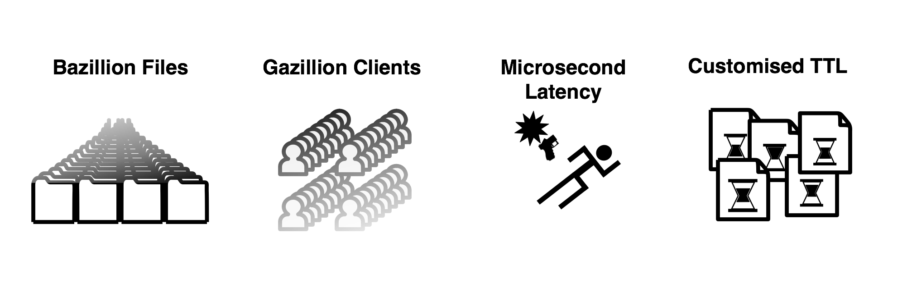

.. _intro:

第1章。 STONエッジサーバー（Edge Server）
**********************************

.. toctree::
   :maxdepth: 2

サービス設計の原則
===================
サービスの成功は、可用性、速度、拡張性にかかっている。 「拡張性、Webアーキテクチャと分散システムの設計」を書いたKate Matsudairaもこの3つの原則を強調している。

**可用性 (availability)**

サービスは、常に可能でなければならない。 障害発生時の90％のお客様は、競合他社に移動する。 完全なシステムはないが、障害時の回復は迅速なければならない。

**速度 (speed)**

ビジネスでの時間は金である。 遅い応答時間は、売上高の減少である。 応答時間が0.1秒の遅延と、売上高1％が減少する。 Amazon.comの顧客47％は、Webページが2秒以内に開かれることを望む。

**拡張性 (scalability)**

顧客が万人であれ人であれサービスはスムーズなければならない。 サイズを育て維持する努力、ストレージ拡張性、トランザクション処理余力も拡張性である。 管理の拡張性欠かせない。 診断、問題を理解し、アップデートと変更が容易でなければならない。

すべての原則は、最小のコストで守る収録効率的です。 費用はお金だけではなく、時間、努力、訓練なども含んでいる。

成功サービスは **成長** する。 より多くの顧客とより多くのコンテンツに対処しなければならない。 成長すればするほどの原則は、より守るのは難しい。 どのようにすれば、この原則を簡単に最小のコストで守ることができるだろうか？

サービスの成長
===============

テストやパイロットサービスはハンヅデのサーバーで開始する。 サービスが少しずつ成長している。 サーバーの数は、冶金冶金増える。 コンテンツの更新は一台ずつ入念にしなければならない。 手足が苦労するだけで、まだ管理に大きな無理がない。

サービスが成長し始めている。 顧客が増え、積むデータがますます大きくなる。 サーバーをいちいち管理することも難しくなる。 データを一箇所に集める高コストのストレージを導入する（NAS、SAN、、DASなど）。 高コストであるが、信頼することができるようだ。 コンテンツ更新が容易になった。 ストレージにあげたコンテンツは、サーバーが自動的に持っていく。

サービスが急成長している。 サーバー台数を増やしリョトドニストレージの転送負荷が大きくなった。 より速いストレージはとても高価である。 導入がためらわれる。 投資する価値があるか。

同期（synchronization）ソリューションを検討する。 サーバーにデータ全体を準備することはできない。ストレージのコンテンツを選別しなければならない。 正確に制御するには、管理技術が必要だ。 サーバー数台の同期管理は容易である。 ただし、サーバーとファイル数が増えるほど難しくなる。 ますます悪くなる。 大きくなるほど遅くなり、難しく不安定である。

コンテンツは変化し続けている。 追加、削除、ファイルが多くなるほど、同期時間は長くなる。 サービスの規模が大きくなるほど、同期管理システムも必然的に大きくなって複雑になる。 管理システムの障害は、すぐに全体の障害を起こす。

コンテンツを迅速かつ柔軟に転送する簡単な方法が必要である。


.. _intro_service_scaling:

サービス拡張性送信
=====================

階層化（layering）にサービスをモデル化すると、次の図のように、2層に分けている。

.. figure:: img/intro_2layers.png
   :align: center

中心にデータを管理するストレージ（storage）の層がある。 その上にサービスロジックが実装されたアプリケーション（application）階層がある。 アプリケーション層は、小規模顧客向けコンテンツ配信も処理することができる。 初期には、ストレージとアプリケーション層のみでサービスを構成することができる。

.. figure:: img/intro_graph_1.png
   :align: center

サービスが成長し処理費用は変わる。 初期にはロジックの開発が、成長期には、顧客の増加とともに、データ管理が最も多くの費用を占めている。 サービスが発展するほど最大の悩みは、 **コンテンツ配信** である。 爆発する帯域幅をどのように解決するのか？  **コンテンツ配信** は、サービス増設（Scale-out）の大きな課題である。

エッジ（edge）：トランスポート層
==========================

.. figure:: img/intro_3layers.png
   :align: center

サービスが成長ほど、転送の負担は指数関数的に大きくなる。 ショッピングモールのコンテンツ数は多ければ数十億個に達する。 動画サービスのコンテンツは、TBに達して久しい。 サービスの増設には、 コンテンツ配信の拡張性（scalability）を考慮する必要があります。

エッジ（edge）は、サービスの最も外側、最前方を指す。 エッジでは、顧客は、速度と可用性を体験する。 顧客が要求しているコンテンツは、何があっても「必ず」送信する必要がある。 顧客が見る画面で壊れた画像でも、接続不能は非常に致命的である。 エッジでコンテンツ配信を処理すると、アプリケーションとストレージの転送負担は減る。

エッジの拡張が容易かつ効率的であれば、他の高コストの層を増設する必要がない。 ストレージとアプリケーションの増設は、高コストの非効率的選択である。

次に、STONエッジサーバーは、どのようにコンテンツ配信を迅速かつ容易に変えよう？

エッジサーバーの動作：キャッシュ（cache）
=========================================

送信の規模は、顧客の数とコンテンツのサイズに応じ大きくなる。 どのように多くの顧客がどのようなコンテンツを要求していることは、エッジで最も早く知ることができる。 エッジからBottom-upの処理の流れが効率的である。 したがってエッジサーバーは、顧客の要求に応じてOn-demandで動作する **キャッシュ(cache)** 伝送方式を採用した。 管理システムも必要がない。 具体的な動作は次の通りである。

.. figure:: img/intro_cache2.png
   :align: center

エッジサーバーは、最初のコンテンツ転送要求を受けたとき、元の階層からコンテンツを取得し、顧客に送信する。 このコンテンツをエッジサーバーは、自分にも保存する。 第二の要求とその後は保存されたコンテンツを、顧客にすぐに送信する。 保存されたコンテンツは、予め設定されたTTL（Time-To-Live）時間だけ有効である。

エッジサーバーは、これらの方法でかなりの量のコンテンツ配信を処理することができる。 アプリケーションとストレージの増設を最小限に抑えながら、高速大容量伝送を処理する。 成長するサービスであれば、必ずエッジを考慮する。

STONエッジサーバーは、フル機能の/無条件を志向するソフトウェアだ。 いくつかのハードウェアにインストールなろう、最大のパフォーマンスを発揮するように設計された。

**CPU:** Many-Coreに最適化された。 Throughputは、コア数に比例する。

**Memory:** が多ければ多いほど高速に処理する。 Disk I / Oを削減する。

**Disk:** I/O を均等に分散する。 より多くのデータをcachingする。

**NIC:** 4Gbps NIC Bondingまたは10Gbps NICのBandwidthを保証する。

STONエッジサーバーは、 **強力なライブ監視/ログ** をサポートします。 秒単位のリアルタイム統計にすぐサービスの状態がどうかを確認することができる。 JSON、XML、SNMPなどのいくつかの汎用フォーマットでリアルタイムの数値を提供する。

STONは、管理者のための **簡単な設定** を提供する。 STONの設計理念は、管理者のためのエッジサーバーである。 Web Managementページを使用して、直感的な設定方法を提供する。 ディテールの設定を希望する場合、単2つのXML設定ファイルに簡単にすることができる。

エッジサーバーの影響
======================
エッジサーバーの効果は次の通りである。

#. 簡単で便利なサービス加速
#. サービスのソースを外部から保護 (Origin Shielding)
#. サービスが重要な役割を実行することができるよう補助

エッジサーバーの影響は、次の適用事例を中心にも確認することができる。

Game
----------------------------

伝統的に、ゲームサービスは、信じられないほど多くの帯域幅を必要とする。
"大作" のゲームから簡単カジュアルゲームまでカテゴリにも非常に多様である。 特にスマートフォンゲームの爆発的な成長と伝播速度は、サービス形態をより多様にした。

- **高帯域幅の出力**

  単一のサーバーに高帯域幅を得る従来の方法は、1Gbps NICをボンディング（Bonding）するものである。 これにより、4Gbpsの帯域幅まで得ることができる。 最近10Gbps NICも市場に多く普及している傾向にある。

  ``STON`` 4Gbps NIC Bondingと10Gbps NICも最大帯域幅を保証する。

- **ユーザーの帯域幅を保証**

  すべてのユーザーは、ゲームをすぐにダウンロードしてがる。 光LANユーザーは100Mbpsの速度が得られない場合抗議の電話をかけるだろう。 みんな早くゲームを開始したがる。 サーバーは、物理的に、各ユーザーの最大速度を均一に確保しなければならない。

  ``STON`` すべてのユーザーに最大速度で転送することを保証する。

- **大容量ファイルの処理**

  インストールファイルが4GB程度のゲームは現在大規模なゲームに分類されてもいない。 数十GBは必要があり、「大作」という単語を取り付けることができる世界である。 ファイルが大きすぎる場合、サーバーのメモリの両方にCachingできない。 最悪の状況は、ファイルのサイズが大きすぎて、ユーザーごとにダウンロードされる位置がまちまちである状況である。

  ``STON`` Cachingファイルサイズの制限がない。 MemoryとDiskの適切なSwapを介していつでも高性能を保証する。

- **Range要求の処理**

  ファイルの転送が大型化されている傾向に基づいてGrid Delivery手法のP2Pソリューションも多く使用されている。 このようなソリューションの特徴は、ファイルを細かく彫刻出し送受信のためにサーバーに非常に多くのHTTP Rangeリクエストを送る。 10GBのファイルを万人の顧客が異なるRangeに要求する状況も可能である。 どの部分を要求してもサービスはすぐに可能でなければならない。 しかし、元のサーバーでは、必ず元のファイルのサイズ分だけデータが送信されるべきである。

  ``STON`` Range要求に最適化されたファイルシステムが搭載された。 また、マルチダウンロードを介して迅速な応答性を確保する。 ソースサーバーから1Bytesも不要ダウンロードはしない。

ショッピングモール
----------------------------

ショッピングモールは、サイトのアクセスが顧客の売上高と直結される。 今、伝統的なPC環境だけでなく、モバイルショッピングが当たり前になった。 ショッピング環境が多様化しなるだけでなく、無限に増えるファイルを管理していなければ、サービスは苦境に処する。

- **無限大の小さなファイル**
  "億！単位を超え〜」、「無数の〜」、「いつも増え欺瞞する〜」ファイルを保存するためには、高価なStorageが必要である。 しかし、経済性が重要なEdgeサーバーでは、そのことができない。 サイズが1KBのファイルが10億個存在するサービスもあることができる。 結論として、すべてのファイルをCachingできない。 ソースサーバーの負荷を最小限に抑えるながらもアクセス頻度が高いファイルを常に維持する方法が必要である。

  ``STON`` メモリとDiskリソースの最大容量だけCachingする。 すべてのファイルのアクセス頻度は、リアルタイムで管理され、LRU（Least Recently Used）によって古いファイルの順に削除される。

- **多くのユーザー**

  ショッピングモールは、多くのユーザーを同時に処理することができなければならない。 急なイベントによって、ユーザー接続が爆発的に増加（= Burst）もある。 Burst時サーバーは、自分自身を保護する必要がありBurst後も安定性を維持しなければならない。

  ``STON`` CPU拡張性（Scalability資源の増設により、ソリューションの性能が高まること）を保証する。 弾力性のあるHTTP Keep-Alive処理とソケットの管理を使用してBurst時にも安定性を確保する。

- **反応性**

  快適なショッピング環境とページがすぐにロードされていることを意味する。 ユーザーは待たない。 3秒以内にロードされない場合、他のサイトに残します。 一般的に、メインページには100個前後のファイルで構成され、物理的な環境を考慮しても、通常1秒台にページが完全にロードされるべきである。

  ``STON`` リアルタイムファイルのインデックスを使用した、すぐに応答を保証する。 ソフトファイル交換を介して、元の依存関係がなく、反応性を最大化することができる。 すべてのHTTP応答（First byte応答、トランザクションの完了）のログと統計数値を提供して、パフォーマンスの低下かどうかをリアルタイムに検出することができる。

- **ページTTL**

  大半のユーザーの移動経路は、メインページ - >大カテゴリページ - >小型カテゴリー - >詳細ページ順である。 ページごとに露出頻度が異なるだけでなく、更新たりも異なるべきである。 スマートなページCaching及び更新の方法が必要である。

  ``STON`` URLごとに個別のTTLを付与することができる。 またPurge、Expire、ExpireAfter、HardPurgeなど状況に応じて、様々な方式の更新方法を提供する。

メディア
----------------------------

メディア専用のプロトコルは、徐々に居場所を失っている。 HTTP、MP4のシンプルだが強力な組み合わせは、徐々に勢力を広げている。 モバイルの可変の接続状態を考慮すれば、HTTPベースのStreaming方式が送信標準になるだろう。

.. figure:: img/icons_media.png
   :align: center

- **メディア認識**

  これ以上ファイルをChunkとして認識してはならない。 メディアファイルを正確に認識することができこそ、帯域幅の節約と一緒に様々な付加機能を連動することができる。 サーバーがファイルの解釈のために、ファイルのすべての部分を必要とする場合、ユーザーは映像の再生を放棄するものである。
  ``STON`` MP4、MP3、M4A、FLV形式をサポートする。 ダウンロードと同時にHTTP Pseudo Streamingのために必要な領域を優先的にCachingする。

- **メディアヘッダーの再配置**

  ヘッダが背後にあるファイルの場合、HTTP Pseudo Streamingが不可能である。 そのためには、専用のプレイヤーが必要ですが、これ、ユーザーに迷惑を+10する。

  ``STON`` MP4ファイルのエンコード後のヘッダーが後に付く場合、ヘッダーを今後移す作業をさらに行う必要がある。 STONは自然にヘッダを前に移して整備する。

- **帯域幅の調整**

  ほとんどの映像を最後まで見るユーザーは珍しい。 したがって、再生に無理がないように、必要な分だけの帯域幅を使用することが効率的な伝送方法である。 同じ映像であっても360p、480p、720p、1080pのようにBitrateを多様にサービスする。

  ``STON`` Bandwidth-Throttlingを通じてメディアファイルの転送帯域幅を最適化することができる。

- **区間抽出**

  プレビュー/ハイライト/共有するなど、ファイル全体ではなく、特定の区間だけをサービスする場合も多い。 サービスを提供するすべてのファイルに対して区間を抽出することは、時間とストレージ容量を過度に無駄にする。 さらに、ユーザーごとに抽出区間が異なる場合もある。 また、Skip機能を区間再生に実装するプレイヤーも存在する。

  ``STON`` Trimming機能により区間を抽出して、完全な形のメディアファイルにサービスする。

ニュース/コミュニティ
----------------------------

非常に高い忠誠心のユーザー層を確保したサイトは、興味深い点が多い。 同じ興味を持つユーザーが集まるので交流が盛んで、ページに留まる時間も非常に長い。 サービスパターンがバラバラだとサービスするかなり難しい。

.. figure:: img/icons_news.png
   :align: center

- **304 Not Modified**

  サイトの忠誠心が非常に高いため、既に多くのファイルをユーザーのローカルに保存している。 ので、実際に転送されるファイルよりも「変更の確認」の割合が圧倒的である。

  ``STON`` 頻繁にアクセスされるファイルは、常にメモリに常駐するように保証する。
  "変更の確認" の作業は待つことなく、すぐに処理される。

- **Bypass**

  ユーザーに特化したページや、新しい記事、リップルなどのページは、常にCachingできない領域を含んでいる。 しかし、Domainを別々に分けずに、単一のドメインをReverse-Proxyに委任する場合が多い。

  ``STON`` さまざまな条件に基づいて、バイパス対象を精巧に分類する。 またOrigin Affinity、Private機能を利用してログインセッションを維持することができる。

- **不安ソース**

  中、小企業や個人が運営するサイトは、高価な機器やインフラ、人材を運営するのは難しい。 ソースサーバーの障害の頻度が比較的高く、これを克服するための経済性は非常に悪い。

  ``STON`` 元サーバーの過負荷や障害を判断して自動的に排除/回復が行われる。 ソースサーバーの障害時に、TTLを自動的に延長させて、元のサーバー依存を最小限に抑えている。

- **画像加工**

  同じ画像をユーザーの環境に応じて多様に示す必要がある。 検索結果では、Thumbnail画像を、ニュースサイトでは、 "XXニュース" のような文字をウォーターマークとして表示しなければならない。 同じ画像を表示される形態に応じて毎回処理することはストレージ容量と時間、労働力の浪費だ。

  ``STON`` :ref:`media-dims` 機能を使用すると、元のサーバーに単一のイメージだけで所望の形状をURL呼び出しだけで生成することができる。

ファイルベースのサーバー
----------------------------

Edgeは、Reverse-Proxy構造に基づいている。 Reverse-Proxyの重要な概念は、リモートサーバー上のファイルをローカルに複製/更新/管理するものである。 すでに検証されたSTONをサービスサーバと連動することができればStorage一元化と同期の問題を除去することができる。 だけでなく、開発時間の短縮とサービスの信頼性の向上の二匹のウサギをすべてキャッチすることができる。

.. figure:: img/icons_file.png
   :align: center

- **File I/O サポート**

  専用プロトコルが必要であれば、そのモジュールに依存サーバーがされてしまう。 大変連動したとしても、性能が低下する時代遅れである。 モジュールとサーバーとの間の中間段階は最小限に抑えなければならない。

  ``STON`` 標準File I / OでSTONが連動される。 専用サーバーとSTONの間には、Linux Kernel（VFS）のみが存在し、高性能を保証する。

- **Web Server 連動**

  標準Webサーバ（Apache、Lighttpd、NginX）に特化した拡張モジュールがインストールされている場合、標準のReverse-Proxyを導入するのは難しいことができる。 DB / WASと連動されているファイルサービスや課金/決済サービスのような場合は、簡単のサービスを拡張するのは難しい。

  ``STON`` ApacheのDocumentRootをSTONに指定すると、ApacheはSTONを物理ディスクとして認識する。 さらに設定することはない。

- **Wowza 連動**

  メディアサービスでは、Wowzaが事実上の標準である。 しかし、WowzaのHTTP Caching機能は使用する面倒なだけでなく、粗末である。 また、徐々にHTTP以外の「専用」のプロトコルは消える傾向にある。

  ``STON`` ローカルディスクにMountできるだけでなく、MP4ヘッダの変換、Trimmingなどすべての機能を利用することができる。

- **リソースの制約**

  Back-endに存在するファイルをFront-Endのユーザーに配信するサーバーであれば、常にファイルの同期が問題になる。 ゲームサーバ、SNSサーバなどの専用サーバーの開発問題は常に存在する。 このようなサーバーの場合中断することなく、長期間運用されるべきなので、メモリ、ディスクの使用が厳しく制限されるべきである。

  ``STON`` 最大メモリ、ディスク使用量を制限することができる。 また、ディスクにMountても、他のすべての機能は、同じように動作して複合的なサービスを最小限のソリューションで構成することができる。

STONはこれらの特性を積極的に活用する次のサービスと一緒に成長している。

.. figure:: img/intro_reference.png
   :align: center
