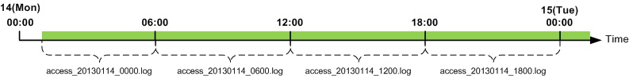
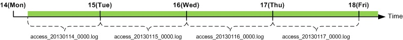
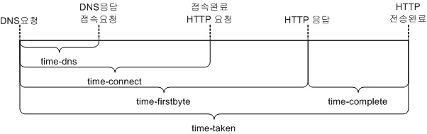
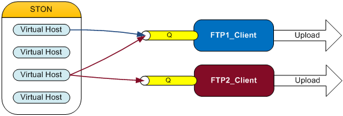

.. admin-log:

第12章 ログ
******************

この章では、ログを大事にする。 サービスは、ログに始まり、ログに終わる。 ログは、金であり、法であり、紛争地域の平和維持軍である。

ログは、グローバルと仮想ホストに区分される。 すべてのログは記録するかどうかを設定することができ、共通の属性を持つ。 ::

   <XXX Type="time" Unit="1440" Retention="10" Compression="OFF">ON</XXX>

-  ``Type (基本: time)`` , ``Unit (基本: 1440분)`` ログローリング条件を設定する。

   - ``time`` 設定された ``unit`` 時間（単位：分）ごとにログファイルをローリングする。
   - ``size`` 設定された ``unit`` サイズ（単位：MB）ごとにログファイルをローリングする。
   - ``both`` コンマ（、）で区切って、時間とサイズを同時に設定する。 たとえばUnit = "1440、100"である場合、時間が24時間（1440分）または100MBの場合、ログファイルをローリングする。

-  ``Retention (基本: 10個)`` 単位のログファイルを最大n個の維持である。

-  ``Compression (基本: OFF)`` ログがローリングされる圧縮を行う。 たとえばaccess_20140715_0000.logファイルがローリングされると、access_20140715_0000.log.gzに圧縮されて保存される。

``Type`` が "time" , ``Unit`` が10の場合、ログは10分毎にローリングされる。 たとえば、サービスを2:18分に開始しても、ログは、10分の2:20、2:30、2:40にローリングされる。 同様に、一日に一回、毎日0時0分にローリングする1440（60分X 24時間）で ``Unit`` 値に設定する。
``time`` の設定でログは一日に一度、無条件ローリングされるので、 ``Unit`` の最大値は、1440を超えることができない。

最大値は24時間（Unit = 1440）時間ごとにログがローリングするように設定した場合は、次の図のようにログが記録される。

.. toctree::
   :maxdepth: 2

.. admin-log-install:

Installログ
====================================

インストール/アップデート時にすべての内容がinstall.logに記録される。 このログは、別の設定がない。 ::

    #DownloadURL: http://foobar.com/ston/ston.2.0.0.rhel.2.6.32.x64.tar.gz
    #DownloadTime: 13 sec
    #Target: STON 2.0.0
    #Date: 2014.03.03 16:48:35
    Prepare for STON 2.0.0 install process
        Stopping STON...
        STON stopped
    [Copying files]
        `./fuse.conf' -> `/etc/fuse.conf'
        `./libfuse.so.2' -> `/usr/local/ston/libfuse.so.2'
        `./libtbbmalloc_proxy.so' -> `/usr/local/ston/libtbbmalloc_proxy.so'
        `./start-stop-daemon' -> `/usr/sbin/start-stop-daemon'
        `./libtbbmalloc_proxy.so.2' -> `/usr/local/ston/libtbbmalloc_proxy.so.2'
        `./libtbbmalloc.so' -> `/usr/local/ston/libtbbmalloc.so'
        `./libtbbmalloc.so.2' -> `/usr/local/ston/libtbbmalloc.so.2'
        `./libtbb.so' -> `/usr/local/ston/libtbb.so'
        `./libtbb.so.2' -> `/usr/local/ston/libtbb.so.2'
        `./stond' -> `/usr/local/ston/stond'
        `./stonx' -> `/usr/local/ston/stonx'
        `./stonr' -> `/usr/local/ston/stonr'
        `./stonu' -> `/usr/local/ston/stonu'
        `./stonapi' -> `/usr/local/ston/stonapi'
        `./server.xml.default' -> `/usr/local/ston/server.xml.default'
        `./vhosts.xml.default' -> `/usr/local/ston/vhosts.xml.default'
        `./ston_format.sh' -> `/usr/local/ston/ston_format.sh'
        `./ston_diskinfo.sh' -> `/usr/local/ston/ston_diskinfo.sh'
        `./wm.sh' -> `/usr/local/ston/wm.sh'
    [Exporting config files]
        #Export so directory
        /usr/local/ston/ to ld.so.conf
        #Export sysctl to /etc/sysctl.conf
        vm.swappiness=0
        vm.min_free_kbytes=524288
        #Export sudoers for WM
        Defaults    !requiretty
        winesoft ALL=NOPASSWD: /etc/init.d/ston stop, /etc/init.d/ston start, /bin/ps -ef
    [Configuring STON daemon script]
        STON deamon activate in run-level 2345.
    [Installing sub-packages]
        curl installed.
        libjpeg installed.
        libgomp installed.
        rrdtool installed.
    [Installing WM]
        Stopping WM...
        WM stopped
        `./wm.server_default.xml' -> `/usr/local/ston/wm/tmp/conf/server_default.xml'
        `./wm.vhost_default.xml' -> `/usr/local/ston/wm/tmp/conf/vhost_default.xml'
        WM configuration found. Current WM port : 8500
        PHP module for Legacy(CentOS 5.5) installed
        `./libphp5.so.5.5' -> `/usr/local/ston/wm/modules/libphp5.so'
        WM installation almost complete. Changing WM privileges.
    Installation successfully complete

.. _admin-log-info:

Infoログ
====================================

Infoログは、グローバル設定（server.xml）に設定する。 ::

   # server.xml - <Server><Cache>

   <InfoLog Type="size" Unit="1" Retention="5">ON</InfoLog>

-  ``<InfoLog> (基本: ON, Type: size, Unit: 1)``
   STONの動作と設定の変更について記録する。

.. _admin-log-deny:

Denyログ
====================================

Denyログは、グローバル設定（server.xml）に設定する。 ::

   # server.xml - <Server><Cache>

   <DenyLog Type="size" Unit="1" Retention="5">ON</DenyLog>

-  ``<DenyLog> (基本: ON, Type: size, Unit: 1)``

   :ref:`access-control-serviceaccess` によってアクセスブロックされたIPアドレスを記録する。 ::

      #Fields: date time c-ip deny
      2012.11.15 07:06:10 1.1.1.1 AP
      2012.11.15 07:06:26 2.2.2.2 GIN
      2012.11.15 07:06:30 3.3.3.3 3.3.3.1-255

   すべてのフィールドは、スペースで区切られ、各フィールドの意味は次のとおりである。

   - ``date`` 日
   - ``time`` 時間
   - ``c-ip`` クライアントのIPアドレス
   - ``deny`` ブロック条件

.. _admin-log-originerror:

OriginErrorログ
====================================

OriginErrorログは、グローバル設定（server.xml）に設定する。 ::

   # server.xml - <Server><Cache>

   <OriginErrorLog Type="size" Unit="5" Retention="5" Warning="OFF">ON</OriginErrorLog>

-  ``<OriginErrorLog> (基本: OFF, Type: size, Unit: 5, Warning: OFF)``

   すべての仮想ホストのソースサーバーで発生した障害だけ記録する。 障害は、接続障害と伝送障害を意味し、元のサーバー排除/回復の結果が記録される。 ::

      #Fields: date time vhostname level s-domain s-ip cs-method cs-uri time-taken sc-error sc-resinfo
      2012.11.15 07:06:10 [example.com] [ERROR] 192.168.0.13 192.168.0.13 GET /Upload/ProductImage/stock/1716439_SM.jpg 20110 Connect-Timeout -
      2012.11.15 07:06:26 [example.com] [ERROR] 192.168.0.13 192.168.0.13 GET /Upload/ProductImage/stock/1716439_SM.jpg 20110 Connect-Timeout -
      2012.11.15 07:06:30 [example.com] [ERROR] 192.168.0.13 192.168.0.13 GET /Upload/ProductImage/stock/1716439_SM.jpg 20110 Connect-Timeout -
      #2012.11.15 07:06:30 [example.com] 192.168.0.13 excluded from service
      #2012.11.15 07:06:31 [example.com] Origin server list: 192.168.0.14
      #2012.11.15 07:11:11 [example.com] 192.168.0.13 recovered back in service
      #2012.11.15 07:11:12 [example.com] Origin server list: 192.168.0.13

   すべてのフィールドは、スペースで区切られ、各フィールドの意味は次のとおりである。

   - ``date`` 障害が発生した日付
   - ``time`` 障害発生時間
   - ``vhostname`` [仮想ホスト]
   - ``level`` [障害レベル（ErrorまたはWarning)]
   - ``s-domain`` ソースサーバーのドメイン
   - ``s-ip`` ソースサーバーのIP
   - ``cs-method`` STONが元のサーバーに送信HTTP Method
   - ``cs-uri`` STONが元のサーバーに送信URI
   - ``time-taken`` 障害が発生するまでにかかった時間
   - ``sc-error`` 障害の種類
   - ``sc-resinfo`` 障害発生時サーバーの応答情報（ "、"文字で区切ら）

   ``Warning`` 属性が ``ON`` であれば、次の例のように不正なHTTP通信が発生した場合に記録する。 ::

      2012.11.15 07:09:03 [example.com] [WARNING] 10.10.10.10 121.189.63.219 GET /716439_SM.jpg 20110 PartialResponseOnNormalRequest Res=206,Len=2635
      2012.11.15 07:09:03 [example.com] [WARNING] 10.10.10.10 121.189.63.219 GET /716439_SM.jpg 20110 ClosedWithoutResponse -

   不正なHTTP通信の場合は、以下の通りである。

   - ``ClosedWithoutResponse`` 元サーバーによる接続終了。 HTTP応答を受けなかった。
   - ``ClosedWhenDownloading`` 元サーバーによる接続終了。 Content-Lengthだけダウンロードしていなかった。
   - ``NotPartialResponseOnRangeRequest`` Range要求をしたが、応答コードが206ではない。
   - ``DifferentContentLengthOnRangeRequest`` 要求されたRangeとContent-Lengthが異なる。
   - ``PartialResponseOnNormalRequest`` Rangeリクエストがないのに応答コードが206である。

.. admin-log-syslog:

SysLog送信
====================================

`syslog <http://en.wikipedia.org/wiki/Syslog>`_ プロトコルを使用してログをUDPでリアルタイム転送する。 すべてのログに対してsyslogに送信されるように設定することができる。 ::

   # server.xml - <Server><Cache>

   <InfoLog SysLog="OFF">ON</InfoLog>
   <DenyLog SysLog="OFF">ON</DenyLog>
   <OriginErrorLog SysLog="OFF">ON</OriginErrorLog>

-  ``SysLog``

   - ``OFF (基本)`` syslogを使用していない。

   - ``ON`` このタグの下位に設定された ``<SysLog>`` にログを送信する。

以下は、  ``<OriginErrorLog>`` が記録されるときにsyslogを設定する例である。 ::

   # server.xml - <Server><Cache>

   <OriginErrorLog SysLog="ON">
      <SysLog Priority="local3.info" Dest="192.168.0.1:514" />
      <SysLog Priority="user.alert" Dest="192.168.0.2" />
      <SysLog Priority="mail.debug" Dest="log.example.com" />
   </OriginErrorLog>

1. ``<OriginErrorLog>`` の ``SysLog`` 属性を ``ON`` に設定する。
#. ``<OriginErrorLog>`` の下位に ``<SysLog>`` タグを生成する。 n台のサーバーに同時に送信可能である。
#. ``<SysLog>`` の ``Priority`` 属性を設定する。 この表現は、 syslogの `Facility Levels <http://en.wikipedia.org/wiki/Syslog#Facility_levels>`_ と
   `Severity levels <http://en.wikipedia.org/wiki/Syslog#Severity_levels>`_ の組み合わせで構成する。
#. ``<SysLog>`` の ``Dest`` 属性を設定する。 syslog受信サーバーを意味し、受信ポートが514である場合、省略可能である。

上記の設定で記録されたsysログの例は、以下の通りである。 syslogのtagはSTON / {ログ名}に記録される。 ::

    Mar 12 11:24:24 192.168.0.1 STON/ORIGINERROR: 2013-03-12 14:09:20 [ERROR] [example.com] - 192.168.0.14 GET /1.gifd 1996 Connect-Timeout -
    Mar 12 11:24:24 192.168.0.1 STON/ORIGINERROR: 2013-03-12 14:09:22 [ERROR] [example.com] - 192.168.0.14 GET /favicon.ico 1995 Connect-Timeout -
    Mar 12 11:24:24 192.168.0.1 STON/ORIGINERROR: 2013-03-12 14:09:24 [ERROR] [example.com] - 192.168.0.14 GET /1.gifd22 2020 Connect-Timeout -
    Mar 12 11:24:24 192.168.0.1 STON/ORIGINERROR: #2013 .03.12 14:09:24 [example.com] 192.168.0.14:102 excluded from service
    Mar 12 11:24:24 192.168.0.1 STON/ORIGINERROR: #2013 .03.12 14:09:24 [example.com] Origin server list:

仮想ホスト固有のログ保存
====================================

仮想ホストごとにログは別々に記録される。 ログが ``OFF`` に設定されていても、ローカルファイルにのみ書かれていないだけなので
:ref:`api-monitoring-logtrace` は正常に動作する。 ::

   # server.xml - <Server><VHostDefault>
   # vhosts.xml - <Vhosts><Vhost>

   <Log Dir="/cache_log">
      ... (省略) ...
   </Log>

-  ``<Log>`` ``Dir`` 属性にログが記録されるディレクトリを設定します。 ログは、設定したディレクトリの下位の仮想ホストのディレクトリに生成される。

.. _admin-log-dns:

DNSログ
====================================

元サーバーのアドレスがDomainに設定された場合Resolving結果を記録する。 ::

   # server.xml - <Server><VHostDefault><Log>
   # vhosts.xml - <Vhosts><Vhost><Log>

   <Dns Type="size" Unit="10" Retention="10" SysLog="OFF" Compression="OFF">ON</Dns>

::

   #Fields: date time domain ttl ip-list ip-count time-taken result
   2014-07-30 12:10:33 example.com 157 173.194.127.15,173.194.127.23,173.194.127.24,173.194.127.31 4 5007 success
   2014-07-30 12:10:38 example.com 152 173.194.127.23,173.194.127.24,173.194.127.31,173.194.127.15 4 9 success
   2014-07-30 12:11:03 example.com 127 173.194.127.31,173.194.127.15,173.194.127.23,173.194.127.24 4 15007 success
   2014-07-30 12:12:53 example.com 17 173.194.127.15,173.194.127.23,173.194.127.24,173.194.127.31 4 6 success
   2014-07-30 12:23:16 test.com 0 - 0 10008 fail
   2014-07-30 12:23:21 test.com 0 - 0 5007 fail
   2014-07-30 12:23:26 test.com 0 - 0 5011 fail
   2014-07-30 12:24:38 example.com 152 173.194.127.23,173.194.127.24,173.194.127.31,173.194.127.15 4 9 success
   2014-07-30 12:25:03 example.com 127 173.194.127.31,173.194.127.15,173.194.127.23,173.194.127.24 4 15007 success

すべてのフィールドは、スペースで区切られ、各フィールドの意味は次のとおりである。

-  ``date`` 日
-  ``time`` 時間
-  ``domain`` 対象Domain
-  ``ttl`` レコードの有効時間(Time To Live)
-  ``ip-list`` IPリスト
-  ``ip-count`` IP数
-  ``time-taken`` 実行時間
-  ``result`` successまたはfail

.. _admin-log-access:

Accessログ
====================================

すべてのクライアントからのHTTPトランザクションを記録する。 ログ記録の時点では、HTTPトランザクションが完了した時点で、転送完了または送信停止時点を意味する。 ::

   # server.xml - <Server><VHostDefault><Log>
   # vhosts.xml - <Vhosts><Vhost><Log>

   <Access Type="time" Unit="1440" Retention="10" XFF="on" Form="ston" Local="Off">ON</Access>

-  ``XFF``

   - ``ON (基本)`` クライアントが送信したXFF（X-Forwarded-For）ヘッダの値とクライアントのIPアドレスをのように記録する。 ない場合は ``OFF`` と同じである。
   - ``OFF`` クライアントのIPアドレスを記録する。
   - ``TrimCIP``  XFFヘッダがない場合は、クライアントのIPアドレスを、ある場合（クライアントのIPアドレスを除く）XFFヘッダだけを記録する。

-  ``Form``

   - ``ston (基本)`` W3C標準+拡張フィールド
   - ``apache`` Apache形式
   - ``iis`` IIS形式
   - ``custom`` `admin-log-access-custom`

-  ``Local``

   - ``OFF (基本)`` ローカル通信（Loopback）は記録しない。
   - ``ON`` ローカル通信（Loopback）も記録する。

::

    #Fields: date time s-ip cs-method cs-uri-stem cs-uri-query s-port cs-username c-ip cs(User-Agent) sc-status sc-bytes time-taken cs-referer sc-resinfo cs-range sc-cachehit cs-acceptencoding session-id sc-content-length
    2012.06.27 16:52:24 220.134.10.5 GET /web/h.gif - 80 - 61.50.7.9 Chrome/19.0.1084.56 200 98141 5 - Bypass+gzip+SSL3 - TCP_HIT gzip+deflate 7 1273735
    2012.06.27 16:52:26 220.134.10.5 GET /favicon.ico - 80 - 61.50.7.9 Chrome/19.0.1084.56 200 949 2 - - - TCP_HIT gzip+deflate 35 14875
    2012.06.27 17:00:06 220.168.0.13 GET /setup.Eexe - 80 - 61.168.0.102  Mozilla/5.0+(Windows+NT+6.1;+WOW64)+AppleWebKit/536.11+(KHTML,+like+Gecko)+Chrome/20.0.1132.57+Safari/536.11 206 20971800 7008 - - 398458880-419430399 TCP_HIT - 41 89764358

すべてのフィールドは、スペースで区切られ、各フィールドの意味は次のとおりである。

-  ``date`` HTTPトランザクションが完了した日付
-  ``time`` HTTPトランザクションが完了した時刻
-  ``s-ip`` サーバのIP
-  ``cs-method`` クライアントが送信したHTTP Method
-  ``cs-uri-stem`` クライアントが送信したURLの中でQueryStringを除いた部分
-  ``cs-uri-query`` クライアントが送信したURLの中でQueryString
-  ``s-port`` サーバーのポート
-  ``cs-username`` クライアントusername
-  ``c-ip`` クライアントのIPアドレス。 XFFの設定が "ON"であれば、X-Forwarded-Forヘッダの値とクライアントのIPアドレスを記録する。
-  ``cs(User-Agent)`` クライアントが送信したHTTP User-Agent
-  ``sc-status`` サーバーの応答コード
-  ``sc-bytes`` サーバーが送信Bytes（ヘッダ+コンテンツ）
-  ``time-taken`` HTTPトランザクションが完了するまでかかった合計時間（ミリ秒）
-  ``cs-referer`` クライアントが送信したHTTP Referer
-  ``sc-resinfo`` 付加情報。 "+"の文字に区分される。 圧縮されたコンテンツをサービスした場合、圧縮オプション（gzipまたはdeflate）が明示される。 安全な通信であれば、SSLプロトコルのバージョン（SSL3、TLS1、TLS1.1、TLS1.2）が明示される。 バイパスした通信であれば、 "Bypass"が明示されている。

-  ``cs-range`` クライアントが送信したRangeヘッダを記録する。
-  ``sc-cachehit`` キャッシュHIT結果
-  ``cs-acceptencoding`` クライアントが送信されるAccept-Encodingヘッダ
-  ``session-id`` HTTP HTTPクライアントセッションID (unsigned int64)
-  ``sc-content-length`` サーバの応答Content-Lengthヘッダの値

Accessログは、送信成功/失敗したかに関係なく、すべてのHTTPトランザクションを記録する。 HTTPトランザクションは、クライアントがHTTP要求を送信するときに開始される。 STONがクライアントに応答を送信する前にHTTP接続が終了した場合、HTTPトランザクションも終了されたものとみなす。 ログには、 ``sc-status`` と ``sc-bytes`` が0に記録される。 主STONが元のサーバーからの応答を受信する前に、クライアントが接続を終了する場合、このようなログが記録される。

.. _admin-log-access-custom:

ユーザー定義のAccessログのフォーマット
====================================

Accessログの形式をユーザー定義のログに設定する。 ::

   # server.xml - <Server><VHostDefault><Log>
   # vhosts.xml - <Vhosts><Vhost><Log>

   <Access Form="custom">ON</Access>
   <AccessFormat>%a %A %b id=%{userid}C %f %h %H "%{user-agent}i" %m %P "%r" %s %t %T %X %I %O %R %e %S %K</AccessFormat>

-  ``<Access>`` の ``Form`` 属性を ``custom`` に設定する。

-  ``<AccessFormat>`` カスタムログ形式。

上の例の場合は、次のようにAccessログが記録される。 （#Fieldsは記録しない。） ::

    192.168.0.88 192.168.0.12 163276 id=winesoft; image.jpg example.com HTTP "STON" GET 80 "GET /ston/image.jpg?type=png HTTP/1.1" 200 2014-04-03 21:21:54 1 C 204 163276 1 2571978 TCP_MISS HTTP/1.1
    192.168.0.88 192.168.0.12 63276 id=winesoft; vod.mp4 example.com HTTP "STON" POST 80 "GET /ston/vod.mp4?start=10 HTTP/1.1" 200 2014-04-03 21:21:54 12 C 304 363276 2 2571979 TCP_REFRESH_HIT HTTP/1.1
    192.168.0.88 192.168.0.12 3634276 id=ston; news.html example.com HTTPS "STON" GET 443 "GET /news.html HTTP/1.1" 200 2014-04-03 21:21:54 30 X 156 2632576 1 2571980 TCP_MISS HTTP/1.1
    192.168.0.88 192.168.0.12 6332476 id=winesoft; style.css example.com HTTP "STON" HEAD 80 "GET /style.css HTTP/1.1" 200 2014-04-03 21:21:54 10 X 234 653276 2 2571981 TCP_REFRESH_HIT HTTP/1.1
    192.168.0.88 192.168.0.12 6276 id=ston; ui.js example.com HTTP "STON" GET 80 "GET /ui.js HTTP/1.1" 200 2014-04-03 21:21:54 1 X 233 63276 1 2571982 TCP_MISS HTTP/1.1
    192.168.0.88 192.168.0.12 626 id=winesoft; hls.m4u8 example.com HTTP "STON" GET 80 "GET /hls.m4u8 HTTP/1.1" 200 2014-04-03 21:21:54 2 X 124 6312333276 2 2571983 TCP_REFRESH_HIT HTTP/1.1

`Apacheのログ形式 <https://httpd.apache.org/docs/2.2/ko/mod/mod_log_config.html>`_ をベースに開発され、いくつかの拡張フィールドがあります。 各フィールドの区切り文字には制限がありませんSpaceを使用する場合は、User-AgentのようにSpaceが含まれているフィールドは、二重引用符（ "..."）で囲んで設定します。

-  ``%...a`` クライアントのIP ::

      192.168.0.66

-  ``%...A`` サーバーのIPアドレス ::

      192.168.0.14

-  ``%...b`` HTTPヘッダ以外の送らバイト数 ::

      1024

-  ``%...{foobar}C`` サーバが受信した要求のクッキーFoobarの値  ::

      %{id=}c に 入力すると、Cookie の id=に 相当する 値を 記録

-  ``%...D`` リクエストを処理するのにかかった時間（MS） ::

      3000

-  ``%...f`` ファイル名 ::

      /mp4/iu.mp4 なら iu。  mp4を 記録

-  ``%...h`` HostName ::

      example.com

-  ``%...H`` リクエストプロトコル ::

      http または https

-  ``%...{foobar}i`` サーバが受信した要求からfoobar：ヘッダの内容 ::

      %{User-Agent}i として 入力 する 場合 User - Agentの 値を 記録

-  ``%...m`` リクエストMethod ::

      GET または POST または HEAD

-  ``%...P`` Server PORT ::

      80

-  ``%...q`` QueryString ::

      Id=10&value=20

-  ``%...r`` リクエストの最初の行(Request Line) ::

      GET /img.jpg HTTP/1.1

-  ``%...s`` の応答コード ::

      200

-  ``%...t`` STON デフォルトの時間形式	::

      2014-01-01 15:27:02

-  ``%...{format}t`` Formatで定義されている日付形式 ::

      %{%Y-%m-%d %H:%M:%S}T と 入力すると 2014-08-07 06:12:23に 記録した 。

-  ``%...T`` TimeTaken(秒単位) ::

      10

-  ``%...U`` ShortURI ::

      /img/img.jpg

-  ``%...u`` FullURI ::

      /img/img.jpg?session=1232&id=37

-  ``%...X`` トランザクションが完了したときの状態

   - ``X`` 応答が完了する前に終了
   - ``C`` 応答が完了した

   ::

      C

-  ``%...I`` リクエストヘッダを含む受信バイト ::

      2048

-  ``%...O`` レスポンスヘッダを含む、送信バイト ::

      2048

-  ``%...R`` 応答時間(MS) ::

      2

-  ``%...e`` Session-ID ::

      1

-  ``%...S`` キャッシュHIT結果 ::

      TCP_HIT

-  ``%...K`` リクエストHTTPのバージョン	::

      HTTP/1.1

-  ``%...y`` リクエストのHTTPヘッダサイズ	::

      488

-  ``%...z`` 応答のHTTPヘッダサイズ	::

      362

設定したフィールドの値が存在しない場合 - で表記する。 形式が間違ってたらSTON基本フォーマット（Form = "ston"）で動作する。

上の表では、各フィールドの...には、 (e.g. “%h %U %r %b) 何も明示しなかったり、記録条件を明示することができる（条件を満たしていない場合 - で記録）。 条件は、HTTPステータスコードのリストに設定するか、！でNOT条件を設定することができる。

次の例では、 400(Bad Request) エラーまたは 501(Not Implemented) エラーの場合にのみUser-agentを記録する。 ::

    "%400,501{User-agent}i"

次の例では、正常な状態ではなく、すべてのリクエストでRefererをログに残す。 ::

    "%!200,304,302{Referer}i"

.. _admin-log-origin:

Originログ
====================================

ソースサーバーのすべてのHTTPトランザクションを記録する。 記録時点では、HTTPトランザクションが完了した時点で、転送完了または送信停止時点を意味する。 ::

   # server.xml - <Server><VHostDefault><Log>
   # vhosts.xml - <Vhosts><Vhost><Log>

   <Origin Type="time" Unit="1440" Retention="10" Local="Off">ON</Origin>

::

    #Fields: date time cs-sid cs-tcount c-ip cs-method s-domain cs-uri s-ip sc-status cs-range sc-sock-error sc-http-error sc-content-length cs-requestsize sc-responsesize sc-bytes time-taken time-dns time-connect time-firstbyte time-complete cs-reqinfo cs-acceptencoding sc-cachecontrol s-port sc-contentencoding session-id session-type
    2012.06.27 17:40:00 357 899 192.168.0.13 GET i.example.com /t/2.gif 115.71.9.136 200 - - - 3874 197 271 3874 20 0 0 17 3 - gzip+deflate - 80 gzip 7 cache
    2012.06.27 17:40:00 357 900 192.168.0.13 GET i.example.com /ex1.gif 115.71.9.136 200 - - - 5673 223 272 5673 24 0 0 21 3 - - - 80 - 8 cache
    2012.06.27 17:40:00 357 901 192.168.0.13 GET i.example.com /exB.jpg 115.71.9.136 200 - - - 8150 189 273 8150 13 0 0 9  4 Bypass - - 80 - 7 cache
    #[ERROR:01] 2012.06.27 17:40:01 220.73.216.5 220.73.216.5 GET /web/nmb/img/main/v1/h1.gif 1824 Connect-Timeout - 11 cache
    2012.06.27 17:40:00 357 901 192.168.0.13 GET i.example.com /exB1.jpg 115.71.9.136 200 - - - 8150 189 273 8150 13 0 0 9 4 - max-age=3600 80 - 12 cache
    2012.06.27 17:40:00 357 901 192.168.0.13 GET i.example.com /exB2.jpg 115.71.9.136 200 - - - 8150 189 273 8150 13 0 0 9 4 - no-cache 80 - 35 cache
    2012.06.27 17:40:00 357 901 192.168.0.13 GET i.example.com /exB3.jpg 115.71.9.136 200 - - - 8150 189 273 8150 13 0 0 9 4 - - 80 - 35 cache

ソースサーバーで障害が発生した場合＃[ERROR：xx]で始まるエラーログが記録される。 すべてのフィールドは、スペースで区切られ、各フィールドの意味は次のとおりである。

   元の時間測定区間

-  ``date`` HTTPトランザクションが完了した日付
-  ``time`` HTTPトランザクションが完了した時刻
-  ``cs-sid`` セッションの一意のID。 同じセッションを介して処理された（再された）HTTPトランザクションは、同じ値を持つ。
-  ``cs-tcount`` トランザクション数。 このHTTPトランザクションが現在のセッションで何番目に処理されたトランザクションであることを記録する。 同じ ``cs-sid`` 値を持つトランザクションであれば、この値は、重複することができない。
-  ``c-ip`` STONのIP
-  ``cs-method`` 元サーバーに送信HTTP Method
-  ``s-domain`` ソースサーバーのドメイン
-  ``cs-uri`` 元サーバーに送信URI
-  ``s-ip`` ソースサーバーのIP
-  ``sc-status`` ソースサーバーHTTP応答コード
-  ``cs-range`` ソースサーバーに送信されるRange要求値
-  ``sc-sock-error`` ソケットエラーコード（1 =送信失敗、2 =伝送遅延、3 =接続の終了）
-  ``sc-http-error`` ソースサーバーが4xxまたは5xx応答を与えてくれたときに応答コードを記録
-  ``sc-content-length`` ソースサーバーが送信したContent Length
-  ``cs-requestsize (単位: Bytes)`` ソースサーバーに送信されるHTTPリクエストヘッダサイズ
-  ``sc-responsesize (単位: Bytes)`` ソースサーバーが応答したHTTPヘッダーのサイズ
-  ``sc-bytes (単位: Bytes)`` 受信したコンテンツサイズ（ヘッダを除く）
-  ``time-taken (単位: ms)`` HTTPトランザクションが完了するまでにかかった合計時間。 セッションの再利用がない場合は、ソケット接続時間まで含んでいる。
-  ``time-dns (単位: ms)`` DNSクエリにかかった時間
-  ``time-connect (単位: ms)`` 元のサーバーとソケットEstablishedまでかかった時間
-  ``time-firstbyte (単位: ms)`` 要求を送信し、応答が来るまでかかった時間
-  ``time-complete (単位: ms)`` 最初の応答から完了するまでにかかった時間
-  ``cs-reqinfo`` 付加情報。 "+"の文字で区切られている。 バイパスした通信であれば、 "Bypass", Privateバイパスなら "PrivateBypass"に記録される。
-  ``cs-acceptencoding`` ソースサーバーに圧縮されたコンテンツを要求すると、 "gzip+deflate"に記録される。
-  ``sc-cachecontrol`` 元サーバーが送信したcachecontrolヘッダ
-  ``s-port`` ソースサーバーのポート
-  ``sc-contentencoding`` 元サーバーが送信されるContent-Encodingヘッダ
-  ``session-id`` ソースサーバー要求を発生させたHTTPクライアントセッションID（unsigned int64）
-  ``session-type`` ソースサーバーに要求されたセッションのタイプ

   -  ``cache`` キャッシュ用途に使用されたセッション
   -  ``recovery`` :ref:`origin_exclusion_and_recovery` で回復の目的で使用されたセッション
   -  ``healthcheck`` :ref:`origin-health-checker` が使用セッション

.. admin-log-monitoring:

Monitoringログ
====================================

5分平均の統計を記録する。 ::

   # server.xml - <Server><VHostDefault><Log>
   # vhosts.xml - <Vhosts><Vhost><Log>

   <Monitoring Type="size" Unit="10" Retention="10" Form="json">ON</Monitoring>

-  ``Form`` ログ形式を指定する。 ( ``json`` または ``xml`` )

.. admin-log-filesystem:

FileSystemログ
====================================

:ref:`filesystem` を使用して発生するすべてのFile I / Oトランザクションを記録する。 ::

   # server.xml - <Server><VHostDefault><Log>
   # vhosts.xml - <Vhosts><Vhost><Log>

   <FileSystem Type="time" Unit="1440" Retention="10">ON</FileSystem>

File I/O トランザクションの終了時に記録される。 トランザクションの終了時点ではcs-methodの形態に依存する。 ::

    #Fields: date time cs-method cs-path sc-status sc-bytes response-time time-taken sc-cachehit attr session-id
    2012.06.27 16:52:24 ATTR /t 200 0 100 100 TCP_HIT FOLDER 1
    2012.06.27 16:52:24 ATTR /t/2.gif 200 0 100 100 TCP_HIT FILE 1
    2012.06.27 16:52:24 OPEN /file.txt 200 0 100 2000 TCP_HIT FILE 2
    2012.06.27 16:52:24 READ /file.txt 200 1024768 100 2000 TCP_HIT FILE 2

-  ``date`` File I/Oトランザクションが完了した日付
-  ``time`` File I/Oトランザクションが完了した時刻
-  ``cs-method`` File I/Oアクセスを形成する。 次の3つのいずれかを持つ。

   -  ``ATTR`` getattr関数を呼び出します。 関数が返されたときのログ記録
   -  ``OPEN`` ファイルは開かれたがREADしません。 ファイルが閉じられるときにログ記録
   -  ``READ`` ファイルを開き、READした。 ファイルが閉じられるときにログ記録

-  ``cs-path`` アクセスパス
-  ``sc-status`` 応答コード。 通常のサービス（200）を除いた処理に失敗コードは次のとおりである。

   -  ``200`` 通常のサービス
   -  ``301`` バイパスが必要
   -  ``302`` サービス拒否
   -  ``303`` Redirect必要
   -  ``400`` 不正な要求
   -  ``401`` 仮想ホストが見つからなかった
   -  ``402`` 元からの初期化に失敗し
   -  ``500`` オブジェクトの初期化に失敗し
   -  ``501`` オブジェクトOpen失敗
   -  ``502`` 保存パスの作成に失敗し
   -  ``503`` メモリの初期化に失敗し
   -  ``504`` Emergency状態
   -  ``600`` ファイルサービス待機中Timeout
   -  ``601`` ファイルのデータサービス待機中Timeout
   -  ``602`` ファイルサービス待機中のファイルの初期化に失敗し
   -  ``603`` ファイルのデータサービス待機中のデータの初期化に失敗し
   -  ``701`` 誤ったOffset
   -  ``702`` ファイルの特定の領域をロードに失敗し
   -  ``703`` Not enough memory
   -  ``704`` 元セッションの作成に失敗し

-  ``sc-bytes`` Readされたサイズ
-  ``response-time`` 関数の呼び出し ~ サービスオブジェクトを接続するのに必要された時間
-  ``time-taken`` 関数の呼び出し ~ File I / O Transactionが完了されかかった時間
-  ``sc-cachehit`` キャッシュHITの結果
-  ``attr`` FILE または FOLDER
-  ``session-id`` File I/O セッション ID (unsigned int64)

   .. note::

      ``session-id`` は、Client（HTTPまたはFile I / O）Contextが作成されるときに割り当てられる。 一般的なファイル処理過程であるOpen - > Read - > Closeでは、Open時点でClient Contextが作成され、Close時点で破壊される。 一方、getattr関数はアトミック（Atomic）関数なので、毎回Client Contextが作成/破壊され、常に新しいsession-idを割り当てられる。

.. _admin-log-ftp:

FTP転送
====================================

ログがローリングされる指定されたFTPクライアントを使用してログをアップロードする。

.. _admin-log-ftpclient:

FTPクライアント
---------------------

FTPクライアントを設定する。 ローリングされたログをリアルタイムでFTPサーバにアップロードする。

   FTPクライアントの構造と動作

FTPクライアントは、上図のようSTON外部に存在する。 STONは、ローカルに存在するログをFTPクライアントキューに入力するだけでFTPの動作には関与しない。 FTPクライアントは、自分の設定に応じて、アップロードを行う。

FTPクライアントは、グローバル設定（server.xml）に設定する。 ::

   # server.xml - <Server>

   <Ftp Name="backup1">
      <Mode>Passive</Mode>
      <Address>ftp.winesoft.co.kr:21</Address>
      <Account>
         <ID>test</ID>
         <Password>12345abc</Password>
      </Account>
      <ConnectTimeout>10</ConnectTimeout>
      <TransferTimeout>600</TransferTimeout>
      <TrafficCap>0</TrafficCap>
      <DeleteUploaded>OFF</DeleteUploaded>
      <BackupOnFail>OFF</BackupOnFail>
      <UploadPath>/log_backup/%v/%s-%e.%p.log</UploadPath>
      <Transfer Time="Rotate" />
   </Ftp>

   <Ftp Name="backup2">
      <Mode>Active</Mode>
      <Address>192.168.0.14:21</Address>
      <Account>
         <ID>test</ID>
         <Password>qwerty</Password>
      </Account>
      <ConnectTimeout>3</ConnectTimeout>
      <TransferTimeout>100</TransferTimeout>
      <TrafficCap>10240</TrafficCap>
      <DeleteUploaded>ON</DeleteUploaded>
      <BackupOnFail>ON</BackupOnFail>
      <Transfer Time="Static">04:00</Transfer>
   </Ftp>

-  ``<Ftp>`` FTPクライアントを設定する。 ``Name`` 属性に固有の名前を設定する。

   - ``Mode (基本: Passive)`` 接続モード ( ``Passive`` または ``Active`` )
   - ``Address`` FTPアドレス。
   - ``Account`` FTPアカウント。 もしパスワード（例えばqwerty）を暗号化したい場合は、次のAPIを使用する。 ::

        /command/encryptpassword?plain=qwerty

     暗号化されたパスワードは、次のように設定する。 ::

        <Password Type="enc">dXR9k0xNUZVVYQsK5Bi1cg==</Password>

   - ``ConnectTimeout`` 接続待機時間
   - ``TransferTimeout`` 送信待機時間
   - ``TrafficCap (単位: KB)`` 0より大きい値に設定した場合の転送の最大帯域幅を設定する。
   - ``DeleteUploaded (基本: OFF)`` 送信完了後に、ログを削除する。
   - ``BackupOnFail (基本: OFF)`` 送信失敗時のログが削除されないように、ログを次のパスにバックアップする。 ::

        /usr/local/ston/stonb/backup/

     バックアップされたログは、再送信せず、管理者が削除するまで削除されない。

   - ``UploadPath`` アップロードパスを設定する。 別に設定しない場合は、 "/가상호스트/" にアップロードする。 example.comのログは/example.com/ディレクトリにアップロードされる。

     - ``%{time format}s`` ログの開始時間
     - ``%{time format}e`` ログ終了時刻
     - ``%p`` prefix
     - ``%v`` 仮想ホスト名
     - ``%h`` 機器HOST名

     例えば、次のように設定した場合 ::

        # server.xml - <Server><Ftp>

        <UploadPath>/log_backup/%v/%s-%e.%p.log</UploadPath>

     アップロードパスは次のとおりである。 ::

        /log_backup/example.com/200140722_0000-200140722_2300.access.log

   - ``Transfer`` ログ転送時間を指定する。 ``Type`` 属性に基づいて値の形式が違ってくる。

     - ``Rotate (基本)`` ローリングされると、すぐに送信する。 値を持たない。
     - ``Static`` 一日一回、指定した時間に送信する。 たとえば04:00に設定とすれば午前4時に送信を開始する。
     - ``Interval`` 一定時間間隔で送信する。 たとえば、4に設定した場合、4時間間隔でログを送信する。

     転送時間を設定した場合、その時点でログがローリングされないように、適切にログ管理ポリシーを設定する必要がある。

FTPクライアントは、curlを使用する。

.. admin-log-ftplog:

FTPのログ
---------------------

FTPのログは/usr/local/ston/sys/stonb/stonb.logに統合して保存される。 ::

    #Fields: date time local-path cs-url file-size time-taken sc-status sc-error-msg
    2014-04-23 17:10:20 /ston_log/winesoft.co.kr/origin_20140423_080000.log ftp://ftp.winesoft.co.kr:21/winesoft.co.kr/origin_20140423_080000.log 381 10006 fail "curl: (7) couldn't connect to host"
    2014-04-23 17:10:20 /ston_log/winesoft.co.kr/access_20140423_1700.log ftp://192.168.0.14:21/winesoft.co.kr/access_20140423_1700.log 260 60 success "-"
    2014-04-23 17:11:00 /ston_log/winesoft.co.kr/origin_20140423_080000.log ftp://ftp.winesoft.co.kr:21/winesoft.co.kr/origin_20140423_080000.log 381 10008 fail "curl: (7) couldn't connect to host"
    2014-04-23 17:11:00 /ston_log/winesoft.co.kr/filesystem_20140423_080000.log ftp://192.168.0.14:21/winesoft.co.kr/filesystem_20140423_080000.log 179 60 success "-"

すべてのフィールドは、スペースで区切られ、各フィールドの意味は次のとおりである。

-  ``date`` 日
-  ``time`` 時間
-  ``local-path`` 転送ログのローカルパス
-  ``cs-url`` 転送FTPアドレス
-  ``file-size`` 転送ファイルサイズ
-  ``time-taken (単位: ms)`` 伝送所要時間
-  ``sc-status`` 伝送成功/失敗（successまたはfail）
-  ``sc-error-msg`` 送信失敗時curlエラーメッセージ

.. admin-log-ftptransfer:

ログFTP転送
---------------------

ログがローリングされる指定されたFTPクライアントを介してアップロードする。 コンマ（、）で区切って、複数のFTPクライアントを同時に使用することができる。 ::

   # server.xml - <Server><VHostDefault>
   # vhosts.xml - <Vhosts><Vhost>

   <Log>
      <Access Ftp="backup1, backup2">ON</Access>
      <Origin Ftp="backup_org">ON</Origin>
      <Monitoring Ftp="backup1">ON</Monitoring>
      <FileSystem Ftp="backup2">ON</FileSystem>
   </Log>

-  ``Ftp`` 使用 `FTP クライアント`

ftp://{FTPサーバーアドレス}/{仮想ホスト名}/{ローリングされたログ名}でログをアップロードする。 たとえばftp.dummy.comサーバーに仮想ホストexample.comのローリングされたログ（access_20140424_0000.log）をアップロードするアドレスは ftp://ftp.dummy.com/example.com/access_20140424_0000.logになる。
