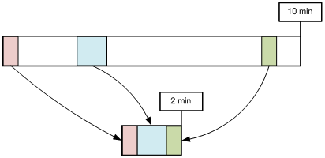

.. _media:

제 17 장 미디어
******************

.. note::

   - `[동영상 강좌]하자! STON Edge Server - Chapter 4. 실시간 이미지 처리 <https://youtu.be/Pdfe-HbtXVs?list=PLqvIfHb2IlKeZ-Eym_UPsp6hbpeF-a2gE>`_
   - `[동영상 강좌]하자! STON Edge Server - Chapter 5 동영상 전달 <https://youtu.be/YjOEVamhah4?list=PLqvIfHb2IlKeZ-Eym_UPsp6hbpeF-a2gE>`_

이 장에서는 미디어를 스마트하게 서비스하는 방법을 설명한다. 클라이언트 환경과 서비스의 다양 화와 콘텐츠를 다양한 형태로 가공하는 경우가 많다. 때문에 동일한 콘텐츠를 다양한 형태로 원래 서버에 존재하게된다. 이 방법은 처리 시간과 저장 공간의 낭비로 이어질뿐만 아니라 관리가 어렵다.

.. toctree::
   :maxdepth: 2

MP4 / M4A 헤더의 위치를 변경
====================================

일반적 MP4 포맷의 경우 인코딩 과정에서 헤더를 완성 할 수 없으므로 완료 후 파일의 끝에 붙인다. 헤더를 앞으로 이동하려면 다른 작업이 필요하다. 헤더가 계속되고있는 경우이를 지원하지 않는 플레이어에서 Pseudo-Streaming이 불가능하다. 헤더의 위치 변경으로 인해 Pseudo-Streaming을 쉽게 지원할 수있다.

헤더의 위치 변경은 전송 단계에서만 발생하면 텍스트의 모양을 변경하지 않는다. 다른 저장 공간을 사용할 수 없다. ::

   # server.xml - <Server><VHostDefault><Media>
   # vhosts.xml - <Vhosts><Vhost><Media>

   <UpfrontMP4Header>OFF</UpfrontMP4Header>
   <UpfrontM4AHeader>OFF</UpfrontM4AHeader>

-  ``<UpfrontMP4Header>``

   - ``OFF (기본)`` 아무것도하지 않는다.

   - ``ON`` 확장자가 .mp4에서 헤더가 계속되고있는 경우 헤더를 앞으로 옮겨 보냅니다.

-  ``<UpfrontM4AHeader>``

   - ``OFF (기본)`` 아무것도하지 않는다.

   - ``ON`` 확장자가 .m4a에서 헤더가 계속되고있는 경우 헤더를 앞으로 옮겨 보냅니다.

처음에 요구되는 콘텐츠의 헤더를 앞으로 이동해야 경우 헤더를 옮기는 데 필요한 부분을 우선으로 다운로드된다. 아주 똑똑한뿐만 아니라 고속으로 동작한다. 커튼 뒤에 복잡한 과정과 상관없이 클라이언트는 원래 헤더가 앞에있는 전체 파일을 서비스받을 수 있습니다.

.. note::

   분석 할 수 없거나 손상된 파일이면 원래의 모양 그대로 서비스된다.

.. _media-trimming:

Trimming
====================================

시간 값에 따라 필요한 구간을 추출한다. Trimming은 전송 단계에서만 발생하면 텍스트의 모양을 변경하지 않는다. 다른 저장 공간을 사용하지 않습니다. ::

   # server.xml - <Server><VHostDefault><Media>
   # vhosts.xml - <Vhosts><Vhost><Media>

   <MP4Trimming StartParam="start" EndParam="end" AllTracks="off">OFF</MP4Trimming>
   <M4ATrimming StartParam="start" EndParam="end" AllTracks="off">OFF</M4ATrimming>
   <MP3Trimming StartParam="start" EndParam="end">OFF</MP3Trimming>

-  ``<MP4Trimming>`` ``<MP3Trimming>`` ``<M4ATrimming>``

   - ``OFF (기본)`` 아무것도하지 않는다.

   - ``ON`` 확장자 (.mp4, .mp3, .m4a)가 일치하면 필요한 구간 만 서비스하도록 Trimming한다. Trimming 구간은 ``StartParam`` 특성과 ``EndParam`` 로 설정한다.

   - ``AllTracks`` 특성

     - ``OFF (기본)`` Audio / Video 트랙 만 Trimming한다. (Mod-H264 방식)

     - ``ON`` 모든 트랙을 Trimming한다. 사용 전에 반드시 플레이어의 호환성을 확인해야한다.

매개 변수는 클라이언트 QueryString을 통해 입력된다. 예를 들어, 10 분의 동영상 (/video.mp4)를 특정 구간 Trimming하려면 QueryString에 언제든지 (단위 : 초)을 지정한다 ::

   http://vod.wineosoft.co.kr/video.mp4                // 10 분 : 전체 영화
   http://vod.wineosoft.co.kr/video.mp4?end=60         // 1 분 : 처음부터 60 초 까지
   http://vod.wineosoft.co.kr/video.mp4?start=120      // 8 분 : 2 분 (120 초)부터 끝까지
   http://vod.wineosoft.co.kr/video.mp4?start=3&end=13 // 10 초 : 3 초에서 13 초까지

``StartParam`` 값이 ``EndParam`` 값보다 크면 구간이 지정되지 않은 것으로 판단한다. 이 기능은 HTTP Pseudo-Streaming에 구현 된 비디오 플레이어 Skip 기능을 위해 개발되었다. 따라서 Range 요청을 처리하도록 파일을 Offset에 따라 끄지 않고 정상적으로 재생되도록 키 프레임 및 시간을인지하고 구간을 추출한다.

클라이언트에 전달되는 파일은 다음의 그림과 같이 MP4 헤더가 다시 생성 된 완전한 형태의 MP4 파일이다.

.. figure:: img/conf_media_mp4trimming.png
   :align: center

   완전한 형태의 파일이 제공된다.

추출 된 구간은 별도의 파일로 인식되기 때문에 200 OK 응답된다. 따라서 다음과 같이 Range 헤더가 포함되어있는 경우, 추출 된 파일에서 Range를 계산하여 **206 Particial Content** 로 응답한다.

.. figure:: img/conf_media_mp4trimming_range.png
   :align: center

   일반적인 Range 요청과 같이 처리된다.

구간 추출 매개 변수가 QueryString 표현을 사용하기 때문에 자칫하면 :ref:`caching-policy-applyquerystring` 과 혼란 스러울 수있다.
``<ApplyQueryString>`` 의 설정이 ``ON`` 의 경우 클라이언트가 요청 된 URL의 QueryString이 모든 인식 ``StartParam`` 과 ``EndParam`` 는 제거된다. ::

   GET /video.mp4?start=30&end=100
   GET /video.mp4?tag=3277&start=30&end=100&date=20130726

예를 들어 위와 같이 ``StartParam`` 가 **start** 로 ``EndParam`` 가 **end** 에 입력 된 경우,이 값은 구간을 추출하는 데 사용되는 것만으로 Caching-Key를 생성하거나 원래 서버로 요청을 보내려면 삭제된다. 각각 다음과 같이 인식된다. ::

   GET /video.mp4
   GET /video.mp4?tag=3277&date=20130726

또한 QueryString 매개 변수는 확장 모듈과 CDN 솔루션에 따라 다를 수있다.

.. figure:: img/conf_media_mp4trimming_range.png
   :align: center

   JW Player에서 제공하는 Module / CDN 별 참고 자료

이외의 nginx의 `ngx_http_mp4_module <http://nginx.org/en/docs/http/ngx_http_mp4_module.html>`_ 와 lighttpd의 `Mod-H264-Streaming-Testing-Version2 <http://h264.code-shop.com/trac/wiki/Mod-H264-Streaming-Testing-Version2>`_ 도  모든 **start** 를 QueryString에 사용하고있다.

.. _media-multi-trimming:

Multi-Trimming
====================================

시간 값에 따라 여러 지정된 구간을 하나의 영상으로 추출한다.

   /video.mp4?trimming=0-30,210-270,525-555

구간의 지정 방법이 다를뿐 동작은 `Trimming`_ 과 같다. ::

   # server.xml - <Server><VHostDefault><Media>
   # vhosts.xml - <Vhosts><Vhost><Media>

   <MP4Trimming MultiParam="trimming" MaxRatio="50">OFF</MP4Trimming>
   <M4ATrimming MultiParam="trimming">OFF</M4ATrimming>

-  ``<MP4Trimming>`` ``<M4ATrimming>``

   - ``MultiParam (기본: "trimming")``
     로 설정된 이름을 QueryString Key로 사용하여 추출 구간을 지정한다. 하나의 구간은 "시작 시간 - 종료 시간"으로 표기하고 각 구간은 쉼표 (,)로 연결한다.

   - ``MaxRatio (기본: 50%)``
     Multi-Trimming 된 영상은 원본보다 ``MaxRatio (最大 100%)`` 의 비율 만까지 커질 수있다.
     ``MaxRatio`` 를 이동 구간은 무시된다.

예를 들어, 다음과 같이 호출하면 3 분의 영상이 생성된다. ::

   http://example.com/video.mp4?trimming=10-70,560-620,1245-1305

같은 영상을 반복하거나 이전 뒤 바뀐 영상을 만들 수있다. ::

   http://example.com/video.mp4?trimming=17-20,17-20,17-20,17-20
   http://example.com/video.mp4?trimming=1000-1200,500-623,1900-2000
   http://example.com/video.mp4?trimming=600-,400-600

구간 값을 지정하지 않으면 시작 또는 끝에 의미한다.

.. note::

   `Multi-Trimming`_ 는 `Trimming`_ 보다 우선한다. QueryString에 `Multi-Trimming`_ 키가 명시되어있는 경우 `Trimming`_ 키는 무시된다.

.. _media-hls:

MP4 HLS
====================================

MP4 파일을 HLS (HTTP Live Streaming) 서비스한다. 소스 서버는 더 이상 HLS 서비스를 위해 파일을 분할 보존 할 필요가 없다. MP4 파일의 헤더의 위치에 관계없이 다운로드와 동시에 실시간으로 .m3u8 / .ts 파일 변환 후 서비스이다.

..  note::

    MP4HLS는 Elementary Stream (Video 또는 Audio)를 변환하는 트랜스 코딩 (Transcoding)이 아니다. 따라서 HLS에 적합한 형식으로 인코딩 된 MP4 파일에만 원활한 단말기의 재생이 가능하다. 인코딩이 맞지 않는 경우는 화면이나 깨지거나 소리가 재생되지 않을 수 있습니다. 현재 (2014.2.20) Apple이 말하는 Video / Audio 인코딩 규격은 다음과 같다.

    What are the specifics of the video and audio formats supported?
    Although the protocol specification does not limit the video and audio formats, the current Apple implementation supports the following formats:

    [Video]
    H.264 Baseline Level 3.0, Baseline Level 3.1, Main Level 3.1, and High Profile Level 4.1.

    [Audio]
    HE-AAC or AAC-LC up to 48 kHz, stereo audio
    MP3 (MPEG-1 Audio Layer 3) 8 kHz to 48 kHz, stereo audio
    AC-3 (for Apple TV, in pass-through mode only)

    Note: iPad, iPhone 3G, and iPod touch (2nd generation and later) support H.264 Baseline 3.1. If your app runs on older versions of iPhone or iPod touch, however, you should use H.264 Baseline 3.0 for compatibility. If your content is intended solely for iPad, Apple TV, iPhone 4 and later, and Mac OS X computers, you should use Main Level 3.1.

기존 방식의 경우 Pseudo-Streaming와 HLS를 위해 다음과 같이 원본 파일이 각각 존재해야한다. 이러한 경우 STON도 원본 파일을 그대로 복제하여 고객에게 서비스한다. 하지만 재생 시간이 길수록 파생 파일은 많아 져 관리의 어려움이 증가한다.

.. figure:: img/conf_media_mp4hls1.png
   :align: center

   수고가 많은 HLS

``<MP4HLS>`` 은 원본 파일에서 HLS 서비스에 필요한 파일을 동적으로 생성한다.

.. figure:: img/conf_media_mp4hls2.png
   :align: center

   스마트 HLS

모든 .m3u8 / .ts 파일은 원본 파일에서 파생 된 다른 저장 공간을 소비하지 않는다. 서비스 바로 메모리에 임시로 생성 된 서비스되지 않으면 자동으로 없어진다. ::

   # server.xml - <Server><VHostDefault><Media>
   # vhosts.xml - <Vhosts><Vhost><Media>

   <MP4HLS Status="Inactive" Keyword="mp4hls">
      <Index Ver="3" Alternates="off">index.m3u8</Index>
      <Sequence>0</Sequence>
      <Duration>10</Duration>
      <AlternatesName>playlist.m3u8</AlternatesName>
   </MP4HLS>

-  ``<MP4HLS>``

   - ``Status (기본: Inactive)`` 의 값이 ``Active`` 인 경우에만 사용된다.

   - ``Keyword (기본: mp4hls)`` HLS 서비스 키워드

-  ``<Index> (기본: index.m3u8)`` HLS 인덱스 (.m3u8) 파일 이름

   - ``Ver (기본 3)`` 인덱스 파일의 버전. 3 인 경우, ``#EXT-X-VERSION:3`` 헤더가 명시되어 ``#EXTINF`` 시간 값이 소수점 셋째 자리까지 표시된다. 1의 경우 ``#EXT-X-VERSION`` 헤더없이 ``#EXTINF`` 시간 값이 정수 (반올림)로 표시된다.

   - ``Alternates (기본: OFF)`` Stream Alternates 사용할지 여부.

     .. figure:: img/hls_alternates_off.png
        :align: center

        OFF。 ``<Index>`` 에서 TS 목록을 서비스한다.

     .. figure:: img/hls_alternates_on.png
        :align: center

        ON。 ``<AlternatesName>`` 에서 TS 목록을 서비스한다.

-  ``<Sequence> (기본: 0)`` .ts 파일의 시작 번호. 이 수에 따라 순차적으로 증가한다.

-  ``<Duration> (기본: 10초)`` 의 MP4 HLS로 분할하는 기준 시간 (초)입니다. 분할의 기준은 Video / Audio의 KeyFrame있다. KeyFrame는 들쭉날쭉 할 수 있으므로 정확하게 분할되지 않는다. 만약 10 초 분할하려고 KeyFrame이 9 초 12 초의 경우 가까운 값 (9 초)을 선택한다.

-  ``<AlternatesName> (기본: playlist.m3u8)`` Stream Alternates 파일 이름. ::

      http://www.example.com/video.mp4/mp4hls/playlist.m3u8

서비스 주소는 다음과 같다 경우 해당 주소에 Pseudo-Streaming을 할 수있다. ::

    http://www.example.com/video.mp4

가상 호스트는 ``<MP4HLS>`` 에 정의 된 ``Keyword`` 문자열을 인식함으로써 HLS 서비스를 진행한다. 다음 URL을 호출하면 / video.mp4에서 index.m3u8 파일을 생성한다. ::

   http://www.example.com/video.mp4/mp4hls/index.m3u8

``Alternates`` 속성이 ON이면,  ``<Index>`` 파일은 ``<AlternatesName>`` 파일을 서비스한다. ::

   #EXTM3U
   #EXT-X-VERSION:3
   #EXT-X-STREAM-INF:PROGRAM-ID=1,BANDWIDTH=200000,RESOLUTION=720x480
   /video.mp4/mp4hls/playlist.m3u8

``#EXT-X-STREAM-INF`` 의 Bandwidth와 Resolution 영상을 분석하여 동적으로 제공한다.

.. note::

   Stream Alternates를 제공하지만, 현재의 버전에서는 index.m3u8는 항상 하나의 서브 인덱스 파일 (playlist.m3u8)만을 제공한다. 캐시의 입장에서는 video_1080.mp4과 video_720.mp4이 (인코딩 옵션이 다른) 같은 영상인지 알 수 없기 때문이다.

마지막으로 생성 된 .ts 목록 (버전 3)은 다음과 같다. ::

   #EXTM3U
   #EXT-X-TARGETDURATION:10
   #EXT-X-VERSION:3
   #EXT-X-MEDIA-SEQUENCE:0
   #EXTINF:11.637,
   /video.mp4/mp4hls/0.ts
   #EXTINF:10.092,
   /video.mp4/mp4hls/1.ts
   #EXTINF:10.112,
   /video.mp4/mp4hls/2.ts

   ... (중략)...

   #EXTINF:10.847,
   /video.mp4/mp4hls/161.ts
   #EXTINF:9.078,
   /video.mp4/mp4hls/162.ts
   #EXT-X-ENDLIST

분할은 3 가지 정책이 있습니다.

-  **KeyFrame 간격보다** ``<Duration>`` **의 설정이 큰 경우**
   KeyFrame이 3 초, ``<Duration>`` 가 20 초이면 20 초를 초과하지 KeyFrame의 배수 인 18 초에 분할된다.

-  **KeyFrame 간격** ``<Duration>`` **이 비슷한 경우**
   KeyFrame이 9 초,  ``<Duration>`` 가 10 초이면 10 초를 초과하지 KeyFrame의 배수 인 9 초 나뉜다.

-  **KeyFrame 간격이** ``<Duration>`` **설정보다 큰 경우**
   KeyFrame 단위로 분할된다.

다음 클라이언트 요청에 STON가 어떻게 작동 하는지를 이해합시다.。 ::

   GET /video.mp4/mp4hls/99.ts HTTP/1.1
   Range: bytes=0-512000
   Host: www.winesoft.co.kr

1.	``STON`` 첫 번째로드 (아무것도 캐쉬되어 있지 않다.)
#.	``Client`` HTTP Range 요구 (100 번째 파일의 첫 번째 500KB 요청)
#.	``STON`` /video.mp4 파일 캐시 개체 만들기
#.	``STON`` /video.mp4 파일의 분석을 위해 필요한 부분 만 원본 서버에서 다운로드
#.	``STON`` 100 번째 (99.ts) 파일 서비스를 위해 필요한 부분 만 원본 서버에서 다운로드
#.	``STON`` 100 번째 (99.ts) 파일을 만든 후 Range 서비스
#.	``STON`` 서비스가 완료되면 99.ts 파일 파괴

.. note::

   ``MP4Trimming`` 기능이 ``ON`` 이면, Trimming 된 MP4를 HLS로 변환 할 수있다. (HLS 이미지를 Trimming 할 수없는 .HLS MP4를 대신 MPEG2TS임을 명심하자.) 영상을 Trimming 후 HLS로 변환하기 위해 다음과 같이 표현하는 것이 자연이다. ::

      /video.mp4?start=0&end=60/mp4hls/index.m3u8

   작동에는 문제가 없지만 QueryString을 가장 뒤에 붙이는 HTTP 스펙에 어긋난다. 이를 보완하기 위해 다음과 같은 표현도 동작은 동일하다. ::

      /video.mp4/mp4hls/index.m3u8?start=0&end=60
      /video.mp4?start=0/mp4hls/index.m3u8?end=60

.. _media-mp3-hls:

MP3 HLS
====================================

MP3 파일을 HLS (HTTP Live Streaming) 서비스한다. ::

   # server.xml - <Server><VHostDefault><Media>
   # vhosts.xml - <Vhosts><Vhost><Media>

   <MP3HLS Status="Inactive" Keyword="mp3hls" SegmentType="TS">
      <Index Ver="3" Alternates="off">index.m3u8</Index>
      <Sequence>0</Sequence>
      <Duration>10</Duration>
      <AlternatesName>playlist.m3u8</AlternatesName>
   </MP3HLS>

모든 설정과 동작이 `MP4 HLS`_ 와 같은 더 Segement 형식을 선택할 수있다.

-  ``<MP3HLS>``

   - ``SegmentType (기본: TS)`` 소스 MP3 MPEG2-TS( ``TS`` )  또는 ``MP3`` 로 분할한다.

.. note::

   `MP4 HLS`_ 와 `MP3 HLS`_ 같은 ``Keyword`` 로 설정되어있는 경우 `MP3 HLS`_ 는 작동하지 않습니다.

.. _media-dims:

DIMS
====================================

DIMS (Dynamic Image Management System)는 원래의 이미지를 다양한 형태로 가공하는 기능이다.
`mod_dims <https://code.google.com/p/moddims/wiki/WebserviceApi>`_ 을 기반으로 확장 한 형태이다. 가공 형상은 모두 7 개 (optimize, crop, thumbnail, resize, format, quality, composite)이며, 이것을 조합 한 복합 가공이 가능하다.

.. figure:: img/dims.png
   :align: center

   다양한 동적 이미지 가공

이미지가 동적으로 생성 된 원본 이미지의 URL 뒤에 약속 된 키워드와 가공 옵션을 사용하여 호출합니다. 가공 된 이미지는 캐시 된 원본 서버의 이미지가 변하지 않는 이상, 다시 가공되지 않는다.

예를 들어, 원본 파일이 /img.jpg이라면 다음과 같은 형식으로 이미지를 가공 할 수있다. ( "12AB"는 약속 된 Keyword있다.) ::

   http://image.example.com/img.jpg    // 원본 이미지
   http://image.example.com/img.jpg/12AB/optimize
   http://image.example.com/img.jpg/12AB/resize/500x500/
   http://image.example.com/img.jpg/12AB/crop/400x400/
   http://image.example.com/img.jpg/12AB/composite/watermark1/

``<Dims>`` 은 별도로 설정하지 않으면 비활성화되어있다. ::

   # server.xml - <Server><VHostDefault><Options>
   # vhosts.xml - <Vhosts><Vhost><Options>

   <Dims Status="Active" Keyword="dims" MaxSourceSize="10" OnFailure="message" />

-  ``<Dims>``

   - ``Status`` DIMS 활성화 ( ``Active`` 또는 ``Inactive`` )
   - ``Keyword`` 소스와 DIMS 구분 키워드
   - ``MaxSourceSize (기본: 10MB)`` 변환을 가능하게하는 가장 큰 원본 이미지 크기 (단위 : MB)
   - ``OnFailure`` 이미지 변환 실패시 동작 방식

     - ``message (기본)`` 500 Internal Error로 응답한다. 본문에는 구체적인 실패의 이유를 명시한다.

       - ``The original file was not successfully downloaded.`` 원래 이미지를 완전히 다운로드 수 없었다.
       - ``The original file size is too large.`` 원래 이미지의 크기가 ``MaxSourceSize`` 이상 변환하지 않았다.
       - ``The original file loading failed.`` 원래 이미지 데이터를로드하지 않았다
       - ``Image converting failed or invalid DIMS command.`` 잘못된 명령 또는 지원되지 않는 이미지 등이 원인으로 변환하지 않았다.

     - ``redirect`` 원본 이미지의 주소에 302 Redirect한다.

최적화
-----------------------

최적화는 이미지 품질을 저하시키지 않고 이미지를 압축하는 과정이다. JPEG, JPEG-2000, Loseless-JPEG 이미지 만 지원이 가능하다. 이미 다른 도구 등을 사용하여 최적화 된 이미지는 더 이상 최적화되지 않는다.。 ::

   http://image.example.com/img.jpg/dims/optimize

최적화는 키워드 이외의 다른 옵션을 가지지 않는다. 따라서 다른 변환 조건과 함께 때 가장 뒤에 명시하는 것이 바람직하다. ::

   http://image.example.com/img.jpg/dims/resize/100x100/optimize

다른 모든 DIMS 기능이 시스템 자원을 많이 사용하지만, 그 중에서도 최적화가 가장 무거운 작업이다. 다음은 HitRatio이 0 % 상태에서 이미지 사이즈 별 성능 테스트 결과이다.

-  ``OS`` CentOS 6.2 (Linux version 2.6.32-220.el6.x86_64 (mockbuild@c6b18n3.bsys.dev.centos.org) (gcc version 4.4.6 20110731 (Red Hat 4.4.6-3) (GCC) ) #1 SMP Tue Dec 6 19:48:22 GMT 2011)
-  ``CPU`` `Intel(R) Xeon(R) CPU E3-1230 v3 @ 3.30GHz (8 processors) <http://www.cpubenchmark.net/cpu.php?cpu=Intel+Xeon+E3-1230+v3+%40+3.30GHz>`_
-  ``RAM`` 16GB
-  ``HDD`` SMC2108 SAS 275GB X 3EA

====== ======= ============= ======================= ================== ================
크기   처리량  응답 속도(ms)  클라이언트 트래픽(Mbps)  원래 트래픽(Mbps)  트래픽의 감소 비율(%)
====== ======= ============= ======================= ================== ================
16KB   720     19.32         46.32                   92.62              49.99
32KB   680     20.68         86.42                   165.08             47.65
64KB   285     50.16         80.67                   150.96             46.56
128KB  274     57.80         164.35                  276.52             40.56
256KB  210     80.74         99.42                   432.35             77.00
512KB  113     156.18        160.54                  436.04             63.18
1MB    20      981.07        90.62                   179.88             49.62
====== ======= ============= ======================= ================== ================

약 50 % 내외의 트래픽을 절감 률이 있기 때문에 매우 효과적이다. 다시 말하지만 최적화는 매우 무거운 작업이다. 표를 사용하여 알 수 있듯이, 이미지 크기가 가장 큰 변수가된다.

때문에 충분한 검토없이 서비스에 적용했다 그리고는 큰 바닥을 볼 수있다. 적절한 :ref:`adv_topics_req_hit_ratio` 가있는 상황이 바람직하지만, 그렇지 않은 경우에는 서비스의 규모에 따라 실제 CPU 리소스를 충분히 확보해야한다.

컷
-----------------------

왼쪽을 기준으로 원하는 영역 만의 이미지를 잘라 낸다. 영역은 **width x height{+-}x{+-}y {@} {!} {<} {>}** 으로 표현한다. 기본적으로 이미지의 가로와 세로의 최대 값을 사용한다. 이미지를 확대하거나 축소해도 화면 비율은 유지된다. 정확하게 지정된 크기로 이미지를 조정할 때 크기 뒤에 느낌표 (!)를 추가합니다.
**640X480!** 라는 표현은 정확하게 640x480 크기의 Thumbnail을 생성한다는 의미이다. 만약 가로 또는 세로 크기 만 지정하면 생략 된 값은 수평 / 수직 비율에 따라 자동으로 결정된다.

예를 들어, **/thumbnail/100/** 가로 폭에 맞게 세로 크기가 결정되고
**/thumbnail/x200/** 세로 크기에 맞게 가로 폭이 결정된다. 수평 / 수직 크기를 이미지 크기에 맞게 비율 (%)로 표현할 수있다. 이미지의 크기를 늘리려면 100보다 큰 값 (예 : 125 %)를 사용한다. 이미지의 크기를 줄이려면 100 미만의 비율을 사용한다. URL Encoding 규칙에 따라 % 문자 % 25으로 인코딩되는 것을 명심해야한다.

예를 들어, 50 %라는 표현은 50 %, 25로 인코딩된다. 다음은 width = 78 height = 110 크기의 Thumbnail을 생성하는 예이다. ::

   http://image.example.com/img.jpg/dims/thumbnail/78x110/

Resizing
-----------------------

이미지의 크기를 변경한다. 크기는 **width x height** 로 표현한다. 이미지가 변경 되어도 비율은 유지된다. 다음은 원본 이미지를 width = 200, height = 200 사이즈로 변경하는 예이다. ::

   http://image.example.com/img.jpg/dims/resize/200x200/

Format 변경
-----------------------

이미지 포맷을 변경한다. 지원되는 포맷은 "png", "jpg", "gif"이다. 다음은 JPG PNG로 변환하는 예이다. ::

   http://image.example.com/img.jpg/dims/format/png/

품질 변경
-----------------------

화질을 조절한다. 이 기능은 전송되는 이미지의 용량을 줄일 수있어 효과적이다. 범위는 0에서 100까지이다. 다음은 이미지의 품질을 25 %로 조절하는 예이다. ::

   http://image.example.com/img.jpg/dims/quality/25/

합성
-----------------------

두 이미지를 합성한다. 위의 기능과는 다른 방법으로 합성 조건은 미리 설정되어 있어야한다. 주로 워터 마크 효과를 내기 위해 사용된다. ::

   # server.xml - <Server><VHostDefault><Options>
   # vhosts.xml - <Vhosts><Vhost><Options>

   <Dims Status="Active" Keyword="dims" port="8500">
      <Composite Name="water1" File="/img/small.jpg" />
      <Composite Name="water2" File="/img/medium.jpg" Gravity="se" Geometry="+0+0" Dissolve="50" />
      <Composite Name="water_ratio" File="/img/wmark_s.png" Gravity="s" Geometry="+0+15%" Dissolve="100" />
   </Dims>

-  ``<Composite>``

    이미지 합성 조건을 설정한다. 속성에 따라 달라 다른 값을 가지지 않는다.

    -  ``Name`` 호출되는 이름을 지정합니다. '/'문자를 입력 할 수 없다. URL의 "/ composite /"다음에 위치한다.

    -  ``File`` 합성하는 이미지 파일의 경로를 지정한다.

    -  ``Gravity (기본: c)`` 합성하는 위치는 왼쪽에서 9 점 (nw, n, ne, w, c, e, sw, s se)가 존재한다.

       .. figure:: img/conf_dims2.png
          :align: center

          Gavity 기준점

    -  ``Geometry (기본: +0+0)`` ``Gravity`` 기준으로 합성 할 이미지의 위치를 설정한다. {+ -} x {+ -} y. 빨간은 Gravity 특성에 따라 + 0 + 0을 의미하는 기준점 + x + y의 값이 커질수록 이미지에 배치된다. 녹색 화살표는 + x, 보라색 화살표는 + y가 증가하는 방향이다. -xy를 사용하면 대상 이미지의 외부에 위치하게되며, 결과 이미지는 보이지 않는다. 이 특성은 다소 복잡하게 보이지만, 이미지의 크기를 자동으로 계산하여 배치하기 때문에 일관성있는 결과를 얻을 수있어 효과적이다. 또한 + x % + y %처럼 % 옵션을 제공 비율로 배치 할 수도있다.

    -  ``Dissolve (기본: 50)`` 합성 이미지의 투명도 (0-100).

``<Composite>`` 을 설정하면 ``Name`` 속성을 사용하여 이미지를 합성 할 수있다. ::

    http://image.example.com/img.jpg/dims/composite/water1/

원본 이미지의 조건 판단
-----------------------

원본 이미지의 조건에 따라 동적으로 가공 옵션을 다르게 적용 할 수있다. 예를 들어 1024 X 768 이하의 이미지 품질을 50 %로 떨어 뜨리고 그 이상의 이미지는 1024 X 768 크기 변환하려면 다음과 같이 ``<ByOriginal>`` 를 설정한다. ::

   # server.xml - <Server><VHostDefault><Options>
   # vhosts.xml - <Vhosts><Vhost><Options>

   <Dims Status="Active" Keyword="dims" port="8500">
      <ByOriginal Name="size1">
         <Condition Width="1024" Height="768">/quality/50/</Condition>
         <Condition>/resize/1024x768/</Condition>
      </ByOriginal>
   </Dims>

-  ``<ByOriginal>``
   ``Name`` 속성에서 호출합니다. 서브 다양한 조건 ``<Condition>`` 를 설정한다.

-  ``<Condition>``
   조건에 만족하는 경우, 설정된 변환을 수행한다.

   - ``Width`` 폭이 설정 값보다 작은 경우에 적용된다.
   - ``Height`` 세로의 길이가 설정 값보다 작은 경우에 적용된다.
조건을 설정하지 않으면 원본 이미지의 크기에 관계없이 변환된다.

``<Condition>`` 은 지정된 순서로 적용된다. 따라서 작은 이미지의 조건을 먼저 배치해야한다. 다음과 같이 호출합니다. ::

   http://image.example.com/img.jpg/dims/byoriginal/size1/

別다른 예로서, 이미지 크기에 따라 다른 ``<Composite>`` 조건을 줄 수있다. 이러한 경우에는 다음과 같이 미리 정의 된 ``<Composite>`` 의 ``Name`` 으로 설정한다. ::

   # server.xml - <Server><VHostDefault><Options>
   # vhosts.xml - <Vhosts><Vhost><Options>

   <Dims Status="Active" Keyword="dims" port="8500">
      <Composite Name="water1" File="/img/small.jpg" />
      <Composite Name="water2" File="/img/medium.jpg" Gravity="se" Geometry="+0+0" Dissolve="50" />
      <Composite Name="water3" File="/img/big.jpg" Gravity="se" Geometry="+10+10" Dissolve="50" />
      <ByOriginal Name="size_water">
         <Condition Width="400">/composite/water1/</Condition>
         <Condition Width="800">/composite/water2/</Condition>
         <Condition>/composite/water3/</Condition>
      </ByOriginal>
   </Dims>

다음과 같이 호출하면 원래 이미지의 크기에 따라 합성이 적용된다. ::

   http://image.example.com/img.jpg/dims/byoriginal/size_water/

.. _media-dims-anigif:

Animated GIF
-----------------------

Animated GIF에도 모든 DIMS 변환이 동일하게 적용된다. 처리 순서는 다음과 같다.

1. Animated GIF를 별도의 이미지로 분해한다.
2. 각각의 이미지를 변환한다.
3. 변환 된 이미지를 Animated GIF에 결합한다.

결합 된 이미지가 많을수록 처리 비용, 서비스 품질이 저하 될 수있다. 이러한 경우 첫 번째 사진에만 변환하도록 설정하면 처리 비용을 낮출 수있다. ::

   # server.xml - <Server><VHostDefault><Options>
   # vhosts.xml - <Vhosts><Vhost><Options>

   <Dims FirstFrameOnly="OFF" />

-  ``FirstFrameOnly (기본: OFF)`` ON이면 Animated GIF의 첫 장면 만 변환한다.

다음과 같이 URL을 호출 할 때 ``FirstFrameOnly`` 옵션을 명시 적으로 지정할 수있다. ::

   http://image.example.com/img.jpg/dims/firstframeonly/on/resize/200x200/
   http://image.example.com/img.jpg/dims/firstframeonly/off/resize/200x200/

위와 같이 URL에 명시 적으로 지정된 경우 설정보다 우선된다.

.. note::

   ``limit`` 명령을 사용하여 Animated GIF의 프레임 수를 조절할 수있다. ::
      
      http://image.example.com/img.jpg/dims/limit/3
      http://image.example.com/img.jpg/dims/limit/3/resize/200x200

기타
-----------------------

이상의 기본적인 기능을 결합하여 복합적인 이미지 처리를 할 수있다. 예를 들어 Thumbnail 생성 (78x110) 포맷을 JPG에서 PNG로 변환하면 품질 50 % 이상의 옵션을 한번의 호출로 수행 할 수있다. ::

   http://image.example.com/img.jpg/dims/thumbnail/78x110/format/png/quality/50/

DIMS URL을 이용하여 이미지 가공이 이루어진다. 따라서 URL에 영향을 미치는 다른 옵션을 위해 바람직하지 않은 결과가되지 않도록주의해야한다.

-  :ref:`caching-policy-applyquerystring` 이 ``OFF`` 이면 키워드 이전 QueryString이 무시된다. ::

      http://image.example.com/img.jpg?session=5234&type=37/dims/resize/200x200/

   위와 같은 호출이 설정이 ``ON`` 이면, 입력 된 URL을두고 인식 OFF이면, 다음과 같이 인식된다. ::

      http://image.example.com/img.jpg/dims/resize/200x200/

-  :ref:`caching-policy-casesensitive` 가 ``OFF`` 이면 모든 URL을 소문자로 변환하여 처리한다. 따라서 DIMS 키워드에 대문자가 포함되어있는 경우 키워드를 인식하지 않습니다. 항상 키워드는 소문자로 사용하는 것이 좋다.
