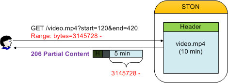

.. _media:

第17章 メディア
******************

.. note::

   - `[動画講座]みよう！ STON Edge Server - Chapter 4.リアルタイム画像処理 <https://youtu.be/Pdfe-HbtXVs?list=PLqvIfHb2IlKeZ-Eym_UPsp6hbpeF-a2gE>`_
   - `[動画講座]みよう！ STON Edge Server - Chapter 5動画配信 <https://youtu.be/YjOEVamhah4?list=PLqvIfHb2IlKeZ-Eym_UPsp6hbpeF-a2gE>`_

この章では、メディアをスマートにサービスする方法について説明する。 クライアント環境とサービスの多様化とコンテンツを様々な形に加工する場合が多い。 ため、同じコンテンツがさまざまな形で元のサーバーに存在することになる。 この方法は、処理時間とストレージ容量の無駄につながるだけでなく、管理が難しい。

.. toctree::
   :maxdepth: 2

MP4 / M4Aヘッダの位置を変更
====================================

通常MP4形式の場合エンコード処理中にヘッダを完成することができないため、完了後にファイルの末尾に付ける。 ヘッダを今後移動するには、別の処理が必要である。 ヘッダが続いている場合、これをサポートしていないプレーヤーでPseudo-Streamingが不可能である。 ヘッダの位置の変更により、Pseudo-Streamingを簡単にサポートすることができる。

ヘッダの位置の変更は、送信段階でのみ発生するだけでテキストの形を変更しない。 別のストレージスペースを使用することもない。 ::

   # server.xml - <Server><VHostDefault><Media>
   # vhosts.xml - <Vhosts><Vhost><Media>

   <UpfrontMP4Header>OFF</UpfrontMP4Header>
   <UpfrontM4AHeader>OFF</UpfrontM4AHeader>

-  ``<UpfrontMP4Header>``

   - ``OFF (基本)`` 何もしない。

   - ``ON`` 拡張子が.mp4でヘッダが続いている場合、ヘッダーを今後移し送信する。

-  ``<UpfrontM4AHeader>``

   - ``OFF (基本)`` 何もしない。

   - ``ON`` 拡張子が.m4aでヘッダが続いている場合、ヘッダーを今後移し送信する。

最初に要求されているコンテンツのヘッダを前に移動する必要が場合、ヘッダを移すために必要な部分を優先的にダウンロードされる。 非常にスマートなだけでなく高速に動作する。 カーテンの後ろの複雑なプロセスとは関係なく、クライアントはもともとヘッダが前にある完全なファイルをサービス受ける。

.. note::

   分析することができない場合、または壊れたファイルであれば、元の形のままサービスされる。

.. _media-trimming:

Trimming
====================================

時間値に基づいて必要な区間を抽出する。 Trimmingは、送信段階でのみ発生するだけでテキストの形を変更しない。 別のストレージスペースを使用していない。 ::

   # server.xml - <Server><VHostDefault><Media>
   # vhosts.xml - <Vhosts><Vhost><Media>

   <MP4Trimming StartParam="start" EndParam="end" AllTracks="off">OFF</MP4Trimming>
   <M4ATrimming StartParam="start" EndParam="end" AllTracks="off">OFF</M4ATrimming>
   <MP3Trimming StartParam="start" EndParam="end">OFF</MP3Trimming>

-  ``<MP4Trimming>`` ``<MP3Trimming>`` ``<M4ATrimming>``

   - ``OFF (基本)`` 何もしない。

   - ``ON`` 拡張子（.mp4、.mp3、.m4a）が一致すると、必要な区間だけサービスするようにTrimmingする。 Trimming区間は ``StartParam`` 属性と ``EndParam`` に設定する。

   - ``AllTracks`` 属性

     - ``OFF (基本)`` Audio/Video トラックのみTrimmingする。 （Mod-H264方式）

     - ``ON`` すべてのトラックをTrimmingする。 使用前に必ずプレーヤーの互換性を確認しなければならない。

パラメータは、クライアントQueryStringを介して入力される。 たとえば、10分の動画（/video.mp4）を特定区間だけTrimmingしたい場合はQueryStringに任意の時点（単位：秒）を指定する。 ::

   http://vod.wineosoft.co.kr/video.mp4                // 10分：全ムービー
   http://vod.wineosoft.co.kr/video.mp4?end=60         // 1分：最初から60秒まで
   http://vod.wineosoft.co.kr/video.mp4?start=120      // 8分：2分（120秒）から最後まで
   http://vod.wineosoft.co.kr/video.mp4?start=3&end=13 // 10秒：3秒から13秒まで

``StartParam`` 値が ``EndParam`` 値よりも大きい場合、区間が指定されていないものと判断する。 この機能は、HTTP Pseudo-Streamingに実装されたビデオプレーヤーのSkip機能のために開発された。 したがって、Range要求を処理するようにファイルをOffsetに基づいて切らずに正常に再生されるように、キーフレームと時間を認知して区間を抽出する。

クライアントに配信されるファイルは、次の図のようにMP4ヘッダが再生成された完全な形のMP4ファイルである。

.. figure:: img/conf_media_mp4trimming.png
   :align: center

   完全な形のファイルが提供される。

抽出された区間は、別のファイルとして認識されるため、200 OKで応答される。 したがって、次のようにRangeヘッダが記載されている場合、抽出されたファイルからRangeを計算して **206 Particial Content** で応答する。

   一般的なRangeリクエストのように処理される。

区間抽出パラメータがQueryString表現を使用するため、ややもすると :ref:`caching-policy-applyquerystring` と混乱することができる。
``<ApplyQueryString>`` の設定が ``ON`` の場合、クライアントが要求されたURLのQueryStringがすべて認識され ``StartParam`` と ``EndParam`` は除去される。 ::

   GET /video.mp4?start=30&end=100
   GET /video.mp4?tag=3277&start=30&end=100&date=20130726

例えば上記のように ``StartParam`` が **start** で ``EndParam`` が **end** で入力された場合、この値は、区間を抽出するのに使われるだけでCaching-Keyを生成したり、元のサーバーに要求を送信する場合は削除される。 それぞれ次のように認識される。 ::

   GET /video.mp4
   GET /video.mp4?tag=3277&date=20130726

また、QueryStringパラメータは、拡張モジュールやCDNソリューションによって異なることができる。

   JW Playerで提供しているModule / CDN星参考資料

以外のnginxの `ngx_http_mp4_module <http://nginx.org/en/docs/http/ngx_http_mp4_module.html>`_ と、lighttpdの `Mod-H264-Streaming-Testing-Version2 <http://h264.code-shop.com/trac/wiki/Mod-H264-Streaming-Testing-Version2>`_ もすべて **start** をQueryStringに使用している。

.. _media-multi-trimming:

Multi-Trimming
====================================

時間値に基づいて、複数の指定された区間を一つの映像として抽出する。

.. figure:: img/conf_media_multitrimming.png
   :align: center

   /video.mp4?trimming=0-30,210-270,525-555

区間の指定方法が違うだけで動作は `Trimming`_ と同じである。 ::

   # server.xml - <Server><VHostDefault><Media>
   # vhosts.xml - <Vhosts><Vhost><Media>

   <MP4Trimming MultiParam="trimming" MaxRatio="50">OFF</MP4Trimming>
   <M4ATrimming MultiParam="trimming">OFF</M4ATrimming>

-  ``<MP4Trimming>`` ``<M4ATrimming>``

   - ``MultiParam (基本: "trimming")``
     に設定され名前をQueryString Keyとして使用して抽出区間を指定する。 一つの区間は "開始時刻 - 終了時刻" と表記し、各区間はコンマ（、）で接続する。

   - ``MaxRatio (基本: 50%)``
    Multi-Trimmingされた映像は、オリジナルよりも ``MaxRatio (最大 100%)`` の割合だけまで大きくなることができる。
     ``MaxRatio`` を移る区間は無視される。

例えば、次のように呼び出すと、3分の映像が生成される。 ::

   http://example.com/video.mp4?trimming=10-70,560-620,1245-1305

同じ映像を繰り返したり、前の背部変わった映像を作成することもできる。 ::

   http://example.com/video.mp4?trimming=17-20,17-20,17-20,17-20
   http://example.com/video.mp4?trimming=1000-1200,500-623,1900-2000
   http://example.com/video.mp4?trimming=600-,400-600

区間値を指定しない場合先頭または最後に意味する。

.. note::

   `Multi-Trimming`_ は `Trimming`_ より優先する。 QueryStringに `Multi-Trimming`_ キーが明示されている場合は `Trimming`_ キーは無視される。

.. _media-hls:

MP4 HLS
====================================

MP4ファイルをHLS（HTTP Live Streaming）にサービスする。 ソースサーバーは、もはやHLSサービスのためにファイルを分割保存する必要がない。 MP4ファイルのヘッダの位置に関係なく、ダウンロードと同時にリアルタイムで.m3u8 / .tsファイルの変換後のサービスである。

..  note::

    MP4HLSはElementary Stream（VideoまたはAudio）を変換するトランスコーディング（Transcoding）ではない。 したがって、HLSに適した形式でエンコードされたMP4ファイルに限って円滑な端末の再生が可能である。 エンコーディングが適合しない場合は、画面や割れたり音が再生されないことがあります。 現在（2014.2.20）Appleの言っているVideo / Audioエンコード規格は、次のとおりである。

    What are the specifics of the video and audio formats supported?
    Although the protocol specification does not limit the video and audio formats, the current Apple implementation supports the following formats:

    [Video]
    H.264 Baseline Level 3.0, Baseline Level 3.1, Main Level 3.1, and High Profile Level 4.1.

    [Audio]
    HE-AAC or AAC-LC up to 48 kHz, stereo audio
    MP3 (MPEG-1 Audio Layer 3) 8 kHz to 48 kHz, stereo audio
    AC-3 (for Apple TV, in pass-through mode only)

    Note: iPad, iPhone 3G, and iPod touch (2nd generation and later) support H.264 Baseline 3.1. If your app runs on older versions of iPhone or iPod touch, however, you should use H.264 Baseline 3.0 for compatibility. If your content is intended solely for iPad, Apple TV, iPhone 4 and later, and Mac OS X computers, you should use Main Level 3.1.

従来方式の場合、Pseudo-StreamingとHLSのために、以下のように、元のファイルがそれぞれ存在しなければならない。 このような場合、STONも、元のファイルをそのまま複製して、顧客にサービスする。 しかし、再生時間が長いほど、派生ファイルは多くなり、管理の難しさは増加する。

.. figure:: img/conf_media_mp4hls1.png
   :align: center

   手間が多くHLS

``<MP4HLS>`` は、元のファイルからHLSサービスに必要なファイルを動的に生成する。

.. figure:: img/conf_media_mp4hls2.png
   :align: center

   スマートHLS

すべての.m3u8 / .tsファイルは、元のファイルから派生し、別のストレージスペースを消費しない。 サービスすぐにメモリに一時的に生成されサービスされない場合、自動的になくなる。 ::

   # server.xml - <Server><VHostDefault><Media>
   # vhosts.xml - <Vhosts><Vhost><Media>

   <MP4HLS Status="Inactive" Keyword="mp4hls">
      <Index Ver="3" Alternates="off">index.m3u8</Index>
      <Sequence>0</Sequence>
      <Duration>10</Duration>
      <AlternatesName>playlist.m3u8</AlternatesName>
   </MP4HLS>

-  ``<MP4HLS>``

   - ``Status (基本: Inactive)`` の値が ``Active`` の場合にのみ有効になる。

   - ``Keyword (基本: mp4hls)`` HLSサービスキーワード

-  ``<Index> (基本: index.m3u8)`` HLSインデックス（.m3u8）ファイル名

   - ``Ver (基本 3)`` インデックスファイルのバージョン。 3である場合、 ``#EXT-X-VERSION:3`` ヘッダが明示されて ``#EXTINF`` の時間値が小数点3桁目まで表示される。 1の場合、 ``#EXT-X-VERSION`` ヘッダがなく、 ``#EXTINF`` の時間値が整数（丸め）に表示される。

   - ``Alternates (基本: OFF)`` Stream Alternates 使用するかどうか。

     .. figure:: img/hls_alternates_off.png
        :align: center

        OFF。 ``<Index>`` でTSリストをサービスする。

     .. figure:: img/hls_alternates_on.png
        :align: center

        ON。 ``<AlternatesName>`` でTSリストをサービスする。

-  ``<Sequence> (基本: 0)`` .tsファイルの開始番号。 このことに基づいて順次増加する。

-  ``<Duration> (基本: 10秒)`` のMP4 HLSに分割する基準時間（秒）。 分割の基準は、Video / AudioのKeyFrameある。 KeyFrameはギザギザすることができますので、正確に分割されない。 もし10秒分割しようとしてKeyFrameが9秒と12秒の場合は近い値（9秒）を選択する。

-  ``<AlternatesName> (基本: playlist.m3u8)`` Stream Alternates ファイル名。 ::

      http://www.example.com/video.mp4/mp4hls/playlist.m3u8

サービスアドレスは次のとおりである場合は、そのアドレスにPseudo-Streamingを行うことができる。 ::

    http://www.example.com/video.mp4

仮想ホストは ``<MP4HLS>`` に定義された ``Keyword`` 文字列を認識することにより、HLSサービスを進行する。 次のURLが呼び出されると、/video.mp4からindex.m3u8ファイルを生成する。 ::

   http://www.example.com/video.mp4/mp4hls/index.m3u8

``Alternates`` 属性がONであれば、 ``<Index>`` ファイルは、 ``<AlternatesName>`` ファイルをサービスする。 ::

   #EXTM3U
   #EXT-X-VERSION:3
   #EXT-X-STREAM-INF:PROGRAM-ID=1,BANDWIDTH=200000,RESOLUTION=720x480
   /video.mp4/mp4hls/playlist.m3u8

``#EXT-X-STREAM-INF`` のBandwidthとResolutionは映像を分析して、動的に提供する。

.. note::

   Stream Alternatesを提供しますが、現在のバージョンではindex.m3u8は常に一つのサブインデックスファイル（playlist.m3u8）だけを提供する。 キャッシュの立場では、video_1080.mp4とvideo_720.mp4が（エンコードオプションが、他の）のような映像なのか知ることができないからである。

最終的に生成された.tsリスト（バージョン3）は、次のとおりである。 ::

   #EXTM3U
   #EXT-X-TARGETDURATION:10
   #EXT-X-VERSION:3
   #EXT-X-MEDIA-SEQUENCE:0
   #EXTINF:11.637,
   /video.mp4/mp4hls/0.ts
   #EXTINF:10.092,
   /video.mp4/mp4hls/1.ts
   #EXTINF:10.112,
   /video.mp4/mp4hls/2.ts

   ... (中略)...

   #EXTINF:10.847,
   /video.mp4/mp4hls/161.ts
   #EXTINF:9.078,
   /video.mp4/mp4hls/162.ts
   #EXT-X-ENDLIST

分割には、3つのポリシーがあります。

-  **KeyFrame 間隔よりも** ``<Duration>`` **の設定が大きい場合**
   KeyFrameが3秒、 ``<Duration>`` が20秒であれば、20秒を超えないKeyFrameの倍数である18秒に分割される。

-  **KeyFrame 間隔と ** ``<Duration>`` **が似ている場合**
   KeyFrameが9秒、 ``<Duration>`` が10秒であれば、10秒を超えないKeyFrameの倍数である9秒分けられる。

-  **KeyFrame 間隔が** ``<Duration>`` **設定よりも大きい場合**
   KeyFrame単位に分割される。

次のクライアント要求に対してSTONがどのように動作するのかを理解しましょう。 ::

   GET /video.mp4/mp4hls/99.ts HTTP/1.1
   Range: bytes=0-512000
   Host: www.winesoft.co.kr

1.	``STON`` 最初のロード (何もキャッシュされていない。)
#.	``Client`` HTTP Range要求（100番目のファイルの最初の500KBリクエスト）
#.	``STON`` /video.mp4 ファイルのキャッシュオブジェクトの作成
#.	``STON`` /video.mp4 ファイルの分析のために必要な部分だけを元のサーバーからダウンロード
#.	``STON`` 100番目(99.ts)ファイルサービスのために必要な部分だけを元のサーバーからダウンロード
#.	``STON`` 100番目(99.ts)ファイルを作成した後Rangeサービス
#.	``STON`` サービスが完了すると、99.tsファイル破壊

.. note::

   ``MP4Trimming`` 機能が ``ON`` であれば、TrimmingされたMP4をHLSに変換することができる。 （HLS画像をTrimmingすることができない。HLSのMP4ではなく、MPEG2TSであることに注意しよう。）映像をTrimmingした後、HLSに変換するため、次のように表現するのが自然である。 ::

      /video.mp4?start=0&end=60/mp4hls/index.m3u8

   動作には問題ありませんがQueryStringを一番後ろに付けるHTTP仕様に反する。 これを補完するために、次のような表現も動作は同じである。 ::

      /video.mp4/mp4hls/index.m3u8?start=0&end=60
      /video.mp4?start=0/mp4hls/index.m3u8?end=60

.. _media-mp3-hls:

MP3 HLS
====================================

MP3ファイルをHLS（HTTP Live Streaming）にサービスする。 ::

   # server.xml - <Server><VHostDefault><Media>
   # vhosts.xml - <Vhosts><Vhost><Media>

   <MP3HLS Status="Inactive" Keyword="mp3hls" SegmentType="TS">
      <Index Ver="3" Alternates="off">index.m3u8</Index>
      <Sequence>0</Sequence>
      <Duration>10</Duration>
      <AlternatesName>playlist.m3u8</AlternatesName>
   </MP3HLS>

すべての設定と動作が `MP4 HLS`_ と同じでさらにSegement形式を選択することができる。

-  ``<MP3HLS>``

   - ``SegmentType (基本: TS)`` ソースのMP3 MPEG2-TS( ``TS`` ) または ``MP3`` に分割する。

.. note::

   `MP4 HLS`_ と `MP3 HLS`_ が同じ ``Keyword`` に設定されている場合、 `MP3 HLS`_ は動作しない。

.. _media-dims:

DIMS
====================================

DIMS(Dynamic Image Management System)は、元の画像を様々な形に加工する機能である。
`mod_dims <https://code.google.com/p/moddims/wiki/WebserviceApi>`_ をベースに拡張した形態である。 加工形状は、すべての7つの（optimize、crop、thumbnail、resize、format、quality、composite）であり、これを組み合わせた複合加工が可能である。

.. figure:: img/dims.png
   :align: center

   様々な動的な画像加工

画像は、動的に生成され、元の画像のURLの後ろに約束されたキーワードと加工オプションを付けて呼び出します。 加工された画像は、キャッシュされて、元のサーバーのイメージが変わらない以上、再加工されない。

たとえば、元のファイルが/img.jpgなら、次のような形式で画像を加工することができる。
("12AB"は、約束されたKeywordある。) ::

   http://image.example.com/img.jpg    // 元の 画像
   http://image.example.com/img.jpg/12AB/optimize
   http://image.example.com/img.jpg/12AB/resize/500x500/
   http://image.example.com/img.jpg/12AB/crop/400x400/
   http://image.example.com/img.jpg/12AB/composite/watermark1/

``<Dims>`` は別に設定しなければ、すべて無効にされている。 ::

   # server.xml - <Server><VHostDefault><Options>
   # vhosts.xml - <Vhosts><Vhost><Options>

   <Dims Status="Active" Keyword="dims" MaxSourceSize="10" OnFailure="message" />

-  ``<Dims>``

   - ``Status`` DIMS有効 ( ``Active`` または ``Inactive`` )
   - ``Keyword`` ソースとDIMSを区別するキーワード
   - ``MaxSourceSize (基本: 10MB)`` 変換を可能にする最大元の画像サイズ（単位：MB）
   - ``OnFailure`` 画像変換失敗時の動作方式

     - ``message (基本)`` 500 Internal Errorで応答する。 本文には、具体的な失敗の理由を明示する。

       - ``The original file was not successfully downloaded.`` 元の画像を完全にダウンロードできなかった。
       - ``The original file size is too large.`` 元画像のサイズが ``MaxSourceSize`` を超え変換していなかった。
       - ``The original file loading failed.`` 元の画像データを読み込まなかった。
       - ``Image converting failed or invalid DIMS command.`` 正しくない命令またはサポートされていない画像などが原因で変換していなかった。

     - ``redirect`` 元の画像のアドレスに302 Redirectする。

最適化
-----------------------

最適化とは、イメージの品質を低下させずに、画像を圧縮する過程である。 JPEG、JPEG-2000、Loseless-JPEG画像のみをサポートが可能である。 既に他のツールなどを使用して最適化された画像は、もはや最適化されない。 ::

   http://image.example.com/img.jpg/dims/optimize

最適化は、キーワード以外の別のオプションを持たない。 したがって、他の変換条件と組み合わせたときに一番後ろ明示した方が望ましい。 ::

   http://image.example.com/img.jpg/dims/resize/100x100/optimize

他のすべてのDIMSの機能がシステムリソースを大量に使用しますが、その中でも最適化が最も重い作業である。 以下は、HitRatioが0％の状態で、画像サイズ別パフォーマンステストの結果である。

-  ``OS`` CentOS 6.2 (Linux version 2.6.32-220.el6.x86_64 (mockbuild@c6b18n3.bsys.dev.centos.org) (gcc version 4.4.6 20110731 (Red Hat 4.4.6-3) (GCC) ) #1 SMP Tue Dec 6 19:48:22 GMT 2011)
-  ``CPU`` `Intel(R) Xeon(R) CPU E3-1230 v3 @ 3.30GHz (8 processors) <http://www.cpubenchmark.net/cpu.php?cpu=Intel+Xeon+E3-1230+v3+%40+3.30GHz>`_
-  ``RAM`` 16GB
-  ``HDD`` SMC2108 SAS 275GB X 3EA

====== ======= ============= ======================= ================== ================
サイズ   スループット  応答速度(ms)  クライアントのトラフィック(Mbps) 元トラフィック(Mbps)  トラフィックの削減率(%)
====== ======= ============= ======================= ================== ================
16KB   720     19.32         46.32                   92.62              49.99
32KB   680     20.68         86.42                   165.08             47.65
64KB   285     50.16         80.67                   150.96             46.56
128KB  274     57.80         164.35                  276.52             40.56
256KB  210     80.74         99.42                   432.35             77.00
512KB  113     156.18        160.54                  436.04             63.18
1MB    20      981.07        90.62                   179.88             49.62
====== ======= ============= ======================= ================== ================

約50％内外のトラフィックを削減率があるので非常に有効である。 もう一度言うが最適化は非常に重い作業である。 表を使用して分かるように、画像サイズが最大の変数となる。

ため、十分な検討なしにサービスに適用たあとは大きな床を見ることができる。 適切な :ref:`adv_topics_req_hit_ratio` がある状況が望ましいが、そうでない場合はサービスの規模に合わせて、物理的なCPUリソースを十分に確保しなければならない。

カット
-----------------------

左上を基準にしたい領域だけの画像を切り取る。 領域は、 **width x height{+-}x{+-}y {@} {!} {<} {>}** で表現する。 基本的には画像の横と縦の最大値を使用する。 画像を拡大または縮小しても、アスペクト比は維持される。 正確に指定したサイズで画像を調整するときは、サイズの後ろに感嘆符（！）を追加します。
**640X480!** という表現は正確に640x480サイズのThumbnailを生成するという意味である。 もし、水平方向または垂直方向のサイズのみ指定した場合、省略された値は、水平/垂直比によって自動的に決定される。

例えば、 **/thumbnail/100/** は横幅に合わせて縦サイズが決定され、
**/thumbnail/x200/** は、縦サイズに合わせて横幅が決定される。 水平/垂直サイズを画像のサイズに合わせて割合（％）で表現することができる。 画像のサイズを増やすには、100よりも大きい値（例えば、125％）を使用する。 画像のサイズを小さくするには、100未満の割合を使用する。 URL Encodingルールに基づいて％の文字が％25にエンコードされることを覚えておかなければならない。

例えば、50％という表現は、50％、25でエンコードされる。 以下は、width = 78、height = 110サイズのThumbnailを生成する例である。 ::

   http://image.example.com/img.jpg/dims/thumbnail/78x110/

Resizing
-----------------------

画像のサイズを変更する。 サイズは **width x height** で表現する。 画像は変更されても比率は維持される。 以下は、元の画像をwidth = 200、height = 200サイズに変更する例である。 ::

   http://image.example.com/img.jpg/dims/resize/200x200/

Format 変更
-----------------------

画像フォーマットを変更する。 サポートされるフォーマットは、 "png", "jpg", "gif" である。 以下は、JPGをPNGへ変換する例である。 ::

   http://image.example.com/img.jpg/dims/format/png/

品質変更
-----------------------

画質を調節する。 この機能は、送信される画像の容量を減らすことができて有効である。 有効範囲は0から100までだ。 次は、画像の品質を25％に調節する例である。 ::

   http://image.example.com/img.jpg/dims/quality/25/

合成
-----------------------

二つの画像を合成する。 前述の機能とは別の方法で合成条件は、あらかじめ設定されてなければならない。 主にウォーターマーク効果を出すために使用される。 ::

   # server.xml - <Server><VHostDefault><Options>
   # vhosts.xml - <Vhosts><Vhost><Options>

   <Dims Status="Active" Keyword="dims" port="8500">
      <Composite Name="water1" File="/img/small.jpg" />
      <Composite Name="water2" File="/img/medium.jpg" Gravity="se" Geometry="+0+0" Dissolve="50" />
      <Composite Name="water_ratio" File="/img/wmark_s.png" Gravity="s" Geometry="+0+15%" Dissolve="100" />
   </Dims>

-  ``<Composite>``

    画像合成条件を設定する。 属性によって決まり、別の値を持たない。

    -  ``Name`` 呼び出される名前を指定します。 '/'文字は入力できない。 URLの "/composite/" の後に位置する。

    -  ``File`` 合成する画像ファイルのパスを指定する。

    -  ``Gravity (基本: c)`` 合成する位置は、左上から9つのポイント（nw、n、ne、w、c、e、sw、s、se）が存在する。

       .. figure:: img/conf_dims2.png
          :align: center

          Gavity基準点

    -  ``Geometry (基本: +0+0)`` ``Gravity`` 基準で合成する画像の位置を設定する。
       {+-}x{+-}y. 赤丸はGravity属性に基づいて +0+0が意味する基準点に+ x + yの値が大きくなるほど画像の中に配置される。 緑の矢印は、+ x、紫の矢印は+ yが増加する方向である。 -xyを使用すると、対象画像の外側に位置するようにされ、結果の画像は見られない。 この属性は、多少複雑に見えますが、画像のサイズを自動的に計算して配置するので、一貫性のある結果を得ることができて有効である。 また、+ x％+ y％のように％オプションを与え割合で配置することもできる。

    -  ``Dissolve (基本: 50)`` 合成する画像の透明度（0〜100）。

``<Composite>`` を設定した場合 ``Name`` プロパティを使用して画像を合成することができる。 ::

    http://image.example.com/img.jpg/dims/composite/water1/

元の画像の条件判断
-----------------------

원元の画像の条件に応じて動的に加工オプションを別の方法で適用することができる。 たとえば1024 X 768以下の画像は、品質を50％に落とし、それ以上の画像は、1024 X 768にサイズ変換をするには、次のように ``<ByOriginal>`` を設定する。 ::

   # server.xml - <Server><VHostDefault><Options>
   # vhosts.xml - <Vhosts><Vhost><Options>

   <Dims Status="Active" Keyword="dims" port="8500">
      <ByOriginal Name="size1">
         <Condition Width="1024" Height="768">/quality/50/</Condition>
         <Condition>/resize/1024x768/</Condition>
      </ByOriginal>
   </Dims>

-  ``<ByOriginal>``
   ``Name`` 属性で呼び出します。 サブさまざまな条件の ``<Condition>`` を設定する。

-  ``<Condition>``
   条件に満足している場合、設定された変換を実行する。

   - ``Width`` 幅が設定値よりも小さい場合に適用される。
   - ``Height`` 縦の長さが設定値よりも小さい場合に適用される。
条件を設定しないと、元の画像のサイズに関係なく、変換される。

``<Condition>`` は指定された順序で適用される。 したがって、小さな画像の条件を最初に配置しなければならない。 次のように呼び出します。 ::

   http://image.example.com/img.jpg/dims/byoriginal/size1/

別の例として、画像サイズに応じて、他の ``<Composite>`` 条件を与えることができる。 このような場合は、次のように事前に定義された ``<Composite>`` の ``Name`` に設定する。 ::

   # server.xml - <Server><VHostDefault><Options>
   # vhosts.xml - <Vhosts><Vhost><Options>

   <Dims Status="Active" Keyword="dims" port="8500">
      <Composite Name="water1" File="/img/small.jpg" />
      <Composite Name="water2" File="/img/medium.jpg" Gravity="se" Geometry="+0+0" Dissolve="50" />
      <Composite Name="water3" File="/img/big.jpg" Gravity="se" Geometry="+10+10" Dissolve="50" />
      <ByOriginal Name="size_water">
         <Condition Width="400">/composite/water1/</Condition>
         <Condition Width="800">/composite/water2/</Condition>
         <Condition>/composite/water3/</Condition>
      </ByOriginal>
   </Dims>

次のように呼び出すと、元の画像のサイズに応じて、合成が適用される。 ::

   http://image.example.com/img.jpg/dims/byoriginal/size_water/

.. _media-dims-anigif:

Animated GIF
-----------------------

Animated GIFにもすべてのDIMS変換が同様に適用される。 処理順序は次のとおりである。

1. Animated GIFを別途のイメージに分解する。
2. それぞれの画像を変換する。
3. 変換された画像をAnimated GIFに結合する。

結合された画像が多いほど処理コストが高く、サービスの品質が低下することができる。 このような場合、最初の画像にのみ変換するように設定すると、処理コストを下げることができる。 ::

   # server.xml - <Server><VHostDefault><Options>
   # vhosts.xml - <Vhosts><Vhost><Options>

   <Dims FirstFrameOnly="OFF" />

-  ``FirstFrameOnly (基本: OFF)`` ONの場合Animated GIFの最初のシーンだけを変換する。

次のようにURLを呼び出すときに ``FirstFrameOnly`` オプションを明示的に指定することができる。 ::

   http://image.example.com/img.jpg/dims/firstframeonly/on/resize/200x200/
   http://image.example.com/img.jpg/dims/firstframeonly/off/resize/200x200/

上記のように、URLに明示的に指定されている場合、設定よりも優先される。

.. note::

   ``limit`` コマンドを使用してAnimated GIFのフレーム数を調節することができる。 ::
      
      http://image.example.com/img.jpg/dims/limit/3
      http://image.example.com/img.jpg/dims/limit/3/resize/200x200

その他
-----------------------

以上の基本的な機能を組み合わせて、複合的なイメージ処理を行うことができる。 たとえばThumbnail生成（78x110）は、フォーマットをJPGからPNGに変換すると、品質の50％以上のオプションを一度の呼び出しで実行することができる。 ::

   http://image.example.com/img.jpg/dims/thumbnail/78x110/format/png/quality/50/

DIMSは、URLを利用して、画像加工が行われる。 したがって、URLに影響を与える他のオプションのために望ましくない結果が得られないように注意しなければならない。

-  :ref:`caching-policy-applyquerystring` が ``OFF`` であれば、キーワード前のQueryStringが無視される。 ::

      http://image.example.com/img.jpg?session=5234&type=37/dims/resize/200x200/

   上記のような呼び出しに、この設定が ``ON`` であれば、入力されたURLのまま認識されOFFであれば、次のように認識される。 ::

      http://image.example.com/img.jpg/dims/resize/200x200/

-  :ref:`caching-policy-casesensitive` が ``OFF`` であれば、すべてのURLを小文字に変換して処理する。 したがって、DIMSキーワードに大文字が含まれている場合、キーワードを認識していない。 常にキーワードは小文字で使用するのがよい。
