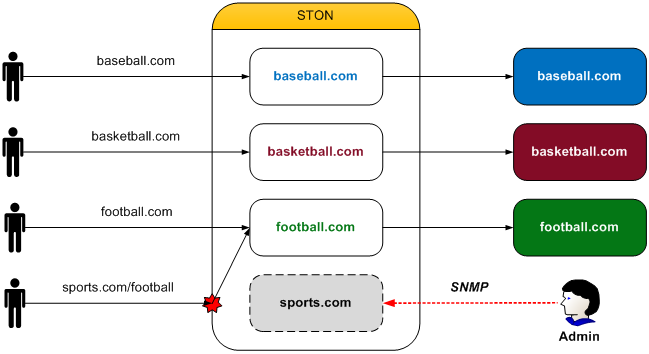

.. _monitoring_stats:

제 10 장 모니터링 및 통계
******************

이 장에서는 모니터링과 통계에 대해 설명한다. 모니터링 및 통계는 용도에 따라 다른 이해되는 경우가 많다. 그러나 서비스는 숫자로 이야기한다는 관점에서 두 사람은 동일하다.

여기에서 가장 중요한 요소는 실시간 성이다. 5 분 길다. 실시간으로 서비스 상태의 변화를 볼 수 있어야한다. 많은 정책이 적용과 동시에 효과를 내는지 즉시 알 수 있어야한다. 모든 통계는 1 초 단위로 수집되며 최소 단위가된다.

모든 통계는 가상 호스트에서 개별적으로 수집 될뿐만 아니라 실시간 (1 초) 5 분 평균으로 제공된다. 고객이 통계를보다 쉽게 ​​분석, 가공 할 수 있도록 JSON과 XML 형식으로 제공한다. ::

    http://127.0.0.1:10040/monitoring/realtime?type=[JSON 또는 XML]
    http://127.0.0.1:10040/monitoring/average?type=[JSON 또는 XML]

-  ``realtime``
   1 초 전에 서비스 상태를 제공한다.

-  ``average``
   5 분 단위의 통계 정보를 제공한다.

.. toctree::
   :maxdepth: 2

수집 범위
====================================

통계의 수집 범위를 설정한다. ::

   # server.xml - <Server><VHostDefault>
   # vhosts.xml - <Vhosts><Vhost>

   <Stats>
      <DirDepth>0</DirDepth>
      <DirDepthAccum>OFF</DirDepthAccum>
      <HttpsTraffic>OFF</HttpsTraffic>
      <ClientLocal>OFF</ClientLocal>
      <OriginLocal>OFF</OriginLocal>
   </Stats>

-  ``<DirDepth> (기본: 0)``

   디렉토리 별 통계를 수집하고있다. 0으로 설정된 경우, 모든 통계를 루트 (/) 디렉토리에 수집한다. 1로 설정하면 통계는 첫 Depth 디렉토리마다 수집된다.

   .. note:

      값의 제한은 없지만 수만 개 이상의 디렉토리 통계를 수집 할 경우 자칫 메모리 문제를 일으킬 수있다.

-  ``<DirDepthAccum>``

   디렉토리 별 통계를 수집 할 때 부모 디렉토리 통계 합산 여부를 설정한다.
   ``<DirDepth>`` 가 0이면이 설정은 무시된다.

   - ``OFF (기본)`` 상위 디렉토리로 통계를 합산하지 않는다.

   - ``ON`` 상위 디렉토리로 통계를 합산한다.

   예를 들어, ``<DirDepth>`` 가 2이며, 모든 디렉토리에 똑같이 10 정도의 트래픽이 발생하는 것으로 가정한다.
   ``<DirDepthAccum>`` 가 ``OFF`` 이면, 왼쪽 그림과 같이 트래픽이 발생하는 디렉토리별로 통계가 수집된다.
   ``ON`` 이면, 오른쪽 그림과 같이 하위 디렉토리의 모든 통계가 부모 디렉토리에 누적된다.

   .. figure:: img/stats_dirdepth.jpg
      :align: center

      부모 디렉토리의 누적 통계

   예를 들어, / img 디렉토리 하위 디렉토리의 트래픽과 자신의 트래픽을 더한 30의 통계에 있고이 트래픽은 부모 디렉토리에 포함된다.

-  ``<HttpsTraffic>``

   - ``OFF (기본)`` HTTPS 트래픽을 SSL 통계 만 수집합니다.

   - ``ON`` HTTPS 트래픽을 SSL 또는 HTTP를 통계 수집합니다.

   기본적으로 SSL 층을 통과하면 다른 SSL 통계 수집한다. HTTPS의 경우 상위 프로토콜에서 HTTP를 통해 처리되기 때문에보다 세밀한 통계 수집이 가능하다. 그러나 SSL 통계 및 HTTP 통계 모두에 중복 통계의 수집하므로 HTTP 통계 만 신뢰하는 것을 권장한다.

-  ``<ClientLocal>``

   Loopback 클라이언트와 STON 구간의 트래픽 통계를 집계한다.

   - ``OFF (기본)`` 집계하지 않는다.

   - ``ON`` 집계한다.

-  ``<OriginLocal>``

   STON 구간과 Loopback 소스 서버 구간의 트래픽 통계를 집계한다.

   - ``OFF (기본)`` 집계하지 않는다.

   - ``ON`` 집계한다.

호스트 종합 통계
====================================

호스트 통계는 가장 상위 개념의 통계에 서비스하는 모든 가상 호스트의 통계를 종합한다. 등의 통계를 JSON과 XML 형식으로 제공한다. ::

   {                                            <Host
     "Host":                                      Version="2.0.0"
     {                                            Name="localhost"
       "Version":"2.0.0",                         State="Healthy"
       "Name":"localhost",                        Uptime="155986"
       "State":"Healthy",                         OriginSession="32"
       "Uptime":155996,                           OriginActiveSession="20"
       "OriginSession":33,                        OriginInbound="1140741"
       "OriginActiveSession":20,                  OriginOutbound="10059"
       "OriginInbound":688177,                    OriginReqCount="42"
       "OriginOutbound":14184,                    OriginResTotalCount="42"
       "OriginReqCount":62,                       OriginResTotalTimeRes="5071"
       "OriginResTotalCount":62,                  OriginResTotalTimeComplete="10288"
       "OriginResTotalTimeRes":2375,              OriginRes2xxCount="19"
       "OriginResTotalTimeComplete":2509,         OriginRes2xxTimeRes="9989"
       "OriginRes2xxCount":54,                    OriginRes2xxTimeComplete="21521"
       "OriginRes2xxTimeRes":2327,                OriginRes3xxCount="23"
       "OriginRes2xxTimeComplete":2481,           OriginRes3xxTimeRes="1008"
       "OriginRes3xxCount":8,                     OriginRes3xxTimeComplete="1008"
       "OriginRes3xxTimeRes":2700,                OriginRes4xxCount="0"
       "OriginRes3xxTimeComplete":2700,           OriginRes4xxTimeRes="0"
       "OriginRes4xxCount":0,                     OriginRes4xxTimeComplete="0"
       "OriginRes4xxTimeRes":0,                   OriginRes5xxCount="0"
       "OriginRes4xxTimeComplete":0,              OriginRes5xxTimeRes="0"
       "OriginRes5xxCount":0,                     OriginRes5xxTimeComplete="0"
       "OriginRes5xxTimeRes":0,                   ClientSession="165"
       "OriginRes5xxTimeComplete":0,              ClientActiveSession="80"
       "ClientSession":155,                       ClientInbound="14792"
       "ClientActiveSession":80                   ClientOutbound="1981700"
       "ClientInbound":35748,                     ClientReqCount="64"
       "ClientOutbound":972906,                   ClientResTotalCount="64"
       "ClientReqCount":152,                      ClientResTotalTimeRes="5535"
       "ClientResTotalCount":152,                 ClientResTotalTimeComplete="6840"
       "ClientResTotalTimeRes":1411,              ClientRes2xxCount="44"
       "ClientResTotalTimeComplete":1479,         ClientRes2xxTimeRes="8050"
       "ClientRes2xxCount":93,                    ClientRes2xxTimeComplete="9943"
       "ClientRes2xxTimeRes":2305,                ClientRes3xxCount="20"
       "ClientRes2xxTimeComplete":2409,           ClientRes3xxTimeRes="5"
       "ClientRes3xxCount":59,                    ClientRes3xxTimeComplete="15"
       "ClientRes3xxTimeRes":3,                   ClientRes4xxCount="0"
       "ClientRes3xxTimeComplete":13,             ClientRes4xxTimeRes="0"
       "ClientRes4xxCount":0,                     ClientRes4xxTimeComplete="0"
       "ClientRes4xxTimeRes":0,                   ClientRes5xxCount="0"
       "ClientRes4xxTimeComplete":0,              ClientRes5xxTimeRes="0"
       "ClientRes5xxCount":0,                     ClientRes5xxTimeComplete="0"
       "ClientRes5xxTimeRes":0,                   RequestHitRatio="6923"
       "ClientRes5xxTimeComplete":0,              ByteHitRatio="4243">
       "RequestHitRatio":6387,                    <HttpCountSum
       "ByteHitRatio":2926,                         OriginReqCount="0"
       "HttpCountSum" :                             OriginResTotalCount="0"
       {                                            OriginRes2xxCount="0"
         "OriginReqCount" : 0,                      OriginRes3xxCount="0"
         "OriginResTotalCount" : 0,                 OriginRes4xxCount="0"
         "OriginRes2xxCount" : 0,                   OriginRes5xxCount="0"
         "OriginRes3xxCount" : 0,                   ClientReqCount="0"
         "OriginRes4xxCount" : 0,                   ClientResTotalCount="0"
         "OriginRes5xxCount" : 0,                   ClientRes2xxCount="0"
         "ClientReqCount" : 0,                      ClientRes3xxCount="0"
         "ClientResTotalCount" : 0,                 ClientRes4xxCount="0"
         "ClientRes2xxCount" : 0,                   ClientRes5xxCount="0"/>
         "ClientRes3xxCount" : 0,                 <HttpRequestHitSum
         "ClientRes4xxCount" : 0,                   TCP_NONE="0"
         "ClientRes5xxCount" : 0                    TCP_HIT="0"
       },                                           TCP_IMS_HIT="0"
       "HttpRequestHitSum" :                        TCP_REFRESH_HIT="0"
       {                                            TCP_REF_FAIL_HIT="0"
         "TCP_NONE" : 0,                            TCP_NEGATIVE_HIT="0"
         "TCP_HIT" : 0,                             TCP_REDIRECT_HIT="0"
         "TCP_IMS_HIT" : 0,                         TCP_MISS="0"
         "TCP_REFRESH_HIT" : 0,                     TCP_REFRESH_MISS="0"
         "TCP_REF_FAIL_HIT" : 0,                    TCP_CLIENT_REFRESH_MISS="0"
         "TCP_NEGATIVE_HIT" : 0,                    TCP_DENIED="0"
         "TCP_REDIRECT_HIT" : 0,                    TCP_ERROR="0"/>
         "TCP_MISS" : 0,                          <FileSystem>
         "TCP_REFRESH_MISS" : 0,                    <RequestHitRatio>0</RequestHitRatio>
         "TCP_CLIENT_REFRESH_MISS" : 0,             <ByteHitRatio>0</ByteHitRatio>
         "TCP_DENIED" : 0,                          <Outbound>0</Outbound>
         "TCP_ERROR" : 0                            <Session>0</Session>
       },                                         </FileSystem>
       "FileSystem":                              <System> ... </System>
       {                                          <VirtualHost> ... </VirtualHost>
         "RequestHitRatio":0,                     <VirtualHost> ... </VirtualHost>
         "ByteHitRatio":0,                        <VirtualHost> ... </VirtualHost>
         "Outbound":0,                            <View> ... </View>
         "Session":0                              <View> ... </View>
       },                                       </Host>
       "System":{ ... },
       "VirtualHost": [ ... ]
       "View": [ ... ]
     }
   }

-  ``Version`` STON 버전
-  ``Name`` 호스트 이름입니다. 설정하지 않으면 시스템의 이름을 나타내고있다.
-  ``State`` 서비스의 상태. (Healthy = 정상 서비스, Inactive = 라이센스 비활성화, Emergency)
-  ``Uptime (단위: 초)`` 서비스 실행 시간
-  ``OriginSession`` 원래 세션 수
-  ``OriginActiveSession`` 전송중인 소스 세션 수
-  ``OriginInbound (단위: Bytes, 평균)`` 원본 서버에서받은 금액
-  ``OriginReqCount (평균)`` 원래 서버로 전송되는 요청 수
-  ``OriginOutbound (단위: Bytes, 평균)`` 원래 서버로 전송 량
-  ``OriginResTotalCount (평균)`` 전 서버의 응답 횟수
-  ``OriginResTotalTimeRes (단위: 0.01ms, 평균)`` 전 서버의 응답 시간 (HTTP 요청 전송 ~HTTP 응답의 첫 번째 수신)
-  ``OriginResTotalTimeComplete (단위: 0.01ms, 평균)`` 원본 서버 HTTP 트랜잭션의 완료 시간 (HTTP 요청 전송 ~HTTP 응답 완료)
-  ``OriginRes2xxCount (평균)`` 원본 서버 2xx 응답 횟수
-  ``OriginRes2xxTimeRes (단위: 0.01ms, 평균)`` 원본 서버 2xx 응답 시간
-  ``OriginRes2xxTimeComplete (단위: 0.01ms, 평균)`` 원본 서버 2xx 트랜잭션의 완료 시간
-  ``OriginRes3xxCount (평균)`` 원본 서버 3xx 응답 횟수
-  ``OriginRes3xxTimeRes (단위: 0.01ms, 평균)`` 원본 서버 3xx 응답 시간
-  ``OriginRes3xxTimeComplete (단위: 0.01ms, 평균)`` 원본 서버 3xx 트랜잭션의 완료 시간
-  ``OriginRes4xxCount (평균)`` 원본 서버 4xx 응답 횟수
-  ``OriginRes4xxTimeRes (단위: 0.01ms, 평균)`` 원본 서버 4xx 응답 시간
-  ``OriginRes4xxTimeComplete (단위: 0.01ms, 평균)`` 원본 서버 4xx 트랜잭션의 완료 시간
-  ``OriginRes5xxCount (평균)`` 원본 서버 5xx 응답 횟수
-  ``OriginRes5xxTimeRes (단위: 0.01ms, 평균)`` 원본 서버 5xx 응답 시간
-  ``OriginRes5xxTimeComplete (단위: 0.01ms, 평균)`` 원본 서버 5xx 트랜잭션의 완료 시간
-  ``ClientSession`` 클라이언트 세션 수
-  ``ClientActiveSession`` 전송하는 클라이언트 세션 수
-  ``ClientInbound (단위: Bytes, 평균)`` 클라이언트로부터받은 금액
-  ``ClientOutbound (단위: Bytes, 평균)`` 클라이언트로 전송 량
-  ``ClientReqCount (평균)`` 클라이언트가 전송 한 요청 수
-  ``ClientResTotalCount (평균)`` 클라이언트의 응답 횟수
-  ``ClientResTotalTimeRes (단위: 0.01ms, 평균)`` 클라이언트의 응답 시간 (HTTP 요청을 수신 ~HTTP 응답 전송)
-  ``ClientResTotalTimeComplete (단위: 0.01ms, 평균)`` 클라이언트 HTTP 트랜잭션의 완료 시간 (HTTP 요청을 수신 ~HTTP 응답 완료)
-  ``ClientRes2xxCount (평균)`` 클라이언트 2xx 응답 횟수
-  ``ClientRes2xxTimeRes (단위: 0.01ms, 평균)`` 클라이언트 2xx 응답 시간
-  ``ClientRes2xxTimeComplete (단위: 0.01ms, 평균)`` 클라이언트 2xx 트랜잭션의 완료 시간
-  ``ClientRes3xxCount (평균)`` 클라이언트 3xx 응답 횟수
-  ``ClientRes3xxTimeRes (단위: 0.01ms, 평균)`` 클라이언트 3xx 응답 시간
-  ``ClientRes3xxTimeComplete (単位: 0.01ms, 평균)`` 클라이언트 3xx 트랜잭션의 완료 시간
-  ``ClientRes4xxCount (평균)`` 클라이언트 4xx 응답 횟수
-  ``ClientRes4xxTimeRes (단위: 0.01ms, 평균)`` 클라이언트 4xx 응답 시간
-  ``ClientRes4xxTimeComplete (단위: 0.01ms, 평균)`` 클라이언트 4xx 트랜잭션의 완료 시간
-  ``ClientRes5xxCount (평균)`` 클라이언트 5xx 응답 횟수
-  ``ClientRes5xxTimeRes (단위: 0.01ms, 평균)`` 클라이언트 5xx 응답 시간
-  ``ClientRes5xxTimeComplete (단위: 0.01ms, 평균)`` 클라이언트 5xx 트랜잭션의 완료 시간
-  ``RequestHitRatio (단위: 0.01%, 평균)`` Hit 율. 캐시 개체가 생성되고, 그 객체가 초기화되는 경우 Hit있다. 반대로 캐시 개체가 없거나 해당 개체가 원본 서버에서 초기화되지 않은 경우 Hit로 치지 않는다. 응답 코드와 Hit 율은 관련이 없다.

   .. figure:: img/stat_filesystem1.png
      :align: center

      HTTP와 File I / O는 가상 호스트를 공유한다.

   Apache를 사용하여 액세스되는 File I / O RequestHitRatio은 0 %가된다. 그러나 HTTP Server의 경우, File I / O에 의해 캐시 된 파일이 서비스되기 때문에 100 % RequestHitRatio을 가진다. ByteHitRatio의 경우 원래 Inbound 대비 Http outbound, File I / O outbound에 각각 계산된다.

-  ``ByteHitRatio (단위: 0.01%, 평균)`` 원래 서버에 비해 클라이언트 전송 속도. ::

      (클라이언트 Outbound - 소스 서버 Inbound) / 클라이언트 Outbound

   원본 서버가 훨씬 빠른 속도를 가지고 있는지, 클라이언트 세션이 즉시 종료 된 경우, 부가된다.

-  ``FileSystem`` 독립 FileSystem 통계에 다른 통계 수치에 수집되지 않는다.

   - ``RequestHitRatio (단위: 0.01%, 평균)`` File I / O를 사용했다 Hit 율
   - ``ByteHitRatio (단위: 0.01%, 평균)`` 원래 서버에 비해 File I / O 속도
   - ``Outbound (단위: Bytes, 평균)`` File I / O 서비스 데이터 크기
   - ``Session (평균)`` File I / O 작업 중의 Thread 수

.. note::

   5 분의 통계 만 제공되는 상품입니다.

   -  ``HttpCountSum`` HTTP 트랜잭션의 총 수
   -  ``HttpRequestHitSum`` 캐시 HIT 결과

System 통계
====================================

시스템과 글로벌 자원 통계를 JSON과 XML 형식으로 제공한다. ::

    "System":                                   <System>
    {                                             <CPU
      "CPU":                                          Kernel="689"
      {                                               User="1316"
        "Kernel":689,                                 Idle="7993"
        "User":1316,                                  ProcKernel="570"
        "Idle":7993,                                  ProcUser="1216"
        "ProcKernel":570,                             Nice="0"
        "ProcUser":1216,                              IOWait="52"
        "Nice":0,                                     IRQ="10"
        "IOWait":52,                                  SoftIRQ="12"
        "IRQ":10,                                     Steal="0" />
        "SoftIRQ":12,                             <Mem Free="5914644" STON="9785800"/>
        "Steal":0                                 <Storage>
      },                                            <Disk
      "Mem":                                        	Path="/cache1"
      {                                             	Status="Normal"
        "Free":5914644,                             	Read="23"
        "STON":9785800                              	ReadMerged="0"
      },                                            	ReadSectors="344"
      "Storage":                                    	ReadTime="117"
      {                                             	Write="24"
        "Disk":                                     	WriteMerged="93"
        [                                           	WriteSectors="936"
          {                                         	WriteTime="256"
            "Path":"/cache1",                       	IOProgress="0"
            "Status":"Normal",                      	IOTime="173"
            "Read":23,                              	IOWeightedTime="373"/>
            "ReadMerged":0,                         <Disk
            "ReadSectors":344,                      	Path="/cache2"
            "ReadTime":117,                         	Status="Normal"
            "Write":24,                             	Read="27"
            "WriteMerged":93,                       	ReadMerged="1"
            "WriteSectors":936,                     	ReadSectors="488"
            "WriteTime":256,                        	ReadTime="144"
            "IOProgress":0,                         	Write="24"
            "IOTime":173,                           	WriteMerged="86"
            "IOWeightedTime":373                    	WriteSectors="880"
          },                                        	WriteTime="254"
          {                                         	IOProgress="0"
            "Path":"/cache2",                       	IOTime="189"
            "Status":"Normal",                      	IOWeightedTime="380"/>
            "Read":27,                            </Storage>
            "ReadMerged":1,                       <ServerSocket
            "ReadSectors":488,                    	Total="42"
            "ReadTime":144,                       	Established="2"
            "Write":24,                            	Accepted="1"
            "WriteMerged":86,                      	Closed="0"/>
            "WriteSectors":880,                   <ClientSocket
            "WriteTime":254,                       	Total="1"
            "IOProgress":0,                        	Established="0"
            "IOTime":189,                          	Connected="0"
            "IOWeightedTime":380                   	Closed="0"/>
          }                                       <TCPSocket
        ]                                          	Established="30"
      },                                           	Timewait="2"
      "ServerSocket":                              	Orphan="0"
      {                                            	Alloc="0"
        "Total":42,                                	Mem="20"/>
        "Established":1,                          <EQ>0</EQ>
        "Accepted":0,                             <RQ>1000000</RQ>
        "Closed":0                                <WaitingFiles2Write>0</WaitingFiles2Write>
      },                                          <ServiceAccess Allow="60" Deny="2"/>
      "ClientSocket":                             <SystemLoadAverage Min1="0" Min5="0" Min15="0"/>
      {                                           <URLRewrite>57</URLRewrite>
        "Total":1,                              </System>
        "Established":0,
        "Connected":0,
        "Closed":0
      },
      "TCPSocket":
      {
        "Established":30,
        "Timewait":2,
        "Orphan":0,
        "Alloc":0,
        "Mem":20
      },
      "EQ":0,
      "RQ":1000000,
      "WaitingFiles2Write":0,
      "ServiceAccess":{"Allow":60, "Deny":2}
      "SystemLoadAverage":
      {
        "Min1":0,
        "Min5":0,
        "Min15":0
      },
      "URLRewrite":57
    }

-  ``CPU (단위: 0.01%)`` CPU 사용률. 전체 CPU 사용률은 Kernel + User 계산해야한다.

   - ``Kernel`` CPU (Kernel)의 사용량
   - ``User`` CPU (User)의 사용량
   - ``Idle`` 사용되지 않는 CPU 양
   - ``ProcKernel`` STON가 사용하는 CPU (Kernel)의 사용량
   - ``ProcUser`` STON가 사용하는 CPU (User)의 사용량
   - ``Nice`` niced processes executing in user mode
   - ``IOWait`` waiting for I/O to complete
   - ``IRQ`` servicing interrupts
   - ``SoftIRQ`` servicing softirqs
   - ``Steal`` involuntary wait

-  ``Mem (단위: Bytes)`` 메모리 사용량

   - ``Free`` 시스템 Free 메모리 크기
   - ``STON`` STON가 사용하는 메모리 크기

-  ``Disk`` 디스크 성능 지표

   - ``Path`` 디스크 경로
   - ``Status`` 디스크의 상태 (Normal : 정상 동작, Invalid : 장애 이전 함수 Unmounted : 관리자가 Unmount 함)
   - ``Read`` 읽기 성공 횟수
   - ``ReadMerged`` 로드가 병합 된 횟수
   - ``ReadSectors`` 읽은 섹터
   - ``ReadTime (단위: ms)`` 읽기 소요 시간
   - ``Write`` 쓰기 성공 횟수
   - ``WriteMerged`` 쓰기가 병합 된 횟수
   - ``WriteSectors`` 쓰는 섹터
   - ``WriteTime (단위: ms)`` 쓰기 소요 시간
   - ``IOProgress`` 진행 IO 수
   - ``IOTime (단위: ms)`` IO 소요 시간
   - ``IOWeightedTime (단위: ms)`` IO 소요 시간 (가중치)

-  ``ServerSocket`` 서버 소켓 (클라이언트와 STON 구간)에 대해

   - ``Total`` 전체 서버 소켓
   - ``Established`` 연결된 상태의 서버 소켓
   - ``Accepted`` 새로운 연결된 서버 소켓 수
   - ``Closed`` 연결이 종료 된 서버 소켓

-  ``ClientSocket`` 클라이언트 소켓 (STON와 원본 서버 구간)에 대해

   - ``Total`` 전체 클라이언트 소켓
   - ``Established`` 연결된 상태의 클라이언트 소켓
   - ``Connected`` 새로운 연결된 클라이언트 소켓
   - ``Closed`` 연결이 종료 된 클라이언트 소켓

-  ``TCPSocket`` 체제 (OS)가 제공하는 TCP 상태 정보

   - ``Established`` Established 상태의 TCP 연결 수
   - ``Timewait`` TIME_WAIT 상태의 TCP 연결 수
   - ``Orphan`` 아직 file handle에 attach되어 있지 않은 TCP 연결
   - ``Alloc`` 할당 된 TCP 연결
   - ``Mem`` (undocumented)

-  ``EQ`` STON Framework에서 아직 처리되지 않은 Event 수
-  ``RQ`` 최근 서비스 된 내용을 참조 큐에 저장된 Event 수
-  ``WaitingFiles2Write`` 디스크 쓰기 대기중인 파일 수
-  ``ServiceAccess`` ServiceAccess에서 허용 (Allow) 거부 (Deny) 소켓 수
-  ``SystemLoadAverage`` System Load Average의 1 분 / 5 분 / 15 분의 평균
-  ``URLRewrite`` URL 전처리에 의해 변환이 성공한 횟수

가상 호스트의 통계
====================================

가상 호스트마다 통계가 제공된다. 가상 호스트의 통계는 HTTP 전송 (디렉토리 별), URL 우회 포트 우회 SSL로 구분된다. ::

   "VirtualHost":                               <VirtualHost
   [                                                Name="image.11st.co.kr"
     {                                              Uptime="155956"
       "Name":"image.11st.co.kr",                   OriginSession="12"
       "Uptime":155966,                             OriginActiveSession="6"
       "OriginSession":12,                          OriginInbound="106914"
       "OriginActiveSession":6,                     OriginOutbound="3238"
       "OriginInbound":169,                         OriginReqCount="42"
       "OriginOutbound":269,                        OriginResTotalCount="13"
       "OriginReqCount":62,                         OriginResTotalTimeRes="1553"
       "OriginResTotalCount":1,                     OriginResTotalTimeComplete="6630"
       "OriginResTotalTimeRes":3300,                OriginRes2xxCount="1"
       "OriginResTotalTimeComplete":3300,           OriginRes2xxTimeRes="3300"
       "OriginRes2xxCount":0,                       OriginRes2xxTimeComplete="69300"
       "OriginRes2xxTimeRes":0,                     OriginRes3xxCount="12"
       "OriginRes2xxTimeComplete":0,                OriginRes3xxTimeRes="1408"
       "OriginRes3xxCount":1,                       OriginRes3xxTimeComplete="1408"
       "OriginRes3xxTimeRes":3300,                  OriginRes4xxCount="0"
       "OriginRes3xxTimeComplete":3300,             OriginRes4xxTimeRes="0"
       "OriginRes4xxCount":0,                       OriginRes4xxTimeComplete="0"
       "OriginRes4xxTimeRes":0,                     OriginRes5xxCount="0"
       "OriginRes4xxTimeComplete":0,                OriginRes5xxTimeRes="0"
       "OriginRes5xxCount":0,                       OriginRes5xxTimeComplete="0"
       "OriginRes5xxTimeRes":0,                     ClientSession="30"
       "OriginRes5xxTimeComplete":0,                ClientActiveSession="12"
       "ClientSession":26,                          ClientInbound="4113"
       "ClientActiveSession":16,                    ClientOutbound="895937"
       "ClientInbound":13968,                       ClientReqCount="64"
       "ClientOutbound":110398,                     ClientResTotalCount="18"
       "ClientReqCount":152,                        ClientResTotalTimeRes="666"
       "ClientResTotalCount":52,                    ClientResTotalTimeComplete="4377"
       "ClientResTotalTimeRes":94,                  ClientRes2xxCount="10"
       "ClientResTotalTimeComplete":107,            ClientRes2xxTimeRes="1200"
       "ClientRes2xxCount":1,                       ClientRes2xxTimeComplete="7870"
       "ClientRes2xxTimeRes":4700,                  ClientRes3xxCount="8"
       "ClientRes2xxTimeComplete":4800,             ClientRes3xxTimeRes="0"
       "ClientRes3xxCount":51,                      ClientRes3xxTimeComplete="12"
       "ClientRes3xxTimeRes":3,                     ClientRes4xxCount="0"
       "ClientRes3xxTimeComplete":15,               ClientRes4xxTimeRes="0"
       "ClientRes4xxCount":0,                       ClientRes4xxTimeComplete="0"
       "ClientRes4xxTimeRes":0,                     ClientRes5xxCount="0"
       "ClientRes4xxTimeComplete":0,                ClientRes5xxTimeRes="0"
       "ClientRes5xxCount":0,                       ClientRes5xxTimeComplete="0"
       "ClientRes5xxTimeRes":0,                     RequestHitRatio="10000"
       "ClientRes5xxTimeComplete":0,                ByteHitRatio="8806">
       "RequestHitRatio":10000,                   <FileSystem>
       "ByteHitRatio":9984,                         <RequestHitRatio>0</RequestHitRatio>
       "FileSystem":                                <ByteHitRatio>0</ByteHitRatio>
       {                                            <Outbound>0</Outbound>
         "RequestHitRatio":0,                       <Session>0</Session>
         "ByteHitRatio":0,                        </FileSystem>
         "Outbound":0,                            <Memory>784786700</Memory>.
         "Session":0                              <SecuredMemory>0</SecuredMemory>.
       },                                         <Disk> ... </Disk>
       "Memory":785740769,                        <Session> ... </Session>
       "SecuredMemory":0,                         <Dims> ... </Dims>
       "Disk": { ... },                           <Compression> ... </Compression>
       "Session": { ... },                        <File Total="458278" Opened="15" Instance="458292"/>
       "Dims": { ... },                           <Cached> ... </Cached>
       "Compression": { ... },                    <CacheFileEvent> ... </CacheFileEvent>
       "FileTotal":458308,                        <WaitingFiles2Delete>1087593</WaitingFiles2Delete>
       "FileOpened":15,                           <CacheFileEvent Create=\"%u\" Swap=\"%u\" Erase=\"%u\" Purge=\"%u\" Expire=\"%u\" />
       "FileInstance":458320,                     <ClientHttpReqBypass Sum="8100">27</ClientHttpReqBypass>
       "Cached": { ... },                         <ClientHttpReqDenied Sum="400">1</ClientHttpReqDenied>
       "CacheFileEvent": { ... },                 <OriginTraffic> ... </OriginTraffic>
       "WaitingFiles2Delete":1087595,             <PortBypass> ... </PortBypass>
       "ClientHttpReqBypassSum":8100,             <ClientTraffic> ... </ClientTraffic>
       "ClientHttpReqBypass":27,                  <UrlBypass> ... </UrlBypass>
       "ClientHttpReqDeniedSum":400,            </VirtualHost>
       "ClientHttpReqDenied":1,                 <VirtualHost> ... </VirtualHost>
       "OriginTraffic": { ... },                <VirtualHost> ... </VirtualHost>
       "PortBypass": { ... },                   <VirtualHost> ... </VirtualHost>
       "ClientTraffic": { ... },
       "UrlBypass": { ... }

     },
     ...
   ]

.. note:

   ※ Name부터 FileSystem까지 호스트 통계와 동일하다.

-  ``Memory (단위: Bytes)`` 메모리에로드 된 콘텐츠의 양
-  ``SecuredMemory (단위: Bytes)`` 메모리에서 삭제 된 콘텐츠의 양
-  ``Disk`` 디스크 정보
-  ``Session`` 세션 정보
-  ``Dims`` DIMS 변환 통계
-  ``Compression`` 압축 통계
-  ``FileTotal`` 전체 파일 수
-  ``FileOpened`` 열려있는 로컬 파일 수
-  ``FileInstance`` 캐시 파일의 수
-  ``Cached`` 캐시 정보
-  ``CacheFileEvent`` 캐시 파일 이벤트
-  ``WaitingFiles2Delete`` 삭제 대기중인 파일 수
-  ``ClientHttpReqBypass`` 무시하고 클라이언트의 HTTP 요청 수
-  ``ClientHttpReqDenied`` HTTP 요청이 차단 된 횟수
-  ``OriginTraffic`` 소스 서버의 트래픽 통계
-  ``PortBypass`` 포트 우회 트래픽 통계
-  ``ClientTraffic`` 클라이언트의 트래픽 통계
-  ``UrlBypass`` URL 매칭 또는 ``<BypassNoCacheRequest>`` 를 통해 원래 서버로 변환 통계 된 HTTP 트래픽 통계

.. note::

   5 분의 통계 만 제공되는 상품입니다.

   -  ``ClientHttpReqBypassSum`` 무시되는 HTTP 요청의 총 수
   -  ``ClientHttpReqDeniedSum`` Deny되는 HTTP 요청의 총 수

디스크 통계
------------------------------

가상 호스트가 사용하는 디스크의 통계 정보를 제공한다. ::

   "Disk":                                      <Disk>
   {                                              <TotalSize>22003701435</TotalSize>
     "TotalSize":22004057982,                     <Create>1</Create>
     "Create":0,                                  <Open>10</Open>
     "Open":1,                                    <Delete>0</Delete>
     "Delete":0,                                  <ReadCount>9</ReadCount>
     "ReadCount":1,                               <ReadSize>735726</ReadSize>
     "ReadSize":104744,                           <WriteCount>1</WriteCount>
     "WriteCount":0,                              <WriteSize>157145</WriteSize>
     "WriteSize":0,                               <Distribution
     "Distribution":                                U1K="45725"
     {                                              U2K="192523"
       "U1K="45725,                                 U4K="137055"
       "U2K="192523,                                U8K="39740"
       "U4K="137055,                                U16K="13408"
       "U8K="39740,                                 U32K="12303"
       "U16K="13408,                                U64K="11462"
       "U32K="12303,                                U128K="2560"
       "U64K="11462,                                U256K="22"
       "U128K="2560,                                U512K="0"
       "U256K="22,                                  U1M="45725"
       "U512K="0,                                   U2M="192523"
       "U1M="45725,                                 U4M="137055"
       "U2M="192523,                                U8M="39740"
       "U4M="137055,                                U16M="13408"
       "U8M="39740,                                 U32M="12303"
       "U16M="13408,                                U64M="11462"
       "U32M="12303,                                U128M="2560"
       "U64M="11462,                                U256M="22"
       "U128M="2560,                                U512M="0"
       "U256M="22,                                  U1G="0"
       "U512M="0,                                   U2G="0"
       "U1G="0,                                     U4G="0"
       "U2G="0,                                     U8G="0"
       "U4G="0,                                     U16G="0"
       "U8G="0,                                     O16G="0" />
       "U16G":0,                                  </Disk>
       "O16G":0

     }
   }

-  ``TotalSize (단위: Bytes)`` 로컬 파일 크기가
-  ``Create`` 로컬 파일 작성 횟수
-  ``Open`` 로컬 파일 Open 횟수
-  ``Delete`` 로컬 파일의 삭제 횟수
-  ``ReadCount`` 로컬 파일에서 Read 한 횟수
-  ``ReadSize (단위: Bytes)`` 로컬 파일에서 Read 한 크기
-  ``WriteCount`` 로컬 파일에서 Write 횟수
-  ``WriteSize (단위: Bytes)`` 로컬 파일에서 Write 크기
-  ``Distribution`` 로컬 파일 크기별 분포

   - ``U1K`` 1KB 미만의 파일 수
   - ``U2K`` 2KB 미만의 파일 수
   - ``U4K`` 4KB 미만의 파일 수
   - ``U8K`` 8KB 미만의 파일 수
   - ``U16K`` 16KB 미만의 파일 수
   - ``U32K`` 32KB 미만의 파일 수
   - ``U64K`` 64KB 미만의 파일 수
   - ``U128K`` 128KB 미만의 파일 수
   - ``U256K`` 256KB 미만의 파일 수
   - ``U512K`` 512KB 미만의 파일 수
   - ``U1M`` 1MB 미만의 파일 수
   - ``U2M`` 2MB 미만의 파일 수
   - ``U4M`` 4MB 미만의 파일 수
   - ``U8M`` 8MB 미만의 파일 수
   - ``U16M`` 16MB 미만의 파일 수
   - ``U32M`` 32MB 미만의 파일 수
   - ``U64M`` 64MB 미만의 파일 수
   - ``U128M`` 128MB 미만의 파일 수
   - ``U256M`` 256MB 미만의 파일 수
   - ``U512M`` 512MB 미만의 파일 수
   - ``U1G`` 1GB 미만의 파일 수
   - ``U2G`` 2GB 미만의 파일 수
   - ``U4G`` 4GB 미만의 파일 수
   - ``U8G`` 8GB 미만의 파일 수
   - ``U16G`` 16GB 미만의 파일 수
   - ``O16G`` 16GB 이상의 파일 수

세션 통계
------------------------------

가상 호스트가 사용하는 디스크의 통계 정보를 제공한다. ::

   "Session":                                   <Session
   {                                              Client="30"
     "Client":30,                                 ActiveClient="20"
     "ActiveClient":20,                           Origin="12"
     "Origin":12,                                 ActiveOrigin="7" />
     "ActiveOrigin":7
   },

-  ``Client`` 완전한 HTTP 클라이언트 세션 수
-  ``ActiveClient`` 완전한 HTTP 클라이언트 전송중인 세션 수
-  ``Origin`` 전체 원본 서버의 세션 수
-  ``ActiveOrigin`` 전송중인 소스 서버 세션 수

DIMS 통계
------------------------------

DIMS의 성능 지표를 제공한다. ::

   "Dims":                                   <Dims
   {                                           Requests="30"
     "Requests": 30,                           Converted="29"
     "Converted": 29,                          Failed="1"
     "Failed": 1,                              AvgSrcSize="1457969"
     "AvgSrcSize": 1457969,                    AvgDestSize="598831"
     "AvgDestSize": 598831,                    AvgTime="34" />
     "AvgTime": 34
   },

-  ``Requests`` 변환 요청 수
-  ``Converted`` 변환 성공 횟수
-  ``Failed`` 변환에 실패한 횟수
-  ``AvgSrcSize (단위: Bytes)`` 원본 이미지의 평균 크기
-  ``AvgDestSize (단위: Bytes)`` 변환 된 이미지의 평균 크기
-  ``AvgTime (단위: ms)`` 환 시간

압축 통계
------------------------------

압축 성능 지표를 제공한다. ::

   "Compression":                             <Compression
   {                                           Requests="30"
     "Requests": 30,                           Converted="29"
     "Converted": 29,                          Failed="1"
     "Failed": 1,                              AvgSrcSize="1457969"
     "AvgSrcSize": 1457969,                    AvgDestSize="598831"
     "AvgDestSize": 598831,                    AvgTime="34" />
     "AvgTime": 34
   },

-  ``Requests`` 압축 요청 수
-  ``Converted`` 압축 성공 횟수
-  ``Failed`` 압축에 실패한 횟수
-  ``AvgSrcSize (단위: Bytes)`` 소스 파일의 평균 크기
-  ``AvgDestSize (단위: Bytes)`` 압축 된 파일의 평균 크기
-  ``AvgTime (단위: ms)`` 압축 소요 시간

소스 통계
------------------------------

STON와 원래 서버 사이에서 발생하는 트래픽의 통계 정보를 제공한다. ::

   "OriginTraffic":                             <OriginTraffic>
   {                                              <HttpReqCount Sum="600">2</HttpReqCount>
     "HttpReqCountSum":0,                         <HttpReqHeaderSize>3238</HttpReqHeaderSize>
     "HttpReqCount":0,                            <HttpReqBodySize>0</HttpReqBodySize>
     "HttpReqHeaderSize":269,                     <HttpResHeaderSize>2020</HttpResHeaderSize>
     "HttpReqBodySize":0,                         <HttpResBodySize>104894</HttpResBodySize>
     "HttpResHeaderSize":169,                     <Response>
     "HttpResBodySize":0,                           <ResTotal>
     "Response":                                      <Count Sum="8100">13</Count>
     {                                                <Completed Sum="8100">12</Completed>
       "ResTotal":                                    <TimeRes>1553</TimeRes>
       {                                              <TimeComplete>6630</TimeComplete>
         "CountSum":0,                              </ResTotal>
         "Count":1,                                 <Res2xx>
         "CompletedSum":0,                            <Count Sum="8100">1</Count>
         "Completed":1,                               <Completed Sum="8100">1</Completed>
         "TimeRes":3300,                              <TimeRes>3300</TimeRes>
         "TimeComplete":3300                          <TimeComplete>69300</TimeComplete>
       },                                           </Res2xx>
       "Res2xx":                                    <Res3xx>
       {                                              <Count Sum="8100">12</Count>
         "CountSum":0,                                <Completed Sum="8100">11</Completed>
         "Count":0,                                   <TimeRes>1408</TimeRes>
         "CompletedSum":0,                            <TimeComplete>1408</TimeComplete>
         "Completed":0,                             </Res3xx>
         "TimeRes":0,                               <Res4xx>
         "TimeComplete":0                             <Count Sum="8100">0</Count>
       },                                             <Completed Sum="8100">0</Completed>
       "Res3xx":                                      <TimeRes>0</TimeRes>
       {                                              <TimeComplete>0</TimeComplete>
         "CountSum":0,                              </Res4xx>
         "Count":1,                                 <Res5xx>
         "CompletedSum":0,                            <Count Sum="8100">0</Count>
         "Completed":1,                               <Completed Sum="8100">0</Completed>
         "TimeRes":3300,                              <TimeRes>0</TimeRes>
         "TimeComplete":3300                          <TimeComplete>0</TimeComplete>
       },                                           </Res5xx>
       "Res4xx":                                    <ConnectTimeout Sum="8100">0</ConnectTimeout>
       {                                            <ReceiveTimeout Sum="8100">0</ReceiveTimeout>
         "CountSum":0,                              <Close Sum="8100">0</Close>
         "Count":0,                               </Response>
         "CompletedSum":0,                        <Connect>
         "Completed":0,                             <Count>0</Count>
         "TimeRes":0,                               <AvgDNSQueryTime>0</AvgDNSQueryTime>
         "TimeComplete":0                           <AvgConnTime>0</AvgConnTime>
       },                                         </Connect>
       "Res5xx":                                </OriginTraffic>
       {
         "CountSum":0,
         "Count":0,
         "CompletedSum":0,
         "Completed":0,
         "TimeRes":0,
         "TimeComplete":0
       },
       "ConnectTimeoutSum":0,
       "ConnectTimeout":0,
       "ReceiveTimeoutSum":0,
       "ReceiveTimeout":0,
       "CloseSum":0,
       "Close":0
     },
     "Connect":
     {
       "Count":0,
       "AvgDNSQueryTime":0,
       "AvgConnTime":0
     }
   },

-  ``HttpReqCount`` 원본 서버로 전송되는 HTTP 요청 수
-  ``HttpReqHeaderSize (단위: Bytes)`` 소스 서버로 전송되는 HTTP 헤더의 크기
-  ``HttpReqBodySize (단위: Bytes)`` 소스 서버로 전송되는 HTTP Body 크기
-  ``HttpResHeaderSize (단위: Bytes)`` 소스 서버로부터 수신 한 HTTP 헤더의 크기
-  ``HttpResBodySize (단위: Bytes)`` 소스 서버로부터 수신 한 HTTP Body 크기
-  ``Response`` 원본 서버에서 전송되는 응답 (ResXXX)

   -  ``Count`` 응답 수
   -  ``Completed`` 성공적으로 전송 완료하여 HTTP 트랜잭션의 수
   -  ``TimeRes`` HTTP 응답 시간
   -  ``TimeComplete`` HTTP 트랜잭션의 완료 시간

-  ``Response`` 기타 필드

   -  ``ConnectTimeout`` 연결에 실패
   -  ``ReceiveTimeout`` 전송 지연
   -  ``Close`` 전송하는 동안 원본 서버에서 첫 번째 소켓을 종료

-  ``Connect`` 소스 서버 접속 통계

   -  ``Count`` 접속 횟수
   -  ``AvgDNSQueryTime (단위: 0.01ms)`` 평균 DNS 쿼리 시간
   -  ``AvgConnTime (단위: 0.01ms)`` 평균 접속 시간 (TCP SYN 전송 ~TCP SYN ACK 수신)

.. note::

   5 분의 통계 만 제공되는 상품입니다.

   -  ``HttpReqCountSum`` HTTP 요청의 총 수
   -  ``CountSum`` HTTP 응답의 총 수
   -  ``CompletedSum`` 완료된 HTTP 트랜잭션의 총 횟수
   -  ``ConnectTimeoutSum`` 소스 서버 연결 실패, 총 회수
   -  ``ReceiveTimeoutSum`` 소스 서버의 전송 지연의 총 횟수
   -  ``CloseSum`` 원본 서버에서 먼저 연결을 종료 한 총 횟수

포트 우회 통계
------------------------------

``<PortBypass>`` 을 통해 발생한 트래픽 통계를 제공한다. ::

   "PortBypass":                                            <PortBypass SrcPort="1935" DestPost="1935">
   [                                                          <Session>0</Session>
     {                                                        <Hit Established="0"
       "SrcPort":1935, "DestPort":1935, "Session":0,               ClientClosed="0"
       "Hit":                                                      OriginClosed="0"
       {                                                           OriginCT="0" />
         "Established":0, "ClientClosed":0,                   <ClientTraffic In="0" Out="0"/>
         "OriginClosed":0, "OriginCT":0                       <OriginTraffic In="0" Out="0"/>
       },                                                   </PortBypass>
       "ClientTraffic": { "In":0, "Out":0 },                <PortBypass SrcPort="1936" DestPost="1936">
       "OriginTraffic": { "In":0, "Out":0 }                   <Session>17</Session>
     },                                                       ...
     {                                                      </PortBypass>
       "SrcPort":1936, "DestPort":1936, "Session":17,
       ...
     }
   ],

-  ``SrcPort/DestPort`` 우회 STON 포트 / 소스 서버의 포트
-  ``Session`` 현재 연결된 세션 수
-  ``Hit`` 우회 접속 통계

   -  ``Established`` 성립 된 연결 수
   -  ``ClientClosed`` 클라이언트가 연결을 종료 한 횟수
   -  ``OriginClosed`` 원본 서버에서 연결을 종료 한 횟수
   -  ``OriginCT`` 소스 서버 연결 실패 횟수

-  ``ClientTraffic (단위: Bytes)`` 클라이언트 트래픽 (In = Inbound Out = Outbound)
-  ``OriginTraffic (단위: Bytes)`` 소스 서버의 트래픽 (In = Inbound Out = Outbound)

.. _monitoring_stats_vhost_client:

클라이언트 통계
------------------------------

클라이언트의 트래픽은 디렉토리 별 통계의 설정 여부에 따라 "Traffic"가 멀티로 표현된다. 디렉토리 별 통계를 설정하지 않은 경우 모든 트래픽은 루트 (/)로 집계된다. 디렉토리 통계가 설정되어있는 경우는 루트 (/)와 트래픽이 발생한 디렉토리 만 제공된다. ::

   "ClientTraffic":                             <ClientTraffics Depth="0" Accum="OFF" HttpsTraffic="OFF">
   {                                              <TrafficCount>1</TrafficCount>
     "Depth":0,                                   <Traffic RequestHitRatio="0">
     "Accum":"OFF",                                 <Path>/</Path>
     "HttpsTraffic":"OFF",                          <HttpReqCount Sum="0">0</HttpReqCount>
     "TrafficCount":1,                              <HttpReqHeaderSize>4113</HttpReqHeaderSize>
     "Traffic":                                     <HttpReqBodySize>0</HttpReqBodySize>
     [                                              <HttpResHeaderSize>3066</HttpResHeaderSize>
       {                                            <HttpResBodySize>892871</HttpResBodySize>
         "RequestHitRatio" : 9984,                  <Response>
         "Path":"/",                                  <ResTotal>
         "HttpReqCountSum":0,                           <Count Sum="0">18</Count>
         "HttpReqCount":100,                            <Completed Sum="0">18</Completed>
         "HttpReqHeaderSize":13968,                     <TimeRes>666</TimeRes>
         "HttpReqBodySize":0,                           <TimeComplete>4377</TimeComplete>
         "HttpResHeaderSize":5654,                    </ResTotal>
         "HttpResBodySize":104744,                    <Res2xx>
         "Response":                                    <Count Sum="0">10</Count>
         {                                              <Completed Sum="0">10</Completed>
           "ResTotal":                                  <TimeRes>1200</TimeRes>
           {                                            <TimeComplete>7870</TimeComplete>
             "CountSum":0,                            </Res2xx>
             "Count":52,                              <Res3xx>
             "CompletedSum":0,                          <Count Sum="0">8</Count>
             "Completed":52,                            <Completed Sum="0">8</Completed>
             "TimeRes":94,                              <TimeRes>0</TimeRes>
             "TimeComplete":107                         <TimeComplete>12</TimeComplete>
           },                                         </Res3xx>
           "Res2xx":                                  <Res4xx>
           {                                            <Count Sum="0">0</Count>
             "CountSum":0,                              <Completed Sum="0">0</Completed>
             "Count":1,                                 <TimeRes>0</TimeRes>
             "CompletedSum":0,                          <TimeComplete>0</TimeComplete>
             "Completed":1,                           </Res4xx>
             "TimeRes":4700,                          <Res5xx>
             "TimeComplete":4800                        <Count Sum="0">0</Count>
           },                                           <Completed Sum="0">0</Completed>
           "Res3xx":                                    <TimeRes>0</TimeRes>
           {                                            <TimeComplete>0</TimeComplete>
             "CountSum":0,                            </Res5xx>
             "Count":51,                            </Response>
             "CompletedSum":0,                      <SSL RecvSize="0" SendSize="0"/>
             "Completed":51,                        <RequestHit
             "TimeRes":3,                             TCP_NONE="0"
             "TimeComplete":15                        TCP_HIT="0"
           },                                         TCP_IMS_HIT="0"
           "Res4xx":                                  TCP_REFRESH_HIT="0"
           {                                          TCP_REF_FAIL_HIT="0"
             "CountSum":0,                            TCP_NEGATIVE_HIT="0"
             "Count":0,                               TCP_REDIRECT_HIT="0"
             "CompletedSum":0,                        TCP_MISS="0"
             "Completed":0,                           TCP_REFRESH_MISS="0"
             "TimeRes":0,                             TCP_CLIENT_REFRESH_MISS="0"
             "TimeComplete":0                         TCP_DENIED="0"
           },                                         TCP_ERROR="0"/>
           "Res5xx":                                <RequestHitSum
           {                                          TCP_NONE="0"
             "CountSum":0,                            TCP_HIT="0"
             "Count":0,                               TCP_IMS_HIT="0"
             "CompletedSum":0,                        TCP_REFRESH_HIT="0"
             "Completed":0,                           TCP_REF_FAIL_HIT="0"
             "TimeRes":0,                             TCP_NEGATIVE_HIT="0"
             "TimeComplete":0                         TCP_REDIRECT_HIT="0"
           }                                          TCP_MISS="0"
         },                                           TCP_REFRESH_MISS="0"
         "SSL":                                       TCP_CLIENT_REFRESH_MISS="0"
         {                                            TCP_DENIED="0"
           "RecvSize":0,                              TCP_ERROR="0"/>
           "SendSize":0                           </Traffic>
         },                                       <FileSystem>
         "RequestHit":                              <GetAttr
         {                                            TimeRes="0"
           "TCP_NONE":0,                              FileCount="0"
           "TCP_HIT":0,                               DirCount="0"
           "TCP_IMS_HIT":0,                           FailCount="0">0</GetAttr>
           "TCP_REFRESH_HIT":0,                     <Open TimeRes="0">0</Open>
           "TCP_REF_FAIL_HIT":0,                    <Read
           "TCP_NEGATIVE_HIT":0,                      TimeRes="0"
           "TCP_REDIRECT_HIT":0,                      BufferSize="0"
           "TCP_MISS":0,                              BufferFilled="0">0</Read>
           "TCP_REFRESH_MISS":0,                    <RequestHit
           "TCP_CLIENT_REFRESH_MISS":0,               TCP_NONE="0"
           "TCP_DENIED":0,                            TCP_HIT="0"
           "TCP_ERROR":0                              TCP_IMS_HIT="0"
         },                                           TCP_REFRESH_HIT="0"
         "RequestHitSum":                             TCP_REF_FAIL_HIT="0"
         {                                            TCP_NEGATIVE_HIT="0"
           "TCP_NONE":0,                              TCP_REDIRECT_HIT="0"
           "TCP_HIT":0,                               TCP_MISS="0"
           "TCP_IMS_HIT":0,                           TCP_REFRESH_MISS="0"
           "TCP_REFRESH_HIT":0,                       TCP_CLIENT_REFRESH_MISS="0"
           "TCP_REF_FAIL_HIT":0,                      TCP_DENIED="0"
           "TCP_NEGATIVE_HIT":0,                      TCP_ERROR="0"/>
           "TCP_REDIRECT_HIT":0,                    <RequestHitSum
           "TCP_MISS":0,                              TCP_NONE="0"
           "TCP_REFRESH_MISS":0,                      TCP_HIT="0"
           "TCP_CLIENT_REFRESH_MISS":0,               TCP_IMS_HIT="0"
           "TCP_DENIED":0,                            TCP_REFRESH_HIT="0"
           "TCP_ERROR":0                              TCP_REF_FAIL_HIT="0"
         },                                           TCP_NEGATIVE_HIT="0"
         "FileSystem":                                TCP_REDIRECT_HIT="0"
         {                                            TCP_MISS="0"
           "GetAttr" :                                TCP_REFRESH_MISS="0"
           {                                          TCP_CLIENT_REFRESH_MISS="0"
             "TimeRes" : 0,                           TCP_DENIED="0"
             "FileCount" : 0,                         TCP_ERROR="0"/>
             "DirCount" : 0,                      </FileSystem>
             "FailCount" : 0,                   </ClientTraffics>
             "TotalCount" : 0
           },
           "Open" :
           {
             "TimeRes" : 0,
             "Count" : 0
           },
           "Read" :
           {
             "TimeRes" : 0,
             "BufferSize" : 0,
             "BufferFilled" : 0,
             "Count" : 0
           },
           "RequestHit":
           {
             "TCP_NONE":0,
             "TCP_HIT":0,
             "TCP_IMS_HIT":0,
             "TCP_REFRESH_HIT":0,
             "TCP_REF_FAIL_HIT":0,
             "TCP_NEGATIVE_HIT":0,
             "TCP_REDIRECT_HIT":0,
             "TCP_MISS":0,
             "TCP_REFRESH_MISS":0,
             "TCP_CLIENT_REFRESH_MISS":0,
             "TCP_DENIED":0,
             "TCP_ERROR":0
           },
           "RequestHitSum":
           {
             "TCP_NONE":0,
             "TCP_HIT":0,
             "TCP_IMS_HIT":0,
             "TCP_REFRESH_HIT":0,
             "TCP_REF_FAIL_HIT":0,
             "TCP_NEGATIVE_HIT":0,
             "TCP_REDIRECT_HIT":0,
             "TCP_MISS":0,
             "TCP_REFRESH_MISS":0,
             "TCP_CLIENT_REFRESH_MISS":0,
             "TCP_DENIED":0,
             "TCP_ERROR":0
           }
         }
       }
     ]
   }

-  ``Depth`` 통계 정보를 수집하는 디렉토리 Depth
-  ``Accum`` 디렉토리 통계가 설정되어있는 경우 서브 디렉토리의 통계 정보를 부모 디렉토리에 누적시키는 설정
-  ``HttpsTraffic`` HTTPS 트래픽을 HTTP 트래픽에 중복 집계 설정
-  ``TrafficCount`` 집계 된 트래픽의 계산
-  ``Traffic`` 디렉토리 별 통계입니다. 루트 (/)는 항상 존재한다.

   -  ``Path`` 서비스 카탈로그
   -  ``HttpReqCount(단위: Bytes)`` 클라이언트가 전송 한 HTTP 요청 수
   -  ``HttpReqHeaderSize(단위: Bytes)`` 클라이언트가 전송 한 HTTP 요청 헤더 크기
   -  ``HttpReqBodySize(단위: Bytes)`` 클라이언트가 전송 한 HTTP 요청 Body 크기
   -  ``HttpResHeaderSize(단위: Bytes)`` STON가 전송되는 HTTP 응답 헤더의 크기
   -  ``HttpResBodySize(단위: Bytes)`` STON가 전송되는 HTTP 응답 Body 크기
   -  ``Response`` STON가 보낸 응답

      -  ``Count`` 응답 수
      -  ``Completed`` 일반적 전송 완료하여 HTTP 트랜잭션의 수
      -  ``TimeRes`` HTTP 응답 시간
      -  ``TimeComplete`` HTTP 트랜잭션의 완료 시간

-  ``SSL(단위: Bytes)`` HTTPS 트래픽 (RecvSize = 수신 크기, SendSize = 전송 크기)
-  ``RequestHit``  캐시 HIT 결
-  ``FileSystem`` FileSystem 액세스

   -  ``GetAttr`` getattr 함수 호출 횟수와 응답 시간. (FileCount : File 응답 DirCount : Dir 응답 FailCount : 실패 응답)
   -  ``Open`` open 함수의 호출 횟수와 응답 시간
   -  ``Read`` read 함수 호출 횟수와 응답 시간 요청의 크기 (BufferSize)와 응답의 크기 (BufferFilled)
   -  ``RequestHit`` (File I / O 액세스) 캐시 HIT 결과

.. note::

   5 분의 통계 만 제공되는 상품입니다.

   -  ``HttpReqCountSum`` HTTP 요청의 총 수
   -  ``CountSum`` HTTP 응답의 총 수
   -  ``CompletedSum`` 완료된 HTTP 트랜잭션의 총 횟수
   -  ``RequestHitSum`` 캐시 HIT 결과

View
====================================

View는 가상 호스트를 하나로 묶어 통계를 추출하는 방식이다. Database의 여러 Table을 마치 하나 인 것처럼 취급 View에서 따온 개념이다. 구성은 다음과 같이 매우 간단하다. ::

   # vhosts.xml

   <Vhosts>
     <Vhost> ... </Vhost>
     <Vhost> ... </Vhost>
     ... (생략) ...
     <View Name="SK">
       <Vhost>...</Vhost>
       <Vhost>...</Vhost>
     </View>
     <View Name="KT">
       <Vhost>...</Vhost>
       <Vhost>...</Vhost>
       <Vhost>...</Vhost>
     </View>
     <View Name="LG">
       <Vhost>...</Vhost>
       <Vhost>...</Vhost>
     </View>
   </Vhosts>

존재하지 않는 가상 호스트에서 View를 구성해도 상관 없다. View가 제공하는 통계는 다음과 같다. ::

-  Realtime XML/JSON
-  SNMP - cache(1.3.6.1.4.1.40001.1.4).10 ~ 12

이해를 돕기 위해 View가 필요 예를 들어 보자. 류홍진 서장 호른, 얇은 송 각각 자신이 좋아하는 스포츠 커뮤니티 사이트를 운영하고있다. ::

   # vhosts.xml

   <Vhosts>
     <Vhost Name="baseball.com"> ... </Vhost>
     <Vhost Name="basketball.com"> ... </Vhost>
     <Vhost Name="football.com"> ... </Vhost>
   </Vhosts>

평소 친분이 있던 세 사람은 의기 투합 스포츠 종합 커뮤니티 서비스를 오픈하기로 결정했다. 도메인도 모든 서비스를 맞출 수있다 sports.com로 결정했다. 개발 / 운영 팀이 해결해야한다면 임무는 다음과 같다.

- 통합 서비스는 sports.com한다.
- 기존 사용자를 위해 기존 도메인과 서비스는 그대로 유지한다.
- 개발 팀은 통합한다. 운영팀은 통합한다.
- 메인 (첫 페이지) 만 새로 개발한다. 링크를 통해 기존의 서비스를 이용한다.
- 예산이 없다. 사람이 없다. 시간이 없다.정신이 없다.
- 이미 모든 구매 절차가 끝났다.

이 모든 요구 사항을 처리하는 현실적인 방법으로 개발 팀은 다음과 같이 첫 번째 디렉토리에 기존 도메인을 지정하는 규칙을 사용하기로 결정했다. ::

   # 기존 서비스
   http://baseball.com/standing/list.html
   http://basketball.com/stats/2014/view.html
   http://football.com/player/messi.php

   # 통합 서비스
   http://sports.com/baseball/standing/list.html
   http://sports.com/basketball/stats/2014/view.html
   http://sports.com/football/player/messi.php

URL의 전처리를 사용하면 간단하게 설정할 수있다. ::

   # vhosts.xml

   <Vhosts>
     <Vhost Name="baseball.com"> ... </Vhost>
     <Vhost Name="basketball.com"> ... </Vhost>
     <Vhost Name="football.com"> ... </Vhost>
     <URLRewrite>
       <Pattern>sports.com/(.*)/(.*)</Pattern>
       <Replace>#1.com/#2</Replace>
     </URLRewrite>
   </Vhosts>

통합 된 운영 팀에서는 현재 각 서비스뿐만 아니라 통합 된 서비스 (교통, 세션, 응답 코드 등)도 감시 할 필요가있다. 대부분 SNMP에 익숙한 관리자이며, 통합 된 지표를 얻기 위해서는 다음과 같이 View를 구성한다.

::

   # vhosts.xml

   <Vhosts>
      <Vhost Name="baseball.com"> ... </Vhost>
      <Vhost Name="basketball.com"> ... </Vhost>
      <Vhost Name="football.com"> ... </Vhost>
      <URLRewrite>
         <Pattern>sports.com/(.*)/(.*)</Pattern>
         <Replace>#1.com/#2</Replace>
      </URLRewrite>
      <View Name="sports.com">
         <Vhost>baseball.com</Vhost>
         <Vhost>basketball.com</Vhost>
         <Vhost>football.com</Vhost>
      </View>
   </Vhosts>

이상의 예에서 볼 수 있듯이 URL Rewrite 및 View의 조합은 기존의 사이트를 하나로 묶어 서비스하는 데 효과적이다.

View 통계
----------------------------

가상 호스트와 같은 통계를 제공한다. 다음과 같이 태그 이름 만 다르다. ::

   "View":                                  <View ...>
   [                                           ...
     { ... },                               </View>
     { ... },                               <View> ... </View>
   ]                                        <View> ... </View>

.. _api-monitoring-vhostlist:

가상 호스트의 목록 참조
====================================

가상 호스트의 목록을 조회한다. ::

    http://127.0.0.1:10040/monitoring/vhostslist

결과는 JSON 형식으로 제공된다. ::

    {
        "version": "2.0.0",
        "method": "vhostslist",
        "status": "OK",
        "result": [ "www.example.com","www.winesoft.com", "site1.com" ]
    }

.. _api-monitoring-fileinfo:

캐시 정보
====================================

캐시 파일의 상태를 모니터링한다. 일반적으로 파일은 URL로 구분되지만 동일한 URL에 다른 옵션 (ie Accept-Encoding 등)이 존재하는 경우, 여러 파일이있을 수있다. ::

    http://127.0.0.1:10040/monitoring/fileinfo?url=example.com/sample.dat

결과는 JSON 형식으로 제공된다.다음은 / sample.dat 파일의 정보를 열람 한 결과이다. ::

    {
        "version": "2.0.0",
        "method": "fileinfo",
        "status": "OK",
        "result":
        [
            {
                "URI": "/sample.dat",
                "Accept-Encoding": "N",
                "RefCount": 0,
                "Disk-Index": 0,
                "Size": 2100267,
                "FID": 24267,
                "LocalPath": "/cache1/example.com/000i/q3.bin",
                "File-Opened ": "N",
                "File-Updating": "-",
                "Downloader-Count": "0",
                "LastAccess": "[ 2012.09.03 14:29:50, -2 ]",
                "UpdateTime": "[ 2012.09.03 13:53:43, -2169 ]",
                "TTL-Left": "[ 2012.10.03 13:53:43, 2589831 ]",
                "ResponseCode": 200,
                "ContentType": "text/plain",
                "LastModifiedTime": "[ 2010.11.22 20:31:47, -56224685 ]",
                "ExpireTime": "[ 0, 0 ]",
                "CacheControl": "not-specified",
                "ETag": "502dd614:200c2b",
                "CustomTTL": 0,
                "NoMoreExist": "N",
                "LocalFileExist": "Y",
                "SmallFile": "N",
                "State": "Cached",
                "Deleted": "N",
                "AddedSize": "Y",
                "TransferEncoding": "N",
                "Compression": "-",
                "Purge": "N",
                "Ignore-IMS ": "N",
                "Redirect-Location ": "-",
                "Content-Disposition ": "-",
                "NoCache": "N"
            }
        ]
    }

-  ``URI`` 파일 URI
-  ``Accept-Encoding`` ( "Y"or "N") Accept-Encoding을 지원하는 경우 "Y"
-  ``RefCount`` 파일의 참조 카운트
-  ``Size`` (Bytes) 파일 크기
-  ``Disk-Index`` (0부터 시작) 저장된 디스크의 인덱스
-  ``FID`` 파일 ID
-  ``LocalPath`` 로컬 경로
-  ``File-Opened`` ( "Y"or "N") 로컬 파일을 엽니 경우 "Y"
-  ``File-Updating`` 파일을 업데이트하는 경우 업데이트 할 개체의 포인터가 명시
-  ``Downloader-Count`` 원본 서버에서이 파일을 다운로드하는 현재의 세션 수
-  ``LastAccess`` (마지막 액세스 시간, 마지막 액세스 시간 - 현재 시간) 2012.09.03 14:29:50 -2]의 의미는 2012.09.03 14:29:50에 액세스 할 수 있으며 현재 2 초전에 액세스 되었다는 의미이다.
-  ``UpdateTime`` (업데이트 시간 업데이트 시간 - 현재 시간) 파일이 마지막으로 업데이트 된 시간. 304 Not Modified도 시간이 업데이트된다.
-  ``TTL-Left`` (유효 기간 만료 - 현재 시간) 콘텐츠 만료 예정 시간. TTL이 남는다면 긍정적이며, 만료했다면 음수 표기된다.
-  ``ResponseCode`` 소스 서버의 응답 코드
-  ``ContentType`` MIME Type
-  ``LastModifiedTime`` (Last Modified Time, Last Modified Time`` 현재 시간) 소스 서버에서 보낸 Last Modified Time. 소스 서버는이 값을 전송하지 않은 경우 0으로 표시된다.
-  ``ExpireTime`` (Expire Time, Expire Time`` 현재 시간) 소스 서버가 보낸 Expire Time. 소스 서버는이 값을 전송하지 않은 경우 0으로 표시된다.
-  ``CacheControl`` ("no-cache" or "not-specified" or (정수)) 원래 서버가 보낸 Cache-Contorl 값
-  ``ETag`` STON가 생성 한 ETag
-  ``CustomTTL`` 사용자 지정 TTL. 설정되어 있지 않으면 0이다.
-  ``NoMoreExist`` ( "Y"or "N") 파일을 삭제 예약 된 경우 "Y"
-  ``LocalFileExist`` ( "Y"or "N") 로컬에 파일이 존재하는 경우, "Y"(200 OK 이외의 파일은 항상 "Y")
-  ``SmallFile`` ( "Y"or "N") 파일을 작은 파일로 판단하면 "Y"(개발적인 이유)
-  ``State`` ("Not Init" or "Cached" or "Error") 파일의 상태
-  ``Deleted`` ("Y" or "N")를 삭제 한 경우 "Y"(개발적인 이유)
-  ``AddedSize`` ("Y" or "N") 의 크기는 통계에 반영되는 경우 "Y"(개발적인 이유)
-  ``TransferEncoding`` ("Y" or "N") Transfer-Encoding을 지원하는 경우 "Y"
-  ``Compression`` 압축 방식
-  ``Purge`` ("Y" or "N") Purge 더라면 "Y"
-  ``Ignore-IMS`` ("Y" or "N") 업데이트하면 If-Modified-Since 헤더를 전송하지 않도록 설정된 경우 "Y"
-  ``Redirect-Location`` Location 헤더의 값
-  ``Content-Disposition`` Content-Disposition 헤더 값
-  ``NoCache`` ("Y" or "N") 원본 서버에서 no-cache 응답을 준 경우 "Y"

.. _api-monitoring-logtrace:

Log Trace
====================================

기록 된 로그를 실시간으로 받아 본다. Access, Origin, Monitoing 로그는 가상 호스트 (vhost)를 지정해야한다. ::

    http://127.0.0.1:10040/monitoring/logtrace/info
    http://127.0.0.1:10040/monitoring/logtrace/deny
    http://127.0.0.1:10040/monitoring/logtrace/sys
    http://127.0.0.1:10040/monitoring/logtrace/originerror
    http://127.0.0.1:10040/monitoring/logtrace/access?vhost=www.site1.com
    http://127.0.0.1:10040/monitoring/logtrace/origin?vhost=www.site1.com
    http://127.0.0.1:10040/monitoring/logtrace/monitoring?vhost=www.site1.com
