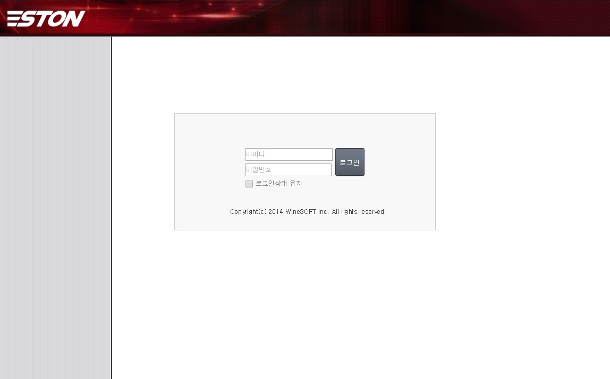
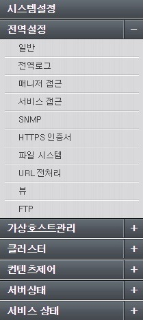
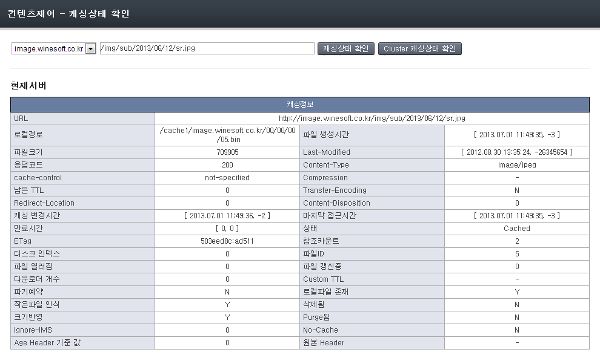

.. _wm:

第13章 WM（Web Management）
******************

この章では、Web Management（以下WM）を紹介する。 WMは、APIをベースに動作するWeb管理ツールである。 WMを介して直感的にサービスを構成することができるだけでなく、クラスタを構成して、多数のSTONを統合管理することができる。

STONをインストールすると、/ usr / local / ston / wmパスにWMが設置される。 WMは、Apache 2.2.24 + PHP 5.3.24に実装された。 Apacheを使用するため/usr/local/ston/wm/conf/httpd.confファイルを編集して、必要な構成（例えば、HTTPS）に変更が可能である。 WMとSTONは密接な関連を持たない。 次の図のようにWMはSTONの設定ファイルとAPIのみを使用しSTONの動作を構成する。

.. figure:: img/wm_compose.jpg
   :align: center

   WMはSTONの設定ファイルとAPIを使用する。

私たちは、同様の方法でWMを凌駕する優れた管理手法が存在すると考えている。

.. toctree::
   :maxdepth: 2

接続
====================================

WMは、基本的に8500番ポートを使用する。 インストールされてSTONのIPアドレスが192.168.0.100の場合WMアクセスアドレスは http://192.168.0.100:8500になる。 前述したように、httpd.confファイルを変更すると、顧客に合わせてカスタマイズが可能である。

   WM接続の初期画面

アカウント
====================================

デフォルトのアカウントは、 [ユーザ名: **admin** , パスワード: **ston** ] である。 ログインに成功すると、STONの全体的な状態を確認できるダッシュボードページが表示される。

.. figure:: img/wm_main.jpg
   :align: center

   WMのダッシュボード

.. _wm-update:

最新バージョンの更新
====================================

最新バージョンがリリースされると、次のように「新しいアップデートがあります」というメッセージが表示される。

.. figure:: img/wm_update_info.png
   :align: center

   新しい更新があります。

メッセージをクリックすると、最新のバージョンに更新することができるページが表示される。 現在のサービスの状態に応じて更新安全度かが表示される。

.. figure:: img/wm_update_page_alert.png
   :align: center

   WMの更新と危険です。

アップデートが完了すると、すべてのサービスが自動的に再起動される。

メニュー構成
====================================

メニューはMouse-Clickに応じて拡張/縮小がされているDrop Downメニューで構成されている。

   WMメニュー

1.  **WMメニュー**

    グローバル設定（server.xml）の仮想ホストの設定を除くすべての機能を設定する。

#.  **仮想ホストの管理**

    仮想ホストの追加/停止/削除をすることができ、サービス中のすべての仮想ホストの状態を一目で見ることができる。

#.  **クラスタ**

    クラスタを構成/管理/破壊することができ、同じクラスタ内のすべてのサービスをサーバ別、サービス別に見ることができる。

#.  **コンテンツ制御**

    Purgeのようにサービスされているコンテンツに対して制御することができる。

#.  **サーバーの状態**

    システム状態のようなグローバル・リソースを監視します。 すべてのGraphは、グローバルリソースのGraphを使用する。

#.  **サービスの状態**

    仮想ホストのサービスの状態を監視する。 すべてのGraphは、仮想ホストGraphを使用する。

グローバル設定
====================================

グローバル設定（server.xml）の仮想ホストの設定を除くすべての機能を設定する。

.. figure:: img/wm_conf_global1.png
   :align: center

   WMグローバル設定-一般

仮想ホストの管理
====================================

サービスを提供するすべての仮想ホストについて詳細に設定し、新規の仮想ホストを追加します。 すべての仮想ホストは別に明示的に設定を変更しない限り、デフォルトの仮想ホスト（VHostDefault）の設定を使用する。 これは、オブジェクト指向の継承（Inheritance）のような概念である。 サービスの仮想ホストは、ほとんどの項目を財政の（Overriding）することができる。

新規
---------------------

新たにサービスする仮想ホストを作成する。 クラスタが設定されている場合、すべてのサーバーに仮想ホストを同時に生成することができる。 すべての仮想ホストはデフォルトの仮想ホスト（VHostDefault）を継承されるため、仮想ホスト名と元サーバーのアドレスを設定するだけすぐにサービス投入が可能である。 8つのサブ設定があり、 **さらに表示** ボタンを押して、詳細設定で拡張することができる。

.. figure:: img/wm_vhost_new1.png
   :align: center

   WM仮想ホストの管理-新規

リスト
---------------------

サービス中のすべての仮想ホストの状態を監視することができる。 仮想ホストごとに開始/停止が可能である。 クラスタが設定されている場合は、すべてのサーバーの仮想ホストを同時に制御することができる。 また、デフォルトの仮想ホストを選択することができる。

.. figure:: img/wm_vhost_list.png
   :align: center

   WM仮想ホストの管理-リスト

詳細設定
---------------------

デフォルトの仮想ホスト（VHostDefault）と、個々の仮想ホストに設定する。 左上のコンボボックスを選択して、仮想ホストを選択することができる。
**"Default仮想ホスト"** は、すべての仮想ホストが継承する基本設定である。 したがって、別途再定義していない設定の場合、 "Default 仮想ホスト"を変更すると、変更された設定が反映される。

.. figure:: img/wm_vhost_conf1.png
   :align: center

   WMバーチャルホストの設定-トップメニュー

上の図のように、多くのサブメニューが提供され、現在選択されてサブメニューが赤い色で表示される。 各メニューをクリック時、下図のように詳細設定ページが提供される。 すべての設定は、 "適用" または "Cluster全体に適用" ボタンを押さなければ反映される。

.. figure:: img/wm_vhost_conf_sub1.png
   :align: center

   WMバーチャルホストの設定-ソースサーバー

ここで設定するほぼすべての項目は、上書きすることができる設定であるため、これに対する明確な理解が必要である。 たとえば、既定の仮想ホストのTTL値が60に設定された場合、すべての仮想ホストは、この値を継承します。 しかし、明らかに、この値を上書きする場合は、仮想ホストに限って上書きされた値を使用することになる。

.. figure:: img/wm_vhost_conf_sub_ttl.png
   :align: center

次のように3つの場合が存在することができる。

-  **他の値で財政の**

   Aの場合のように、デフォルト値は60ですが、180で上書きする場合は、Aユーザーは180でサービスされる。 デフォルトの仮想ホストの設定を変更しても影響を受けない。

-  **同じ値で財政の**

   Bの場合のように、デフォルト値と同じ値に設定しても上書きと判断してBのユーザーは60でサービスされる。 今後デフォルトの仮想ホストのTTL値が30に変更されても再定義がされているのでBユーザーの設定（60）は、影響を受けない。

-  **上書きしない**

   Cの場合のように省略された場合、デフォルトの仮想ホストの設定を継承してCユーザーは60でサービスされる。 今後デフォルトの仮想ホストのTTL値が30に変更されるとCユーザーも30でサービスされる。

WMは色で上書きを区分する。 デフォルトの仮想ホストの設定をそのまま使用している場合は、白い背景で表示される。 オーバーライドされた値は、アンズに表示されてデフォルトの区分される。 すべての財政の設定の右側には、Xボタンが提供される。 このボタンをクリックして上書きを終了する。

.. _wm_cluster:

クラスタ
====================================

複数のSTONを1つのクラスタに統合して一括して管理/運営することができる。 すべてのSTONは同等の関係に設定されるため、クラスタに含まれているいくつかのSTONにログインしても、クラスタ全体を管理することができる。

構成
---------------------

クラスタを作成したり、既に存在しているクラスタに別のサーバーを追加することができる。 クラスタに追加には、WMアカウントの認証手続きが必要である。 もし同じアカウント（ユーザ名とパスワード）でWMが構成されている場合、認証手続きは省略される。

.. figure:: img/wm_cluseter1.png
   :align: center

   新規クラスタの作成

.. figure:: img/wm_cluseter2.png
   :align: center

   クラスタリスト

クラスタが構成され、仮想ホストの管理時に、 "Cluster全体に適用" ボタンで一括設定が可能である。 また、クラスタに所属されたサーバー同士簡単にすべての設定を複製することができる。 特定のサーバーを別のクラスタに参加させたいと脱退後の再構成しなければならない。

専用ポート分離
---------------------

最初のインストール時にWMとクラスタポートが同じポートを使用する。 この方式は、WMアカウントだけでクラスタリング構成が可能であるという利点があるが、アクセスIPを制限する環境では、問題になることがあります。

* セキュリティ上の理由WMを、いくつかのIPのみアクセスされるように制限する。
* クラスタリングのためには、すべてのサーバーが別のサーバーのIPアドレスを許可ヘジュオヤする。
* （CDNのような）サーバーの数が非常に多いか、サーバーのIPアドレスが流動的な場合は、IPリストを作成することができない。

クラスタポートを分離して、この問題を解決することができる。 サーバー同士のアイデンティティは、WMアカウントではなく、ライセンスを使用して確認される。 同じライセンスを持つサーバ同士クラスタが可能となり、セキュリティ性が高くなる。

**1. [Apacheサーバー] httpd.confマルチPort設定**

(デフォルトのインストールであれば) /usr/local/ston/wm/conf/httpd.conf ファイルを開き、次のようにポートを追加します。

.. figure:: img/wm_cluster_multiport.png
   :align: center

保存して反映するためのApacheサーバーを再起動する。

**2. [WM]クラスタ構成**

通常のマルチポート設定がされた場合は、次のように「クラスタポートの取り外し」ボタンが生成される。

.. figure:: img/wm_cluster_multiport1.png
   :align: center

ボタンをクリックします。

**3. [WM]クラスタポートの選択**

分離することができるポートのリストを示している。 ポートを選択して構成する。

.. figure:: img/wm_cluster_multiport2.png
   :align: center

クラスタリングに含まれるすべてのサーバーは、同じポートを使用する必要がある。

サーバーの状態
---------------------

クラスタに所属されているすべてのSTONサーバーの状態とサービスの現状を確認することができる。 サーバーのリストを構成する各項目をクリックすると、より詳細な情報を確認することができる。

.. figure:: img/wm_cluseter3_2.png
   :align: center

   サーバー別のステータス

仮想ホストの状態
---------------------

クラスタでサービスを提供するすべての仮想ホストのMRTGを総合して確認することができる。 タのすべての仮想ホストを同時に開始/停止することができる。 仮想ホストのリストを構成する各項目をクリックすると、より詳細な情報を確認することができる。

.. figure:: img/wm_cluseter4.png
   :align: center

   仮想ホストのサービス別の状態

.. _wm_cluster_list_api:

API
---------------------
APIを介してクラスタ構成サーバーのリストを照会することができる。 ::

   http://SERVER_IP:10040/monitoring/clusterlist

クラスタが構成されている場合、結果は以下の通りである。 ::

   {
      "version": "2.5.5",
      "method": "clusterlist",
      "status": "OK",
      "result": 
      {
          "Name" : "test", 
          "Node" : 
          [ 
              { "Address" : "192.168.0.148:8500"},
              { "Address" : "192.168.0.175:8500"}
          ]
      }
   }

失敗（クラスタが構成ならず、または検索が失敗）の状況では、以下のように答えている。 ::

   {
      "version": "2.5.5",
      "method": "clusterlist",
      "status": "Fail",
      "result": { }
   }

コンテンツ制御
====================================

サービス中のコンテンツを閲覧/制御したり、クリーンアップを実行することができる。 クラスタ構成になっている場合は、すべてのSTONのコンテンツを同時に閲覧したり、制御することができる。

   Caching状態の確認

.. figure:: img/wm_ctrl3.png
   :align: center

   PurgeなどのAPI呼び出し

システム情報
====================================

稼働中のサーバーのシステム情報を照会する。

.. figure:: img/wm_gstat1.png
   :align: center

サービスの状態
====================================

バーチャルホストごとにサービスの状態を監視する。

   仮想ホストサービスの状態
