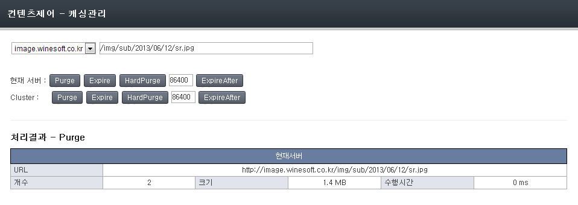
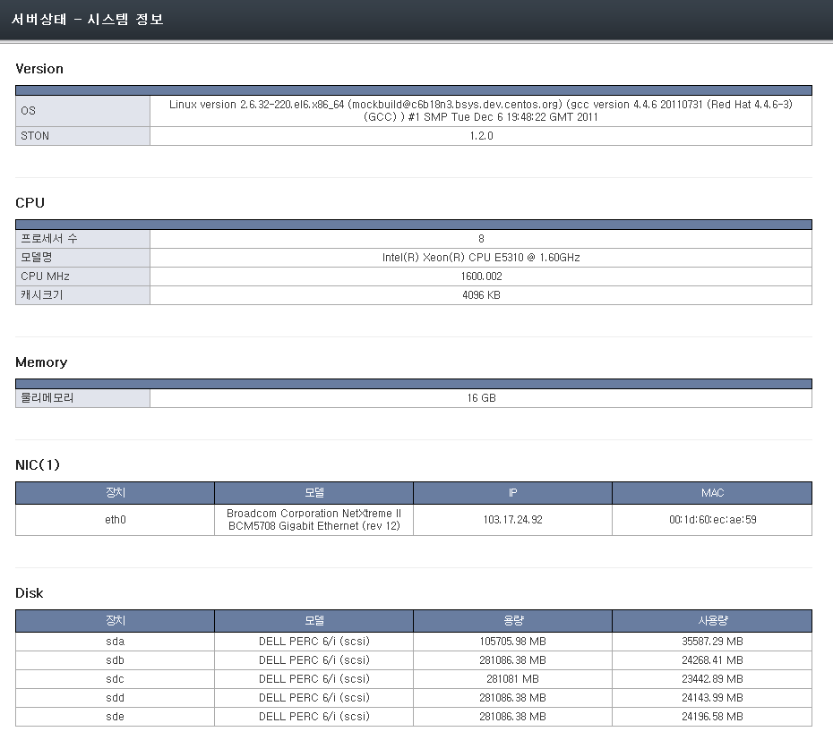

.. _wm:

제 13 장 WM (Web Management)
******************

이 장에서는 Web Management (이하 WM)를 소개한다. WM은 API를 기반으로 동작하는 Web 관리 툴이다. WM을 통해 직관적으로 서비스를 구성 할 수있을뿐만 아니라 클러스터를 구성하여 다수의 STON을 통합 관리 할 수있다.

STON를 설치하면 / usr / local / ston / wm 경로에 WM이 설치된다. WM은 Apache 2.2.24 + PHP 5.3.24에 구현되었다. Apache를 사용하는 /usr/local/ston/wm/conf/httpd.conf 파일을 편집하여 필요한 구성 (예 : HTTPS)로 변경이 가능하다. WM과 STON 밀접한 관련을 가지지 않는다. 다음 그림과 같이 WM은 STON 설정 파일 및 API만을 사용 STON의 동작을 구성한다.

.. figure:: img/wm_compose.jpg
   :align: center

   WM은 STON 설정 파일과 API를 사용한다.

우리는 같은 방법으로 WM을 능가하는 뛰어난 관리 기법이 존재한다고 생각하고있다.

.. toctree::
   :maxdepth: 2

연결
====================================

WM은 기본적으로 8500 번 포트를 사용한다. 설치된 STON의 IP 주소가 192.168.0.100 인 경우 WM 액세스 주소는 http://192.168.0.100:8500이된다. 전술 한 바와 같이 httpd.conf 파일을 변경하면 고객에 맞게 사용자 정의가 가능하다.

.. figure:: img/wm_login.jpg
   :align: center

   WM 연결의 초기 화면

계정
====================================

기본 계정은 [사용자 이름: **admin** , 암호: **ston** ] 이다. 로그인에 성공하면 STON의 전반적인 상태를 확인할 수있는 대시 보드 페이지가 표시됩니다.

.. figure:: img/wm_main.jpg
   :align: center

   WM의 대시 보드

.. _wm-update:

최신 버전의 업데이트
====================================

최신 버전이 출시되면 다음과 같이 "새로운 업데이트가 있습니다" 라는 메시지가 표시된다.

.. figure:: img/wm_update_info.png
   :align: center

   새로운 업데이트가 있습니다.

메시지를 클릭하면 최신 버전으로 업데이트 할 수있는 페이지가 표시된다. 현재 서비스 상태에 따라 업데이트 안전도 하나가 표시된다.

.. figure:: img/wm_update_page_alert.png
   :align: center

   WM 업데이트 및 위험합니다.

업데이트가 완료되면 모든 서비스가 자동으로 다시 시작된다.

메뉴 구성
====================================

메뉴는 Mouse-Click에 따라 확장 / 축소가되는 Drop Down 메뉴로 구성되어있다.

.. figure:: img/wm_menu.jpg
   :align: center

   WM 메뉴

1.  **전역 설정**

    전역 설정 (server.xml)의 가상 호스트 설정을 제외한 모든 기능을 설정한다.

#.  **가상 호스트 관리**

    가상 호스트 추가 / 정지 / 삭제를 할 수 있으며, 서비스중인 모든 가상 호스트의 상태를 한눈에 볼 수있다.

#.  **클러스터**

    클러스터를 구성 / 관리 / 파괴 할 수 동일한 클러스터의 모든 서비스를 서버 별, 서비스별로 볼 수있다.

#.  **콘텐츠 제어**

    Purge처럼 서비스되는 콘텐츠에 대해 제어 할 수있다.

#.  **서버 상태**

    시스템 상태와 같은 글로벌 리소스를 모니터링합니다. 모든 Graph는 글로벌 자원의 Graph를 사용한다.

#.  **서비스 상태**

    가상 호스트의 서비스 상태를 모니터링한다. 모든 Graph 가상 호스트 Graph 사용한다.

전역 설정
====================================

전역 설정 (server.xml)의 가상 호스트 설정을 제외한 모든 기능을 설정한다.

   WM 전역 설정 - 일반

가상 호스트 관리
====================================

서비스를 제공하는 모든 가상 호스트에 대해 상세하게 설정하고 새 가상 호스트를 추가합니다. 모든 가상 호스트 별도로 명시 적으로 설정을 변경하지 않는 한 기본 가상 호스트 (VHostDefault) 설정을 사용한다. 이것은 객체 지향의 상속 (Inheritance)과 같은 개념이다. 서비스의 가상 호스트는 대부분의 항목을 재정의 (Overriding) 할 수있다.

신규
---------------------

새롭게 서비스하는 가상 호스트를 작성한다. 클러스터가 설정되어있는 경우, 모든 서버에 가상 호스트를 동시에 생성 할 수있다. 모든 가상 호스트는 기본 가상 호스트 (VHostDefault)을 상속되기 때문에 가상 호스트 이름과 원본 서버의 주소를 설정하기 만하면 즉시 서비스 투입이 가능하다. 8 개의 하위 설정이 있고, **더보기** 버튼을 눌러 고급 설정에서 확장 할 수있다.

.. figure:: img/wm_vhost_new1.png
   :align: center

   WM 가상 호스트 관리 - 신규

목록
---------------------

서비스중인 모든 가상 호스트의 상태를 모니터링 할 수있다. 가상 호스트마다 시작 / 정지가 가능하다. 클러스터가 설정되어있는 경우, 모든 서버의 가상 호스트를 동시에 제어 할 수있다. 또한 기본 가상 호스트를 선택할 수있다.

.. figure:: img/wm_vhost_list.png
   :align: center

   WM 가상 호스트 관리 - 목록

고급
---------------------

기본 가상 호스트 (VHostDefault)와 개별 가상 호스트 설정한다. 왼쪽 콤보 박스를 선택하여 가상 호스트를 선택할 수있다.
**"Default 가상 호스트"** 는 모든 가상 호스트가 상속하는 기본 설정이다. 따라서 별도 재정의하지 않는 설정의 경우 "Default 가상 호스트"를 변경하면 변경된 설정이 반영된다.

.. figure:: img/wm_vhost_conf1.png
   :align: center

   WM 가상 호스트 설정 - 상단 메뉴

위의 그림과 같이 많은 서브 메뉴가 제공되며 현재 선택된 서브 메뉴가 붉은 색으로 표시된다. 각 메뉴를 클릭시 아래와 같이 환경 설정 페이지가 제공된다. 모든 설정은 "적용" 또는 "Cluster 전체에 적용" 버튼을 누르지 않으면 반영된다.

.. figure:: img/wm_vhost_conf_sub1.png
   :align: center

   WM 가상 호스트 설정 - 소스 서버

여기에서 설정하는 거의 모든 항목은 무시할 수있는 설정이기 때문에 이에 대한 명확한 이해가 필요하다. 예를 들어, 기본 가상 호스트의 TTL 값을 60로 설정된 경우 모든 가상 호스트는이 값을 상속합니다. 하지만 분명이 값을 덮어 쓰려면 가상 호스트에만 덮어 된 값을 사용하게된다.

.. figure:: img/wm_vhost_conf_sub_ttl.png
   :align: center

다음과 같이 3 가지 경우가있을 수있다.

-  **다른 값으로 재정의**

   A의 경우처럼, 기본값은 60이며, 180로 덮어 경우 A 사용자는 180에서 서비스된다. 기본 가상 호스트 설정을 변경해도 영향을받지 않는다.

-  **같은 값으로 재정의**

   B의 경우처럼 기본 값과 같은 값으로 설정해도 덮어 판단하고 B의 사용자는 60에서 서비스된다. 향후 기본 가상 호스트의 TTL 값을 30로 변경되어도 재정의되어 있기 때문에 B 사용자 설정 (60)는 영향을받지 않는다.

-  **덮어 쓰지**

   C의 경우처럼 생략 된 경우 기본 가상 호스트 설정을 상속하여 C 사용자는 60에서 서비스된다. 향후 기본 가상 호스트의 TTL 값을 30로 변경되면 C 사용자도 30에서 서비스된다.

WM은 색으로 덧 쓰기를 구분한다. 기본 가상 호스트의 설정을 그대로 사용하는 경우 흰색 배경에 표시됩니다. 재정의 된 값은 살구에 표시되는 기본 구분된다. 모든 재정적 인 설정의 오른쪽에있는 X 버튼이 제공된다. 이 버튼을 클릭하여 덮어을 종료한다.

.. _wm_cluster:

클러스터
====================================

여러 STON를 하나의 클러스터로 통합하여 일괄 적으로 관리 / 운영 할 수있다. 모든 STON는 동등한 관계로 설정되기 때문에 클러스터에 포함 된 일부 STON에 로그인해도 전체 클러스터를 관리 할 수있다.

구성
---------------------

클러스터를 만들거나 이미 존재하는 클러스터에 다른 서버를 추가 할 수있다. 클러스터에 추가로, WM 계정의 인증 절차가 필요하다. 만약 동일한 계정 (사용자 이름 및 암호)에서 WM이 구성되어있는 경우 인증 절차는 생략된다.

.. figure:: img/wm_cluseter1.png
   :align: center

   새 클러스터 만들기

.. figure:: img/wm_cluseter2.png
   :align: center

   클러스터 목록

클러스터가 구성된 가상 호스트 관리시 "Cluster 전체에 적용" 버튼으로 일괄 설정이 가능하다. 또한 클러스터에 소속 된 서버끼리 간단하게 모든 설정을 복제 할 수있다. 특정 서버를 다른 클러스터에 참여시키고 싶다고 탈퇴 후 재구성해야한다.

전용 포트 분리
---------------------

초기 설치시 WM 및 클러스터 포트가 동일한 포트를 사용한다. 이 방식은 WM 계정 만 클러스터링 구성이 가능하다는 장점이 있지만, 접근 IP를 제한 할 환경에서는 문제가 될 수 있습니다.

* 보안상의 이유로 WM을 여러 IP 만 접근하도록 제한한다.
* 클러스터링을 위해 모든 서버가 다른 서버의 IP 주소를 허용해주어야한다.
* （CDN같은）서버의 수가 매우 많거나 서버의 IP 주소가 유동적 인 경우 IP 목록을 만들 수 없다.

클러스터 포트를 분리하여이 문제를 해결할 수있다. 서버끼리의 정체성은 WM 계정이 아닌 라이센스를 사용하여 확인된다. 동일한 라이센스를 가진 서버끼리 클러스터가 가능해 보안 성이 높아진다.

**1. [Apache 서버] httpd.conf 멀티 Port 설정**

(기본 설치 인 경우) /usr/local/ston/wm/conf/httpd.conf 파일을 열고 다음과 같이 포트를 추가합니다

.. figure:: img/wm_cluster_multiport.png
   :align: center

저장하고 반영하기위한 Apache 서버를 다시 시작한다.

**2. [WM] 클러스터 구성**

일반 멀티 포트 설정이 된 경우에는 다음과 같이 "클러스터 포트 분리"버튼이 생성된다.

.. figure:: img/wm_cluster_multiport1.png
   :align: center

버튼을 클릭합니다.

**3. [WM] 클러스터 포트 선택**

분리 할 수있는 포트의 목록을 보여주고있다. 포트를 선택하여 구성한다.

.. figure:: img/wm_cluster_multiport2.png
   :align: center

클러스터링에 포함 된 모든 서버는 동일한 포트를 사용할 필요가있다.

서버의 상태
---------------------

클러스터에 소속되어있는 모든 STON 서버의 상태 및 서비스 현황을 확인할 수있다. 서버 목록을 구성하는 각 항목을 클릭하면 더 자세한 정보를 확인할 수있다.

.. figure:: img/wm_cluseter3_2.png
   :align: center

   서버 별 상태

가상 호스트의 상태
---------------------

클러스터에 서비스를 제공하는 모든 가상 호스트 MRTG를 종합하여 확인할 수있다. 데이터의 모든 가상 호스트를 동시에 시작 / 중지 할 수있다. 가상 호스트의 목록을 구성하는 각 항목을 클릭하면 더 자세한 정보를 확인할 수있다.

   가상 호스트의 서비스 별 상태

.. _wm_cluster_list_api:

API
---------------------
API를 통해 클러스터 구성 서버의 목록을 조회 할 수있다. ::

   http://SERVER_IP:10040/monitoring/clusterlist

클러스터가 구성되어있는 경우, 결과는 다음과 같다. ::

   {
      "version": "2.5.5",
      "method": "clusterlist",
      "status": "OK",
      "result": 
      {
          "Name" : "test", 
          "Node" : 
          [ 
              { "Address" : "192.168.0.148:8500"},
              { "Address" : "192.168.0.175:8500"}
          ]
      }
   }

실패 (클러스터가 구성되지 않고, 또는 검색 실패) 상태에서는 다음과 같이 대답했다. ::

   {
      "version": "2.5.5",
      "method": "clusterlist",
      "status": "Fail",
      "result": { }
   }

콘텐츠 제어
====================================

서비스되는 내용보기 / 제어하고 정리 작업을 수행 할 수있다. 클러스터 구성되어 있다면, 모든 STON 콘텐츠를 동시에 보거나 제어 할 수있다.

.. figure:: img/wm_ctrl2.png
   :align: center

   Caching 상태 확인

   Purge 등의 API 호출

시스템 정보
====================================

실행중인 서버의 시스템 정보를 조회한다.

서비스 상태
====================================

가상 호스트에 서비스 상태를 모니터링한다.

.. figure:: img/wm_vstat3.png
   :align: center

   가상 호스트 서비스의 상태
